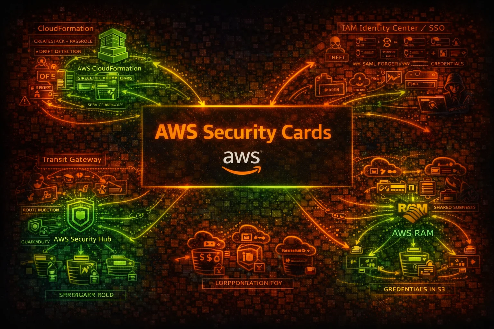

  

# AWS Security Cards

**75 AWS service security reference cards** covering attack vectors, misconfigurations, enumeration commands, privilege escalation, persistence techniques, detection indicators, and defense recommendations.

Each card is available in three formats:
- **Markdown** - readable on GitHub, easy to search and contribute
- **HTML** - beautiful standalone dark-themed pages, open in any browser
- **PDF** - print-ready, share with your team

Open source community project.

---

## Security Cards

| # | | Service | Category | Risk | Markdown | HTML | PDF |
|---|--|---------|----------|------|----------|------|-----|
| 1 |  | AWS IAM | Identity | 9.5 | [MD](cards/markdown/iam.md) | [HTML](cards/html/iam.html) | [PDF](cards/pdf/iam.pdf) |
| 2 |  | AWS STS | Identity | 9.5 | [MD](cards/markdown/sts.md) | [HTML](cards/html/sts.html) | [PDF](cards/pdf/sts.pdf) |
| 3 |  | AWS Organizations | Multi-Account | 9.5 | [MD](cards/markdown/organizations.md) | [HTML](cards/html/organizations.html) | [PDF](cards/pdf/organizations.pdf) |
| 4 |  | AWS Secrets Manager | Secrets | 9.5 | [MD](cards/markdown/secretsmanager.md) | [HTML](cards/html/secretsmanager.html) | [PDF](cards/pdf/secretsmanager.pdf) |
| 5 |  | AWS IAM Identity Center | Identity | 9.5 | [MD](cards/markdown/identitycenter.md) | [HTML](cards/html/identitycenter.html) | [PDF](cards/pdf/identitycenter.pdf) |
| 6 |  | AWS Redshift | Data Warehouse | 9.2 | [MD](cards/markdown/redshift.md) | [HTML](cards/html/redshift.html) | [PDF](cards/pdf/redshift.pdf) |
| 7 |  | AWS EC2 | Compute | 9.0 | [MD](cards/markdown/ec2.md) | [HTML](cards/html/ec2.html) | [PDF](cards/pdf/ec2.pdf) |
| 8 |  | AWS S3 | Storage | 9.0 | [MD](cards/markdown/s3.md) | [HTML](cards/html/s3.html) | [PDF](cards/pdf/s3.pdf) |
| 9 |  | AWS EKS | Kubernetes | 9.0 | [MD](cards/markdown/eks.md) | [HTML](cards/html/eks.html) | [PDF](cards/pdf/eks.pdf) |
| 10 |  | AWS RDS | Database | 9.0 | [MD](cards/markdown/rds.md) | [HTML](cards/html/rds.html) | [PDF](cards/pdf/rds.pdf) |
| 11 |  | AWS CodeBuild & CodePipeline | CI/CD | 9.0 | [MD](cards/markdown/codebuild.md) | [HTML](cards/html/codebuild.html) | [PDF](cards/pdf/codebuild.pdf) |
| 12 |  | AWS Directory Service | Identity | 9.0 | [MD](cards/markdown/directoryservice.md) | [HTML](cards/html/directoryservice.html) | [PDF](cards/pdf/directoryservice.pdf) |
| 13 |  | AWS Glue | ETL & Data Catalog | 9.0 | [MD](cards/markdown/glue.md) | [HTML](cards/html/glue.html) | [PDF](cards/pdf/glue.pdf) |
| 14 |  | AWS Route 53 | DNS | 9.0 | [MD](cards/markdown/route53.md) | [HTML](cards/html/route53.html) | [PDF](cards/pdf/route53.pdf) |
| 15 |  | AWS Backup | Disaster Recovery | 9.0 | [MD](cards/markdown/backup.md) | [HTML](cards/html/backup.html) | [PDF](cards/pdf/backup.pdf) |
| 16 |  | AWS CloudFormation | Infrastructure as Code | 9.0 | [MD](cards/markdown/cloudformation.md) | [HTML](cards/html/cloudformation.html) | [PDF](cards/pdf/cloudformation.pdf) |
| 17 |  | AWS CloudTrail | Audit Logging | 8.5 | [MD](cards/markdown/cloudtrail.md) | [HTML](cards/html/cloudtrail.html) | [PDF](cards/pdf/cloudtrail.pdf) |
| 18 |  | AWS API Gateway | API | 8.5 | [MD](cards/markdown/apigateway.md) | [HTML](cards/html/apigateway.html) | [PDF](cards/pdf/apigateway.pdf) |
| 19 |  | AWS ECR | Container | 8.5 | [MD](cards/markdown/ecr.md) | [HTML](cards/html/ecr.html) | [PDF](cards/pdf/ecr.pdf) |
| 20 |  | AWS ECS | Containers | 8.5 | [MD](cards/markdown/ecs.md) | [HTML](cards/html/ecs.html) | [PDF](cards/pdf/ecs.pdf) |
| 21 |  | AWS OpenSearch | Search & Analytics | 8.5 | [MD](cards/markdown/opensearch.md) | [HTML](cards/html/opensearch.html) | [PDF](cards/pdf/opensearch.pdf) |
| 22 |  | AWS Systems Manager | Management | 8.5 | [MD](cards/markdown/ssm.md) | [HTML](cards/html/ssm.html) | [PDF](cards/pdf/ssm.pdf) |
| 23 |  | AWS SageMaker | ML Platform | 8.5 | [MD](cards/markdown/sagemaker.md) | [HTML](cards/html/sagemaker.html) | [PDF](cards/pdf/sagemaker.pdf) |
| 24 |  | AWS Step Functions | Workflow Orchestration | 8.5 | [MD](cards/markdown/stepfunctions.md) | [HTML](cards/html/stepfunctions.html) | [PDF](cards/pdf/stepfunctions.pdf) |
| 25 |  | AWS Security Hub | Security Posture | 8.5 | [MD](cards/markdown/securityhub.md) | [HTML](cards/html/securityhub.html) | [PDF](cards/pdf/securityhub.pdf) |
| 26 |  | AWS Transit Gateway | Network Transit | 8.5 | [MD](cards/markdown/transitgateway.md) | [HTML](cards/html/transitgateway.html) | [PDF](cards/pdf/transitgateway.pdf) |
| 27 |  | AWS DynamoDB | Database | 8.0 | [MD](cards/markdown/dynamodb.md) | [HTML](cards/html/dynamodb.html) | [PDF](cards/pdf/dynamodb.pdf) |
| 28 |  | AWS Cognito | Identity | 8.0 | [MD](cards/markdown/cognito.md) | [HTML](cards/html/cognito.html) | [PDF](cards/pdf/cognito.pdf) |
| 29 |  | AWS KMS | Encryption | 8.0 | [MD](cards/markdown/kms.md) | [HTML](cards/html/kms.html) | [PDF](cards/pdf/kms.pdf) |
| 30 |  | AWS EBS | Storage | 8.0 | [MD](cards/markdown/ebs.md) | [HTML](cards/html/ebs.html) | [PDF](cards/pdf/ebs.pdf) |
| 31 |  | AWS AppSync | Managed GraphQL | 8.0 | [MD](cards/markdown/appsync.md) | [HTML](cards/html/appsync.html) | [PDF](cards/pdf/appsync.pdf) |
| 32 |  | AWS Athena | SQL Query Service | 8.0 | [MD](cards/markdown/athena.md) | [HTML](cards/html/athena.html) | [PDF](cards/pdf/athena.pdf) |
| 33 |  | AWS DataSync | Data Transfer | 8.0 | [MD](cards/markdown/datasync.md) | [HTML](cards/html/datasync.html) | [PDF](cards/pdf/datasync.pdf) |
| 34 |  | AWS ElastiCache | In-Memory Cache | 8.0 | [MD](cards/markdown/elasticache.md) | [HTML](cards/html/elasticache.html) | [PDF](cards/pdf/elasticache.pdf) |
| 35 |  | AWS EventBridge | Event Bus | 8.0 | [MD](cards/markdown/eventbridge.md) | [HTML](cards/html/eventbridge.html) | [PDF](cards/pdf/eventbridge.pdf) |
| 36 |  | AWS RAM | Multi-Account | 8.0 | [MD](cards/markdown/ram.md) | [HTML](cards/html/ram.html) | [PDF](cards/pdf/ram.pdf) |
| 37 |  | AWS MSK | Streaming | 7.8 | [MD](cards/markdown/msk.md) | [HTML](cards/html/msk.html) | [PDF](cards/pdf/msk.pdf) |
| 38 |  | AWS Lake Formation | Data Lake | 7.8 | [MD](cards/markdown/lakeformation.md) | [HTML](cards/html/lakeformation.html) | [PDF](cards/pdf/lakeformation.pdf) |
| 39 |  | AWS Batch | Compute | 7.5 | [MD](cards/markdown/batch.md) | [HTML](cards/html/batch.html) | [PDF](cards/pdf/batch.pdf) |
| 40 |  | AWS Bedrock | AI/ML | 7.5 | [MD](cards/markdown/bedrock.md) | [HTML](cards/html/bedrock.html) | [PDF](cards/pdf/bedrock.pdf) |
| 41 |  | AWS CloudFront | CDN | 7.5 | [MD](cards/markdown/cloudfront.md) | [HTML](cards/html/cloudfront.html) | [PDF](cards/pdf/cloudfront.pdf) |
| 42 |  | AWS CloudWatch | Monitoring | 7.5 | [MD](cards/markdown/cloudwatch.md) | [HTML](cards/html/cloudwatch.html) | [PDF](cards/pdf/cloudwatch.pdf) |
| 43 |  | AWS Config | Compliance & Configuration | 7.5 | [MD](cards/markdown/config.md) | [HTML](cards/html/config.html) | [PDF](cards/pdf/config.pdf) |
| 44 |  | AWS EFS | File Storage | 7.5 | [MD](cards/markdown/efs.md) | [HTML](cards/html/efs.html) | [PDF](cards/pdf/efs.pdf) |
| 45 |  | AWS Kinesis | Streaming | 7.5 | [MD](cards/markdown/kinesis.md) | [HTML](cards/html/kinesis.html) | [PDF](cards/pdf/kinesis.pdf) |
| 46 |  | AWS Lambda | Serverless | 7.5 | [MD](cards/markdown/lambda.md) | [HTML](cards/html/lambda.html) | [PDF](cards/pdf/lambda.pdf) |
| 47 |  | AWS MemoryDB | Redis | 7.5 | [MD](cards/markdown/memorydb.md) | [HTML](cards/html/memorydb.html) | [PDF](cards/pdf/memorydb.pdf) |
| 48 |  | AWS Transfer Family | Managed File Transfer | 7.5 | [MD](cards/markdown/transferfamily.md) | [HTML](cards/html/transferfamily.html) | [PDF](cards/pdf/transferfamily.pdf) |
| 49 |  | Amazon Macie | Data Security | 7.5 | [MD](cards/markdown/macie.md) | [HTML](cards/html/macie.html) | [PDF](cards/pdf/macie.pdf) |
| 50 |  | AWS VPC | Networking | 7.0 | [MD](cards/markdown/vpc.md) | [HTML](cards/html/vpc.html) | [PDF](cards/pdf/vpc.pdf) |
| 51 |  | AWS GuardDuty | Threat Detection | 7.0 | [MD](cards/markdown/guardduty.md) | [HTML](cards/html/guardduty.html) | [PDF](cards/pdf/guardduty.pdf) |
| 52 |  | AWS App Runner | Containers | 6.5 | [MD](cards/markdown/apprunner.md) | [HTML](cards/html/apprunner.html) | [PDF](cards/pdf/apprunner.pdf) |
| 53 |  | AWS SQS | Queuing | 6.5 | [MD](cards/markdown/sqs.md) | [HTML](cards/html/sqs.html) | [PDF](cards/pdf/sqs.pdf) |
| 54 |  | AWS ELB/ALB | Networking | 6.0 | [MD](cards/markdown/elb.md) | [HTML](cards/html/elb.html) | [PDF](cards/pdf/elb.pdf) |
| 55 |  | AWS Amplify | Frontend | 6.0 | [MD](cards/markdown/amplify.md) | [HTML](cards/html/amplify.html) | [PDF](cards/pdf/amplify.pdf) |
| 56 |  | AWS SNS | Messaging | 6.0 | [MD](cards/markdown/sns.md) | [HTML](cards/html/sns.html) | [PDF](cards/pdf/sns.pdf) |
| 57 |  | Amazon Inspector V2 | Vulnerability Scanning | 6.0 | [MD](cards/markdown/inspector.md) | [HTML](cards/html/inspector.html) | [PDF](cards/pdf/inspector.pdf) |
| 58 |  | AWS ACM | Certificates | 5.5 | [MD](cards/markdown/acm.md) | [HTML](cards/html/acm.html) | [PDF](cards/pdf/acm.pdf) |
| 59 |  | AWS Network Firewall | Network | 5.5 | [MD](cards/markdown/networkfirewall.md) | [HTML](cards/html/networkfirewall.html) | [PDF](cards/pdf/networkfirewall.pdf) |
| 60 |  | AWS WAF | Web Application Firewall | 5.5 | [MD](cards/markdown/waf.md) | [HTML](cards/html/waf.html) | [PDF](cards/pdf/waf.pdf) |
| 61 |  | AWS Control Tower | Landing Zone Governance | 9.5 | [MD](cards/markdown/controltower.md) | [HTML](cards/html/controltower.html) | [PDF](cards/pdf/controltower.pdf) |
| 62 |  | Amazon EMR | Big Data / Analytics | 8.0 | [MD](cards/markdown/emr.md) | [HTML](cards/html/emr.html) | [PDF](cards/pdf/emr.pdf) |
| 63 |  | AWS Elastic Beanstalk | Compute | 8.0 | [MD](cards/markdown/elasticbeanstalk.md) | [HTML](cards/html/elasticbeanstalk.html) | [PDF](cards/pdf/elasticbeanstalk.pdf) |
| 64 |  | Amazon Lightsail | Compute | 8.0 | [MD](cards/markdown/lightsail.md) | [HTML](cards/html/lightsail.html) | [PDF](cards/pdf/lightsail.pdf) |
| 65 |  | Amazon DocumentDB | Database | 8.0 | [MD](cards/markdown/documentdb.md) | [HTML](cards/html/documentdb.html) | [PDF](cards/pdf/documentdb.pdf) |
| 66 |  | Amazon Neptune | Graph Database | 8.0 | [MD](cards/markdown/neptune.md) | [HTML](cards/html/neptune.html) | [PDF](cards/pdf/neptune.pdf) |
| 67 |  | Amazon QuickSight | BI / Analytics | 7.5 | [MD](cards/markdown/quicksight.md) | [HTML](cards/html/quicksight.html) | [PDF](cards/pdf/quicksight.pdf) |
| 68 |  | Amazon WorkSpaces | End-User Computing | 7.5 | [MD](cards/markdown/workspaces.md) | [HTML](cards/html/workspaces.html) | [PDF](cards/pdf/workspaces.pdf) |
| 69 |  | AWS Firewall Manager | Central Security Management | 7.5 | [MD](cards/markdown/firewallmanager.md) | [HTML](cards/html/firewallmanager.html) | [PDF](cards/pdf/firewallmanager.pdf) |
| 70 |  | AWS CloudHSM | Hardware Encryption | 7.0 | [MD](cards/markdown/cloudhsm.md) | [HTML](cards/html/cloudhsm.html) | [PDF](cards/pdf/cloudhsm.pdf) |
| 71 |  | AWS Shield | DDoS Protection | 7.0 | [MD](cards/markdown/shield.md) | [HTML](cards/html/shield.html) | [PDF](cards/pdf/shield.pdf) |
| 72 |  | AWS X-Ray | Distributed Tracing | 7.0 | [MD](cards/markdown/xray.md) | [HTML](cards/html/xray.html) | [PDF](cards/pdf/xray.pdf) |
| 73 |  | AWS Verified Access | Zero Trust Networking | 6.5 | [MD](cards/markdown/verifiedaccess.md) | [HTML](cards/html/verifiedaccess.html) | [PDF](cards/pdf/verifiedaccess.pdf) |
| 74 |  | Amazon Detective | Security Investigation | 6.0 | [MD](cards/markdown/detective.md) | [HTML](cards/html/detective.html) | [PDF](cards/pdf/detective.pdf) |
| 75 |  | Amazon Verified Permissions | Cedar Authorization | 6.0 | [MD](cards/markdown/verifiedpermissions.md) | [HTML](cards/html/verifiedpermissions.html) | [PDF](cards/pdf/verifiedpermissions.pdf) |

## What's in each card?

Every security card includes:

1. **Service Overview** - How the service works, with attacker-relevant notes
2. **Risk Assessment** - Numeric risk score with justification
3. **Attack Vectors** - Known attack techniques and exploitation paths
4. **Common Misconfigurations** - The mistakes that lead to breaches
5. **Enumeration Commands** - AWS CLI commands for security assessment
6. **Privilege Escalation** - How attackers escalate access
7. **Persistence Techniques** - How attackers maintain access
8. **Detection Indicators** - What to look for in logs and monitoring
9. **Exploitation Commands** - Practical commands for authorized testing
10. **Policy Examples** - Good vs. bad IAM/resource policies side-by-side
11. **Defense Recommendations** - Hardening steps with CLI examples

## Usage

**Browse on GitHub**: Click any Markdown link above to read directly on GitHub.

**Open HTML locally**: Clone the repo and open any HTML file in your browser for the full dark-themed experience.

**Download PDFs**: Each card is available as a print-ready PDF with embedded images and AWS icons.

## Disclaimer

These security cards are for **authorized security testing and educational purposes only**. Always obtain proper authorization before testing. The attack techniques described should only be used in legitimate security assessments, CTF competitions, or defensive security research.

## License

This project is open source. See [LICENSE](LICENSE) for details.

## Contributing

Contributions are welcome! Feel free to submit PRs to improve existing cards, fix errors, or add new AWS services.
