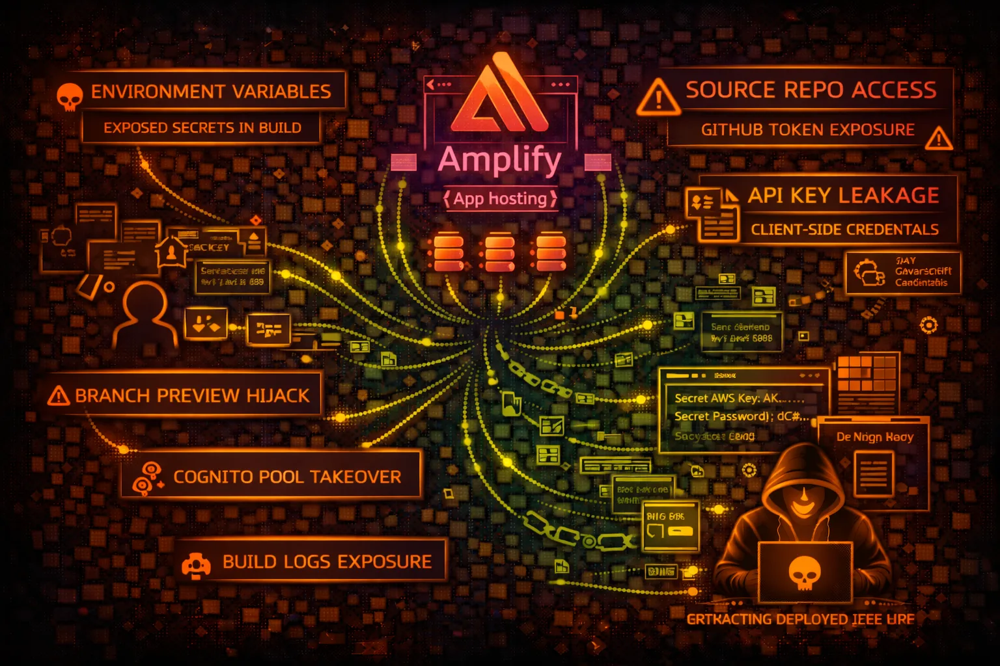

#  AWS Amplify Security



> **Category**: FRONTEND

AWS Amplify hosts web apps and provides backend services. Security risks include environment variable exposure, API key leakage in JavaScript bundles, and build log secrets.

## Quick Stats

| Risk Level | Scope | App Types | Deployment |
| --- | --- | --- | --- |
| **MEDIUM** | **Global** | **SPA/SSR** | **CI/CD** |

## Service Overview

### Amplify Hosting

Hosts static websites and SSR apps. Connects to GitHub, GitLab, Bitbucket for CI/CD. Environment variables configured per branch. Builds run in AWS-managed containers.

> Attack note: Build logs often contain secrets. Environment variables can be exposed via client-side JavaScript if prefixed wrong.

### Amplify Backend

Provisions AppSync, Cognito, S3, Lambda backends. amplify-cli generates aws-exports.js with pool IDs, API endpoints. Gen 2 uses CDK under the hood.

> Attack note: aws-exports.js bundled in client exposes Cognito pool IDs, GraphQL endpoints, S3 buckets - recon goldmine

## Security Risk Assessment

`██████░░░░` **6.0/10** (HIGH)

Amplify apps often expose sensitive configuration in client bundles. Build environments may leak credentials. Connected repos provide source code access. Backend misconfigurations enable data theft.

## ⚔️ Attack Vectors

### Client-Side Exposure

- API keys in JavaScript bundles
- aws-exports.js configuration leak
- Environment variables in window object
- Source maps exposing code
- GraphQL introspection enabled

### Build/Deploy Attacks

- Build log secrets exposure
- GitHub token from connection
- PR preview branch injection
- amplify.yml command injection
- Webhook secret theft

## ⚠️ Misconfigurations

### Environment Issues

- REACT_APP_ prefix exposes to client
- NEXT_PUBLIC_ variables with secrets
- Build-time secrets not cleared
- Same env vars for all branches
- Production secrets in preview branches

### Backend Issues

- Cognito allows self-signup
- GraphQL auth rules too permissive
- S3 bucket public access
- Lambda function role overly broad
- API Gateway no authorization

## 🔍 Enumeration

**List Apps**
```bash
aws amplify list-apps
```

**Get App Details**
```bash
aws amplify get-app --app-id APP_ID
```

**List Branches**
```bash
aws amplify list-branches --app-id APP_ID
```

**Get Branch (includes env vars)**
```bash
aws amplify get-branch \\
  --app-id APP_ID --branch-name main
```

**List Jobs (build history)**
```bash
aws amplify list-jobs \\
  --app-id APP_ID --branch-name main
```

## 📈 Privilege Escalation

### From Client Exposure

- Cognito Pool ID → User enumeration
- GraphQL endpoint → Data theft
- API Key → Backend access
- S3 bucket → File access
- Identity Pool → AWS credentials

### Escalation Paths

- aws-exports.js → Cognito → Identity Pool → AWS creds
- Build logs → Database URL → Data access
- GitHub connection → Repo access → Code secrets
- GraphQL introspection → Schema → Data queries
- Preview branch → Inject code → Steal prod secrets

## 📊 Data Exposure

### Client Bundle Secrets

- AWS Cognito User Pool ID
- AWS Cognito Identity Pool ID
- GraphQL/AppSync endpoint
- S3 bucket names
- API Gateway URLs and keys

### Build Environment

- DATABASE_URL with credentials
- STRIPE_SECRET_KEY
- GITHUB_TOKEN
- AWS_ACCESS_KEY_ID (anti-pattern)
- Third-party API keys

## 🛡️ Detection

### CloudTrail Events

- CreateApp - new app
- UpdateApp - config changes
- CreateBranch - new branch
- StartJob - build triggered
- GetBranch - env var access attempt

### Indicators of Compromise

- Unusual GetBranch API calls
- Build jobs from unknown IPs
- New branches with suspicious names
- Environment variable changes
- Webhook modifications

## Exploitation Commands

**Get Environment Variables**
```bash
aws amplify get-branch \\
  --app-id APP_ID --branch-name main \\
  --query 'branch.environmentVariables'
```

**Download Build Artifacts**
```bash
aws amplify get-job \\
  --app-id APP_ID --branch-name main \\
  --job-id JOB_ID --query 'job.steps[*].artifactsUrl'
```

**Extract aws-exports.js (from deployed app)**
```bash
curl https://app.example.com/aws-exports.js
```

**GraphQL Introspection**
```bash
curl -X POST GRAPHQL_ENDPOINT \\
  -H "Content-Type: application/json" \\
  -d '{"query": "{ __schema { types { name } } }"}'
```

**Get Job Logs (build logs)**
```bash
aws amplify get-job \\
  --app-id APP_ID --branch-name main \\
  --job-id JOB_ID
```

**Start Build (trigger deployment)**
```bash
aws amplify start-job \\
  --app-id APP_ID --branch-name main \\
  --job-type RELEASE
```

## Policy Examples

### ❌ Dangerous - Full Access

```json
{
  "Effect": "Allow",
  "Action": "amplify:*",
  "Resource": "*"
}
```

*Full Amplify access - can read env vars, trigger builds, modify apps*

### ✅ Secure - Read Only Monitoring

```json
{
  "Effect": "Allow",
  "Action": [
    "amplify:ListApps",
    "amplify:GetApp"
  ],
  "Resource": "*"
}
```

*Only list and describe apps - no env var or build access*

### ❌ Risky - Branch Access

```json
{
  "Effect": "Allow",
  "Action": [
    "amplify:GetBranch",
    "amplify:UpdateBranch"
  ],
  "Resource": "*"
}
```

*Can read and modify environment variables*

### ✅ Secure - Deny Env Var Access

```json
{
  "Effect": "Deny",
  "Action": [
    "amplify:GetBranch",
    "amplify:UpdateBranch"
  ],
  "Resource": "*",
  "Condition": {
    "StringNotEquals": {"aws:PrincipalTag/team": "devops"}
  }
}
```

*Only DevOps team can access branch settings*

## Defense Recommendations

### 🔐 Use Secrets Manager

Store secrets in Secrets Manager, fetch at build time, don't expose to client.

```bash
aws secretsmanager get-secret-value --secret-id prod/db
```

### 🚫 No Client-Side Secrets

Never prefix secrets with REACT_APP_, NEXT_PUBLIC_, or VITE_.

### 🔒 Separate Branch Environments

Use different secrets for preview vs production branches.

### 📝 Review Build Logs

Audit build logs for secret exposure. Use secret masking.

### 🛡️ Cognito Security

Disable self-signup if not needed. Enable MFA. Use hosted UI.

### 🔍 Disable GraphQL Introspection

Disable introspection in production AppSync APIs.

---

*AWS Amplify Security Card*

*Always obtain proper authorization before testing*
