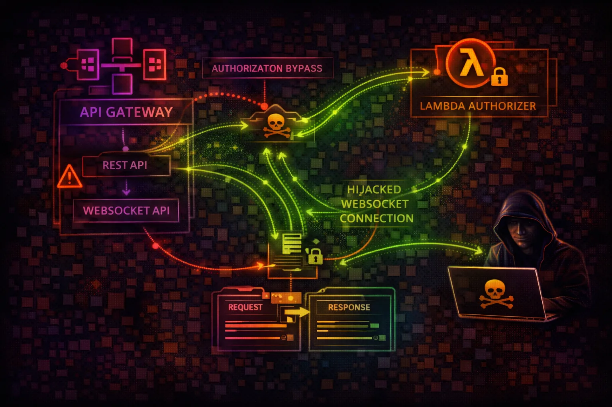

#  AWS API Gateway Security



> **Category**: API

API Gateway is the front door to AWS applications, proxying requests to Lambda, EC2, and other services. Attackers target misconfigured authorization, exposed endpoints, and information disclosure to access backend systems and exfiltrate data.

## Quick Stats

| Attack Surface | Attack Techniques | API Types | Default Exposure |
| --- | --- | --- | --- |
| **HIGH** | **20+** | **3** | **Public** |

## Service Overview

### API Types & Architecture

API Gateway offers REST APIs (v1), HTTP APIs (v2), and WebSocket APIs. REST APIs provide the most features including VTL request/response transforms, resource policies, and caching. HTTP APIs are simpler and cheaper. WebSocket APIs maintain persistent connections.

> Attack note: REST APIs with VTL mapping templates can be exploited for server-side template injection if user input reaches the template

### Authorization Models

Endpoints can use NONE, IAM, Cognito, or Lambda authorizers. API keys are NOT authorization - they only control usage plans and rate limiting. Many developers mistakenly treat API keys as authentication, leaving endpoints effectively unprotected.

> Attack note: Lambda authorizers with flawed logic (e.g., only checking token format, not signature) are a common bypass vector

## Security Risk Assessment

`█████████░` **8.5/10** (CRITICAL)

API Gateway is often internet-facing by default, making misconfigurations directly exploitable. Missing or weak authorization allows unauthorized access to backend Lambda functions and services.

## ⚔️ Attack Vectors

### Authorization Bypass

- Missing authorization on endpoints (NONE)
- Weak Lambda authorizer token validation
- API key mistaken as authentication
- Resource policy bypass via IP spoofing
- Cognito pool misconfiguration

### Injection & Abuse

- VTL template injection in mapping
- WebSocket message injection
- CORS misconfiguration for credential theft
- Stage variable injection
- HTTP method override (GET vs POST)

## ⚠️ Misconfigurations

### Authorization Issues

- NONE authorization type on endpoints
- Lambda authorizer returns wildcard policy
- API keys without usage plans or throttling
- Missing request validation
- Authorizer caching with shared tokens

### Exposure Issues

- Overly permissive CORS (Origin: *)
- Verbose error responses (stack traces)
- Stage variables containing secrets
- Dev/staging stages publicly accessible
- WAF not attached to API

## 🔍 Enumeration

**List REST APIs**
```bash
aws apigateway get-rest-apis
```

**List HTTP APIs**
```bash
aws apigatewayv2 get-apis
```

**Get Resources**
```bash
aws apigateway get-resources \\
  --rest-api-id <api-id>
```

**Get Method Auth**
```bash
aws apigateway get-method \\
  --rest-api-id <api-id> \\
  --resource-id <id> --http-method GET
```

**List API Keys**
```bash
aws apigateway get-api-keys --include-values
```

## 📈 Privilege Escalation

### API-Level Escalation

- Modify resource policy to allow attacker IP
- Update authorizer to bypass authentication
- Change integration to attacker Lambda
- Promote dev stage config to production
- Create new deployment with modified routes

### Backend Pivoting

- HTTP integration SSRF to internal services
- VPC Link to access private resources
- AWS Service integration for direct SDK calls
- Lambda integration to RCE via function update
- S3 integration to read arbitrary buckets

## 🔗 Persistence

### API Backdoors

- Add hidden endpoint with no auth
- Create new stage with relaxed security
- Modify Lambda authorizer to allow backdoor token
- Add resource policy for attacker account
- Deploy custom domain pointing to attacker API

### WebSocket Persistence

- Maintain persistent WebSocket connection
- Inject route with attacker Lambda backend
- Modify $connect authorizer for backdoor
- Use WebSocket for C2 communication
- Scheduled ping to keep connection alive

> **Tool reference:** Use CloudFox to enumerate API Gateway configurations and find unprotected endpoints across multiple AWS accounts. Pacu module apigateway__enum maps all APIs and authorization types.

## 🛡️ Detection

### CloudTrail Events

- UpdateRestApi / UpdateApi
- UpdateAuthorizer
- PutRestApiPolicy
- CreateDeployment
- GetApiKeys (credential enumeration)

### Indicators of Compromise

- New stages created (dev, test, backdoor)
- Authorization type changed to NONE
- Resource policy modifications
- Unusual API call patterns in access logs
- New integrations pointing to unknown Lambda/URLs

## Exploitation Commands

**Find Unprotected Endpoints**
```bash
aws apigateway get-resources --rest-api-id <api-id> | \\
  jq '.items[] | select(.resourceMethods) |
  {path: .path, methods: (.resourceMethods | keys)}'
```

**Check Authorization Type**
```bash
aws apigateway get-method \\
  --rest-api-id <api-id> --resource-id <id> \\
  --http-method GET --query 'authorizationType'
```

**Extract API Keys (with values)**
```bash
aws apigateway get-api-keys --include-values --query 'items[*].[name,value]'
```

**Add Backdoor Resource Policy**
```bash
aws apigateway update-rest-api \\
  --rest-api-id <api-id> \\
  --patch-operations op=replace,path=/policy,value='{"Version":"2012-10-17","Statement":[{"Effect":"Allow","Principal":"*","Action":"execute-api:Invoke","Resource":"*"}]}'
```

**List All Stages (find dev/test)**
```bash
aws apigateway get-stages --rest-api-id <api-id>
```

**Get Stage Variables (secrets)**
```bash
aws apigateway get-stage \\
  --rest-api-id <api-id> --stage-name dev \\
  --query 'variables'
```

## Policy Examples

### ❌ Dangerous - No Authorization

```json
{
  "authorizationType": "NONE",
  "apiKeyRequired": false
}
// Anyone on the internet can call this endpoint
```

*No authorization - anyone with the URL can invoke the API endpoint*

### ✅ Secure - IAM Authorization

```json
{
  "authorizationType": "AWS_IAM",
  "apiKeyRequired": false
}
// Requires AWS SigV4 signed requests
```

*Requires valid IAM credentials with execute-api:Invoke permission*

### ❌ Dangerous - Open Resource Policy

```json
{
  "Version": "2012-10-17",
  "Statement": [{
    "Effect": "Allow",
    "Principal": "*",
    "Action": "execute-api:Invoke",
    "Resource": "arn:aws:execute-api:*:*:*/*/*/*"
  }]
}
```

*Allows any principal to invoke any method on any resource - no IP or VPC restrictions*

### ✅ Secure - VPC and IP Restricted

```json
{
  "Version": "2012-10-17",
  "Statement": [{
    "Effect": "Allow",
    "Principal": "*",
    "Action": "execute-api:Invoke",
    "Resource": "arn:aws:execute-api:*:*:*/prod/GET/*",
    "Condition": {
      "IpAddress": {"aws:SourceIp": "10.0.0.0/8"}
    }
  }]
}
```

*Only allows GET requests from internal IP ranges on production stage*

## Defense Recommendations

### 🔒 Always Use Authorization

Never deploy APIs with NONE authorization. Use IAM, Cognito, or Lambda authorizers.

### 📋 Enable Access Logging

Log all API invocations to CloudWatch for security monitoring and forensics.

```bash
aws apigateway update-stage --rest-api-id <id> \\
  --stage-name prod --patch-operations \\
  op=replace,path=/accessLogSettings/destinationArn,value=<log-group-arn>
```

### 🌐 Restrict CORS Origins

Configure specific allowed origins. Never allow credentials with wildcard origin.

```bash
Access-Control-Allow-Origin: https://app.example.com
```

### 🛡️ Resource Policies for IP/VPC

Implement IP restrictions or VPC-only access using resource policies.

```bash
"Condition": {"IpAddress": {
  "aws:SourceIp": ["10.0.0.0/8", "192.168.1.0/24"]
}}
```

### ✅ Enable Request Validation

Reject malformed requests before they reach backend integrations.

```bash
aws apigateway update-method \\
  --rest-api-id <id> --resource-id <rid> \\
  --http-method POST --patch-operations \\
  op=replace,path=/requestValidatorId,value=<validator-id>
```

### 🔥 Attach AWS WAF

Protect against SQL injection, XSS, and rate limiting with WAF rules.

```bash
aws wafv2 associate-web-acl \\
  --web-acl-arn <waf-arn> \\
  --resource-arn arn:aws:apigateway:region::/restapis/<id>/stages/prod
```

---

*AWS API Gateway Security Card*

*Always obtain proper authorization before testing*
