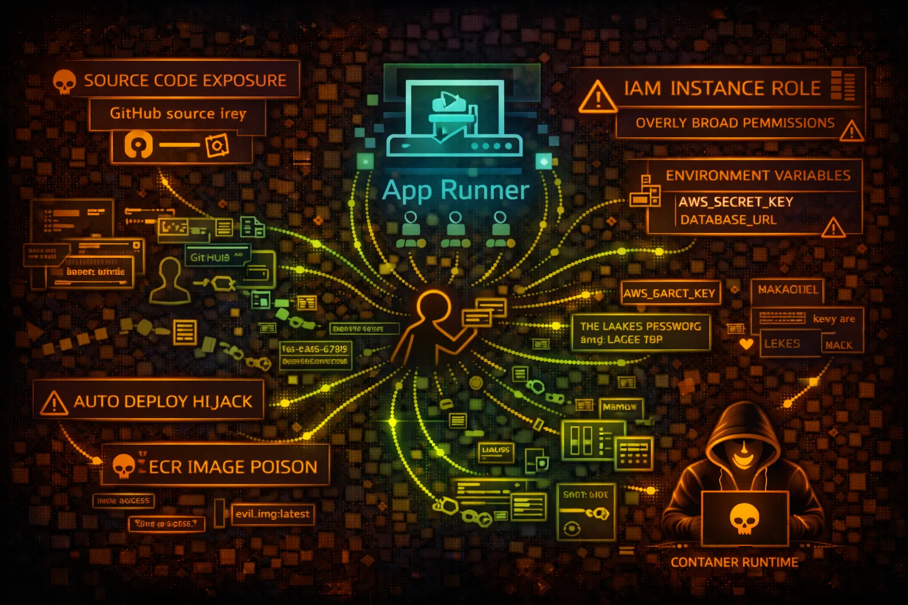

#  AWS App Runner Security



> **Category**: CONTAINERS

AWS App Runner deploys containerized web apps and APIs from source code or container images. Security risks include environment variable exposure, IAM role abuse, and source code theft.

## Quick Stats

| Risk Level | Scope | Source | Compute |
| --- | --- | --- | --- |
| **MEDIUM** | **Regional** | **ECR/GitHub** | **Auto-Scale** |

## Service Overview

### Source Code Deployment

Connects to GitHub repositories for automatic builds and deployments. Stores GitHub connection credentials. Build logs may contain sensitive information.

> Attack note: GitHub connection ARN can be enumerated to understand repository access. Build commands may expose secrets.

### Container Image Deployment

Pulls images from ECR (public or private). Auto-deploys on image push. Service runs with instance role that can access other AWS services.

> Attack note: Instance role often overly permissive. Container environment variables may contain database credentials.

## Security Risk Assessment

`███████░░░` **6.5/10** (HIGH)

App Runner simplifies deployment but abstracts security controls. Environment variables, IAM roles, and source code connections are common attack vectors for credential theft and lateral movement.

## ⚔️ Attack Vectors

### Credential Exposure

- Environment variables with secrets
- Build logs exposing credentials
- GitHub token from connection
- Instance role credential theft
- ECR credentials in service config

### Service Compromise

- Application vulnerability exploitation
- SSRF to metadata service
- Container escape attempts
- Auto-deploy hijacking
- Source code repository poisoning

## ⚠️ Misconfigurations

### IAM Issues

- Instance role with AdministratorAccess
- Access role allowing all ECR repos
- No condition keys on IAM policies
- Cross-account role trust too broad
- Missing VPC egress controls

### Configuration Issues

- Secrets in plain environment variables
- Public endpoint without WAF
- No VPC connector configured
- Observability logs exposing data
- Auto-scaling allows resource abuse

## 🔍 Enumeration

**List Services**
```bash
aws apprunner list-services
```

**Describe Service**
```bash
aws apprunner describe-service \\
  --service-arn SERVICE_ARN
```

**List Connections**
```bash
aws apprunner list-connections
```

**List Auto Scaling Configs**
```bash
aws apprunner list-auto-scaling-configurations
```

**List VPC Connectors**
```bash
aws apprunner list-vpc-connectors
```

## 📈 Privilege Escalation

### Instance Role Abuse

- SSRF to 169.254.170.2 for task credentials
- Instance role → S3/DynamoDB access
- Instance role → Secrets Manager
- ECR access role → Pull other images
- VPC connector → Internal resources

### Escalation Paths

- App vuln → SSRF → Instance role creds
- Build logs → GitHub token → Repo access
- Env vars → DB creds → Data access
- VPC connector → Private subnet resources
- Auto-deploy → Code injection → RCE

## 📊 Data Exposure

### Sensitive Data Locations

- Environment variables
- Build output logs
- Application logs
- Container filesystem
- Connected GitHub repos

### Common Secrets Found

- DATABASE_URL with credentials
- API_KEY for third-party services
- AWS_ACCESS_KEY_ID (anti-pattern)
- JWT_SECRET for authentication
- GITHUB_TOKEN for integrations

## 🛡️ Detection

### CloudTrail Events

- CreateService - new service
- UpdateService - config changes
- DescribeService - recon activity
- ListConnections - enum connections
- AssociateCustomDomain - domain changes

### Indicators of Compromise

- Unusual outbound connections
- Metadata service access patterns
- Failed authentication attempts
- Unexpected deployments
- Environment variable changes

## Exploitation Commands

**Get Service Details (includes env vars)**
```bash
aws apprunner describe-service \\
  --service-arn SERVICE_ARN \\
  --query 'Service.SourceConfiguration'
```

**Get Connection Details**
```bash
aws apprunner describe-custom-domains \\
  --service-arn SERVICE_ARN
```

**List Operations (deployment history)**
```bash
aws apprunner list-operations \\
  --service-arn SERVICE_ARN
```

**SSRF to Get Task Role (from app)**
```bash
curl http://169.254.170.2$AWS_CONTAINER_CREDENTIALS_RELATIVE_URI
```

**Get Build Logs**
```bash
aws logs get-log-events \\
  --log-group-name /aws/apprunner/SERVICE/BUILD
```

**Get Application Logs**
```bash
aws logs get-log-events \\
  --log-group-name /aws/apprunner/SERVICE/application
```

## Policy Examples

### ❌ Dangerous - Full Access

```json
{
  "Effect": "Allow",
  "Action": "apprunner:*",
  "Resource": "*"
}
```

*Full App Runner access - can create/modify services and view secrets*

### ✅ Secure - Read Only

```json
{
  "Effect": "Allow",
  "Action": [
    "apprunner:DescribeService",
    "apprunner:ListServices"
  ],
  "Resource": "arn:aws:apprunner:*:*:service/prod-*"
}
```

*Only describe specific services matching pattern*

### ❌ Risky - Overly Broad Instance Role

```json
{
  "Effect": "Allow",
  "Action": [
    "s3:*",
    "dynamodb:*",
    "secretsmanager:*"
  ],
  "Resource": "*"
}
```

*Instance role with broad access - SSRF leads to full compromise*

### ✅ Secure - Minimal Instance Role

```json
{
  "Effect": "Allow",
  "Action": [
    "s3:GetObject"
  ],
  "Resource": "arn:aws:s3:::app-assets/*",
  "Condition": {
    "StringEquals": {"aws:SourceVpc": "vpc-xxx"}
  }
}
```

*Instance role limited to specific bucket with VPC condition*

## Defense Recommendations

### 🔐 Use Secrets Manager

Store secrets in Secrets Manager instead of environment variables.

```bash
aws secretsmanager create-secret --name app/database --secret-string ...
```

### 🛡️ Minimal Instance Role

Apply least privilege to instance role. Only grant required permissions.

### 🔒 VPC Connector

Use VPC connector to restrict network access and enable private connectivity.

### 🚫 WAF Protection

Associate WAF WebACL with App Runner service for application-layer protection.

### 📝 Enable Observability

Enable tracing and logging but ensure no secrets in log output.

### 🔍 Review Build Logs

Audit build logs for credential exposure. Use secrets in build environment.

---

*AWS App Runner Security Card*

*Always obtain proper authorization before testing*
