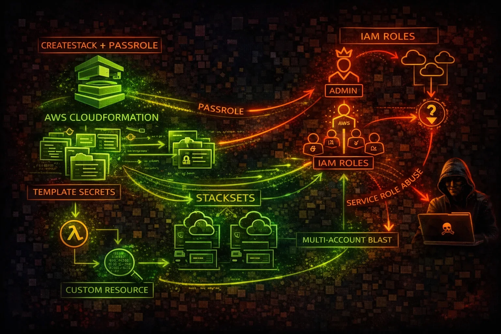

#  AWS CloudFormation Security



> **Category**: INFRASTRUCTURE AS CODE

CloudFormation provisions AWS resources via templates. Attackers abuse CreateStack with PassRole to escalate privileges, extract secrets from templates and outputs, and leverage Custom Resources for arbitrary code execution.

## Quick Stats

| Privesc Vector | Multi-Account | Resources (RCE) | In Templates |
| --- | --- | --- | --- |
| **PassRole** | **StackSets** | **Custom** | **Secrets** |

## Service Overview

### Stack & Template Model

CloudFormation uses JSON/YAML templates to declaratively provision AWS resources as stacks. Templates may contain hardcoded secrets, IAM policies, and infrastructure details that attackers can extract via GetTemplate.

### Service Roles & PassRole

CloudFormation can assume a service role to create resources. If a user has iam:PassRole and cloudformation:CreateStack, they can pass an AdministratorAccess role and create any resource, effectively escalating to admin.

### StackSets & Custom Resources

StackSets deploy stacks across multiple accounts and regions simultaneously. Custom Resources invoke Lambda functions or SNS topics during stack operations, enabling arbitrary code execution within the deployment pipeline.

## Security Risk Assessment

`█████████░` **9.0/10** (CRITICAL)

CloudFormation with iam:PassRole is one of the most reliable privilege escalation paths in AWS. Templates leak secrets, StackSets amplify blast radius across accounts, and Custom Resources execute arbitrary code.

## ⚔️ Attack Vectors

### Privilege Escalation via PassRole

- CreateStack + PassRole with admin service role = full admin
- Service role with AdministratorAccess creates any resource
- Create IAM users/roles/policies via stack templates
- UpdateStack to modify existing infrastructure silently
- StackSets to deploy backdoors across all org accounts

### Secret Extraction

- GetTemplate exposes hardcoded passwords and API keys
- Stack Outputs leak database endpoints, credentials, ARNs
- ListExports reveals cross-stack shared values
- describe-stack-events shows parameter values in logs
- Template stored in S3 may be publicly accessible

## ⚠️ Misconfigurations

### Service Role Issues

- CloudFormation service role with AdministratorAccess
- Service role shared across multiple stacks
- No condition keys restricting CreateStack callers
- PassRole allowed for any role (Resource: *)
- Service roles never audited or rotated

### Template & Stack Issues

- Secrets hardcoded in template Parameters with NoEcho only
- Drift detection not enabled or never run
- Stack policy not configured (any resource can be updated)
- Termination protection not enabled on critical stacks
- Outputs exposing database passwords or API keys

## 🔍 Enumeration

**List All Stacks**
```bash
aws cloudformation describe-stacks
```

**Get Template (Extract Secrets)**
```bash
aws cloudformation get-template \\
  --stack-name TargetStack
```

**List Stack Resources**
```bash
aws cloudformation list-stack-resources \\
  --stack-name TargetStack
```

**List Exports (Cross-Stack Values)**
```bash
aws cloudformation list-exports
```

**Describe Stack Events**
```bash
aws cloudformation describe-stack-events \\
  --stack-name TargetStack
```

## 🔓 Privilege Escalation

### CreateStack + PassRole Chain

- iam:PassRole + cloudformation:CreateStack = admin escalation
- Pass admin role to CFN, template creates backdoor IAM user
- Template creates Lambda with admin role for persistent access
- UpdateStack modifies existing resources with elevated role
- Custom Resource Lambda executes code as the service role

### StackSet Escalation

- create-stack-set deploys to every account in the org
- StackSet admin role trusts CloudFormation service globally
- Execution role in target accounts often has AdministratorAccess
- Single template change propagates across all member accounts
- StackSet drift rarely monitored across org

## ⚡ Persistence Techniques

### Infrastructure Persistence

- Deploy backdoor IAM user/role via stack template
- Create Lambda with reverse shell as Custom Resource
- Deploy EC2 instance with attacker SSH key via stack
- Nested stacks hide malicious resources in child templates
- Stack with DeletionPolicy: Retain keeps resources after delete

### Template Tampering

- Modify S3-hosted templates to inject resources on next update
- Add Custom Resource that phones home on every stack operation
- StackSet with auto-deploy creates resources in new accounts
- CloudFormation macros transform templates at deploy time
- Change Sets can be pre-staged for later execution

## 🛡️ Detection

### CloudTrail Events

- CreateStack - new stack created with role
- UpdateStack - stack template or params modified
- CreateStackSet - multi-account deployment initiated
- GetTemplate - template contents retrieved
- SetStackPolicy - stack protection changed

### Indicators of Compromise

- Stack created with AdministratorAccess service role
- GetTemplate calls from unusual principals
- StackSet deployed to accounts outside normal pattern
- Custom Resource Lambda created with broad permissions
- Stack drift detected on IAM resources

## Exploitation Commands

**Privesc: CreateStack with Admin Role**
```bash
aws cloudformation create-stack \\
  --stack-name privesc-stack \\
  --template-body file://backdoor-template.yaml \\
  --role-arn arn:aws:iam::ACCOUNT:role/CFNAdminRole \\
  --capabilities CAPABILITY_NAMED_IAM
```

**Extract Template Secrets**
```bash
aws cloudformation get-template \\
  --stack-name ProductionStack \\
  --template-stage Original
```

**Enumerate Stack Outputs**
```bash
aws cloudformation describe-stacks \\
  --query 'Stacks[].Outputs[].[OutputKey,OutputValue]' \\
  --output table
```

**Deploy Custom Resource (Code Exec)**
```bash
aws cloudformation create-stack \\
  --stack-name custom-res \\
  --template-body file://custom-resource.yaml \\
  --role-arn arn:aws:iam::ACCOUNT:role/CFNRole \\
  --capabilities CAPABILITY_IAM
```

**Create StackSet (Multi-Account)**
```bash
aws cloudformation create-stack-set \\
  --stack-set-name backdoor-stackset \\
  --template-body file://backdoor.yaml \\
  --permission-model SERVICE_MANAGED \\
  --auto-deployment Enabled=true,RetainStacksOnAccountRemoval=true \\
  --capabilities CAPABILITY_NAMED_IAM
```

**List All Exports Across Stacks**
```bash
aws cloudformation list-exports \\
  --query 'Exports[].[Name,Value]' \\
  --output table
```

## Policy Examples

### ❌ Dangerous - PassRole to Any Role

```json
{
  "Version": "2012-10-17",
  "Statement": [{
    "Effect": "Allow",
    "Action": [
      "cloudformation:CreateStack",
      "cloudformation:UpdateStack",
      "iam:PassRole"
    ],
    "Resource": "*"
  }]
}
```

*CreateStack + PassRole with no resource constraint allows passing AdministratorAccess role to CloudFormation for full privilege escalation*

### ✅ Secure - Scoped PassRole

```json
{
  "Version": "2012-10-17",
  "Statement": [{
    "Effect": "Allow",
    "Action": "iam:PassRole",
    "Resource": "arn:aws:iam::ACCOUNT:role/CFN-LimitedRole",
    "Condition": {
      "StringEquals": {
        "iam:PassedToService": "cloudformation.amazonaws.com"
      }
    }
  }]
}
```

*PassRole restricted to a specific least-privilege role and only for CloudFormation service*

### ❌ Dangerous - Full CloudFormation Access

```json
{
  "Version": "2012-10-17",
  "Statement": [{
    "Effect": "Allow",
    "Action": "cloudformation:*",
    "Resource": "*"
  }]
}
```

*Full access allows GetTemplate (secret extraction), CreateStackSet (multi-account compromise), and stack deletion*

### ✅ Secure - SCP Deny CreateStack Without Conditions

```json
{
  "Version": "2012-10-17",
  "Statement": [{
    "Sid": "DenyCFNWithoutApprovedRole",
    "Effect": "Deny",
    "Action": [
      "cloudformation:CreateStack",
      "cloudformation:CreateStackSet"
    ],
    "Resource": "*",
    "Condition": {
      "StringNotEquals": {
        "cloudformation:RoleArn": [
          "arn:aws:iam::*:role/Approved-CFN-Role"
        ]
      }
    }
  }]
}
```

*SCP enforces only approved service roles can be used with CloudFormation stack creation*

## Defense Recommendations

### 🔐 Least-Privilege Service Roles

Never use AdministratorAccess for CloudFormation service roles. Scope to only the resources the stack needs.

```bash
aws iam create-role --role-name CFN-LimitedRole \\
  --assume-role-policy-document file://cfn-trust.json
# Trust: {"Service": "cloudformation.amazonaws.com"}
```

### 🚫 SCP Restrict CreateStack

Use Organization SCPs to deny CreateStack unless a pre-approved service role is specified.

### 📡 Enable Drift Detection

Run drift detection regularly to catch out-of-band changes to stack resources, especially IAM.

```bash
aws cloudformation detect-stack-drift \\
  --stack-name ProductionStack
```

### 🔒 Enable Stack Policies

Prevent updates to critical resources like IAM roles and security groups within stacks.

```bash
aws cloudformation set-stack-policy --stack-name Prod \\
  --stack-policy-body '{"Statement":[{"Effect":"Deny","Action":"Update:*","Principal":"*","Resource":"LogicalResourceId/AdminRole"}]}'
```

### 🔍 Template Scanning

Scan templates with cfn-lint, cfn-nag, or Checkov before deployment to catch secrets and misconfigurations.

```bash
cfn_nag_scan --input-path template.yaml
```

### 🛡️ Enable Termination Protection

Prevent accidental or malicious deletion of critical stacks.

```bash
aws cloudformation update-termination-protection \\
  --enable-termination-protection \\
  --stack-name ProductionStack
```

---

*AWS CloudFormation Security Card*

*Always obtain proper authorization before testing*
