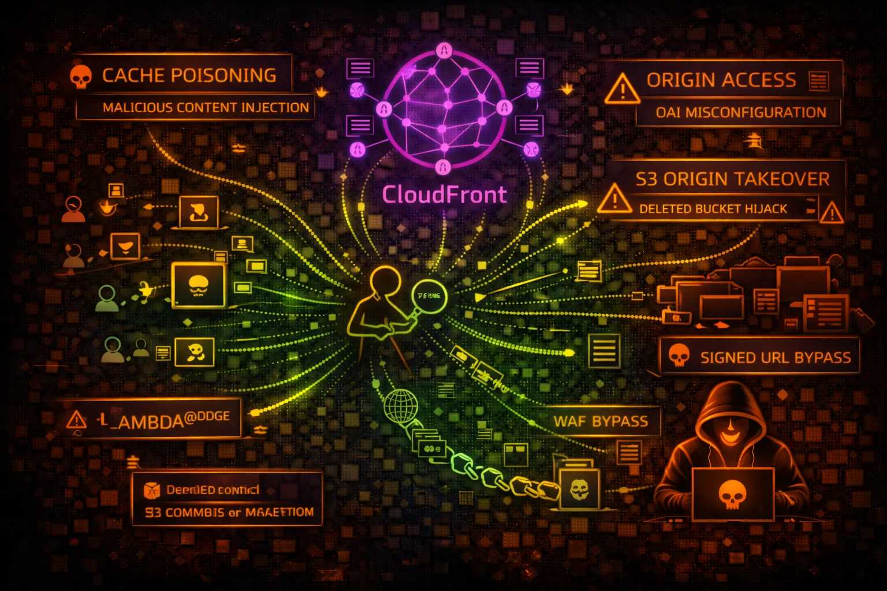

#  AWS CloudFront Security



> **Category**: CDN

Amazon CloudFront is a global CDN that delivers content with low latency. It sits in front of origins (S3, ALB, EC2, custom) and can be a critical security boundary for web applications.

## Quick Stats

| Risk Level | Edge Locations | Integration | Origin Control |
| --- | --- | --- | --- |
| **HIGH** | **450+** | **WAF** | **OAC** |

## Service Overview

### Content Delivery

CloudFront caches and delivers content from edge locations worldwide. Supports static files, dynamic content, streaming, and WebSocket connections. Can serve as reverse proxy for APIs.

> Origins: S3 buckets, ALB/ELB, EC2, Lambda@Edge, API Gateway, custom HTTP servers

### Security Features

Integrates with WAF, Shield, ACM for DDoS protection and TLS. Supports signed URLs/cookies, geo-restriction, field-level encryption, and Origin Access Control (OAC).

> Edge compute: Lambda@Edge and CloudFront Functions for request/response manipulation at edge locations

## Security Risk Assessment

`████████░░` **7.5/10** (HIGH)

CloudFront misconfigurations can expose origin servers, bypass WAF rules, leak sensitive data via cache poisoning, and allow unauthorized access to private content. Origin takeover is a critical risk.

## ⚔️ Attack Vectors

### Origin Attacks

- Origin server discovery and direct access
- Subdomain takeover of S3 origin buckets
- Custom origin without proper authentication
- Origin header injection
- HTTP request smuggling to origin

### CDN Attacks

- Cache poisoning via headers/parameters
- Cache deception attacks
- Signed URL/cookie bypass
- Lambda@Edge code injection
- Web cache deception for sensitive data

## ⚠️ Misconfigurations

### Distribution Misconfigs

- Origin Access Control not configured
- S3 bucket policy allows public access
- No WAF association
- TLS 1.0/1.1 still enabled
- Permissive CORS headers cached
- Caching sensitive endpoints

### Origin Misconfigs

- Origin directly accessible from internet
- Missing origin authentication header
- Unencrypted origin connection (HTTP)
- Origin failover to insecure backup
- Custom origin with weak TLS config

## 🔍 Enumeration

**List All Distributions**
```bash
aws cloudfront list-distributions --query 'DistributionList.Items[*].[Id,DomainName,Origins.Items[0].DomainName]'
```

**Get Distribution Config**
```bash
aws cloudfront get-distribution-config --id EXXXXXXXXXX
```

**List Origin Access Controls**
```bash
aws cloudfront list-origin-access-controls
```

**Get Cache Policy**
```bash
aws cloudfront get-cache-policy --id XXXXXXXX-XXXX-XXXX-XXXX-XXXXXXXXXXXX
```

**List Functions**
```bash
aws cloudfront list-functions
```

## 💉 Cache Attacks

### Cache Poisoning

- Inject malicious content via unkeyed headers
- X-Forwarded-Host header injection
- X-Original-URL for path manipulation
- Parameter pollution to poison cache
- Exploit vary header misconfigurations

### Cache Deception

- Append .css/.js to sensitive endpoints
- /api/user/profile/logo.png caching trick
- Path confusion with trailing characters
- Response splitting via headers
- Steal cached authenticated responses

> **Tip:** Look for endpoints where static file extensions cause caching of dynamic content containing user data.

## 🎯 Origin Takeover

### S3 Origin Takeover

- Origin bucket deleted but CF still points to it
- Create bucket with same name in same region
- Serve malicious content via CloudFront
- Phishing pages on legitimate domain
- Malware distribution via trusted CDN

### Detection & Exploitation

- Look for 404/403 with S3 error messages
- Check if bucket name is available
- Create bucket and upload test file
- Verify content served via CloudFront
- Report or exploit responsibly

## 🛡️ Detection

### CloudTrail Events

- CreateDistribution - new distribution
- UpdateDistribution - config changes
- CreateOriginAccessControl - OAC changes
- CreateFunction - edge function creation
- DeleteDistribution - distribution removal

### CloudFront Logs

- Enable access logging to S3
- Monitor cache hit/miss ratios
- Watch for unusual origin requests
- Track geographic access patterns
- Alert on 4xx/5xx spike

## Exploitation Commands

**Find CloudFront Distribution ID**
```bash
aws cloudfront list-distributions \\
  --query "DistributionList.Items[?contains(Aliases.Items, 'target.com')].Id" \\
  --output text
```

**Get Origin Domain**
```bash
aws cloudfront get-distribution --id EXXXXXXXXXX \\
  --query "Distribution.DistributionConfig.Origins.Items[*].DomainName"
```

**Cache Poisoning Test**
```bash
curl -H "X-Forwarded-Host: evil.com" \\
  -H "X-Original-URL: /admin" \\
  https://target.cloudfront.net/page
```

**S3 Origin Takeover Check**
```bash
# If you see "NoSuchBucket" error
aws s3api head-bucket --bucket origin-bucket-name 2>&1 | grep -q "404" && echo "Takeover possible!"
```

**Invalidate Cache (if permitted)**
```bash
aws cloudfront create-invalidation \\
  --distribution-id EXXXXXXXXXX \\
  --paths "/*"
```

**Check Signed URL Config**
```bash
aws cloudfront get-distribution --id EXXXXXXXXXX \\
  --query "Distribution.DistributionConfig.DefaultCacheBehavior.TrustedSigners"
```

## Policy Examples

### ❌ Insecure - Public Bucket

```json
{
  "Version": "2012-10-17",
  "Statement": [{
    "Sid": "PublicRead",
    "Effect": "Allow",
    "Principal": "*",
    "Action": "s3:GetObject",
    "Resource": "arn:aws:s3:::my-bucket/*"
  }]
}
```

*Bucket is publicly accessible - CloudFront provides no real protection*

### ✅ Secure - OAC Only

```json
{
  "Version": "2012-10-17",
  "Statement": [{
    "Sid": "AllowCloudFrontOAC",
    "Effect": "Allow",
    "Principal": {
      "Service": "cloudfront.amazonaws.com"
    },
    "Action": "s3:GetObject",
    "Resource": "arn:aws:s3:::my-bucket/*",
    "Condition": {
      "StringEquals": {
        "AWS:SourceArn": "arn:aws:cloudfront::123456789012:distribution/EXXXXXXXXXX"
      }
    }
  }]
}
```

*Only CloudFront can access origin via Origin Access Control*

### ❌ Dangerous - OAI Wildcard

```json
{
  "Version": "2012-10-17",
  "Statement": [{
    "Effect": "Allow",
    "Principal": {
      "AWS": "arn:aws:iam::cloudfront:user/CloudFront Origin Access Identity *"
    },
    "Action": "s3:GetObject",
    "Resource": "arn:aws:s3:::my-bucket/*"
  }]
}
```

*Wildcard OAI allows any CloudFront distribution to access - use OAC instead*

### ✅ Secure - Custom Header Auth

```json
# CloudFront Custom Origin Config
Origin Custom Headers:
  X-Origin-Verify: super-secret-value-123

# Origin Server Validation
if request.headers['X-Origin-Verify'] != 'super-secret-value-123':
    return 403
```

*Custom header validates requests came through CloudFront*

## Defense Recommendations

### 🔐 Use Origin Access Control

Replace legacy OAI with OAC for S3 origins. Provides better security with SigV4 signing.

```bash
aws cloudfront create-origin-access-control \\
  --origin-access-control-config \\
  Name=MyOAC,SigningProtocol=sigv4,SigningBehavior=always,OriginAccessControlOriginType=s3
```

### 🛡️ Associate WAF WebACL

Protect against common web attacks with AWS WAF rules.

```bash
aws cloudfront update-distribution \\
  --id EXXXXXXXXXX \\
  --distribution-config file://config.json
# Add WebACLId to config
```

### 🔒 Enforce HTTPS Only

Redirect HTTP to HTTPS and use TLS 1.2+ for origin connections.

```bash
ViewerProtocolPolicy: redirect-to-https
OriginProtocolPolicy: https-only
OriginSSLProtocols: [TLSv1.2]
```

### 📝 Enable Access Logging

Log all requests to S3 for security monitoring and incident response.

```bash
aws cloudfront update-distribution \\
  --id EXXXXXXXXXX \\
  --distribution-config '{"Logging":{"Enabled":true,"Bucket":"logs.s3.amazonaws.com","Prefix":"cf/"}}'
```

### 🚫 Restrict Origin Access

Block direct access to origin by allowing only CloudFront IP ranges or using custom headers.

### 🔑 Use Signed URLs/Cookies

Protect private content with signed URLs or cookies using CloudFront key pairs.

```bash
# Generate signed URL
aws cloudfront sign \\
  --url https://d111.cloudfront.net/private/file.pdf \\
  --key-pair-id KXXXXXXXXXXXX \\
  --private-key file://private_key.pem \\
  --date-less-than 2024-12-31
```

---

*AWS CloudFront Security Card*

*Always obtain proper authorization before testing*
