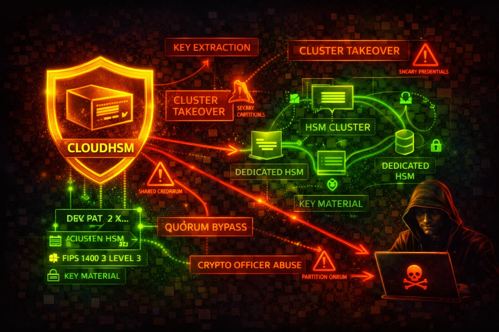

#  AWS CloudHSM Security



> **Category**: ENCRYPTION

AWS CloudHSM provides single-tenant, FIPS-validated hardware security modules in your VPC for cryptographic key generation, storage, and operations. The primary attack surface centers on HSM user credential compromise, network-level access to HSM ENIs, and IAM-level control-plane abuse that can destroy clusters or exfiltrate backups.

## Quick Stats

| Risk Level | Scope | Key Feature | Management |
| --- | --- | --- | --- |
| **HIGH** | **Regional** | **FIPS 140-3 L3** | **Dedicated** |

## 📋 Service Overview

### HSM Clusters & Instances
CloudHSM clusters contain one or more HSM instances distributed across Availability Zones within a VPC. Each HSM gets an Elastic Network Interface (ENI) in your subnet. Clients connect to HSMs through these ENIs over ports 2223-2225. AWS automatically creates a security group (`cloudhsm-cluster-<clusterID>-sg`) controlling network access.
> Attack note: Compromising the cluster security group or gaining network access to the HSM ENIs allows direct interaction with HSM instances. Overly permissive security groups that allow inbound access beyond the client instances are the most common network-level misconfiguration.

### HSM User Model (Admin / Crypto User / Appliance User)
CloudHSM has its own user model separate from IAM. After cluster activation, there are three user types: **Admin** (manages users, passwords, quorum settings), **Crypto User (CU)** (creates/uses/shares/exports keys, performs crypto operations), and **Appliance User (AU)** (AWS-managed, handles HSM synchronization). The default admin account is named `admin`.
> Attack note: HSM user credentials are managed outside of IAM — if an attacker obtains the admin or CU password, IAM policies cannot prevent HSM-level operations. Credential theft is the highest-impact vector.

### Backups
CloudHSM automatically creates encrypted backups of cluster state. Backups are encrypted inside the HSM using an ephemeral backup key (EBK) wrapped by a persistent backup key (PBK) — both AES-256. Backups can be copied cross-region. A restored backup contains all users, keys, and configuration from the original HSM.
> Attack note: An attacker with `cloudhsm:CopyBackupToRegion` and `cloudhsm:RestoreBackup` permissions can copy a backup to an attacker-controlled region and restore it to a new cluster, gaining access to all keys if they possess the HSM user credentials.

### KMS Custom Key Store Integration
CloudHSM clusters can back AWS KMS custom key stores. KMS creates a dedicated CU account (`kmsuser`) on the HSM and performs all cryptographic operations through the HSM. Key material never leaves the HSM unencrypted.
> Attack note: If an attacker disconnects the custom key store and logs in as `kmsuser`, they can directly access and use all KMS-backed keys on the HSM, bypassing KMS key policies entirely.

## Security Risk Assessment

`███████░░░` **7.0/10** (HIGH)

CloudHSM has strong cryptographic protections — key material never leaves the HSM unencrypted, and AWS cannot access customer keys. However, the risk is HIGH because: (1) HSM user credentials exist outside IAM and are not protected by MFA or session policies by default, (2) the IAM control plane allows cluster destruction and backup exfiltration, (3) network access to ENIs enables direct HSM interaction, and (4) quorum authentication is not enabled by default, meaning a single compromised admin can perform all user management operations.

## ⚔️ Attack Vectors

### Credential & Authentication Attacks
- **HSM admin credential theft** — Extracting the admin password from application configs, environment variables, or EC2 instance metadata to gain full user management control on the HSM
- **Crypto User password compromise** — Obtaining CU credentials to perform key operations (encrypt, decrypt, sign, export) without any IAM-level control
- **Weak admin password** — The admin password set during cluster activation may be weak; there is no complexity requirement enforced by CloudHSM, and passwords are not subject to automatic rotation
- **kmsuser credential extraction** — Disconnecting a KMS custom key store and logging in as `kmsuser` to directly access KMS-backed keys on the HSM
- **Brute-force HSM login** — Attempting repeated authentication against the HSM user accounts (CloudHSM locks accounts after 5 failed login attempts; however, in multi-HSM clusters, load balancing across HSMs may allow more attempts before lockout)

### IAM Control-Plane Attacks
- **Cluster deletion** — An attacker with `cloudhsm:DeleteCluster` and `cloudhsm:DeleteHsm` can destroy the entire cluster, causing a denial-of-service for all dependent cryptographic operations
- **Backup exfiltration** — Using `cloudhsm:CopyBackupToRegion` to copy backups to an attacker-controlled region, then restoring them in a new cluster
- **Backup deletion** — Using `cloudhsm:DeleteBackup` to destroy backups, preventing disaster recovery
- **HSM addition to attacker subnet** — Using `cloudhsm:CreateHsm` to add an HSM in an attacker-accessible subnet, then connecting to it
- **Resource policy manipulation** — Using `cloudhsm:PutResourcePolicy` to grant cross-account access to cluster resources

### Network-Level Attacks
- **Security group modification** — Widening the `cloudhsm-cluster-*-sg` security group to allow inbound access from unauthorized hosts
- **ENI-level traffic interception** — Gaining access to the VPC subnet where HSM ENIs reside to interact directly with HSMs on ports 2223-2225
- **VPC peering exploitation** — Accessing HSM ENIs through misconfigured VPC peering connections
- **Client instance compromise** — Compromising an EC2 instance in the cluster security group to leverage its network access to HSMs

## ⚠️ Misconfigurations

### Cluster & Network Misconfigurations
- **Single-AZ deployment** — Running a cluster with only one HSM provides no high availability; AWS strongly recommends at least two HSMs in separate AZs
- **Overly permissive security group** — Adding broad CIDR ranges or 0.0.0.0/0 to the CloudHSM cluster security group, allowing unauthorized network access to HSM ENIs
- **HSM in public subnet** — Placing HSM ENIs in public subnets instead of private subnets
- **Modifying the cluster security group rules** — Deleting or changing the preconfigured TCP rules (ports 2223-2225) on the cluster security group can break HSM connectivity or open unintended access
- **No VPC Flow Logs on HSM subnets** — Failing to enable VPC Flow Logs on subnets containing HSM ENIs, making network-level attack detection impossible

### User & Key Management Misconfigurations
- **Quorum authentication not enabled** — By default, a single admin can create/delete users and change passwords without requiring approval from additional admins
- **HSM credentials stored in plaintext** — Storing admin or CU passwords in application config files, environment variables, or source code instead of using AWS Secrets Manager or a secure retrieval mechanism
- **No key sharing restrictions** — Allowing crypto users to share keys with all other CUs without restrictions
- **Not rotating HSM user passwords** — HSM user passwords are not subject to automatic rotation; they remain unchanged unless manually rotated
- **Wildcard IAM policies for CloudHSM** — Granting `cloudhsm:*` to IAM principals, which allows cluster destruction, backup manipulation, and resource policy changes

## 🔍 Enumeration

**List All CloudHSM Clusters**
```bash
aws cloudhsmv2 describe-clusters
```

**Describe a Specific Cluster**
```bash
aws cloudhsmv2 describe-clusters --filters clusterIds=cluster-1234abcd5678
```

**List All Backups**
```bash
aws cloudhsmv2 describe-backups
```

**List Backups for a Specific Cluster**
```bash
aws cloudhsmv2 describe-backups --filters clusterIds=cluster-1234abcd5678
```

**List Tags on a Cluster**
```bash
aws cloudhsmv2 list-tags --resource-id cluster-1234abcd5678
```

**Get Resource Policy on a Backup**
```bash
aws cloudhsmv2 get-resource-policy --resource-arn arn:aws:cloudhsm:us-east-1:123456789012:backup/backup-1234abcd5678
```

## 📈 Privilege Escalation

### IAM-Level Escalation Paths
- **cloudhsm:CreateCluster + cloudhsm:CreateHsm + cloudhsm:InitializeCluster** — Create a new cluster from a stolen backup, initialize it, and gain admin access to all keys in the backup
- **cloudhsm:RestoreBackup + cloudhsm:CreateCluster** — Restore a deleted backup and create a new cluster from it, recovering access to all key material
- **cloudhsm:PutResourcePolicy** — Attach a resource policy granting cross-account access to backups, enabling backup exfiltration from another account
- **cloudhsm:CopyBackupToRegion** — Copy a backup to a region where the attacker has more permissive IAM access

### HSM-Level Escalation
- **Admin to Crypto User key access** — An admin cannot directly use keys, but can reset any CU password, then log in as that CU to access their keys
- **CU key sharing abuse** — A CU can share their keys with other CUs; a compromised CU account gains access to all keys shared with it

### Exploitation Example: Backup-Based Key Recovery
```bash
# Step 1: List available backups
aws cloudhsmv2 describe-backups --query "Backups[*].{ID:BackupId,ClusterId:ClusterId,State:BackupState}"

# Step 2: Copy backup to attacker-controlled region
aws cloudhsmv2 copy-backup-to-region --destination-region eu-west-1 --backup-id backup-1234abcd5678

# Step 3: Create new cluster from the copied backup
aws cloudhsmv2 create-cluster --hsm-type hsm2m.medium --subnet-ids subnet-abcdef12 --source-backup-id backup-1234abcd5678

# Step 4: Add HSM to the new cluster
aws cloudhsmv2 create-hsm --cluster-id cluster-newcluster --availability-zone eu-west-1a
```
> Note: The attacker still needs HSM user credentials to log in and use keys. Backups are encrypted and can only be restored to AWS-owned HSMs.

## 📜 Policy Examples

### ❌ Bad Policy
```json
{
  "Version": "2012-10-17",
  "Statement": [
    {
      "Effect": "Allow",
      "Action": "cloudhsm:*",
      "Resource": "*"
    }
  ]
}
```
> Why it's bad: Grants full control over all CloudHSM operations including DeleteCluster, DeleteHsm, DeleteBackup, CopyBackupToRegion, and PutResourcePolicy. An attacker with this policy can destroy clusters, exfiltrate backups cross-region, and grant cross-account access to backups.

### ✅ Good Policy — Read-Only Monitoring
```json
{
  "Version": "2012-10-17",
  "Statement": [
    {
      "Effect": "Allow",
      "Action": [
        "cloudhsm:DescribeClusters",
        "cloudhsm:DescribeBackups",
        "cloudhsm:ListTags"
      ],
      "Resource": "*"
    }
  ]
}
```
> Why it's good: Grants only read-only access for monitoring and inventory purposes. Cannot modify, delete, or create any CloudHSM resources.

### ✅ Good Policy — Operator (No Delete, No Backup Export)
```json
{
  "Version": "2012-10-17",
  "Statement": [
    {
      "Effect": "Allow",
      "Action": [
        "cloudhsm:DescribeClusters",
        "cloudhsm:DescribeBackups",
        "cloudhsm:ListTags",
        "cloudhsm:CreateHsm",
        "cloudhsm:TagResource",
        "cloudhsm:UntagResource"
      ],
      "Resource": "*"
    },
    {
      "Effect": "Deny",
      "Action": [
        "cloudhsm:DeleteCluster",
        "cloudhsm:DeleteHsm",
        "cloudhsm:DeleteBackup",
        "cloudhsm:CopyBackupToRegion",
        "cloudhsm:PutResourcePolicy"
      ],
      "Resource": "*"
    }
  ]
}
```
> Why it's good: Allows day-to-day operations (adding HSMs, tagging) while explicitly denying destructive actions (deletion) and exfiltration vectors (cross-region backup copy, resource policy changes).

## 🛡️ Defense Recommendations

### 1. Enable Quorum Authentication (M-of-N)
Require multiple admins to approve sensitive operations like user creation, deletion, and password changes. This prevents a single compromised admin from taking over the HSM.
```bash
# Using CloudHSM CLI: set quorum for admin user management operations
# (requires logging into the HSM as admin)
# cloudhsm-cli> quorum token-sign set-quorum-value --service user --value 2
```
> Reference: https://docs.aws.amazon.com/cloudhsm/latest/userguide/quorum-auth-chsm-cli.html

### 2. Deploy Multi-AZ Clusters
Always run at least two HSMs in separate Availability Zones for high availability and resilience against AZ failures.
```bash
# Add HSM in a second AZ
aws cloudhsmv2 create-hsm --cluster-id cluster-1234abcd5678 --availability-zone us-east-1b
```

### 3. Restrict CloudHSM Security Group
Ensure the cluster security group only allows inbound traffic from authorized client instances. Never add broad CIDR ranges.
```bash
# Verify the cluster security group rules
aws ec2 describe-security-groups --group-ids sg-cloudhsmclustersg --query "SecurityGroups[*].IpPermissions"
```

### 4. Enable CloudTrail Logging for Control-Plane Operations
Monitor all CloudHSM API calls (CreateHsm, DeleteHsm, DeleteCluster, CopyBackupToRegion, DeleteBackup) via CloudTrail.
```bash
# Search CloudTrail for destructive CloudHSM events
aws cloudtrail lookup-events --lookup-attributes AttributeKey=EventName,AttributeValue=DeleteCluster --max-results 10
```

### 5. Monitor HSM Audit Logs via CloudWatch
CloudHSM sends HSM-level audit logs (login attempts, key operations, user management) to CloudWatch Logs. Set up metric filters and alarms for failed logins and admin operations.
```bash
# List CloudHSM audit log groups
aws logs describe-log-groups --log-group-name-prefix /aws/cloudhsm
```

### 6. Use EventBridge Rules for Critical Alerts
Create EventBridge rules to alert on high-risk CloudHSM API calls.
```bash
# Create an EventBridge rule for DeleteHsm events
aws events put-rule --name cloudhsm-delete-alert --event-pattern '{"source":["aws.cloudhsm"],"detail-type":["AWS API Call via CloudTrail"],"detail":{"eventName":["DeleteHsm","DeleteCluster","DeleteBackup","CopyBackupToRegion"]}}'
```

### 7. Secure HSM Credentials
Store HSM user credentials (admin and CU passwords) in AWS Secrets Manager with automatic rotation. Never store them in plaintext in application code, environment variables, or config files.
> Reference: https://docs.aws.amazon.com/cloudhsm/latest/userguide/bp-application-integration.html

### 8. Apply SCPs to Prevent Cluster Destruction
In AWS Organizations, use Service Control Policies to prevent unauthorized deletion of CloudHSM resources.
```json
{
  "Version": "2012-10-17",
  "Statement": [
    {
      "Effect": "Deny",
      "Action": [
        "cloudhsm:DeleteCluster",
        "cloudhsm:DeleteHsm",
        "cloudhsm:DeleteBackup"
      ],
      "Resource": "*",
      "Condition": {
        "StringNotEquals": {
          "aws:PrincipalArn": "arn:aws:iam::*:root"
        }
      }
    }
  ]
}
```
