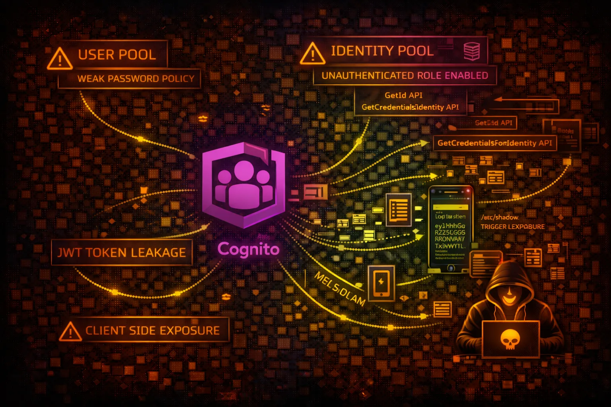

#  AWS Cognito Security



> **Category**: IDENTITY

Amazon Cognito provides authentication, authorization, and user management for web and mobile applications. User Pools handle sign-up/sign-in, Identity Pools provide temporary AWS credentials.

## Quick Stats

| Risk Level | Attack Vectors | Token Type | Auth Flow |
| --- | --- | --- | --- |
| **HIGH** | **8+** | **JWT** | **OAuth** |

## Service Overview

### User Pools

User directories for sign-up/sign-in functionality. Issues JWT tokens (ID, Access, Refresh) for authenticated users. Supports MFA, password policies, and custom authentication flows.

> Key components: App clients, Lambda triggers, groups, hosted UI, custom domains, resource servers

### Identity Pools

Federated identities that exchange tokens for temporary AWS credentials via STS. Supports authenticated and unauthenticated (guest) access with role mapping.

> Key components: Identity providers, IAM roles, role mapping rules, attribute mapping, basic vs enhanced auth flow

## Security Risk Assessment

`████████░░` **8.0/10** (CRITICAL)

Cognito misconfigurations can lead to unauthorized account access, privilege escalation via identity pools, and exposure of sensitive user data. Overly permissive unauthenticated roles are a critical risk.

## ⚔️ Attack Vectors

### User Pool Attacks

- Self-registration abuse when enabled
- Client secret extraction from mobile apps
- JWT token tampering if not validated
- Custom auth Lambda trigger bypass
- Password spraying against user pool
- Pre-token generation trigger manipulation

### Identity Pool Attacks

- Unauthenticated role privilege escalation
- Role mapping rule bypass
- Cross-account identity federation
- GetCredentialsForIdentity abuse
- Developer-authenticated identity spoofing

## ⚠️ Misconfigurations

### User Pool Misconfigs

- Self-registration enabled without verification
- Weak password policy (min length, complexity)
- MFA not enforced for sensitive operations
- Client secret not enabled for web apps
- Read/write attributes overly permissive
- Account recovery allows unverified users

### Identity Pool Misconfigs

- Unauthenticated identities enabled
- Overly permissive unauthenticated IAM role
- Authenticated role too privileged
- Basic auth flow instead of enhanced
- Missing role-based access control

## 🔍 Enumeration

**List User Pools**
```bash
aws cognito-idp list-user-pools --max-results 60
```

**Describe User Pool**
```bash
aws cognito-idp describe-user-pool --user-pool-id us-east-1_xxxxx
```

**List App Clients**
```bash
aws cognito-idp list-user-pool-clients --user-pool-id us-east-1_xxxxx
```

**List Identity Pools**
```bash
aws cognito-identity list-identity-pools --max-results 60
```

**Get Identity Pool Roles**
```bash
aws cognito-identity get-identity-pool-roles --identity-pool-id us-east-1:xxx-xxx
```

## 📈 Privilege Escalation

### User Pool PrivEsc

- Modify user attributes to escalate privileges
- Self-add to admin groups if allowed
- Abuse custom attribute write permissions
- Exploit Lambda triggers for code execution

### Identity Pool PrivEsc

- Get unauthenticated credentials, then escalate
- Abuse overly permissive authenticated role
- Token substitution for different identity provider
- Role mapping rule confusion attacks

> **Key Technique:** If unauthenticated access is enabled, get credentials with GetId + GetCredentialsForIdentity and check the IAM role permissions.

## 🔄 Lateral Movement

### From Cognito

- Use identity pool creds to access AWS services
- Enumerate S3 buckets with obtained credentials
- Access DynamoDB tables storing user data
- Invoke Lambda functions via obtained role
- Access API Gateway protected endpoints

### Data Exfiltration

- List all users and export PII
- Extract custom attributes (SSN, addresses)
- Dump user pool configurations
- Access linked social identity data
- Extract refresh tokens for persistence

## 🛡️ Detection

### CloudTrail Events

- GetCredentialsForIdentity - credential retrieval
- AdminCreateUser - admin user creation
- AdminSetUserPassword - password changes
- CreateIdentityPool - new identity pool
- SetIdentityPoolRoles - role modification
- UpdateUserPoolClient - client changes

### Indicators of Compromise

- Spike in GetCredentialsForIdentity calls
- Multiple failed authentication attempts
- User attribute modifications at scale
- New identity providers added
- Unusual geographic authentication patterns

## Exploitation Commands

**Get Unauthenticated Identity ID**
```bash
aws cognito-identity get-id \\
  --identity-pool-id us-east-1:xxxxxxxx-xxxx-xxxx-xxxx-xxxxxxxxxxxx \\
  --no-sign-request
```

**Get Credentials for Identity**
```bash
aws cognito-identity get-credentials-for-identity \\
  --identity-id us-east-1:xxxxxxxx-xxxx-xxxx-xxxx-xxxxxxxxxxxx \\
  --no-sign-request
```

**Sign Up New User (if enabled)**
```bash
aws cognito-idp sign-up \\
  --client-id <app-client-id> \\
  --username attacker@evil.com \\
  --password 'P@ssw0rd123!' \\
  --no-sign-request
```

**List Users in Pool**
```bash
aws cognito-idp list-users \\
  --user-pool-id us-east-1_xxxxx
```

**Get User Attributes**
```bash
aws cognito-idp admin-get-user \\
  --user-pool-id us-east-1_xxxxx \\
  --username victim@target.com
```

**Modify User Attributes**
```bash
aws cognito-idp admin-update-user-attributes \\
  --user-pool-id us-east-1_xxxxx \\
  --username victim@target.com \\
  --user-attributes Name=custom:role,Value=admin
```

## Policy Examples

### ❌ Overly Permissive Unauthenticated Role

```json
{
  "Version": "2012-10-17",
  "Statement": [{
    "Effect": "Allow",
    "Action": [
      "s3:*",
      "dynamodb:*",
      "lambda:InvokeFunction"
    ],
    "Resource": "*"
  }]
}
```

*Unauthenticated role with broad permissions allows any visitor to access AWS resources*

### ✅ Properly Scoped Unauthenticated Role

```json
{
  "Version": "2012-10-17",
  "Statement": [{
    "Effect": "Allow",
    "Action": ["s3:GetObject"],
    "Resource": "arn:aws:s3:::public-assets/*"
  }]
}
```

*Limited to read-only access on specific public bucket only*

### ❌ Dangerous Authenticated Role

```json
{
  "Version": "2012-10-17",
  "Statement": [{
    "Effect": "Allow",
    "Action": [
      "iam:*",
      "sts:AssumeRole"
    ],
    "Resource": "*"
  }]
}
```

*Authenticated users can escalate privileges via IAM and STS*

### ✅ Secure Authenticated Role with Conditions

```json
{
  "Version": "2012-10-17",
  "Statement": [{
    "Effect": "Allow",
    "Action": ["s3:*"],
    "Resource": [
      "arn:aws:s3:::user-data/\${cognito-identity.amazonaws.com:sub}/*"
    ]
  }]
}
```

*Users can only access their own data using identity-based path restrictions*

## Defense Recommendations

### 🚫 Disable Unauthenticated Access

Unless absolutely required, disable unauthenticated identities in identity pools.

```bash
aws cognito-identity update-identity-pool \\
  --identity-pool-id us-east-1:xxx \\
  --identity-pool-name MyPool \\
  --no-allow-unauthenticated-identities
```

### 🔐 Enforce MFA

Require MFA for all users, especially for privileged operations.

```bash
aws cognito-idp set-user-pool-mfa-config \\
  --user-pool-id us-east-1_xxx \\
  --mfa-configuration ON \\
  --software-token-mfa-configuration Enabled=true
```

### 📝 Restrict Attribute Access

Limit which attributes users can read and write on app clients.

```bash
aws cognito-idp update-user-pool-client \\
  --user-pool-id us-east-1_xxx \\
  --client-id xxx \\
  --read-attributes email name \\
  --write-attributes ""
```

### 🔍 Use Advanced Security

Enable advanced security features for risk-based adaptive authentication.

```bash
aws cognito-idp update-user-pool \\
  --user-pool-id us-east-1_xxx \\
  --user-pool-add-ons AdvancedSecurityMode=ENFORCED
```

### 🎫 Use Client Secrets

Enable client secrets for server-side applications to prevent client ID abuse.

```bash
# Generate secret during client creation
aws cognito-idp create-user-pool-client \\
  --user-pool-id us-east-1_xxx \\
  --client-name SecureApp \\
  --generate-secret
```

### ⚡ Add Lambda Triggers

Use pre-authentication and pre-token-generation triggers for custom validation.

```bash
aws cognito-idp update-user-pool \\
  --user-pool-id us-east-1_xxx \\
  --lambda-config PreAuthentication=arn:aws:lambda:...:validate
```

---

*AWS Cognito Security Card*

*Always obtain proper authorization before testing*
