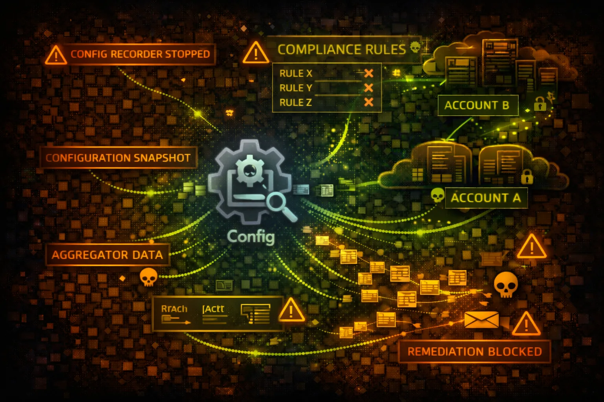

#  AWS Config Security



> **Category**: COMPLIANCE & CONFIGURATION

AWS Config tracks resource configurations and compliance over time. It provides a complete inventory of AWS resources, configuration history, and compliance status against rules. Attackers use Config for reconnaissance and to understand the security posture of targets.

## Quick Stats

| Risk Level | Resource Types | Max Retention | Recording |
| --- | --- | --- | --- |
| **HIGH** | **300+** | **7 Years** | **Continuous** |

## Service Overview

### Configuration Recording

Config continuously records resource configurations, capturing every change. This creates a timeline of configuration items (CIs) that can be queried, enabling compliance auditing and troubleshooting configuration drift.

> Attack note: Configuration history reveals security group changes, IAM policy modifications, and infrastructure secrets

### Config Rules & Compliance

Config Rules evaluate resource configurations against desired settings. Managed rules check common compliance requirements, while custom rules use Lambda functions. Non-compliant resources trigger remediation actions.

> Attack note: Disabling or manipulating rules can hide security violations and block automated remediation

## Security Risk Assessment

`████████░░` **7.5/10** (HIGH)

AWS Config provides a comprehensive inventory and historical record of all AWS resources. Access grants attackers detailed reconnaissance data including IAM policies, security groups, encryption settings, and the ability to identify non-compliant resources for exploitation.

## ⚔️ Attack Vectors

### Reconnaissance

- List all resources in the AWS account
- Query configuration history for secrets
- Identify non-compliant resources to exploit
- Discover security group rules and network ACLs
- Map IAM roles and their attached policies

### Evasion & Persistence

- Delete Config rules to prevent detection
- Disable configuration recorder
- Stop delivery channel to halt logging
- Modify remediation actions
- Delete configuration snapshots

## ⚠️ Misconfigurations

### Recording Gaps

- Recorder not enabled for all resource types
- Global resources not included in recording
- Short retention period loses history
- Delivery channel to unprotected S3 bucket
- Missing KMS encryption on configuration data

### Access Control Issues

- config:* permissions too broadly granted
- Describe permissions expose all configurations
- Missing condition keys on sensitive actions
- Cross-account aggregator overly permissive
- Remediation Lambda with excessive privileges

## 🔍 Enumeration

**List Discovered Resources**
```bash
aws configservice list-discovered-resources \\
  --resource-type AWS::IAM::Role
```

**Get Resource Configuration**
```bash
aws configservice get-resource-config-history \\
  --resource-type AWS::EC2::SecurityGroup \\
  --resource-id sg-12345678
```

**List Config Rules**
```bash
aws configservice describe-config-rules
```

**Get Compliance Status**
```bash
aws configservice describe-compliance-by-config-rule
```

**Query Resources (Advanced SQL)**
```bash
aws configservice select-resource-config \\
  --expression "SELECT * WHERE resourceType = 'AWS::S3::Bucket'"
```

## 📜 Configuration History Mining

### High-Value Data

- IAM policy versions with past permissions
- Security group rules history (open ports)
- S3 bucket policies over time
- KMS key policies and grants
- Lambda function environment variables

### Historical Analysis

- Find when encryption was disabled
- Identify removed security restrictions
- Discover deleted IAM roles/policies
- Track resource relationship changes
- Correlate changes with incidents

> **Recon Gold:** Configuration history may reveal credentials that were accidentally committed and later removed.

## 🔧 Rule Manipulation

### Disable Detection

- Delete Config rules checking for violations
- Stop the configuration recorder
- Delete delivery channel to stop S3 logging
- Modify rule scope to exclude targets
- Change evaluation frequency to delay detection

### Remediation Sabotage

- Delete automatic remediation configurations
- Modify remediation Lambda functions
- Change SSM documents for remediation
- Increase retry attempts to delay fixes
- Target remediation IAM role for privilege escalation

## 🛡️ Detection

### CloudTrail Events

- DeleteConfigRule - rule deletion
- StopConfigurationRecorder - recorder stopped
- DeleteDeliveryChannel - channel removed
- PutRemediationConfigurations - remediation changed
- SelectResourceConfig - SQL query executed

### Indicators of Compromise

- Configuration recorder stopped unexpectedly
- Config rules deleted or modified
- Bulk resource queries from new principals
- Historical configuration accessed at unusual times
- Aggregator authorization changes

## Exploitation Commands

**List All IAM Roles**
```bash
aws configservice list-discovered-resources \\
  --resource-type AWS::IAM::Role \\
  --query 'resourceIdentifiers[*].resourceId'
```

**Get Security Group History**
```bash
aws configservice get-resource-config-history \\
  --resource-type AWS::EC2::SecurityGroup \\
  --resource-id sg-12345678 \\
  --later-time 2024-01-01 --earlier-time 2023-01-01
```

**Find Non-Compliant Resources**
```bash
aws configservice get-compliance-details-by-config-rule \\
  --config-rule-name s3-bucket-public-read-prohibited \\
  --compliance-types NON_COMPLIANT
```

**SQL Query All S3 Buckets with Configs**
```bash
aws configservice select-resource-config \\
  --expression "SELECT resourceId, configuration.publicAccessBlockConfiguration
  WHERE resourceType = 'AWS::S3::Bucket'"
```

**Stop Configuration Recorder**
```bash
aws configservice stop-configuration-recorder \\
  --configuration-recorder-name default
```

**Delete Config Rule**
```bash
aws configservice delete-config-rule \\
  --config-rule-name iam-password-policy
```

**Find Public S3 Buckets**
```bash
aws configservice select-resource-config --expression "
SELECT resourceId, resourceType, configuration
WHERE resourceType = 'AWS::S3::Bucket'
AND configuration.publicAccessBlockConfiguration.blockPublicAcls = false"
```

**List Unencrypted EBS Volumes**
```bash
aws configservice select-resource-config --expression "
SELECT resourceId, availabilityZone, configuration.encrypted
WHERE resourceType = 'AWS::EC2::Volume'
AND configuration.encrypted = false"
```

**Find Security Groups with 0.0.0.0/0**
```bash
aws configservice select-resource-config --expression "
SELECT resourceId, configuration.ipPermissions
WHERE resourceType = 'AWS::EC2::SecurityGroup'
AND configuration.ipPermissions.ipRanges.cidrIp = '0.0.0.0/0'"
```

**Get Lambda Functions with VPC**
```bash
aws configservice select-resource-config --expression "
SELECT resourceId, configuration.functionName, configuration.vpcConfig
WHERE resourceType = 'AWS::Lambda::Function'
AND configuration.vpcConfig.subnetIds IS NOT NULL"
```

## Policy Examples

### ❌ Dangerous - Full Config Access

```json
{
  "Version": "2012-10-17",
  "Statement": [{
    "Effect": "Allow",
    "Action": "config:*",
    "Resource": "*"
  }]
}
```

*Allows full reconnaissance and can disable Config entirely*

### ✅ Secure - Read-Only Compliance

```json
{
  "Version": "2012-10-17",
  "Statement": [{
    "Effect": "Allow",
    "Action": [
      "config:DescribeComplianceByConfigRule",
      "config:GetComplianceDetailsByConfigRule"
    ],
    "Resource": "*"
  }]
}
```

*Only allows viewing compliance status, not configurations*

### ❌ Dangerous - Write Actions

```json
{
  "Version": "2012-10-17",
  "Statement": [{
    "Effect": "Allow",
    "Action": [
      "config:DeleteConfigRule",
      "config:StopConfigurationRecorder",
      "config:DeleteDeliveryChannel"
    ],
    "Resource": "*"
  }]
}
```

*Allows disabling Config monitoring entirely*

### ✅ Secure - Deny Destructive Actions

```json
{
  "Version": "2012-10-17",
  "Statement": [{
    "Effect": "Deny",
    "Action": [
      "config:DeleteConfigRule",
      "config:StopConfigurationRecorder",
      "config:DeleteDeliveryChannel",
      "config:DeleteConfigurationRecorder"
    ],
    "Resource": "*"
  }]
}
```

*SCP preventing Config from being disabled*

## Defense Recommendations

### 🔐 Protect Config with SCP

Use Service Control Policies to prevent stopping the recorder or deleting rules.

```bash
"Effect": "Deny",
"Action": ["config:Stop*", "config:Delete*"]
```

### 🔒 Encrypt Configuration Data

Enable KMS encryption for the S3 delivery bucket and SNS topic.

### 📊 Monitor for Tampering

Alert on StopConfigurationRecorder, DeleteConfigRule, and DeleteDeliveryChannel events.

### 🌐 Use Aggregators Securely

Limit cross-account aggregator permissions and require authorization.

```bash
aws configservice put-aggregation-authorization \\
  --authorized-account-id 123456789012 \\
  --authorized-aws-region us-east-1
```

### 📝 Enable All Resource Types

Ensure the recorder captures all supported resource types including global resources.

```bash
AllSupported: true, IncludeGlobalResourceTypes: true
```

### ⏱️ Maximize Retention

Set maximum retention period (7 years) to maintain comprehensive history.

---

*AWS Config Security Card*

*Always obtain proper authorization before testing*
