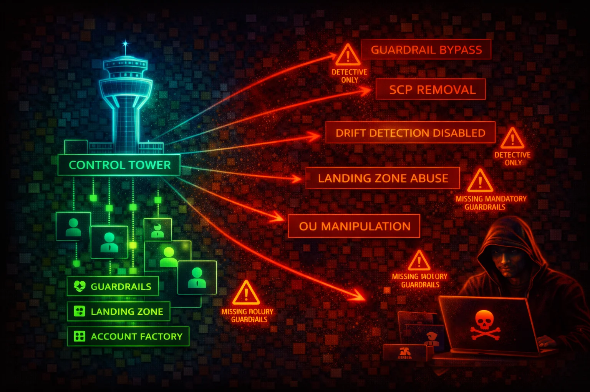

#  AWS Control Tower Security



> **Category**: MANAGEMENT

AWS Control Tower orchestrates multi-account governance by deploying a landing zone with guardrails (preventive, detective, proactive), Account Factory, and centralized logging. Compromising the management account or disabling controls grants unrestricted access across the entire organization.


## Quick Stats

| Risk Level | Control Types | Governance | Top Target |
| --- | --- | --- | --- |
| **CRITICAL** | **Preventive / Detective / Proactive** | **Landing Zone** | **Management Account** |

## 📋 Service Overview

### Landing Zone

A pre-configured, secure multi-account environment based on AWS best practices. Deploys a Security OU (with Log Archive and Audit accounts) and a user-named additional OU (commonly called Sandbox). Managed via the `aws controltower` API (28 subcommands covering controls, landing zones, baselines, and tagging).

> Critical: The management account is exempt from all preventive controls (SCPs and RCPs). Any identity in this account can bypass every guardrail.

### Controls (Guardrails)

Three behavioral types enforce governance across enrolled OUs:

- **Preventive** -- Implemented as SCPs (or RCPs). Block disallowed actions before they execute. Example: disallow changes to CloudTrail configuration.
- **Detective** -- Implemented as AWS Config rules (service-linked). Detect non-compliant resources after deployment. Example: detect whether public read access to S3 is allowed.
- **Proactive** -- Implemented as CloudFormation Hooks. Validate resource compliance at provision time, blocking non-compliant resources before creation.

Three guidance categories: **Mandatory** (always on, cannot be disabled), **Strongly Recommended**, and **Elective**.

> Attack note: Disabling or detaching a detective control does not remediate existing non-compliant resources -- it simply stops detecting them.

### Account Factory

Standardized account provisioning via AWS Service Catalog. Creates new accounts with the `AWSControlTowerExecution` role pre-installed. Account Factory for Terraform (AFT) extends this with IaC-based customization pipelines.

> Attack note: The `AWSControlTowerExecution` role in every member account has `AdministratorAccess` and trusts the management account root principal with no conditions by default.

### Key IAM Roles

| Role | Location | Purpose |
| --- | --- | --- |
| `AWSControlTowerExecution` | Every member account | Full admin access, trusts management account |
| `AWSControlTowerAdmin` | Management account | Creates Config aggregators, runs Control Tower operations |
| `AWSControlTowerCloudTrailRole` | Management account | Manages centralized CloudTrail |
| `AWSControlTowerStackSetRole` | Management account | Deploys StackSets to member accounts |
| `aws-controltower-AuditAdministratorRole` | Audit account | Lambda-only, cross-account admin via `aws-controltower-AdministratorExecutionRole` |
| `aws-controltower-AuditReadOnlyRole` | Audit account | Lambda-only, cross-account read-only via `aws-controltower-ReadOnlyExecutionRole` |

## Security Risk Assessment

`██████████` **9.5/10** (CRITICAL)

AWS Control Tower is the governance layer for the entire organization. Compromise of the management account means full admin access to every enrolled member account via the `AWSControlTowerExecution` role. Disabling controls removes guardrails organization-wide. Drift introduced by an attacker can disable security detection without triggering obvious alerts.

## ⚔️ Attack Vectors

### Management Account Compromise

- Steal credentials for identities in the management account with `sts:AssumeRole` on `AWSControlTowerExecution` to pivot to any member account
- Exploit weakly-scoped IAM policies (e.g., `Resource: "*"`) to assume the `AWSControlTowerExecution` role in member accounts
- Compromise the `AWSControlTowerAdmin` role to modify landing zone configuration
- Social-engineer org administrators who have access to Control Tower console
- Target Account Factory / AFT pipeline credentials (Terraform tokens, git tokens) to inject malicious account customizations

### Control and Landing Zone Manipulation

- Disable preventive controls (SCPs) to remove security restrictions from OUs
- Disable detective controls to stop compliance monitoring silently
- Introduce landing zone drift by modifying SCPs or moving accounts outside Control Tower
- Delete or modify the `AWSControlTowerCloudTrailRole` to disrupt centralized logging (triggers role drift but buys time)
- Abuse delegated administrator privileges to escalate access across the organization

## ⚠️ Misconfigurations

### Dangerous Defaults

- `AWSControlTowerExecution` role trusts the management account root with no conditions -- any identity with `sts:AssumeRole` and a wildcard resource can pivot to all member accounts
- No Permissions Boundaries applied to management account identities to prevent unauthorized role assumption
- Only mandatory controls enabled; strongly recommended and elective controls left disabled
- Account Factory provisions accounts without additional SCPs or Permissions Boundaries
- Audit account Lambda roles (`aws-controltower-AuditAdministratorRole`) have cross-account admin access via role chaining

### Governance Gaps

- No alerting configured for control disable/enable operations
- Landing zone drift not monitored or auto-remediated (auto-enrollment for inheritance drift disabled by default)
- AFT pipeline credentials (Terraform tokens) stored without rotation policy
- No SCP protecting Control Tower roles from modification in member accounts
- Management account used for daily workloads instead of being isolated to Control Tower administration only

## 🔍 Enumeration

**List Landing Zones**
```bash
aws controltower list-landing-zones
```

**Get Landing Zone Details (version, drift status)**
```bash
aws controltower get-landing-zone \
  --landing-zone-identifier arn:aws:controltower:us-east-1:123456789012:landingzone/LANDING_ZONE_ID
```

**List Enabled Controls on an OU**
```bash
aws controltower list-enabled-controls \
  --target-identifier arn:aws:organizations::123456789012:ou/o-abc1234xyz/ou-abc-xyz
```

**List Enabled Controls Filtered by Drift Status**
```bash
aws controltower list-enabled-controls \
  --target-identifier arn:aws:organizations::123456789012:ou/o-abc1234xyz/ou-abc-xyz \
  --filter '{"driftStatuses":["DRIFTED"]}'
```

**List All Baselines**
```bash
aws controltower list-baselines
```

**List Enabled Baselines**
```bash
aws controltower list-enabled-baselines
```

**Get Details of a Specific Enabled Control**
```bash
aws controltower get-enabled-control \
  --enabled-control-identifier arn:aws:controltower:us-east-1:123456789012:enabledcontrol/CONTROL_ID
```

**Enumerate Organization Accounts (via Organizations API)**
```bash
aws organizations list-accounts \
  --query 'Accounts[*].[Id,Name,Status]' \
  --output table
```

**List SCPs Applied to an OU (via Organizations API)**
```bash
aws organizations list-policies-for-target \
  --target-id ou-xxxx-xxxxxxxx \
  --filter SERVICE_CONTROL_POLICY
```

## 📈 Privilege Escalation

### From Member Account to Full Organization Access

- Identify the management account ID from `aws organizations describe-organization`
- Check if `AWSControlTowerExecution` role exists and its trust policy (it trusts management account root by default)
- If you compromise any identity in the management account with `sts:AssumeRole` permissions, assume `AWSControlTowerExecution` in any member account for full admin
- Abuse the Audit account's `aws-controltower-AuditAdministratorRole` chain: Lambda in audit account assumes `AuditAdministratorRole`, which assumes `AdministratorExecutionRole` in member accounts
- Exploit delegated administrator registration: if an attacker has `organizations:RegisterDelegatedAdministrator`, they can register a compromised account as delegated admin for sensitive services

### From Management Account

- Assume `AWSControlTowerExecution` in any member account for `AdministratorAccess`
- Disable preventive controls to remove SCP restrictions
- Disable detective controls to blind compliance monitoring
- Modify landing zone manifest to weaken security configuration
- Create new accounts via Account Factory with attacker-controlled settings

**Assume AWSControlTowerExecution in a Member Account**
```bash
aws sts assume-role \
  --role-arn arn:aws:iam::MEMBER_ACCOUNT_ID:role/AWSControlTowerExecution \
  --role-session-name ct-pivot
```

**Disable a Control on an OU**
```bash
aws controltower disable-control \
  --control-identifier arn:aws:controltower:us-east-1::control/CONTROL_ID \
  --target-identifier arn:aws:organizations::123456789012:ou/o-abc1234xyz/ou-abc-xyz
```

## 📜 Policy Examples

### Bad: AWSControlTowerExecution Default Trust (No Conditions)

```json
{
  "Version": "2012-10-17",
  "Statement": [{
    "Effect": "Allow",
    "Principal": {
      "AWS": "arn:aws:iam::MANAGEMENT_ACCOUNT_ID:root"
    },
    "Action": "sts:AssumeRole"
  }]
}
```

*Any identity in the management account with `sts:AssumeRole` and a wildcard resource policy can assume this role. No MFA, no IP restriction, no principal tag condition.*

### Good: AWSControlTowerExecution with Restrictive Conditions

```json
{
  "Version": "2012-10-17",
  "Statement": [{
    "Effect": "Allow",
    "Principal": {
      "AWS": "arn:aws:iam::MANAGEMENT_ACCOUNT_ID:root"
    },
    "Action": "sts:AssumeRole",
    "Condition": {
      "StringEquals": {
        "aws:PrincipalTag/team": "platform-engineering"
      },
      "IpAddress": {
        "aws:SourceIp": "203.0.113.0/24"
      }
    }
  }]
}
```

*Restricts role assumption to principals tagged as platform-engineering from a known IP range. Reduces blast radius of compromised management account credentials.*

### Bad: Management Account Identity with Wildcard AssumeRole

```json
{
  "Version": "2012-10-17",
  "Statement": [{
    "Effect": "Allow",
    "Action": "sts:AssumeRole",
    "Resource": "*"
  }]
}
```

*Allows assumption of AWSControlTowerExecution in every member account. This is the exact pattern that enables the TrustedSec-documented pivoting attack.*

### Good: Permissions Boundary Blocking AWSControlTowerExecution Assumption

```json
{
  "Version": "2012-10-17",
  "Statement": [
    {
      "Effect": "Allow",
      "Action": "*",
      "Resource": "*"
    },
    {
      "Effect": "Deny",
      "Action": "sts:AssumeRole",
      "Resource": "arn:aws:iam::*:role/AWSControlTowerExecution"
    }
  ]
}
```

*Applied as a Permissions Boundary to all IAM users, roles, and Identity Center Permission Sets in the management account. Prevents unauthorized pivoting to member accounts via AWSControlTowerExecution.*

### Good: SCP Protecting Control Tower Roles in Member Accounts

```json
{
  "Version": "2012-10-17",
  "Statement": [{
    "Sid": "ProtectControlTowerRoles",
    "Effect": "Deny",
    "Action": [
      "iam:AttachRolePolicy",
      "iam:DeleteRole",
      "iam:DeleteRolePolicy",
      "iam:DetachRolePolicy",
      "iam:PutRolePolicy",
      "iam:UpdateAssumeRolePolicy"
    ],
    "Resource": [
      "arn:aws:iam::*:role/AWSControlTowerExecution",
      "arn:aws:iam::*:role/aws-controltower-*"
    ],
    "Condition": {
      "ArnNotLike": {
        "aws:PrincipalArn": "arn:aws:iam::*:role/AWSControlTowerExecution"
      }
    }
  }]
}
```

*Prevents member account identities from modifying or deleting Control Tower roles. Only the AWSControlTowerExecution role itself (used by Control Tower operations) can modify these roles.*

## 🛡️ Defense Recommendations

### Isolate the Management Account

Run zero production workloads in the management account. Restrict it to Control Tower administration, Organizations management, and billing only. Apply strict identity controls: hardware MFA on root, minimal IAM users, and short-lived sessions via Identity Center.

### Apply Permissions Boundaries in the Management Account

Attach Permissions Boundaries to all IAM users, roles, and Identity Center Permission Sets that deny `sts:AssumeRole` against `AWSControlTowerExecution`. This blocks the default pivoting path documented by TrustedSec.

### Add Conditions to AWSControlTowerExecution Trust Policies

Modify the trust policy on `AWSControlTowerExecution` in every member account to require specific principal tags, source IP ranges, or named principal ARNs. This must be reapplied after account enrollment since Control Tower resets the trust policy.

### Enable All Strongly Recommended Controls

Do not rely only on mandatory controls. Enable all strongly recommended preventive and detective controls. Evaluate elective controls for your threat model.

### Monitor Control Tower API Calls

Configure CloudTrail alerts (via EventBridge) for these critical events:
- `DisableControl` / `EnableControl` -- control changes
- `UpdateLandingZone` / `ResetLandingZone` -- landing zone modifications
- `DisableBaseline` -- baseline removal
- `CreateAccount` (Organizations) or `controltower:CreateManagedAccount` / Service Catalog `ProvisionProduct` -- new account creation
- Role assumption of `AWSControlTowerExecution` in CloudTrail

### Protect Control Tower Roles via SCP

Deploy an SCP that denies modification or deletion of `AWSControlTowerExecution` and `aws-controltower-*` roles by member account identities.

### Monitor and Remediate Drift

Check landing zone drift status regularly via `aws controltower get-landing-zone`. Enable auto-enrollment to remediate inheritance drift when accounts move between OUs. Alert on drift detection via SNS notifications from the audit account.

---

*AWS Control Tower Security Card*

*Always obtain proper authorization before testing*
