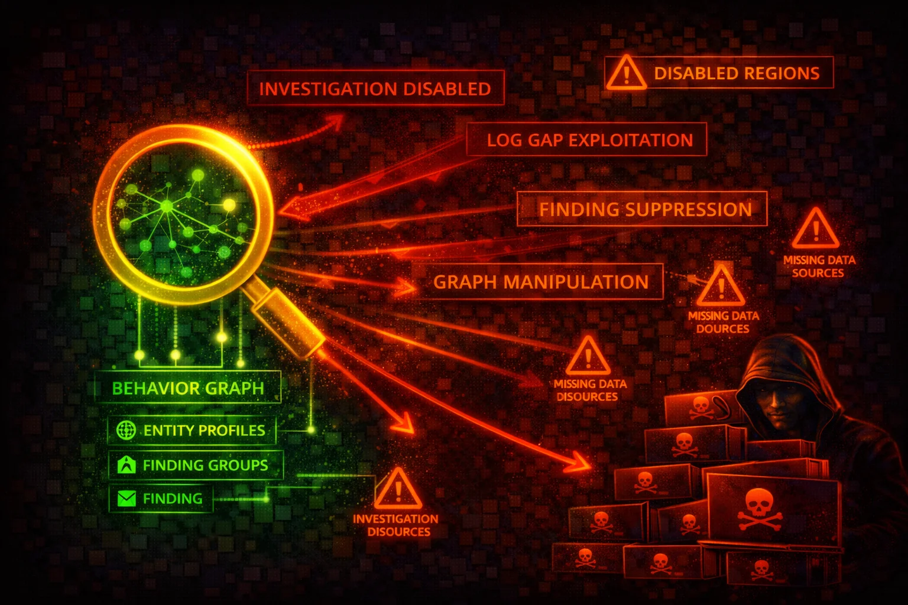

#  Amazon Detective Security



> **Category**: SECURITY INVESTIGATION

Amazon Detective automatically collects log data from AWS resources and uses machine learning, statistical analysis, and graph theory to build interactive visualizations for security investigations. Attackers target Detective to destroy forensic evidence and remove investigation capabilities.

## Quick Stats

| Analysis | Data Sources | Data Retention | Pricing |
| --- | --- | --- | --- |
| **ML + Graph** | **5** | **Up to 1 year** | **Per GB ingested** |

## 📋 Service Overview

### Behavior Graph

Detective builds a behavior graph from ingested data using ML and statistical analysis. The graph links entities (IP addresses, IAM principals, AWS accounts) with their activities over time, enabling security analysts to investigate root causes of findings.

### Data Sources

Core data sources ingested automatically: **AWS CloudTrail logs**, **Amazon VPC Flow Logs** (IPv4 and IPv6, EC2 instances in VPCs only), and **Amazon GuardDuty findings**. Optional data source packages: **EKS Audit Logs** and **AWS Security Hub findings**.

### Integration with GuardDuty and Security Hub

Detective ingests GuardDuty findings and correlates them with CloudTrail and VPC Flow Log data. Analysts can pivot directly from a GuardDuty finding or Security Hub finding into Detective for deeper investigation. Detective Finding Groups cluster related findings to identify potential security incidents.

### Multi-Account Architecture

An **administrator account** creates and manages the behavior graph, invites member accounts, and conducts investigations. **Member accounts** contribute data to the administrator's behavior graph. In AWS Organizations, a delegated administrator can auto-enable Detective for all organization accounts.

## Security Risk Assessment

`██████░░░░` **6.0/10** (MEDIUM-HIGH)

Detective is an investigation tool, not a detection tool. Disabling it does not stop alerts (GuardDuty still fires), but it destroys the forensic graph data needed to investigate incidents. Attackers who delete the behavior graph eliminate up to 1 year of correlated investigation data that cannot be recovered.

## ⚔️ Attack Vectors

### Destroy Investigation Capability

- Delete the behavior graph to permanently destroy all correlated forensic data
- Remove member accounts to stop data ingestion from target accounts
- Disable the Organizations delegated administrator to break centralized management
- Disassociate membership to remove your compromised account from monitoring
- Reject invitations to prevent accounts from joining the behavior graph

### Tamper with Investigations

- Update investigation state to mark active investigations as closed
- Delete members to stop data flow from specific accounts being investigated
- Note: data source packages cannot be disabled via API once enabled; however, removing member accounts stops their data ingestion
- Update organization configuration to stop auto-enabling for new accounts
- Tag resources with misleading metadata to cause confusion

## ⚠️ Evasion Techniques

### Reduce Forensic Visibility

- Remove specific member accounts rather than deleting the entire graph (less obvious)
- Disable optional data source packages (EKS, Security Hub) to create blind spots
- Disassociate compromised accounts from the behavior graph silently
- Time deletion to coincide with maintenance windows to avoid suspicion
- Operate within accounts not yet added to the behavior graph

### Operational Evasion

- Use accounts not enrolled in the behavior graph as attack staging
- Operate during the interval between GuardDuty finding generation and Detective graph update
- Operate from IPs that blend with normal traffic patterns in the graph
- Avoid triggering GuardDuty findings that would generate Detective entities
- Focus attacks on services whose logs are not ingested (e.g., NAT gateway traffic, Fargate, RDS VPC flow logs are excluded)

## 🔍 Enumeration

**List All Behavior Graphs**
```bash
aws detective list-graphs
```

**List Member Accounts in a Graph**
```bash
aws detective list-members \
  --graph-arn arn:aws:detective:us-east-1:111122223333:graph:a1b2c3d4e5f6a1b2c3d4e5f6a1b2c3d4
```

**Get Member Account Details**
```bash
aws detective get-members \
  --graph-arn arn:aws:detective:us-east-1:111122223333:graph:a1b2c3d4e5f6a1b2c3d4e5f6a1b2c3d4 \
  --account-ids 444455556666
```

**List Datasource Packages**
```bash
aws detective list-datasource-packages \
  --graph-arn arn:aws:detective:us-east-1:111122223333:graph:a1b2c3d4e5f6a1b2c3d4e5f6a1b2c3d4
```

**List Pending Invitations**
```bash
aws detective list-invitations
```

**List Organization Admin Accounts**
```bash
aws detective list-organization-admin-accounts
```

**List Investigations**
```bash
aws detective list-investigations \
  --graph-arn arn:aws:detective:us-east-1:111122223333:graph:a1b2c3d4e5f6a1b2c3d4e5f6a1b2c3d4
```

**Get Investigation Details**
```bash
aws detective get-investigation \
  --graph-arn arn:aws:detective:us-east-1:111122223333:graph:a1b2c3d4e5f6a1b2c3d4e5f6a1b2c3d4 \
  --investigation-id 123456789012345678901
```

**Describe Organization Configuration**
```bash
aws detective describe-organization-configuration \
  --graph-arn arn:aws:detective:us-east-1:111122223333:graph:a1b2c3d4e5f6a1b2c3d4e5f6a1b2c3d4
```

## 📈 Privilege Escalation

Detective itself does not directly enable privilege escalation in the traditional sense. However:

- **Investigation data exposure**: A principal with `detective:SearchGraph` can query the behavior graph to discover IAM roles, IP addresses, API call patterns, and resource relationships across all member accounts — valuable reconnaissance for planning lateral movement.
- **Cross-account visibility**: An attacker who gains access to the administrator account's Detective console can see activity across all member accounts, mapping the entire organization's security posture.
- **Investigation manipulation**: A principal with `detective:UpdateInvestigationState` can close active investigations, allowing ongoing attacks to proceed without analyst awareness.

## 💻 Exploitation Commands

**Delete Behavior Graph (Destroys All Forensic Data)**
```bash
aws detective delete-graph \
  --graph-arn arn:aws:detective:us-east-1:111122223333:graph:a1b2c3d4e5f6a1b2c3d4e5f6a1b2c3d4
```

**Remove Member Accounts from Graph**
```bash
aws detective delete-members \
  --graph-arn arn:aws:detective:us-east-1:111122223333:graph:a1b2c3d4e5f6a1b2c3d4e5f6a1b2c3d4 \
  --account-ids 444455556666 777788889999
```

**Disassociate Own Account from Graph**
```bash
aws detective disassociate-membership \
  --graph-arn arn:aws:detective:us-east-1:111122223333:graph:a1b2c3d4e5f6a1b2c3d4e5f6a1b2c3d4
```

**Disable Organization Admin Account**
```bash
aws detective disable-organization-admin-account
```

**Note:** Data source packages cannot be disabled via API once enabled. The `UpdateDatasourcePackages` API can only enable (start) packages, not disable them.

**Close an Active Investigation**
```bash
aws detective update-investigation-state \
  --graph-arn arn:aws:detective:us-east-1:111122223333:graph:a1b2c3d4e5f6a1b2c3d4e5f6a1b2c3d4 \
  --investigation-id 123456789012345678901 \
  --state ARCHIVED
```

## 📝 CloudTrail Events

### High-Severity Events

- `DeleteGraph` — behavior graph deleted, all forensic data destroyed
- `DeleteMembers` — member accounts removed from graph
- `DisableOrganizationAdminAccount` — delegated admin removed
- `DisassociateMembership` — account left the behavior graph

### Medium-Severity Events

- `UpdateDatasourcePackages` — data source configuration changed
- `UpdateInvestigationState` — investigation state modified
- `UpdateOrganizationConfiguration` — org auto-enable settings changed
- `RejectInvitation` — account declined behavior graph invitation

## 📜 Policy Examples

### ❌ Dangerous - Full Detective Access

```json
{
  "Version": "2012-10-17",
  "Statement": [{
    "Effect": "Allow",
    "Action": "detective:*",
    "Resource": "*"
  }]
}
```

*Full access allows deleting behavior graphs, removing members, and destroying all forensic investigation data*

### ✅ Read-Only - Security Analyst

```json
{
  "Version": "2012-10-17",
  "Statement": [
    {
      "Effect": "Allow",
      "Action": [
        "detective:Get*",
        "detective:List*",
        "detective:BatchGet*",
        "detective:SearchGraph",
        "detective:DescribeOrganizationConfiguration"
      ],
      "Resource": "*"
    }
  ]
}
```

*Read-only access for security analysts to investigate findings without modification rights*

### ✅ SCP - Prevent Detective Tampering

```json
{
  "Version": "2012-10-17",
  "Statement": [{
    "Sid": "PreventDetectiveTampering",
    "Effect": "Deny",
    "Action": [
      "detective:DeleteGraph",
      "detective:DeleteMembers",
      "detective:DisableOrganizationAdminAccount",
      "detective:DisassociateMembership",
      "detective:UpdateInvestigationState"
    ],
    "Resource": "*"
  }]
}
```

*Organization SCP to prevent deleting behavior graphs or removing member accounts*

### ❌ Dangerous - Can Destroy Forensic Data

```json
{
  "Version": "2012-10-17",
  "Statement": [{
    "Effect": "Allow",
    "Action": [
      "detective:DeleteGraph",
      "detective:DeleteMembers",
      "detective:DisassociateMembership"
    ],
    "Resource": "*"
  }]
}
```

*These permissions allow destroying the behavior graph and all correlated investigation data*

## 🛡️ Defense Recommendations

### 🏢 Use Organization Delegated Administrator

Centralize Detective management so member accounts cannot disable it or leave the behavior graph.

```bash
aws detective enable-organization-admin-account \
  --account-id 123456789012
```

### 🔒 SCP to Prevent Graph Deletion

Use Service Control Policies to deny Detective destructive actions across all member accounts.

```json
{
  "Version": "2012-10-17",
  "Statement": [{
    "Sid": "DenyDetectiveDestruction",
    "Effect": "Deny",
    "Action": [
      "detective:DeleteGraph",
      "detective:DeleteMembers",
      "detective:DisableOrganizationAdminAccount"
    ],
    "Resource": "*",
    "Condition": {
      "StringNotLike": {
        "aws:PrincipalArn": "arn:aws:iam::*:role/SecurityAdmin"
      }
    }
  }]
}
```

### 🌍 Enable in All Regions

Detective must be enabled per-region. Ensure behavior graphs exist in every active region.

```bash
for region in $(aws ec2 describe-regions --query 'Regions[].RegionName' --output text); do
  aws detective create-graph --region $region --tags Environment=Production
done
```

### 🔔 Alert on Detective Changes

Create EventBridge rules to alert on destructive Detective API calls via CloudTrail.

```bash
aws events put-rule \
  --name "DetectiveTamperingAlert" \
  --event-pattern '{
    "source": ["aws.detective"],
    "detail-type": ["AWS API Call via CloudTrail"],
    "detail": {
      "eventName": [
        "DeleteGraph",
        "DeleteMembers",
        "DisableOrganizationAdminAccount",
        "DisassociateMembership"
      ]
    }
  }'
```

### 📊 Auto-Enable for New Organization Accounts

Ensure new accounts are automatically added to the behavior graph.

```bash
aws detective update-organization-configuration \
  --graph-arn arn:aws:detective:us-east-1:111122223333:graph:a1b2c3d4e5f6a1b2c3d4e5f6a1b2c3d4 \
  --auto-enable
```

### 🎯 Enable All Data Source Packages

Enable optional data source packages for maximum investigation coverage.

```bash
aws detective update-datasource-packages \
  --graph-arn arn:aws:detective:us-east-1:111122223333:graph:a1b2c3d4e5f6a1b2c3d4e5f6a1b2c3d4 \
  --datasource-packages EKS_AUDIT ASFF_SECURITYHUB_FINDING
```

### 🔐 Restrict SearchGraph Access

The `SearchGraph` action provides cross-account visibility into all member account activity. Restrict it to authorized security investigators only, using tag-based conditions where possible.

---

*Amazon Detective Security Card — Toc Consulting*

*Always obtain proper authorization before testing*
