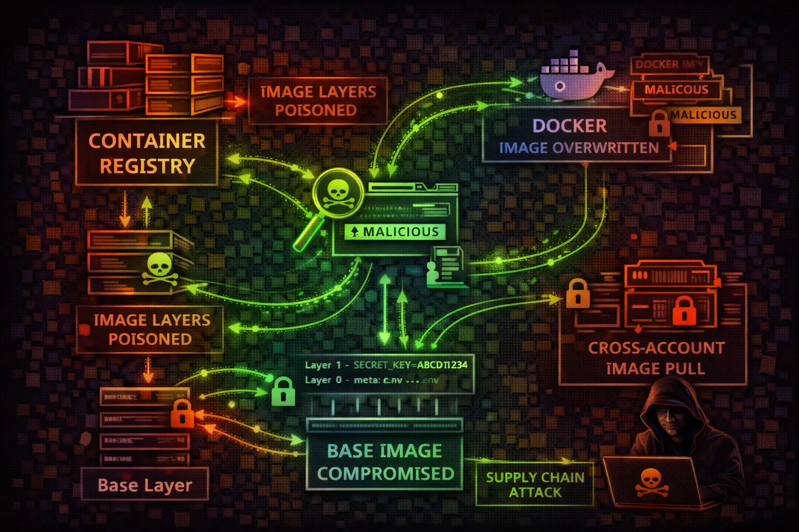

#  AWS ECR Security



> **Category**: CONTAINER

Elastic Container Registry stores Docker container images used by ECS, EKS, and Lambda. Attackers exploit repository policies, image pull access, and push permissions for supply chain attacks, credential theft, and persistent backdoors.

## Quick Stats

| Supply Chain Risk | Poisoning Target | In Image Layers | Via Deployed Images |
| --- | --- | --- | --- |
| **CRITICAL** | **Images** | **Secrets** | **RCE** |

## Service Overview

### Repositories & Images

ECR stores Docker and OCI container images in private or public repositories. Each repository has its own resource policy controlling push/pull access. Images are identified by tags or SHA256 digests — mutable tags allow image replacement attacks if not protected by tag immutability.

### Image Scanning & Signing

ECR offers basic scanning (Clair-based) and enhanced scanning (Amazon Inspector) for CVE detection. Image signing via AWS Signer or Notation validates image provenance. Without signing verification, any image pushed to a repository can be deployed to production.

### Lifecycle & Replication

Lifecycle policies automatically clean up old images, but misconfigured rules can delete production images. Cross-region and cross-account replication distributes images for availability — each replica inherits the destination repository's access policy, not the source's.

## Security Risk Assessment

`█████████░` **8.5/10** (CRITICAL)

ECR is a critical supply chain component. Compromised images get deployed to production via ECS/EKS. Image layers may contain hardcoded secrets. Cross-account pull permissions can expose images to attackers.

## ⚔️ Attack Vectors

### Image Exploitation

- Push malicious image (same tag)
- Overwrite :latest tag
- Cross-account image pull
- Layer history secrets extraction
- Dockerfile command injection

## ⚠️ Misconfigurations

### Common Issues

- Public repository access
- ecr:* permissions
- No image scanning enabled
- Missing image immutability
- Cross-account pull allowed

## 💀 Exploitation

### Techniques

- Replace trusted image with backdoor
- Extract secrets from layers
- Inject cryptominer in base image
- Add reverse shell to entrypoint
- Modify application binaries

## 🎯 High-Value Targets

### Repositories

- Base images (node, python, java)
- Production app images
- Lambda container images
- Internal tooling images
- CI/CD build images

## 🔑 Secrets in Images

### Common Locations

- Environment variables in layers
- Config files (application.yml)
- SSH keys in .ssh directories
- AWS credentials in .aws/
- Build-time ARG secrets

## 🛡️ Detection

### CloudTrail Events

- PutImage (image push)
- BatchGetImage (pull)
- GetDownloadUrlForLayer
- SetRepositoryPolicy
- DeleteRepository

**List Repositories**
```bash
aws ecr describe-repositories
```

**List Images in Repository**
```bash
aws ecr list-images --repository-name my-app
```

**Describe Image (Manifest)**
```bash
aws ecr batch-get-image --repository-name my-app --image-ids imageTag=latest
```

**Get Repository Policy**
```bash
aws ecr get-repository-policy --repository-name my-app
```

**Get Image Scan Findings**
```bash
aws ecr describe-image-scan-findings --repository-name my-app --image-id imageTag=latest
```

**Get Login Token**
```bash
aws ecr get-login-password | docker login --username AWS --password-stdin 123456789012.dkr.ecr.us-east-1.amazonaws.com
```

**Pull Image**
```bash
docker pull 123456789012.dkr.ecr.us-east-1.amazonaws.com/my-app:latest
```

**Push Backdoored Image**
```bash
docker push 123456789012.dkr.ecr.us-east-1.amazonaws.com/my-app:latest
```

**View Image History**
```bash
docker history --no-trunc 123456789012.dkr.ecr.us-east-1.amazonaws.com/my-app:latest
```

**Extract Secrets from Layers**
```bash
docker save my-app:latest | tar -xvf - && grep -r 'password\\|secret\\|key' */layer.tar
```

## Policy Examples

### ❌ Dangerous - Public Repository

```json
{
  "Version": "2012-10-17",
  "Statement": [{
    "Sid": "PublicAccess",
    "Effect": "Allow",
    "Principal": "*",
    "Action": [
      "ecr:GetDownloadUrlForLayer",
      "ecr:BatchGetImage"
    ]
  }]
}
```

*Anyone can pull images - exposes application code and potentially secrets*

### ✅ Secure - Restricted Pull Access

```json
{
  "Version": "2012-10-17",
  "Statement": [{
    "Sid": "AllowProdECS",
    "Effect": "Allow",
    "Principal": {
      "Service": "ecs-tasks.amazonaws.com"
    },
    "Action": [
      "ecr:GetDownloadUrlForLayer",
      "ecr:BatchGetImage"
    ],
    "Condition": {
      "StringEquals": {
        "aws:SourceAccount": "123456789012"
      }
    }
  }]
}
```

*Only ECS tasks in the same account can pull images*

### ❌ Dangerous - Cross-Account Push

```json
{
  "Statement": [{
    "Effect": "Allow",
    "Principal": {
      "AWS": "arn:aws:iam::*:root"
    },
    "Action": [
      "ecr:PutImage",
      "ecr:InitiateLayerUpload"
    ]
  }]
}
```

*Any AWS account can push images - enables supply chain attacks*

### ✅ Secure - CI/CD Only Push

```json
{
  "Statement": [{
    "Effect": "Allow",
    "Principal": {
      "AWS": "arn:aws:iam::123456789012:role/CodeBuildRole"
    },
    "Action": [
      "ecr:PutImage",
      "ecr:InitiateLayerUpload",
      "ecr:UploadLayerPart",
      "ecr:CompleteLayerUpload"
    ]
  }]
}
```

*Only the designated CI/CD role can push new images*

## Defense Recommendations

### 🔒 Enable Image Tag Immutability

Prevent tag overwrites to protect against image replacement attacks.

```bash
aws ecr put-image-tag-mutability --repository-name my-app --image-tag-mutability IMMUTABLE
```

### 🔍 Enable Image Scanning

Scan images on push for known vulnerabilities.

```bash
aws ecr put-image-scanning-configuration --repository-name my-app --image-scanning-configuration scanOnPush=true
```

### 🚫 Restrict Push Permissions

Only allow CI/CD roles to push images. Deny manual pushes.

### 📝 Use Image Digest References

Reference images by digest (@sha256:...) instead of mutable tags.

```bash
image: 123456.dkr.ecr.region.amazonaws.com/app@sha256:abc123...
```

### 🔐 Sign Images with Notation/Cosign

Cryptographically sign images and verify signatures before deployment.

### 📋 Monitor ECR API Calls

Alert on PutImage, SetRepositoryPolicy, and DeleteRepository events.

---

*AWS ECR Security Card*

*Always obtain proper authorization before testing*
