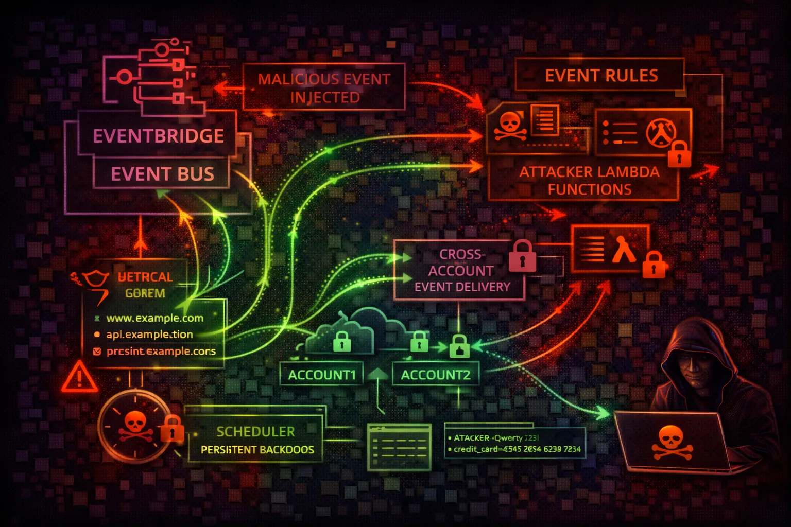

#  AWS EventBridge Security



> **Category**: EVENT BUS

EventBridge is a serverless event bus that routes events between AWS services, SaaS apps, and custom applications. Attackers exploit rules to intercept sensitive events, inject malicious events, and create persistence mechanisms that trigger on specific AWS activities.

## Quick Stats

| Persistence Risk | AWS Event Sources | Target Types | Event Processing |
| --- | --- | --- | --- |
| **HIGH** | **200+** | **35+** | **Real-time** |

## Service Overview

### Event Buses & Rules

EventBridge uses event buses (default and custom) to receive events. Rules match event patterns and route to targets (Lambda, SQS, SNS, Step Functions, etc.). Every AWS API call via CloudTrail generates an event on the default bus.

> Attack note: A single rule on the default bus can intercept ANY AWS API call in real-time. This is the ultimate persistence and surveillance mechanism.

### Cross-Account & Archives

Event bus policies control cross-account event delivery. Archives store events for replay. API destinations enable HTTP webhook integration. Connections store auth credentials for external APIs.

> Attack note: Archives contain historical events that may include sensitive data. Replaying archived events can re-trigger actions in the account.

## Security Risk Assessment

`████████░░` **8.0/10** (CRITICAL)

EventBridge enables powerful persistence mechanisms. Rules can trigger Lambda functions on any AWS API call, providing real-time access to sensitive data and enabling automated response to defender actions.

## ⚔️ Attack Vectors

### Event Bus Abuse

- Malicious rule creation on default bus
- Event interception via wildcard patterns
- Target hijacking (change rule targets)
- Cross-account event injection

### Data & Infrastructure

- Archive data exfiltration via replay
- Schema enumeration for recon
- API destination credential theft
- Connection secret extraction

## ⚠️ Misconfigurations

### Bus Policy Issues

- Event bus policy with Principal: *
- Wildcard event patterns matching everything
- Cross-account rules without source restrictions
- Unmonitored custom event buses

### Operational Gaps

- Archives storing sensitive event data
- Missing rule change monitoring
- No SCP restricting PutRule/PutTargets
- API destinations with stored credentials

## 🔍 Enumeration

**List Event Buses**
```bash
aws events list-event-buses
```

**List Rules**
```bash
aws events list-rules
```

**Get Bus Policy**
```bash
aws events describe-event-bus --name default
```

**List Archives**
```bash
aws events list-archives
```

## 📈 Privilege Escalation

### Event-Based Escalation

- Rule on CreateAccessKey to intercept new keys
- Rule on AssumeRole to capture session tokens
- Rule on GetSecretValue to mirror secrets
- Rule on PutBucketPolicy to detect changes

### Target Exploitation

- Lambda target with escalated IAM role
- Step Functions target chaining API calls
- SNS target for data exfiltration
- API destination to attacker webhook

> **Key insight:** EventBridge rules execute with the target's IAM role, not the rule creator's. If the target Lambda has admin access, the rule creator effectively has admin access.

## 🔗 Persistence

### Rule-Based Persistence

- Rule on CreateUser -> auto-add backdoor key
- Rule on StopLogging -> re-enable CloudTrail
- Rule on DeleteRule -> self-recreating rule
- Scheduled rule for periodic beacon/check-in

### Advanced Persistence

- Rule on remediation -> re-compromise target
- Cross-account event bus for C2 channel
- Archive replay to re-trigger backdoors
- Self-healing infrastructure via event chains

## 🛡️ Detection

### CloudTrail Events

- PutRule (new rule creation)
- PutTargets (target modification)
- PutPermission (bus policy change)
- CreateApiDestination (webhook setup)

### Behavioral Indicators

- Rules matching broad event patterns
- New rules on default event bus
- Cross-account event bus permissions
- Rules targeting external Lambda/HTTP

> **Tool reference:** Pacu module events__enum discovers rules, targets, and bus policies. Prowler check eventbridge_bus_exposed flags open bus policies.

## Exploitation Commands

**Create Intercept Rule**
```bash
aws events put-rule --name intercept-secrets --event-pattern '{"source":["aws.secretsmanager"],"detail-type":["AWS API Call via CloudTrail"],"detail":{"eventName":["GetSecretValue"]}}'
```

**Add Lambda Target**
```bash
aws events put-targets --rule intercept-secrets --targets '[{"Id":"exfil","Arn":"arn:aws:lambda:us-east-1:123:function:exfil-handler"}]'
```

**Create Scheduled Beacon**
```bash
aws events put-rule --name beacon --schedule-expression 'rate(5 minutes)'
```

**Open Bus to Cross-Account**
```bash
aws events put-permission --event-bus-name default --action events:PutEvents --principal '*' --statement-id allow-all
```

**Replay Archived Events**
```bash
aws events start-replay --replay-name attack-replay --event-source-arn arn:aws:events:us-east-1:123:archive/my-archive --destination arn:aws:events:us-east-1:123:event-bus/default --event-start-time 2024-01-01T00:00:00Z --event-end-time 2024-01-02T00:00:00Z
```

**List Rule Targets (Recon)**
```bash
aws events list-targets-by-rule --rule my-rule --query 'Targets[*].{Id:Id,Arn:Arn}'
```

## Policy Examples

### ❌ Dangerous - Permissive Bus Policy

```json
{
  "Version": "2012-10-17",
  "Statement": [{
    "Sid": "AllowCrossAccount",
    "Effect": "Allow",
    "Principal": "*",
    "Action": "events:PutEvents",
    "Resource": "arn:aws:events:*:*:event-bus/default"
  }]
}
```

*Allows any account to send events to this bus - enables event injection from anywhere*

### ❌ Dangerous - Unrestricted Rule Creation

```json
{
  "Effect": "Allow",
  "Action": [
    "events:PutRule",
    "events:PutTargets",
    "iam:PassRole"
  ],
  "Resource": "*"
}
// Allows creating rules that intercept ANY event
// and route to ANY target with ANY role
```

*PutRule + PutTargets + PassRole = full event interception and arbitrary code execution*

### ✅ Secure - Restricted Bus Policy

```json
{
  "Version": "2012-10-17",
  "Statement": [{
    "Sid": "AllowTrustedAccount",
    "Effect": "Allow",
    "Principal": {
      "AWS": "arn:aws:iam::TRUSTED_ACCOUNT:root"
    },
    "Action": "events:PutEvents",
    "Resource": "arn:aws:events:*:*:event-bus/default",
    "Condition": {
      "StringEquals": {
        "events:source": ["trusted.application"]
      }
    }
  }]
}
```

*Only allows specific account with specific event source - no wildcards*

### ✅ Secure - SCP Blocking Rule Creation

```json
{
  "Version": "2012-10-17",
  "Statement": [{
    "Effect": "Deny",
    "Action": [
      "events:PutRule",
      "events:PutTargets",
      "events:PutPermission"
    ],
    "Resource": "*",
    "Condition": {
      "StringNotLike": {
        "aws:PrincipalArn": [
          "arn:aws:iam::*:role/EventBridgeAdmin"
        ]
      }
    }
  }]
}
```

*SCP prevents rule creation except by designated admin role*

## Defense Recommendations

### 👁️ Monitor Rule Changes

Alert on any EventBridge rule creation, modification, or target changes in real-time.

```bash
EventBridge rule on events:PutRule,\nPutTargets, RemoveTargets -> SNS alert
```

### 🔒 Restrict Cross-Account Access

Use explicit conditions in event bus policies instead of Principal: *.

```bash
"Condition": {"StringEquals": {\n  "events:source": ["trusted.app"]\n}}
```

### 🛡️ SCP to Limit Rule Creation

Prevent unauthorized principals from creating EventBridge rules via Service Control Policies.

```bash
SCP: Deny events:PutRule except\nfrom arn:...:role/EventBridgeAdmin
```

### 🔍 Audit Existing Rules

Regularly review all rules and targets for suspicious patterns like wildcard matchers.

```bash
aws events list-rules | jq \\\n  '.Rules[] | {Name, EventPattern}'
```

### 🔐 Encrypt Archives

Use KMS encryption for event archives to protect sensitive historical event data.

```bash
aws events create-archive \\\n  --archive-name secure-archive \\\n  --event-source-arn arn:aws:events:REGION:ACCOUNT:event-bus/default
```

### 🏷️ Tag-Based Access Control

Tag authorized rules and alert on untagged rule creation as an anomaly indicator.

```bash
aws events tag-resource --resource-arn <arn>\n  --tags Key=Authorized,Value=true
```

---

*AWS EventBridge Security Card*

*Always obtain proper authorization before testing*
