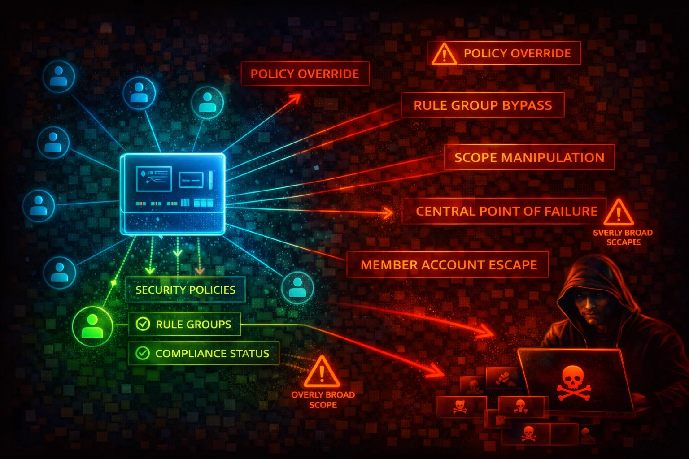

#  AWS Firewall Manager Security



> **Category**: MANAGEMENT

AWS Firewall Manager is a centralized security management service that lets you configure and deploy firewall rules and protections across multiple accounts and resources in an AWS Organization. It manages WAF, Shield Advanced, VPC Security Groups, Network ACLs, Network Firewall, Route 53 Resolver DNS Firewall, and third-party firewalls (Palo Alto Networks Cloud NGFW, Fortigate CNF).


## Quick Stats

| Risk Level | Scope | Policy Types | Requires |
| --- | --- | --- | --- |
| **HIGH** | **Org-wide** | **WAF/SG/NF/DNS/Shield/NACL** | **Organizations + Config** |

## 📋 Service Overview

### Centralized Policy Management

Firewall Manager enforces security policies across all accounts in an AWS Organization. Policies are automatically applied to new accounts and resources as they are added. The FMS administrator account has the authority to create, modify, and delete policies that affect every member account in scope.

> Attack note: Compromising the FMS administrator account grants the ability to weaken or delete security policies across the entire organization in a single operation

### Auto-Remediation and Scope Control

Policies can automatically remediate non-compliant resources. Scope is controlled via account inclusion/exclusion maps, resource tags, and resource types. Disabling auto-remediation or narrowing scope silently removes protections.

> Attack note: An attacker with fms:PutPolicy can modify a policy's scope or disable remediation, leaving resources unprotected without triggering obvious alerts

## Security Risk Assessment

`████████░░` **7.5/10** (HIGH)

Firewall Manager is an organization-wide security control plane. Compromise of the FMS administrator account or misconfiguration of policies can silently remove WAF rules, security group restrictions, and Network Firewall protections across every account in the organization. The blast radius is the entire AWS Organization.

## ⚔️ Attack Vectors

### Policy Manipulation

- Modify existing policy to disable RemediationEnabled, stopping auto-fix of non-compliant resources
- Change IncludeMap/ExcludeMap to remove accounts from policy scope
- Switch SecurityServiceType policy rules to permissive configurations via ManagedServiceData
- Delete critical policies with fms:DeletePolicy, removing organization-wide protections
- Narrow admin scope via `fms:PutAdminAccount` to push policies into `OUT_OF_ADMIN_SCOPE` status, effectively disabling their enforcement

### Administrative Takeover

- Use fms:PutAdminAccount to register a rogue administrator account (requires compromise of the Organizations management account -- the highest-privilege account in the organization)
- Use fms:AssociateAdminAccount to designate attacker-controlled account as FMS admin
- Modify admin scope via fms:PutAdminAccount to limit legitimate admin visibility
- Delete notification channel with fms:DeleteNotificationChannel to suppress compliance alerts
- Disassociate the legitimate admin account with fms:DisassociateAdminAccount

## ⚠️ Misconfigurations

### Policy Scope Issues

- RemediationEnabled set to false -- non-compliant resources are reported but never fixed
- ExcludeResourceTags set to true with overly broad tag exclusions, leaving critical resources unprotected
- IncludeMap limited to a subset of accounts, leaving other member accounts without protection
- Policies created only in one Region while resources exist in multiple Regions
- DeleteUnusedFMManagedResources set to false, leaving orphaned security resources after policy deletion

### Operational Gaps

- AWS Config not enabled in all accounts and Regions, preventing Firewall Manager from detecting non-compliance
- No SNS notification channel configured (PutNotificationChannel never called), so compliance violations go unnoticed
- Security group policies in audit mode only (SECURITY_GROUPS_USAGE_AUDIT) without corresponding enforcement policies
- WAF policies using COUNT action instead of BLOCK in managed rule groups
- Third-party firewall integration enabled without verifying the third-party tenant configuration

## 🔍 Enumeration

**Identify FMS Administrator Account**
```bash
aws fms get-admin-account
```

**List All FMS Policies**
```bash
aws fms list-policies
```

**Get Full Policy Details**
```bash
aws fms get-policy \
  --policy-id a1b2c3d4-5678-90ab-cdef-EXAMPLE11111
```

**List Member Accounts Under FMS**
```bash
aws fms list-member-accounts
```

**Check Compliance Status for a Policy**
```bash
aws fms list-compliance-status \
  --policy-id a1b2c3d4-5678-90ab-cdef-EXAMPLE11111
```

**Get Detailed Compliance for Specific Account**
```bash
aws fms get-compliance-detail \
  --policy-id a1b2c3d4-5678-90ab-cdef-EXAMPLE11111 \
  --member-account 123456789012
```

**Get Violation Details for a Resource**
```bash
aws fms get-violation-details \
  --policy-id a1b2c3d4-5678-90ab-cdef-EXAMPLE11111 \
  --member-account 123456789012 \
  --resource-id sg-0123456789abcdef0 \
  --resource-type AWS::EC2::SecurityGroup
```

**Check Notification Channel Configuration**
```bash
aws fms get-notification-channel
```

**List Resource Sets**
```bash
aws fms list-resource-sets
```

**List All FMS Administrators in the Organization**
```bash
aws fms list-admin-accounts-for-organization
```

## 📈 Privilege Escalation

### fms:PutPolicy -- Weaken Organization-Wide Security

An attacker with `fms:PutPolicy` can modify existing Firewall Manager policies to disable remediation, narrow scope, or change the managed service data to permissive rules. This effectively removes security controls across all in-scope accounts without needing direct access to those accounts.

### fms:AssociateAdminAccount / fms:PutAdminAccount -- Administrative Takeover

The `fms:AssociateAdminAccount` action (callable from the Organizations management account) designates the FMS administrator. The `fms:PutAdminAccount` action creates or updates additional FMS administrator accounts. An attacker with access to the management account and these permissions can install their own account as FMS administrator, gaining full control over all security policies in the organization.

### fms:DeletePolicy -- Remove Protections at Scale

An attacker with `fms:DeletePolicy` can delete Firewall Manager policies, which removes the centrally managed WAF rules, security group rules, or Network Firewall configurations from all accounts in scope. Combined with `fms:DeleteNotificationChannel`, the deletion can go unnoticed.

## 📜 Policy Examples

### Bad -- Overly Broad Exclusion, No Remediation

```json
{
  "Policy": {
    "PolicyName": "WAFPolicy",
    "SecurityServicePolicyData": {
      "Type": "WAFV2",
      "ManagedServiceData": "{\"type\":\"WAFV2\",\"defaultAction\":{\"type\":\"ALLOW\"}}"
    },
    "ResourceType": "AWS::ElasticLoadBalancingV2::LoadBalancer",
    "ExcludeResourceTags": true,
    "ResourceTags": [
      {
        "Key": "Environment",
        "Value": "Dev"
      }
    ],
    "RemediationEnabled": false,
    "ExcludeMap": {
      "ACCOUNT": ["111111111111", "222222222222"]
    }
  }
}
```

*Default action is ALLOW, remediation is disabled, two accounts are excluded, and all Dev-tagged resources are excluded. Non-compliant resources will never be fixed and large portions of the organization are left unprotected.*

### Good -- Full Scope, Remediation Enabled, Enforcing Rules

```json
{
  "Policy": {
    "PolicyName": "WAFPolicy-AllAccounts",
    "SecurityServicePolicyData": {
      "Type": "WAFV2",
      "ManagedServiceData": "{\"type\":\"WAFV2\",\"defaultAction\":{\"type\":\"BLOCK\"},\"preProcessRuleGroups\":[{\"managedRuleGroupIdentifier\":{\"vendorName\":\"AWS\",\"managedRuleGroupName\":\"AWSManagedRulesCommonRuleSet\"},\"overrideAction\":{\"type\":\"NONE\"},\"ruleGroupType\":\"ManagedRuleGroup\",\"excludeRules\":[]}],\"postProcessRuleGroups\":[]}"
    },
    "ResourceType": "AWS::ElasticLoadBalancingV2::LoadBalancer",
    "ResourceTypeList": [
      "AWS::ElasticLoadBalancingV2::LoadBalancer",
      "AWS::CloudFront::Distribution",
      "AWS::ApiGateway::Stage"
    ],
    "ExcludeResourceTags": false,
    "ResourceTags": [],
    "RemediationEnabled": true,
    "DeleteUnusedFMManagedResources": true,
    "IncludeMap": {}
  }
}
```

*Default action is BLOCK, AWS Managed Rules Common Rule Set is enforced, remediation is enabled, no accounts or tags are excluded, multiple resource types are covered, and orphaned resources are cleaned up on policy deletion.*

## 🛡️ Defense Recommendations

### Restrict FMS Administrative Permissions

Limit `fms:PutPolicy`, `fms:DeletePolicy`, `fms:AssociateAdminAccount`, and `fms:PutAdminAccount` to the absolute minimum number of principals. Use SCPs to prevent member accounts from calling FMS write actions.

### Enable Auto-Remediation on All Policies

Set `RemediationEnabled: true` on every Firewall Manager policy. Audit-only mode is useful during initial rollout, but production policies must enforce compliance automatically.

### Configure SNS Notification Channel

Use `aws fms put-notification-channel` to send compliance findings to an SNS topic monitored by your security team. Without this, policy violations are only visible in the FMS console.

### Enable AWS Config in All Accounts and Regions

Firewall Manager depends on AWS Config to detect resource compliance. If Config is not enabled in an account or Region, FMS cannot evaluate or remediate resources there. Use an AWS Config conformance pack or Organizations delegated administrator to ensure full coverage.

### Monitor FMS API Calls with CloudTrail

Create CloudTrail alerts for `fms:PutPolicy`, `fms:DeletePolicy`, `fms:AssociateAdminAccount`, `fms:DisassociateAdminAccount`, `fms:PutAdminAccount`, and `fms:DeleteNotificationChannel`. These are high-impact actions that should trigger immediate investigation.

### Apply Policies Across All Regions

Firewall Manager policies are Regional. Create policies in every Region where you have resources, or use SCPs to deny resource creation in Regions where FMS policies are not deployed.

### Use IncludeMap Sparingly -- Default to All Accounts

Leave `IncludeMap` empty (which means all accounts) rather than listing specific accounts. Use `ExcludeMap` only for well-justified exceptions, and audit exclusions regularly.

---

*AWS Firewall Manager Security Card*

*Always obtain proper authorization before testing*
