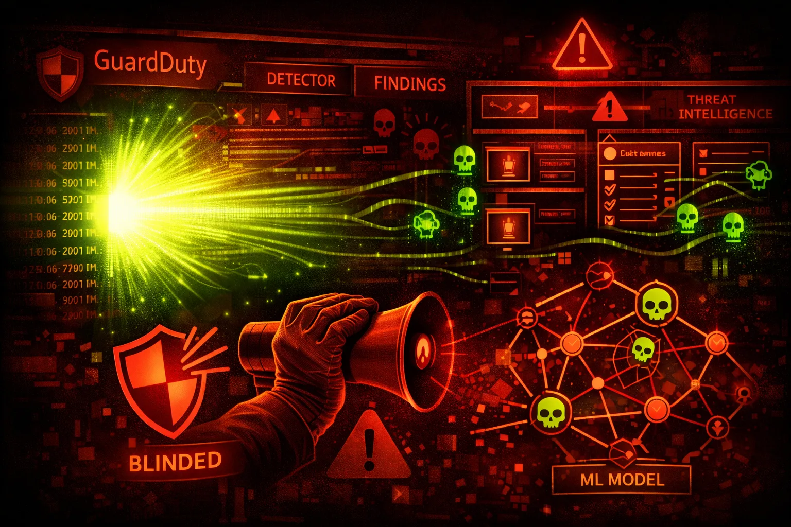

#  AWS GuardDuty Security



> **Category**: THREAT DETECTION

GuardDuty is AWS's managed threat detection service. It analyzes CloudTrail, VPC Flow Logs, and DNS logs to detect malicious activity. Red teamers must understand what triggers alerts.

## Quick Stats

| Detection | Finding Types | Data Sources | Detection Delay |
| --- | --- | --- | --- |
| **ML-Based** | **100+** | **3** | **~15 min** |

## Service Overview

### CloudTrail Analysis

Analyzes management events for suspicious API activity: unusual regions, first-time API calls, known malicious IPs, credential abuse patterns.

### VPC Flow Logs

Detects network anomalies: port scanning, unusual outbound traffic, communication with known C2 servers, cryptocurrency mining patterns.

### DNS Logs

Monitors DNS queries for: C2 domain lookups, DNS exfiltration attempts, cryptomining pool connections, DGA domain patterns.

## Security Risk Assessment

`███████░░░` **7.0/10** (HIGH)

GuardDuty can be disabled, findings can be archived/suppressed, and detection has blind spots. Understanding finding types helps red teamers operate below detection thresholds.

## ⚔️ Attack Vectors

### Disable Detection

- Disable GuardDuty detector entirely
- Suspend GuardDuty in specific regions
- Delete detector to stop all findings
- Remove member accounts from org detector
- Modify publishing destination

### Suppress Findings

- Archive findings to hide them
- Create suppression rules for your IPs
- Add attacker IPs to trusted IP list
- Mark findings as "useful" to reduce noise
- Modify S3 publication frequency

## 👻 Evasion Techniques

### Behavioral Evasion

- Stay within normal API call patterns
- Use same regions as legitimate users
- Avoid known malicious IP addresses
- Throttle reconnaissance to avoid spikes
- Blend with existing traffic patterns

### Technical Evasion

- Use residential proxies, not VPNs
- Avoid Tor exit nodes (flagged)
- DNS over HTTPS to bypass DNS analysis
- Encrypt C2 traffic to avoid pattern detection
- Use legitimate AWS services as proxies

## 🔍 Enumeration

**List Detectors**
```bash
aws guardduty list-detectors
```

**Get Detector Details**
```bash
aws guardduty get-detector --detector-id abc123
```

**List Findings**
```bash
aws guardduty list-findings \\
  --detector-id abc123 \\
  --finding-criteria '{"Criterion":{"severity":{"Gte":7}}}'
```

**List IP Sets (Trusted/Threat)**
```bash
aws guardduty list-ip-sets --detector-id abc123
```

**List Suppression Rules**
```bash
aws guardduty list-filters --detector-id abc123
```

## 🚨 Key Finding Types

### IAM Findings

- UnauthorizedAccess:IAMUser/InstanceCredentialExfiltration
- Recon:IAMUser/MaliciousIPCaller
- PenTest:IAMUser/KaliLinux
- Persistence:IAMUser/AnomalousBehavior
- PrivilegeEscalation:IAMUser/AnomalousBehavior

### EC2/Network Findings

- CryptoCurrency:EC2/BitcoinTool.B!DNS
- Backdoor:EC2/C&CActivity.B!DNS
- Trojan:EC2/DNSDataExfiltration
- UnauthorizedAccess:EC2/SSHBruteForce
- Impact:EC2/PortSweep

## ⚡ Common Triggers

### Will Trigger GuardDuty

- API calls from Tor exit nodes
- Calls from known malicious IPs
- First-time API in unusual region
- EC2 credential use outside AWS
- DNS queries to known C2 domains
- Port scanning from EC2 instances

### May NOT Trigger

- API calls from residential IPs
- Slow, low-volume reconnaissance
- Traffic to non-blacklisted domains
- Actions matching normal patterns
- Encrypted exfiltration channels

## 🛡️ Detection

### CloudTrail Events to Monitor

- DeleteDetector - detector deleted
- UpdateDetector - settings changed
- ArchiveFindings - findings hidden
- CreateFilter - suppression rule added
- CreateIPSet - trusted IP list modified

### Indicators of Tampering

- GuardDuty disabled unexpectedly
- New suppression filters created
- Findings archived in bulk
- Trusted IP list expanded
- Threat IP list deleted

## Exploitation Commands

**Disable GuardDuty Detector**
```bash
aws guardduty update-detector \\
  --detector-id abc123 \\
  --no-enable
```

**Delete GuardDuty Detector**
```bash
aws guardduty delete-detector --detector-id abc123
```

**Archive All Findings**
```bash
aws guardduty archive-findings \\
  --detector-id abc123 \\
  --finding-ids $(aws guardduty list-findings --detector-id abc123 --query 'FindingIds' --output text)
```

**Create Suppression Rule**
```bash
aws guardduty create-filter \\
  --detector-id abc123 \\
  --name "SuppressMyIP" \\
  --action ARCHIVE \\
  --finding-criteria '{"Criterion":{"service.action.networkConnectionAction.remoteIpDetails.ipAddressV4":{"Eq":["1.2.3.4"]}}}'
```

**Add Trusted IP**
```bash
aws guardduty create-ip-set \\
  --detector-id abc123 \\
  --name "TrustedIPs" \\
  --format TXT \\
  --location s3://bucket/trusted-ips.txt \\
  --activate
```

**Delete Threat IP List**
```bash
aws guardduty delete-threat-intel-set \\
  --detector-id abc123 \\
  --threat-intel-set-id threat123
```

## Policy Examples

### ❌ Dangerous - Can Disable GuardDuty

```json
{
  "Version": "2012-10-17",
  "Statement": [{
    "Effect": "Allow",
    "Action": "guardduty:*",
    "Resource": "*"
  }]
}
```

*Full GuardDuty access allows disabling detection and suppressing findings*

### ✅ Read-Only - Security Monitoring

```json
{
  "Version": "2012-10-17",
  "Statement": [{
    "Effect": "Allow",
    "Action": [
      "guardduty:Get*",
      "guardduty:List*",
      "guardduty:Describe*"
    ],
    "Resource": "*"
  }]
}
```

*Read-only access for security analysts without modification rights*

### ✅ SCP - Prevent GuardDuty Disable

```json
{
  "Version": "2012-10-17",
  "Statement": [{
    "Sid": "PreventGuardDutyDisable",
    "Effect": "Deny",
    "Action": [
      "guardduty:DeleteDetector",
      "guardduty:UpdateDetector",
      "guardduty:DeleteMembers",
      "guardduty:DisassociateFromMasterAccount"
    ],
    "Resource": "*"
  }]
}
```

*Organization SCP to prevent disabling GuardDuty in member accounts*

### ❌ Dangerous - Can Suppress Findings

```json
{
  "Version": "2012-10-17",
  "Statement": [{
    "Effect": "Allow",
    "Action": [
      "guardduty:ArchiveFindings",
      "guardduty:CreateFilter",
      "guardduty:UpdateFilter"
    ],
    "Resource": "*"
  }]
}
```

*Ability to archive findings and create suppression rules hides attacks*

## Defense Recommendations

### 🏢 Use Organization Delegated Admin

Centralize GuardDuty management so member accounts can't disable it.

```bash
aws guardduty enable-organization-admin-account \\
  --admin-account-id 123456789012
```

### 🔒 SCP to Prevent Tampering

Use Service Control Policies to deny GuardDuty modifications.

### 📊 Export Findings to S3/SIEM

Publish findings to S3 or EventBridge for independent monitoring.

```bash
aws guardduty create-publishing-destination \\
  --detector-id abc123 \\
  --destination-type S3 \\
  --destination-properties DestinationArn=arn:aws:s3:::findings-bucket
```

### 🔔 Alert on GuardDuty Changes

Create CloudWatch alarms for DeleteDetector, UpdateDetector, ArchiveFindings.

### 🌍 Enable in All Regions

GuardDuty must be enabled per-region - ensure coverage everywhere.

```bash
for region in $(aws ec2 describe-regions --query 'Regions[].RegionName' --output text); do
  aws guardduty create-detector --enable --region $region
done
```

### 🎯 Configure Threat Intel Feeds

Add custom threat IP lists for your industry or known adversaries.

---

*AWS GuardDuty Security Card*

*Always obtain proper authorization before testing*
