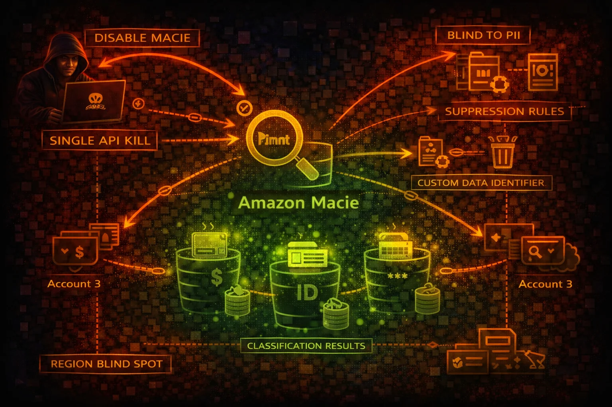

#  AWS Macie Security



> **Category**: DATA SECURITY

Amazon Macie uses machine learning to discover and protect sensitive data in S3. It detects PII, credentials, and financial data. Attackers can disable Macie with a single API call, delete custom data identifiers, and suppress findings.

## Quick Stats

| To Disable | Scope | Detection | Per-Region |
| --- | --- | --- | --- |
| **1 API** | **S3 Only** | **ML-Based** | **Regional** |

## Service Overview

### Sensitive Data Discovery

Macie scans S3 objects to find PII (SSNs, credit cards, passport numbers), credentials (API keys, private keys), and financial data. It is the only AWS service that examines actual object content for hardcoded secrets and sensitive data.

### Classification Jobs

Classification jobs scan S3 buckets on schedule or one-time. Custom data identifiers extend detection with regex patterns for organization-specific data. Jobs can be paused, cancelled, or deleted by an attacker to stop ongoing detection.

### Findings & Suppression

Findings report sensitive data locations and policy violations. Suppression rules automatically archive matching findings. Without org delegated admin, member accounts can disable Macie independently. Macie is not enabled by default.

## Security Risk Assessment

`████████░░` **7.5/10** (HIGH)

Macie can be disabled with a single API call (disable-macie). It is region-scoped and not enabled by default, meaning many accounts have never run it. Findings can be suppressed silently and custom data identifiers deleted.

## ⚔️ Attack Vectors

### Disable Detection

- disable-macie with a single API call stops all detection
- Cancel or pause active classification jobs
- Delete custom data identifiers to remove org-specific detection
- Create suppression rules to auto-archive findings
- Disassociate from administrator account to escape oversight

### Reconnaissance via Findings

- list-findings reveals buckets containing sensitive data
- Findings show exact S3 object paths with credentials
- Bucket statistics expose data classification summary
- Custom data identifiers reveal what org considers sensitive
- Classification results stored in S3 may be misconfigured

## ⚠️ Misconfigurations

### Coverage Gaps

- Macie not enabled at all (not on by default)
- Not enabled in all regions (region-scoped)
- Classification jobs not running or paused
- Not all S3 buckets included in classification scope
- Custom data identifiers not configured for org-specific data

### Management Issues

- No delegated admin - member accounts disable independently
- Classification results S3 bucket publicly accessible
- Findings not exported to Security Hub
- No alerting when Macie is disabled
- Suppression rules too broad, hiding real findings

## 🔍 Enumeration

**Check Macie Status**
```bash
aws macie2 get-macie-session
```

**List S3 Buckets with Stats**
```bash
aws macie2 describe-buckets
```

**List Findings (Sensitive Data Locations)**
```bash
aws macie2 list-findings \\
  --finding-criteria '{"criterion":{"category":{"eq":["CLASSIFICATION"]}}}'
```

**List Classification Jobs**
```bash
aws macie2 list-classification-jobs
```

**List Custom Data Identifiers**
```bash
aws macie2 list-custom-data-identifiers
```

## 🚨 Key Concepts

### Unique Detection Capabilities

- Only service that finds credentials hardcoded in S3 objects
- Detects PII, financial data, health records in stored data
- Custom data identifiers use regex for org-specific patterns
- Classification results show exact file paths and data types
- Bucket-level statistics reveal sensitive data distribution

### Architectural Weaknesses

- Region-scoped: disabling in one region leaves blind spot
- Not enabled by default: many accounts never ran it
- Single API call (disable-macie) stops all detection
- Classification results stored in S3 can be misconfigured
- Without delegated admin, each member controls their own Macie

## ⚡ Persistence Techniques

### Suppression Persistence

- Create suppression rules for specific finding types
- Suppress by bucket name to hide attacker data stores
- Broad suppression criteria cover future findings too
- Delete custom data identifiers silently
- Modify classification job scope to exclude attacker buckets

### Detection Evasion

- Disable Macie in specific regions only
- Pause classification jobs instead of deleting (less obvious)
- Store exfiltrated data in buckets excluded from scanning
- Encrypt objects with attacker KMS key (Macie cannot read)
- Cancel scheduled jobs to prevent future scans

## 🛡️ Detection

### CloudTrail Events

- DisableMacie - Macie disabled entirely
- CreateFindingsFilter - suppression rule created
- DeleteCustomDataIdentifier - detection pattern deleted
- UpdateClassificationJob - job paused or cancelled
- DisassociateFromAdministratorAccount - escaped admin

### Indicators of Tampering

- Macie disabled in one or more regions
- Classification jobs paused or cancelled unexpectedly
- Custom data identifiers deleted
- New suppression rules with broad criteria
- Findings count drops sharply without remediation

## Exploitation Commands

**Disable Macie**
```bash
aws macie2 disable-macie
```

**Delete Custom Data Identifier**
```bash
aws macie2 delete-custom-data-identifier \\
  --id cdi-abc123def456
```

**Create Suppression Rule**
```bash
aws macie2 create-findings-filter \\
  --name "SuppressAll" \\
  --action ARCHIVE \\
  --finding-criteria '{"criterion":{"category":{"eq":["CLASSIFICATION"]}}}'
```

**Pause Classification Job**
```bash
aws macie2 update-classification-job \\
  --job-id job-abc123 \\
  --job-status USER_PAUSED
```

**Recon: Find Buckets with Credentials**
```bash
aws macie2 list-findings --finding-criteria '{"criterion":{"type":{"eq":["SensitiveData:S3Object/Credentials"]}}}' --query 'findingIds' --output text | xargs -I {} aws macie2 get-findings --finding-ids {}
```

**Disassociate from Admin Account**
```bash
aws macie2 disassociate-from-administrator-account
```

## Policy Examples

### ❌ Dangerous - Can Disable Macie

```json
{
  "Version": "2012-10-17",
  "Statement": [{
    "Effect": "Allow",
    "Action": "macie2:*",
    "Resource": "*"
  }]
}
```

*Full Macie access allows disabling the service, deleting data identifiers, and creating suppression rules*

### ✅ Secure - Read-Only Findings Access

```json
{
  "Version": "2012-10-17",
  "Statement": [{
    "Effect": "Allow",
    "Action": [
      "macie2:Get*",
      "macie2:List*",
      "macie2:Describe*"
    ],
    "Resource": "*"
  }]
}
```

*Read-only access for security teams to review findings without modification rights*

### ❌ Dangerous - Can Suppress Findings

```json
{
  "Version": "2012-10-17",
  "Statement": [{
    "Effect": "Allow",
    "Action": [
      "macie2:CreateFindingsFilter",
      "macie2:UpdateFindingsFilter",
      "macie2:DeleteCustomDataIdentifier",
      "macie2:UpdateClassificationJob"
    ],
    "Resource": "*"
  }]
}
```

*Can create suppression rules, delete custom identifiers, and pause classification jobs to hide sensitive data findings*

### ✅ Secure - SCP Prevent Disable

```json
{
  "Version": "2012-10-17",
  "Statement": [{
    "Sid": "PreventMacieDisable",
    "Effect": "Deny",
    "Action": [
      "macie2:DisableMacie",
      "macie2:DisassociateFromAdministratorAccount",
      "macie2:DeleteCustomDataIdentifier"
    ],
    "Resource": "*"
  }]
}
```

*Organization SCP prevents member accounts from disabling Macie or removing custom detection patterns*

## Defense Recommendations

### 🏢 Use Org Delegated Admin

Centralize Macie management so member accounts cannot disable it independently.

```bash
aws macie2 enable-organization-admin-account \\
  --admin-account-id 123456789012
```

### 🚫 SCP Prevent Disable

Use SCPs to deny DisableMacie and DisassociateFromAdministratorAccount in all member accounts.

### 📊 Export Findings to Security Hub

Send Macie findings to Security Hub so they persist independently and feed into centralized monitoring.

### 🌍 Enable in All Regions

Macie is regional. Enable it in every region where S3 buckets exist to avoid blind spots.

```bash
for region in $(aws ec2 describe-regions --query 'Regions[].RegionName' --output text); do
  aws macie2 enable-macie --region $region 2>/dev/null
done
```

### 🔍 Monitor Macie Status

Alert on DisableMacie, DeleteCustomDataIdentifier, and CreateFindingsFilter CloudTrail events.

### 🔐 Secure Classification Results Bucket

Ensure the S3 bucket storing Macie classification results has proper access controls and encryption.

```bash
aws s3api put-public-access-block \\
  --bucket macie-results-bucket \\
  --public-access-block-configuration \\
  BlockPublicAcls=true,IgnorePublicAcls=true,\\
BlockPublicPolicy=true,RestrictPublicBuckets=true
```

---

*AWS Macie Security Card*

*Always obtain proper authorization before testing*
