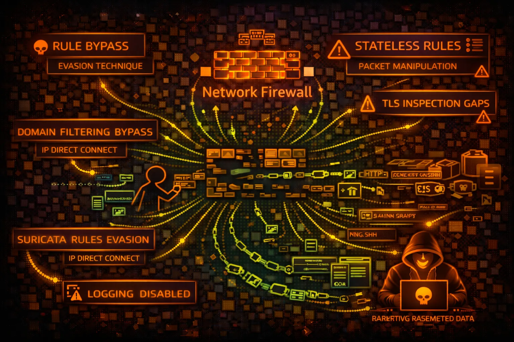

#  AWS Network Firewall Security



> **Category**: NETWORK

AWS Network Firewall provides stateful inspection, IDS/IPS, and domain filtering for VPCs. Security risks include rule bypass, logging gaps, and TLS inspection evasion.

## Quick Stats

| Risk Level | Scope | Engine | Inspection |
| --- | --- | --- | --- |
| **MEDIUM** | **VPC** | **Suricata** | **L3-L7** |

## Service Overview

### Rule Groups

Stateless rules evaluate packets individually. Stateful rules track connection state. Suricata-compatible rules enable IDS/IPS signatures. Domain lists filter HTTP/TLS traffic.

> Attack note: Stateless rules have priority. Lower priority pass rules can bypass higher deny rules in some configurations.

### Firewall Policies

Policies combine rule groups with ordering. Default actions define what happens to non-matching traffic. Strict order vs action order affects rule evaluation.

> Attack note: Default pass actions allow traffic not explicitly blocked. Missing rules = allowed traffic.

## Security Risk Assessment

`██████░░░░` **5.5/10** (MEDIUM)

Network Firewall is a defensive control, so risk is about bypassing it. Misconfigured rules, logging gaps, and TLS inspection limitations create opportunities for attackers to evade detection.

## ⚔️ Attack Vectors

### Protocol Evasion

- IP fragmentation to evade inspection
- TCP segmentation attacks
- HTTP/2 protocol to bypass HTTP rules
- QUIC/UDP to bypass TLS inspection
- DNS over HTTPS (DoH) bypassing

### Rule Gaps

- Direct IP access bypassing domain rules
- Non-standard ports for blocked protocols
- Allowed domain for C2 (*.amazonaws.com)
- IPv6 if only IPv4 rules configured
- Encrypted channels within allowed TLS

## ⚠️ Misconfigurations

### Rule Issues

- Default pass action for unmatched
- Stateless priority misconfiguration
- Missing rules for critical protocols
- Overly broad allow rules
- Incomplete domain allow lists

### Deployment Issues

- Logging disabled or partial
- TLS inspection not configured
- Routing tables bypassing firewall
- No alerts on rule matches
- Unmonitored dropped traffic

## 🔍 Enumeration

**List Firewalls**
```bash
aws network-firewall list-firewalls
```

**Describe Firewall**
```bash
aws network-firewall describe-firewall \\
  --firewall-name FIREWALL_NAME
```

**List Rule Groups**
```bash
aws network-firewall list-rule-groups
```

**Describe Rule Group**
```bash
aws network-firewall describe-rule-group \\
  --rule-group-name GROUP_NAME \\
  --type STATEFUL
```

**Describe Firewall Policy**
```bash
aws network-firewall describe-firewall-policy \\
  --firewall-policy-name POLICY_NAME
```

## 📈 Rule Manipulation

### With Modify Permissions

- Add pass rule for attacker C2
- Remove block rules
- Disable logging for specific traffic
- Add exception for attacker domain
- Modify alert to pass action

### Impact

- Enable C2 communication
- Allow data exfiltration paths
- Disable IDS detection
- Remove evidence of attacks
- Open reverse shell ports

## 🥷 Detection Evasion

### Traffic Techniques

- Domain fronting via CDN
- Steganography in allowed traffic
- Slow/low data exfiltration
- Protocol tunneling (DNS, ICMP)
- Encrypted payloads in TLS

### Infrastructure

- C2 on allowed domains (S3, CloudFront)
- Use legitimate cloud services
- Dynamic domain generation (DGA)
- Peer-to-peer within VPC
- VPC endpoints bypass inspection

## 🛡️ Detection

### CloudTrail Events

- CreateFirewall - new firewall
- UpdateFirewallPolicy - policy change
- CreateRuleGroup - new rules
- UpdateRuleGroup - rule modification
- DeleteRuleGroup - rules removed

### Indicators of Compromise

- Rule modifications outside change windows
- New pass rules for unusual destinations
- Logging configuration changes
- Unusual blocked traffic patterns
- Suricata alerts for known threats

## Exploitation Commands

**Get Firewall Rules (Stateful)**
```bash
aws network-firewall describe-rule-group \\
  --rule-group-arn RULE_GROUP_ARN \\
  --query 'RuleGroup.RulesSource'
```

**Get Domain Allow List**
```bash
aws network-firewall describe-rule-group \\
  --rule-group-arn ARN \\
  --query 'RuleGroup.RulesSource.RulesSourceList'
```

**Get Firewall Logging Config**
```bash
aws network-firewall describe-logging-configuration \\
  --firewall-arn FIREWALL_ARN
```

**Add Pass Rule (if permissions)**
```bash
aws network-firewall update-rule-group \\
  --rule-group-arn ARN \\
  --rules 'pass ip any any -> any any (sid:1;)'
```

**Add Domain Exception**
```bash
aws network-firewall update-rule-group \\
  --rule-group-arn ARN \\
  --rules-source-list Targets=[".attacker.com"],
    TargetTypes=["HTTP_HOST","TLS_SNI"],
    GeneratedRulesType=ALLOWLIST
```

**Disable Logging**
```bash
aws network-firewall update-logging-configuration \\
  --firewall-arn ARN \\
  --logging-configuration '{"LogDestinationConfigs":[]}'
```

## Policy Examples

### ❌ Dangerous - Full Access

```json
{
  "Effect": "Allow",
  "Action": "network-firewall:*",
  "Resource": "*"
}
```

*Full access - can modify rules, disable logging, bypass firewall*

### ✅ Secure - Read Only

```json
{
  "Effect": "Allow",
  "Action": [
    "network-firewall:Describe*",
    "network-firewall:List*"
  ],
  "Resource": "*"
}
```

*Only describe and list - no modification capability*

### ❌ Risky - Rule Modification

```json
{
  "Effect": "Allow",
  "Action": [
    "network-firewall:UpdateRuleGroup",
    "network-firewall:CreateRuleGroup"
  ],
  "Resource": "*"
}
```

*Can create/modify rules - bypass firewall protection*

### ✅ Secure - Deny Rule Changes

```json
{
  "Effect": "Deny",
  "Action": [
    "network-firewall:Update*",
    "network-firewall:Delete*",
    "network-firewall:Create*"
  ],
  "Resource": "*",
  "Condition": {
    "StringNotEquals": {"aws:PrincipalTag/team": "network-security"}
  }
}
```

*Only network security team can modify firewall*

## Defense Recommendations

### 🔐 Default Deny

Set default action to drop/alert for unmatched traffic. Explicit allow only.

### 📝 Full Logging

Enable logging for all rule actions - ALERT, DROP, and PASS.

```bash
LogDestinationConfigs for S3/CloudWatch/Kinesis
```

### 🔒 TLS Inspection

Enable TLS inspection for HTTPS traffic visibility where compliance allows.

### 🚫 Restrict Modifications

Use SCP to prevent rule changes except by security team.

### 📊 Monitor Rule Changes

Alert on UpdateRuleGroup, UpdateFirewallPolicy CloudTrail events.

### 🔄 Regular Rule Review

Audit rules periodically for overly broad allows and stale rules.

---

*AWS Network Firewall Security Card*

*Always obtain proper authorization before testing*
