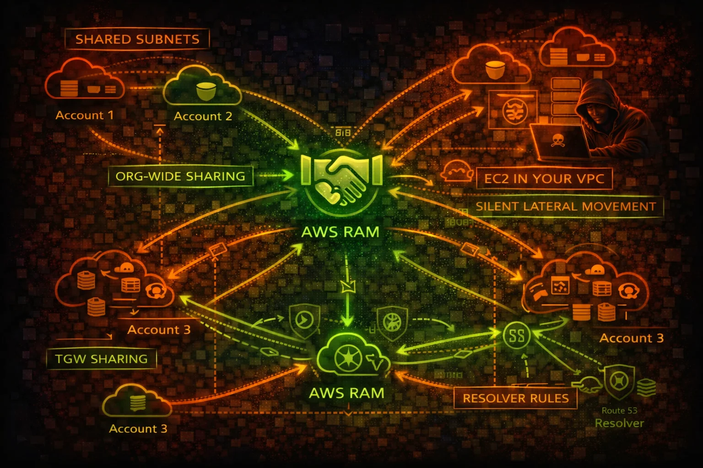

#  AWS RAM Security



> **Category**: MULTI-ACCOUNT

Resource Access Manager (RAM) shares AWS resources across accounts. Shared subnets let other accounts launch EC2 in your VPC, shared TGWs enable routing changes, and shared Resolver rules redirect DNS.

## Quick Stats

| Shared VPCs | Route Access | Resolver Rules | Auto-Share |
| --- | --- | --- | --- |
| **Subnets** | **TGW** | **DNS** | **Org-Wide** |

## Service Overview

### Resource Sharing Model

RAM creates resource shares containing AWS resources (subnets, TGWs, Resolver rules, License Manager configs). Shares can target specific accounts, OUs, or the entire organization. Within an org, shares are auto-accepted without invitation.

### Shared VPC Subnets

When subnets are shared, participant accounts can launch EC2 instances, RDS databases, and other resources directly in the owner account VPC. The participant sees the subnet but cannot modify VPC-level networking, creating a trust boundary issue.

### Organization-Wide Sharing

EnableSharingWithAwsOrganization auto-accepts shares for all org accounts. RAM shares do not appear prominently in CloudTrail, and there is no native alerting when resources are shared with your account, creating visibility gaps.

## Security Risk Assessment

`████████░░` **8.0/10** (CRITICAL)

RAM enables cross-account resource access that is difficult to audit. Shared subnets allow launching instances in other accounts VPCs, shared TGWs enable routing changes, and shared Resolver rules can redirect DNS queries.

## ⚔️ Attack Vectors

### Cross-Account Resource Abuse

- Launch EC2 instances in shared subnets of another account VPC
- Access shared Transit Gateway to manipulate routing
- Shared Route53 Resolver rules enable DNS redirection
- Shared License Manager configs for lateral movement discovery
- Shared Glue catalogs expose data lake metadata

### Organization-Wide Exposure

- EnableSharingWithAwsOrganization auto-shares to all accounts
- Create resource share targeting the entire org for broad access
- Pending invitations can be re-sent after rejection
- Accepted shares persist even after the acceptor leaves the org
- No native alerting when new resources are shared with you

## ⚠️ Misconfigurations

### Sharing Scope Issues

- Organization-wide sharing enabled without controls
- Subnets shared with all accounts instead of specific OUs
- TGW shared without route table segmentation
- Resolver rules shared broadly enabling DNS redirect
- No periodic audit of what is shared and with whom

### Visibility Gaps

- RAM shares not included in regular security audits
- No alerting on CreateResourceShare events
- Shared resources not tagged for ownership tracking
- No inventory of resources shared WITH your account
- CloudTrail events for RAM not monitored

## 🔍 Enumeration

**List Resource Shares**
```bash
aws ram get-resource-shares \\
  --resource-owner SELF
```

**List Shared Resources**
```bash
aws ram list-resources \\
  --resource-owner SELF
```

**List Principals (Who Has Access)**
```bash
aws ram list-principals \\
  --resource-owner SELF
```

**List Resources Shared With Me**
```bash
aws ram list-resources \\
  --resource-owner OTHER-ACCOUNTS
```

**List Resource Share Permissions**
```bash
aws ram list-resource-share-permissions \\
  --resource-share-arn arn:aws:ram:us-east-1:123456789012:resource-share/abc123
```

## 🚨 Key Concepts

### Shared VPC Attack Surface

- Participant launches EC2 in owner VPC subnet directly
- Instance can reach all resources in the VPC via local routing
- Security groups in shared VPCs can reference each other
- Owner cannot see or manage participant instances
- Participant workloads inherit VPC-level network controls

### DNS and Transit Sharing Risks

- Shared Resolver rules forward DNS to attacker-controlled resolver
- TGW sharing grants route table access for traffic manipulation
- Shared resources remain accessible even if RAM share is modified
- No resource-level permissions within a share (all or nothing)
- Cross-region shares possible for some resource types

## ⚡ Persistence Techniques

### Resource Share Persistence

- Create share targeting entire org for auto-accept access
- Share subnets to maintain network presence in target VPC
- Share TGW for persistent routing control
- Share Resolver rules for ongoing DNS redirect capability
- Resources in shared subnets persist even if share is revoked

### Stealthy Sharing

- RAM shares generate minimal CloudTrail footprint
- Name shares innocuously (e.g., "SharedServices-Subnet")
- Share from compromised account to attacker account
- Use org-level sharing to avoid invitation flow
- Modify existing shares to add attacker account as principal

## 🛡️ Detection

### CloudTrail Events

- CreateResourceShare - new share created
- AssociateResourceShare - resource or principal added
- AcceptResourceShareInvitation - share accepted
- EnableSharingWithAwsOrganization - org-wide sharing enabled
- DisassociateResourceShare - principal or resource removed

### Indicators of Compromise

- New resource shares targeting unknown accounts
- Org-wide sharing enabled unexpectedly
- Subnets or TGWs shared outside normal pattern
- Resource shares created from unusual principals
- Resolver rules shared pointing to external DNS servers

## Exploitation Commands

**Create Resource Share (Org-Wide)**
```bash
aws ram create-resource-share \\
  --name "SharedInfra" \\
  --resource-arns arn:aws:ec2:us-east-1:123456789012:subnet/subnet-abc123 \\
  --principals arn:aws:organizations::123456789012:organization/o-abc123
```

**Accept Resource Share Invitation**
```bash
aws ram accept-resource-share-invitation \\
  --resource-share-invitation-arn arn:aws:ram:us-east-1:123456789012:resource-share-invitation/abc123
```

**Enable Org-Wide Sharing**
```bash
aws ram enable-sharing-with-aws-organization
```

**Add Attacker Account to Existing Share**
```bash
aws ram associate-resource-share \\
  --resource-share-arn arn:aws:ram:us-east-1:123456789012:resource-share/abc123 \\
  --principals 999888777666
```

**Launch Instance in Shared Subnet**
```bash
aws ec2 run-instances \\
  --image-id ami-0123456789abcdef0 \\
  --instance-type t3.micro \\
  --subnet-id subnet-shared-abc123 \\
  --key-name attacker-key
```

**Enumerate All Shared Resources**
```bash
echo "=== Shared BY me ===" && aws ram list-resources --resource-owner SELF --query 'resources[].[type,arn]' --output table && echo "=== Shared WITH me ===" && aws ram list-resources --resource-owner OTHER-ACCOUNTS --query 'resources[].[type,arn]' --output table
```

## Policy Examples

### ❌ Dangerous - Full RAM Access

```json
{
  "Version": "2012-10-17",
  "Statement": [{
    "Effect": "Allow",
    "Action": "ram:*",
    "Resource": "*"
  }]
}
```

*Full RAM access allows creating shares targeting any account, enabling org-wide sharing, and modifying existing shares*

### ✅ Secure - Read-Only RAM Audit

```json
{
  "Version": "2012-10-17",
  "Statement": [{
    "Effect": "Allow",
    "Action": [
      "ram:Get*",
      "ram:List*"
    ],
    "Resource": "*"
  }]
}
```

*Read-only access for auditing resource shares without ability to create or modify them*

### ❌ Dangerous - Can Enable Org-Wide Sharing

```json
{
  "Version": "2012-10-17",
  "Statement": [{
    "Effect": "Allow",
    "Action": [
      "ram:EnableSharingWithAwsOrganization",
      "ram:CreateResourceShare",
      "ram:AssociateResourceShare"
    ],
    "Resource": "*"
  }]
}
```

*Enables org-wide auto-accept sharing and can share any resource with any account in the organization*

### ✅ Secure - SCP Restrict RAM Actions

```json
{
  "Version": "2012-10-17",
  "Statement": [{
    "Sid": "DenyRAMSharing",
    "Effect": "Deny",
    "Action": [
      "ram:CreateResourceShare",
      "ram:EnableSharingWithAwsOrganization",
      "ram:AssociateResourceShare"
    ],
    "Resource": "*",
    "Condition": {
      "StringNotEquals": {
        "aws:PrincipalArn": "arn:aws:iam::*:role/NetworkAdmin"
      }
    }
  }]
}
```

*SCP restricts RAM sharing to dedicated NetworkAdmin role, preventing unauthorized cross-account resource exposure*

## Defense Recommendations

### 🚫 Disable Org-Wide Sharing

Do not enable EnableSharingWithAwsOrganization unless required. Use explicit account-level sharing instead.

### 🔒 SCP Restrict RAM Actions

Use SCPs to deny CreateResourceShare and AssociateResourceShare except for authorized roles.

### 🔍 Audit Shared Resources Regularly

Periodically enumerate all resource shares and validate that each share is still needed and correctly scoped.

```bash
aws ram get-resource-shares --resource-owner SELF \\
  --query 'resourceShares[].[name,status]' \\
  --output table
```

### 🏷️ Tag-Based Controls

Use tag-based conditions in RAM policies to restrict which resources can be shared.

```bash
"Condition": {"StringEquals": {
  "ram:ResourceTag/Shareable": "true"
}}
```

### 🔔 Alert on RAM Events

Create EventBridge rules for CreateResourceShare, EnableSharingWithAwsOrganization, and AcceptResourceShareInvitation.

### 📊 Inventory What Is Shared With You

Regularly check what resources other accounts have shared with you to detect unauthorized access.

```bash
aws ram list-resources --resource-owner OTHER-ACCOUNTS \\
  --query 'resources[].[type,arn,resourceShareArn]' \\
  --output table
```

---

*AWS RAM Security Card*

*Always obtain proper authorization before testing*
