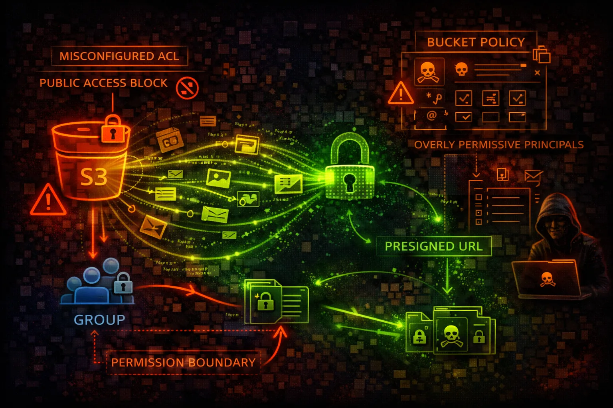

#  AWS S3 Security



> **Category**: STORAGE

Simple Storage Service (S3) provides object storage with bucket policies and ACLs controlling access. S3 is the #1 source of cloud data breaches due to misconfigured public buckets and weak policies.

## Quick Stats

| Risk Level | Namespace | Up to 5TB Each | + ACLs |
| --- | --- | --- | --- |
| **CRITICAL** | **Global** | **Objects** | **Policies** |

## Service Overview

### Bucket Access Controls

S3 uses bucket policies (resource-based) and ACLs (legacy) to control access. Block Public Access settings provide account-level and bucket-level guardrails against accidental exposure.

> Attack note: Public buckets are discovered within hours using automated scanning tools

### Data Access Methods

Objects can be accessed via API, CLI, Console, or pre-signed URLs. Pre-signed URLs grant temporary access without requiring AWS credentials - often leaked or misconfigured.

> Attack note: SSRF vulnerabilities can access private buckets via EC2 instance roles

## Security Risk Assessment

`█████████░` **9.0/10** (CRITICAL)

S3 misconfigurations are responsible for the majority of cloud data breaches. Public buckets, overly permissive policies, and lack of encryption expose sensitive data to the internet.

## ⚔️ Attack Vectors

### Public Exposure

- Public buckets with sensitive data
- Bucket policy allows Principal: *
- ACL grants public-read or public-read-write
- Block Public Access disabled
- Website hosting exposes directory listing

### Access Abuse

- Pre-signed URL leaked or shared
- SSRF to access private buckets
- Cross-account access too permissive
- Versioning disabled - data destruction
- Replication to attacker bucket

## ⚠️ Misconfigurations

### Policy Issues

- Principal: * without conditions
- s3:* action allowed broadly
- No VPC endpoint restriction
- Missing aws:SecureTransport condition
- Cross-account access too wide

### Security Settings

- Block Public Access disabled
- No server-side encryption
- Object Lock not enabled
- Access logging not configured
- MFA Delete not enabled

## 🔍 Enumeration

**List All Buckets**
```bash
aws s3 ls
```

**List Bucket Contents**
```bash
aws s3 ls s3://bucket-name --recursive
```

**Get Bucket Policy**
```bash
aws s3api get-bucket-policy --bucket NAME
```

**Get Bucket ACL**
```bash
aws s3api get-bucket-acl --bucket NAME
```

**Check Public Access Block**
```bash
aws s3api get-public-access-block \\
  --bucket NAME
```

## 📤 Data Exfiltration

### Bulk Download

- aws s3 sync - download entire bucket
- List and download specific prefixes
- Access all object versions
- Download via pre-signed URLs
- Stream objects to external storage

### Replication Abuse

- Configure cross-region replication
- Replicate to attacker-controlled bucket
- Batch operations for bulk export
- S3 Access Points for data access
- Use Object Lambda to exfil

> **Gold Mine:** Backup buckets often contain database dumps, logs with credentials, and configuration files.

## 📝 Object Manipulation

### Write Access Abuse

- Overwrite website index.html
- Upload malicious JavaScript
- Replace application configs
- Plant backdoors in deployments
- Modify log files to hide tracks

### Destruction

- Delete objects and versions
- Ransomware - encrypt objects
- Modify bucket lifecycle rules
- Delete bucket (if empty)
- Disable versioning first

## 🛡️ Detection

### Logging & Monitoring

- S3 Server Access Logs
- CloudTrail data events
- CloudWatch metrics
- Macie sensitive data findings
- GuardDuty S3 protection

### Indicators of Compromise

- Unusual GetObject patterns
- Mass downloads from new IPs
- Public access configuration changes
- Bucket policy modifications
- Cross-account access from unknown

## Exploitation Commands

**Download Entire Bucket**
```bash
aws s3 sync s3://target-bucket ./loot
```

**Upload Malicious File**
```bash
aws s3 cp malicious.html s3://bucket/index.html
```

**Make Bucket Public**
```bash
aws s3api put-bucket-acl \\
  --bucket NAME --acl public-read
```

**Check Anonymous Access**
```bash
aws s3 ls s3://bucket-name --no-sign-request
```

**Generate Pre-signed URL**
```bash
aws s3 presign s3://bucket/secret.txt \\
  --expires-in 604800
```

**Delete All Versions**
```bash

```

## Policy Examples

### ❌ Dangerous - Public Bucket

```json
{
  "Version": "2012-10-17",
  "Statement": [{
    "Effect": "Allow",
    "Principal": "*",
    "Action": "s3:*",
    "Resource": ["arn:aws:s3:::bucket/*"]
  }]
}
```

*Anyone on the internet can read, write, and delete all objects*

### ✅ Secure - VPC Restricted

```json
{
  "Version": "2012-10-17",
  "Statement": [{
    "Effect": "Allow",
    "Principal": {"AWS": "arn:aws:iam::123456789012:role/AppRole"},
    "Action": ["s3:GetObject"],
    "Resource": "arn:aws:s3:::bucket/data/*",
    "Condition": {
      "StringEquals": {"aws:SourceVpc": "vpc-12345"}
    }
  }]
}
```

*Only specific role can access, and only from within VPC*

### ❌ Dangerous - Any AWS Account

```json
{
  "Version": "2012-10-17",
  "Statement": [{
    "Effect": "Allow",
    "Principal": {"AWS": "*"},
    "Action": ["s3:GetObject", "s3:PutObject"],
    "Resource": "arn:aws:s3:::bucket/*"
  }]
}
```

*Any authenticated AWS user can read/write - not just your account*

### ✅ Secure - HTTPS Only

```json
{
  "Version": "2012-10-17",
  "Statement": [{
    "Effect": "Deny",
    "Principal": "*",
    "Action": "s3:*",
    "Resource": "arn:aws:s3:::bucket/*",
    "Condition": {
      "Bool": {"aws:SecureTransport": "false"}
    }
  }]
}
```

*Deny all requests not using HTTPS - prevents data interception*

## Defense Recommendations

### 🔐 Block Public Access

Enable at account and bucket level - this is the most important setting.

```bash
aws s3api put-public-access-block --bucket NAME \\
  --public-access-block-configuration \\
  BlockPublicAcls=true,IgnorePublicAcls=true,\\
BlockPublicPolicy=true,RestrictPublicBuckets=true
```

### 🚫 Enable Default Encryption

SSE-S3, SSE-KMS, or SSE-C for all objects automatically.

```bash
aws s3api put-bucket-encryption --bucket NAME \\
  --server-side-encryption-configuration ...
```

### 🔒 Enable Versioning

Protect against accidental deletion and ransomware attacks.

```bash
aws s3api put-bucket-versioning --bucket NAME \\
  --versioning-configuration Status=Enabled
```

### 📝 Enable Access Logging

Track all access to bucket for security monitoring.

```bash
aws s3api put-bucket-logging --bucket NAME \\
  --bucket-logging-status ...
```

### 🌐 Use VPC Endpoints

Restrict bucket access to within your VPC only.

```bash
"Condition": {"StringEquals": \\
  {"aws:SourceVpc": "vpc-xxx"}}
```

### 🔍 Enable Macie

Discover and protect sensitive data automatically.

```bash
aws macie2 enable-macie && \\
aws macie2 create-classification-job ...
```

---

*AWS S3 Security Card*

*Always obtain proper authorization before testing*
