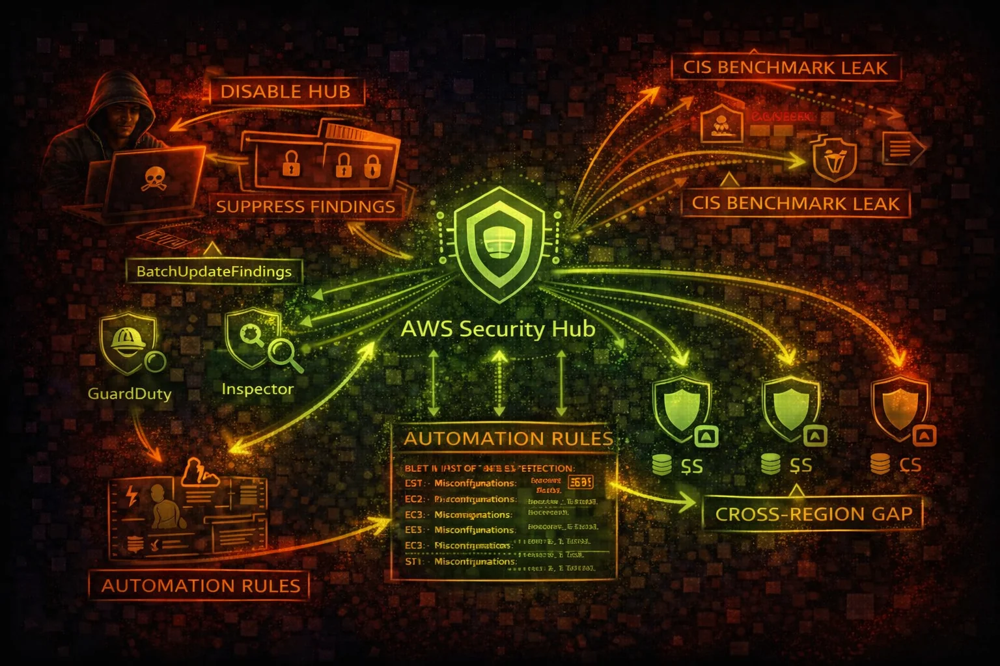

#  AWS Security Hub Security



> **Category**: SECURITY POSTURE

Security Hub aggregates findings from GuardDuty, Inspector, Macie, Config, and third-party tools. Attackers can disable it, suppress findings, or use GetFindings as a reconnaissance goldmine for misconfiguration discovery.

## Quick Stats

| To Disable All | Compliance | Aggregation | Via Findings |
| --- | --- | --- | --- |
| **1 API** | **CIS/PCI** | **Multi-Svc** | **Recon** |

## Service Overview

### Finding Aggregation

Security Hub ingests findings from GuardDuty, Inspector, Macie, Config, Firewall Manager, and third-party tools. Disabling Security Hub silences all integrated findings in a single API call, creating a massive blind spot.

### Compliance Standards

Built-in standards (CIS AWS Foundations, PCI DSS, NIST 800-53, AWS Foundational Security Best Practices) continuously evaluate your environment. GetFindings reveals every misconfiguration and compliance gap to an attacker.

### Automation & Suppression

Automation rules can auto-update finding statuses. Attackers create rules to auto-suppress future findings, effectively creating persistent blind spots. BatchUpdateFindings can archive hundreds of findings instantly.

## Security Risk Assessment

`█████████░` **8.5/10** (CRITICAL)

Security Hub is both a reconnaissance goldmine (GetFindings reveals all misconfigurations) and a key target for defense evasion (DisableSecurityHub, BatchUpdateFindings, CreateAutomationRule for suppression).

## ⚔️ Attack Vectors

### Defense Evasion

- DisableSecurityHub silences ALL integrated findings
- BatchUpdateFindings suppresses findings covertly
- CreateAutomationRule auto-suppresses future findings
- DisassociateFromAdministratorAccount escapes org monitoring
- DisableImportFindingsForProduct blocks specific integrations

### Reconnaissance via Findings

- GetFindings returns complete misconfiguration inventory
- CIS/PCI compliance failures map exploitable weaknesses
- Findings reveal public S3 buckets, open security groups
- Failed compliance checks identify unpatched resources
- Cross-region aggregation shows full org posture

## ⚠️ Misconfigurations

### Coverage Gaps

- Security Hub not enabled in all regions
- Cross-region aggregation not configured
- Not all compliance standards enabled
- Third-party integrations not connected
- Findings not exported to external SIEM

### Access Control Issues

- Member accounts can disable Security Hub independently
- No SCP preventing DisableSecurityHub
- BatchUpdateFindings allowed for non-admin users
- Automation rules not audited for suppression patterns
- Delegated admin account not hardened

## 🔍 Enumeration

**Check If Security Hub Is Enabled**
```bash
aws securityhub describe-hub
```

**Get All Findings (Recon Goldmine)**
```bash
aws securityhub get-findings \\
  --filters '{"ComplianceStatus":[{"Value":"FAILED","Comparison":"EQUALS"}]}' \\
  --max-items 100
```

**List Member Accounts**
```bash
aws securityhub list-members
```

**List Enabled Standards**
```bash
aws securityhub get-enabled-standards
```

**List Automation Rules**
```bash
aws securityhub list-automation-rules
```

## 🚨 Key Concepts

### Finding Lifecycle Abuse

- NEW -> NOTIFIED -> RESOLVED -> SUPPRESSED workflow
- BatchUpdateFindings sets Workflow.Status to SUPPRESSED
- Suppressed findings hidden from default dashboard view
- RecordState set to ARCHIVED removes from active findings
- Compliance.Status override hides failed checks

### Aggregation Architecture

- Region-scoped: each region runs independently
- Cross-region aggregation copies findings to one region
- Admin-member model: admin sees all member findings
- Disassociating from admin breaks centralized visibility
- Custom actions trigger EventBridge for automated response

## ⚡ Persistence Techniques

### Persistent Suppression

- CreateAutomationRule to auto-suppress specific finding types
- Automation rule with broad criteria silences future detections
- Suppress by resource type to hide attacker infrastructure
- Modify existing automation rules to expand suppression scope
- Disable specific product integrations selectively

### Monitoring Evasion

- Disable Security Hub in non-aggregation regions
- Disassociate member account from admin oversight
- Delete custom EventBridge rules for finding alerts
- Modify SNS subscriptions to redirect notifications
- BatchUpdateFindings to mark critical findings as resolved

## 🛡️ Detection

### CloudTrail Events

- DisableSecurityHub - hub disabled entirely
- BatchUpdateFindings - findings suppressed/archived
- CreateAutomationRule - suppression rule created
- DisassociateFromAdministratorAccount - escaped monitoring
- DisableImportFindingsForProduct - integration disabled

### Indicators of Tampering

- Security Hub disabled unexpectedly
- Large batch of findings suppressed at once
- New automation rules with broad suppression criteria
- Member account disassociated from admin
- Decrease in finding count without remediation

## Exploitation Commands

**Disable Security Hub**
```bash
aws securityhub disable-security-hub
```

**Suppress All Critical Findings**
```bash
aws securityhub batch-update-findings \\
  --finding-identifiers '[{"Id":"arn:aws:securityhub:us-east-1:123456789012:finding/abc123","ProductArn":"arn:aws:securityhub:us-east-1::product/aws/securityhub"}]' \\
  --workflow '{"Status":"SUPPRESSED"}'
```

**Create Auto-Suppression Rule**
```bash
aws securityhub create-automation-rule \\
  --rule-name "SuppressAll" \\
  --rule-order 1 \\
  --criteria '{"SeverityLabel":[{"Value":"CRITICAL","Comparison":"EQUALS"}]}' \\
  --actions '[{"Type":"FINDING_FIELDS_UPDATE","FindingFieldsUpdate":{"Workflow":{"Status":"SUPPRESSED"}}}]'
```

**Disassociate From Admin Account**
```bash
aws securityhub disassociate-from-administrator-account
```

**Recon: Get All Failed Compliance Checks**
```bash
aws securityhub get-findings \\
  --filters '{"ComplianceStatus":[{"Value":"FAILED","Comparison":"EQUALS"}],"RecordState":[{"Value":"ACTIVE","Comparison":"EQUALS"}]}' \\
  --query 'Findings[].[Title,Resources[0].Id]' \\
  --output table
```

**Disable Specific Product Integration**
```bash
aws securityhub disable-import-findings-for-product \\
  --product-subscription-arn arn:aws:securityhub:us-east-1:123456789012:product-subscription/aws/guardduty
```

## Policy Examples

### ❌ Dangerous - Can Disable Security Hub

```json
{
  "Version": "2012-10-17",
  "Statement": [{
    "Effect": "Allow",
    "Action": "securityhub:*",
    "Resource": "*"
  }]
}
```

*Full Security Hub access allows disabling the service, suppressing findings, and creating suppression automation*

### ✅ Secure - Read-Only Security Monitoring

```json
{
  "Version": "2012-10-17",
  "Statement": [{
    "Effect": "Allow",
    "Action": [
      "securityhub:Get*",
      "securityhub:List*",
      "securityhub:Describe*"
    ],
    "Resource": "*"
  }]
}
```

*Read-only access for security analysts to view findings without modification rights*

### ❌ Dangerous - Can Suppress Findings

```json
{
  "Version": "2012-10-17",
  "Statement": [{
    "Effect": "Allow",
    "Action": [
      "securityhub:BatchUpdateFindings",
      "securityhub:CreateAutomationRule",
      "securityhub:UpdateAutomationRule"
    ],
    "Resource": "*"
  }]
}
```

*Ability to suppress findings and create automation rules enables covert defense evasion*

### ✅ Secure - SCP Prevent Disable

```json
{
  "Version": "2012-10-17",
  "Statement": [{
    "Sid": "PreventSecurityHubDisable",
    "Effect": "Deny",
    "Action": [
      "securityhub:DisableSecurityHub",
      "securityhub:DisassociateFromAdministratorAccount",
      "securityhub:DisableImportFindingsForProduct",
      "securityhub:DeleteMembers"
    ],
    "Resource": "*"
  }]
}
```

*Organization SCP prevents member accounts from disabling Security Hub or escaping admin oversight*

## Defense Recommendations

### 🚫 SCP Prevent Disable

Use Organization SCPs to deny DisableSecurityHub, DisassociateFromAdministratorAccount in all member accounts.

### 📊 Export Findings Externally

Send findings to S3 or external SIEM via EventBridge so they persist even if Security Hub is disabled.

```bash
aws events put-rule --name SecurityHubFindings \\
  --event-pattern '{"source":["aws.securityhub"],"detail-type":["Security Hub Findings - Imported"]}'
```

### 🌍 Enable in All Regions

Security Hub is regional. Enable in all regions and configure cross-region aggregation.

```bash
aws securityhub create-finding-aggregator \\
  --region us-east-1 \\
  --region-linking-mode ALL_REGIONS
```

### 🔍 Audit Automation Rules

Regularly review automation rules to ensure none are suppressing findings inappropriately.

```bash
aws securityhub list-automation-rules \\
  --query 'AutomationRulesMetadata[].{Name:RuleName,Status:RuleStatus}'
```

### 🏢 Use Org Delegated Admin

Centralize Security Hub management so member accounts cannot disable it independently.

```bash
aws securityhub enable-organization-admin-account \\
  --admin-account-id 123456789012
```

### 🔔 Alert on Security Hub Changes

Create EventBridge rules for DisableSecurityHub, BatchUpdateFindings, and CreateAutomationRule events.

---

*AWS Security Hub Security Card*

*Always obtain proper authorization before testing*
